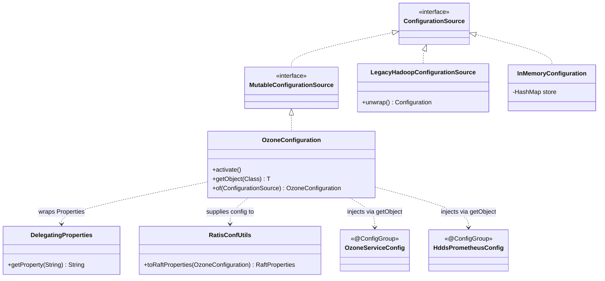

# hddscommon / config-common

_This feature page was generated from `study/atlas/components/hddscommon/config-common.md`. Author prose belongs above or below the BEGIN/END markers._

{/* BEGIN atlas-generated */}

**Classes:** 5    **Kinds:** service:3, config:2

## Overview

`OzoneConfiguration` extends Hadoop `Configuration` and implements `MutableConfigurationSource`, serving as the primary configuration entry point for all Ozone services. Its static `activate()` method registers module-specific XML default-resource files (such as `hdds-common-default.xml` and `ozone-manager-default.xml`), and `getObject(Class<T>)` drives POJO injection by calling `ConfigurationReflectionUtil.injectConfiguration()` on any `@ConfigGroup`-annotated class. `DelegatingProperties` provides a thread-safe bridge so Ozone config sources can interoperate with code that expects a `java.util.Properties` view. `RatisConfUtils` translates Ozone key-value pairs into Ratis `RaftProperties`, centralising the cross-system config translation. `OzoneServiceConfig` and `HddsPrometheusConfig` are lightweight `@ConfigGroup` POJOs that hold per-service and Prometheus-endpoint defaults, respectively.

## Diagram

## Class table

### Sub-feature: `hdds.conf`

| reading_order | fqcn | kind | logic | loc | study (min) | role |
|--:|---|---|---|--:|--:|---|
| 1664 | <Fqcn>org.apache.hadoop.hdds.conf.OzoneConfiguration</Fqcn> | service | logic-heavy | 350~ | 45 | Configuration for ozone. |
| 1665 | <Fqcn>org.apache.hadoop.hdds.conf.DelegatingProperties</Fqcn> | service | mixed | 125~ | 30 | Delegating properties helper class. |
| 1666 | <Fqcn>org.apache.hadoop.hdds.conf.RatisConfUtils</Fqcn> | service | mixed | 25~ | 30 | Utilities for Ratis configurations. |
| 1667 | <Fqcn>org.apache.hadoop.hdds.conf.HddsPrometheusConfig</Fqcn> | config | data-only | 25~ | 20 | The configuration class for the Prometheus endpoint. |

### Sub-feature: `ozone.conf`

| reading_order | fqcn | kind | logic | loc | study (min) | role |
|--:|---|---|---|--:|--:|---|
| 1668 | <Fqcn>org.apache.hadoop.ozone.conf.OzoneServiceConfig</Fqcn> | config | data-only | 25~ | 20 | This class is used to define Ozone service level configs which are needed for all the ozone services. |

## Anchor details

### `OzoneConfiguration`

- **path:** `hadoop-hdds/common/src/main/java/org/apache/hadoop/hdds/conf/OzoneConfiguration.java`
- **loc:** 350~    **difficulty:** 4    **study:** 45 min    **concurrency:** single-threaded    **persistence:** in-memory
- **key collaborators:** `org.apache.hadoop.hdds.HddsConfigKeys`, `org.apache.hadoop.hdds.annotation.InterfaceAudience`, `org.apache.hadoop.hdds.scm.ScmConfigKeys`, `org.apache.hadoop.hdds.utils.LegacyHadoopConfigurationSource`, `org.apache.hadoop.ozone.OzoneConfigKeys`
- **test exemplar:** `hadoop-hdds/common/src/test/java/org/apache/hadoop/hdds/conf/TestOzoneConfiguration.java`
- **role:** Configuration for ozone.
- `activate()` is called once at service startup and uses `Configuration.addDefaultResource()` to register each module's generated XML file; any module that omits its file from `getConfigurationResourceFiles()` will not have its defaults loaded. `of(ConfigurationSource)` round-trips through `LegacyHadoopConfigurationSource.unwrap()` so callers that hold a plain `ConfigurationSource` interface can still obtain a full `OzoneConfiguration` without a second load.

## Design docs

- `hadoop-hdds/docs/content/design/typesafeconfig.md` — describes the `@Config` / `@ConfigGroup` annotation-driven approach that `OzoneConfiguration.getObject()` relies on.
- `hadoop-hdds/docs/content/design/configless.md` — proposes reducing static config coupling; directly relevant to how `OzoneConfiguration` loads defaults.

## Seminal JIRAs / PRs

- [HDDS-499](https://issues.apache.org/jira/browse/HDDS-499). Display descriptions for properties on config page
- [HDDS-14030](https://issues.apache.org/jira/browse/HDDS-14030). Add ConfigGroup prefix to all configs
- [HDDS-12777](https://issues.apache.org/jira/browse/HDDS-12777). Use module-specific name for generated config files
- [HDDS-12172](https://issues.apache.org/jira/browse/HDDS-12172). Rename Java constants of DFSConfigKeysLegacy keys
- [HDDS-12164](https://issues.apache.org/jira/browse/HDDS-12164). Rename and deprecate DFSConfigKeysLegacy config keys

## Sharp edges

- `OzoneConfiguration.activate()` must be called before any service reads defaults; if a module's XML file is absent from `getConfigurationResourceFiles()`, its defaults silently fail to load with no error at startup (see [HDDS-12777](https://issues.apache.org/jira/browse/HDDS-12777)).
- `LegacyHadoopConfigurationSource.unwrap()` returns the underlying Hadoop `Configuration` by casting; callers that pass a non-`OzoneConfiguration` `ConfigurationSource` will get a `ClassCastException` at runtime rather than compile time.
- [HDDS-14030](https://issues.apache.org/jira/browse/HDDS-14030) added per-`@ConfigGroup` prefixes; code that still refers to old flat keys (pre-prefix) against a new `OzoneConfiguration` will silently receive default values instead of the operator-supplied value.

## Related features

- [`config-annotations.md`](/component/hddscommon/config-annotations) — the `@Config`, `@ConfigGroup`, `@ConfigType` annotations that `OzoneConfiguration.getObject()` reads.
- [`config-runtime.md`](/component/hddscommon/config-runtime) — live reconfiguration servlet and handler built on top of this config layer.
- [`tracing-common.md`](/component/hddscommon/tracing-common) — `TracingConfig` is a `@ConfigGroup` POJO loaded through `OzoneConfiguration`.
- [`ratis-integration.md`](/component/hddscommon/ratis-integration) — `RatisConfUtils` bridges `OzoneConfiguration` keys into Ratis `RaftProperties`.

## Self-quiz

1. What does `OzoneConfiguration.activate()` do, and what happens if it is never called for a module?
2. How does `OzoneConfiguration.getObject(Class<T>)` populate a `@ConfigGroup`-annotated POJO — which utility class performs the injection?
3. `DelegatingProperties` is marked `thread-safe` while `OzoneConfiguration` is `single-threaded`. What design consequence does this have for code that shares an `OzoneConfiguration` across threads?
4. Trace how an operator-set value in `ozone-site.xml` flows from XML parsing through `OzoneConfiguration` into a field annotated with `@Config` on `OzoneServiceConfig`.
5. `RatisConfUtils` translates Ozone config into Ratis `RaftProperties`. Name one Ozone key it translates and the corresponding Ratis property key.

Answers

Answer 1: `activate()` registers each module's generated XML default-resource file via `Configuration.addDefaultResource()`; without it, module defaults are absent and properties return `null` or built-in Hadoop defaults silently.
Answer 2: `ConfigurationReflectionUtil.injectConfiguration()` iterates `@Config`-annotated fields and calls the appropriate `Configuration.get*()` method for each, using the `@ConfigGroup` prefix plus the field's `key` attribute to build the full config key.
Answer 3: Because `OzoneConfiguration` is single-threaded, callers must synchronise externally or obtain separate instances per thread; `DelegatingProperties` can safely be shared because it locks on reads/writes.
Answer 4: XML is parsed by Hadoop `Configuration`; `OzoneConfiguration` (extends `Configuration`) inherits that parsing; `getObject()` then calls `ConfigurationReflectionUtil.injectConfiguration()` which reads each `@Config` key from the parsed map and sets the corresponding field on the POJO.
Answer 5: One example: `RatisConfUtils` maps `hdds.ratis.raft.server.rpc.timeout` to `raft.server.rpc.timeout.min`; verify by reading `RatisConfUtils.java` in `hadoop-hdds/common/src/main/java/org/apache/hadoop/hdds/conf/`.

{/* END atlas-generated */}
