# hddscommon / framework-protocol

_This feature page was generated from `study/atlas/components/hddscommon/framework-protocol.md`. Author prose belongs above or below the BEGIN/END markers._

{/* BEGIN atlas-generated */}

**Classes:** 27    **Kinds:** interface:15, rpc-stub:7, service:5

## Overview

The `framework-protocol` feature group defines the Protobuf-over-Hadoop-RPC wire contracts between HDDS clients and the SCM services. It is organized in two layers: thin `*PB` interfaces (generated-adjacent stubs that declare the raw RPC signatures) and hand-written `*ClientSideTranslatorPB` / `*ServerSideTranslatorPB` classes that serialize domain objects to Protobuf requests and deserialize responses. The three heaviest translators cover SCM block allocation (`ScmBlockLocationProtocolClientSideTranslatorPB`), container and pipeline management (`StorageContainerLocationProtocolClientSideTranslatorPB`, 925 lines), and certificate operations with the SCM CA (`SCMSecurityProtocolClientSideTranslatorPB`). Lighter translator pairs cover DiskBalancer admin, reconfiguration, and secret-key distribution to OM/SCM/datanode roles. All translators are stateless wrappers; retry and failover are delegated to a retry-proxy created by `SCMFailoverProxyProviderBase` before this layer is reached. Trace spans are injected via `TracingUtil` at the translator boundary.

## Diagram

```mermaid
classDiagram
  class ScmBlockLocationProtocol { <<interface>> }
  class StorageContainerLocationProtocol { <<interface>> }
  class SCMSecurityProtocol { <<interface>> }
  class ReconfigureProtocol { <<interface>> }
  class DiskBalancerProtocol { <<interface>> }
  class SecretKeyProtocol { <<interface>> }

  class ScmBlockLocationProtocolClientSideTranslatorPB
  class StorageContainerLocationProtocolClientSideTranslatorPB
  class SCMSecurityProtocolClientSideTranslatorPB
  class ReconfigureProtocolClientSideTranslatorPB
  class DiskBalancerProtocolClientSideTranslatorPB
  class SecretKeyProtocolClientSideTranslatorPB

  class ScmBlockLocationProtocolPB { <<rpc-stub>> }
  class StorageContainerLocationProtocolPB { <<rpc-stub>> }
  class SCMSecurityProtocolPB { <<rpc-stub>> }
  class ReconfigureProtocolPB { <<rpc-stub>> }
  class DiskBalancerProtocolPB { <<rpc-stub>> }

  ScmBlockLocationProtocol <|.. ScmBlockLocationProtocolClientSideTranslatorPB
  StorageContainerLocationProtocol <|.. StorageContainerLocationProtocolClientSideTranslatorPB
  SCMSecurityProtocol <|.. SCMSecurityProtocolClientSideTranslatorPB
  ReconfigureProtocol <|.. ReconfigureProtocolClientSideTranslatorPB
  DiskBalancerProtocol <|.. DiskBalancerProtocolClientSideTranslatorPB
  SecretKeyProtocol <|.. SecretKeyProtocolClientSideTranslatorPB

  ScmBlockLocationProtocolClientSideTranslatorPB --> ScmBlockLocationProtocolPB : rpcProxy
  StorageContainerLocationProtocolClientSideTranslatorPB --> StorageContainerLocationProtocolPB : rpcProxy
  SCMSecurityProtocolClientSideTranslatorPB --> SCMSecurityProtocolPB : rpcProxy
  ReconfigureProtocolClientSideTranslatorPB --> ReconfigureProtocolPB : rpcProxy
  DiskBalancerProtocolClientSideTranslatorPB --> DiskBalancerProtocolPB : rpcProxy
click ScmBlockLocationProtocol href "/class/scmblocklocationprotocol" "Open ScmBlockLocationProtocol"
click StorageContainerLocationProtocol href "/class/storagecontainerlocationprotocol" "Open StorageContainerLocationProtocol"
click SCMSecurityProtocol href "/class/scmsecurityprotocol" "Open SCMSecurityProtocol"
click ReconfigureProtocol href "/class/reconfigureprotocol" "Open ReconfigureProtocol"
click DiskBalancerProtocol href "/class/diskbalancerprotocol" "Open DiskBalancerProtocol"
click SecretKeyProtocol href "/class/secretkeyprotocol" "Open SecretKeyProtocol"
click ScmBlockLocationProtocolClientSideTranslatorPB href "/class/scmblocklocationprotocolclientsidetranslatorpb" "Open ScmBlockLocationProtocolClientSideTranslatorPB"
click StorageContainerLocationProtocolClientSideTranslatorPB href "/class/storagecontainerlocationprotocolclientsidetranslatorpb" "Open StorageContainerLocationProtocolClientSideTranslatorPB"
click SCMSecurityProtocolClientSideTranslatorPB href "/class/scmsecurityprotocolclientsidetranslatorpb" "Open SCMSecurityProtocolClientSideTranslatorPB"
click ReconfigureProtocolClientSideTranslatorPB href "/class/reconfigureprotocolclientsidetranslatorpb" "Open ReconfigureProtocolClientSideTranslatorPB"
click DiskBalancerProtocolClientSideTranslatorPB href "/class/diskbalancerprotocolclientsidetranslatorpb" "Open DiskBalancerProtocolClientSideTranslatorPB"
click SecretKeyProtocolClientSideTranslatorPB href "/class/secretkeyprotocolclientsidetranslatorpb" "Open SecretKeyProtocolClientSideTranslatorPB"
click ScmBlockLocationProtocolPB href "/class/scmblocklocationprotocolpb" "Open ScmBlockLocationProtocolPB"
click StorageContainerLocationProtocolPB href "/class/storagecontainerlocationprotocolpb" "Open StorageContainerLocationProtocolPB"
click SCMSecurityProtocolPB href "/class/scmsecurityprotocolpb" "Open SCMSecurityProtocolPB"
click ReconfigureProtocolPB href "/class/reconfigureprotocolpb" "Open ReconfigureProtocolPB"
click DiskBalancerProtocolPB href "/class/diskbalancerprotocolpb" "Open DiskBalancerProtocolPB"
```

## Class table

### Sub-feature: `hdds.protocol`

| reading_order | fqcn | kind | logic | loc | study (min) | role |
|--:|---|---|---|--:|--:|---|
| 1679 | <Fqcn>org.apache.hadoop.hdds.protocol.DiskBalancerProtocol</Fqcn> | interface | mixed | 25~ | 20 | Client-to-datanode RPC protocol for administering DiskBalancer. |
| 1680 | <Fqcn>org.apache.hadoop.hdds.protocol.ReconfigureProtocol</Fqcn> | interface | mixed | 25~ | 20 | ReconfigureProtocol is used by ozone admin to reload configuration. |
| 1681 | <Fqcn>org.apache.hadoop.hdds.protocol.SecretKeyProtocolDatanode</Fqcn> | interface | mixed | 25~ | 20 | The client protocol to access secret key from Datanode. |
| 1682 | <Fqcn>org.apache.hadoop.hdds.protocol.SecretKeyProtocolOm</Fqcn> | interface | mixed | 25~ | 20 | The client protocol to access secret key from OM. |
| 1683 | <Fqcn>org.apache.hadoop.hdds.protocol.SecretKeyProtocolScm</Fqcn> | interface | mixed | 25~ | 20 | The client protocol to access secret key from SCM. |
| 1684 | <Fqcn>org.apache.hadoop.hdds.protocol.SCMSecurityProtocol</Fqcn> | interface | mixed | 25~ | 20 | The protocol used to perform security related operations with SCM. |
| 1685 | <Fqcn>org.apache.hadoop.hdds.protocol.SecretKeyProtocol</Fqcn> | interface | mixed | 25~ | 20 | The protocol used to expose secret keys in SCM. |

### Sub-feature: `hdds.protocolPB`

| reading_order | fqcn | kind | logic | loc | study (min) | role |
|--:|---|---|---|--:|--:|---|
| 1686 | <Fqcn>org.apache.hadoop.hdds.protocolPB.ReconfigureProtocolOmPB</Fqcn> | interface | mixed | 25~ | 20 | inferred: ReconfigureProtocolOmPB — role not documented. |
| 1687 | <Fqcn>org.apache.hadoop.hdds.protocolPB.SecretKeyProtocolDatanodePB</Fqcn> | interface | mixed | 25~ | 20 | Protocol for secret key related operations, to be used by datanode service role. |
| 1688 | <Fqcn>org.apache.hadoop.hdds.protocolPB.SecretKeyProtocolScmPB</Fqcn> | interface | mixed | 25~ | 20 | Protocol for secret key related operations, to be used by SCM service role. |
| 1689 | <Fqcn>org.apache.hadoop.hdds.protocolPB.SecretKeyProtocolOmPB</Fqcn> | interface | mixed | 25~ | 20 | Protocol for secret key related operations, to be used by OM service role. |
| 1690 | <Fqcn>org.apache.hadoop.hdds.protocolPB.ReconfigureProtocolDatanodePB</Fqcn> | interface | mixed | 25~ | 20 | Protocol that clients use to communicate with the DN to do reconfiguration on the fly. |
| 1691 | <Fqcn>org.apache.hadoop.hdds.protocolPB.SCMSecurityProtocolClientSideTranslatorPB</Fqcn> | service | logic-heavy | 200~ | 45 | This class is the client-side translator that forwards requests for SCMSecurityProtocol to the SCMSecurityProtocolPB... |
| 1692 | <Fqcn>org.apache.hadoop.hdds.protocolPB.ReconfigureProtocolClientSideTranslatorPB</Fqcn> | service | mixed | 125~ | 30 | This class is the client side translator to translate the requests made on ReconfigureProtocol interfaces to the RPC... |
| 1693 | <Fqcn>org.apache.hadoop.hdds.protocolPB.SecretKeyProtocolClientSideTranslatorPB</Fqcn> | service | mixed | 75~ | 30 | This class is the client-side translator that forwards requests for SecretKeyProtocol to the server proxy. |
| 1694 | <Fqcn>org.apache.hadoop.hdds.protocolPB.DiskBalancerProtocolClientSideTranslatorPB</Fqcn> | service | mixed | 75~ | 30 | Client-side translator for DiskBalancerProtocol. |
| 1695 | <Fqcn>org.apache.hadoop.hdds.protocolPB.ReconfigureProtocolServerSideTranslatorPB</Fqcn> | rpc-stub | data-only | 75~ | 20 | This class is used on the server side. |
| 1696 | <Fqcn>org.apache.hadoop.hdds.protocolPB.DiskBalancerProtocolServerSideTranslatorPB</Fqcn> | rpc-stub | data-only | 50~ | 20 | Server-side translator for DiskBalancerProtocolPB. |
| 1697 | <Fqcn>org.apache.hadoop.hdds.protocolPB.DiskBalancerProtocolPB</Fqcn> | rpc-stub | data-only | 25~ | 20 | Protocol that clients use to communicate directly with Datanodes for DiskBalancer operations. |
| 1698 | <Fqcn>org.apache.hadoop.hdds.protocolPB.ReconfigureProtocolPB</Fqcn> | rpc-stub | data-only | 25~ | 20 | Protocol that clients use to communicate with the SCM to do reconfiguration on the fly. |
| 1699 | <Fqcn>org.apache.hadoop.hdds.protocolPB.SCMSecurityProtocolPB</Fqcn> | rpc-stub | data-only | 25~ | 20 | Protocol for security related operations on SCM. |

### Sub-feature: `scm.protocol`

| reading_order | fqcn | kind | logic | loc | study (min) | role |
|--:|---|---|---|--:|--:|---|
| 1700 | <Fqcn>org.apache.hadoop.hdds.scm.protocol.StorageContainerLocationProtocol</Fqcn> | interface | mixed | 125~ | 20 | ContainerLocationProtocol is used by an HDFS node to find the set of nodes that currently host a container. |
| 1701 | <Fqcn>org.apache.hadoop.hdds.scm.protocol.ScmBlockLocationProtocol</Fqcn> | interface | mixed | 25~ | 20 | ScmBlockLocationProtocol is used by an HDFS node to find the set of nodes to read/write a block. |

### Sub-feature: `scm.protocolPB`

| reading_order | fqcn | kind | logic | loc | study (min) | role |
|--:|---|---|---|--:|--:|---|
| 1702 | <Fqcn>org.apache.hadoop.hdds.scm.protocolPB.ScmBlockLocationProtocolClientSideTranslatorPB</Fqcn> | service | logic-heavy | 250~ | 20 | This class is the client-side translator to translate the requests made on the ScmBlockLocationProtocol interface to... |
| 1703 | <Fqcn>org.apache.hadoop.hdds.scm.protocolPB.StorageContainerLocationProtocolClientSideTranslatorPB</Fqcn> | service | logic-heavy | 925~ | 60 | This class is the client-side translator to translate the requests made on the StorageContainerLocationProtocol inter... |
| 1704 | <Fqcn>org.apache.hadoop.hdds.scm.protocolPB.StorageContainerLocationProtocolPB</Fqcn> | rpc-stub | data-only | 25~ | 20 | Protocol used from an HDFS node to StorageContainerManager. |
| 1705 | <Fqcn>org.apache.hadoop.hdds.scm.protocolPB.ScmBlockLocationProtocolPB</Fqcn> | rpc-stub | data-only | 25~ | 20 | Protocol used from an HDFS node to StorageContainerManager. |

## Anchor details

### `ScmBlockLocationProtocolClientSideTranslatorPB`

- **path:** `hadoop-hdds/framework/src/main/java/org/apache/hadoop/hdds/scm/protocolPB/ScmBlockLocationProtocolClientSideTranslatorPB.java`
- **loc:** 250~    **difficulty:** 2    **study:** 20 min    **concurrency:** single-threaded    **persistence:** in-memory
- **entry points:** `close`
- **key collaborators:** `org.apache.hadoop.hdds.scm.protocol.ScmBlockLocationProtocol`, `org.apache.hadoop.hdds.annotation.InterfaceAudience`, `org.apache.hadoop.hdds.client.ContainerBlockID`, `org.apache.hadoop.hdds.client.ECReplicationConfig`, `org.apache.hadoop.hdds.client.RatisReplicationConfig`, `org.apache.hadoop.hdds.client.ReplicationConfig`
- **role:** This class is the client-side translator to translate the requests made on the ScmBlockLocationProtocol inter...
- **note:** Each method builds a Protobuf request via the generated builder, calls `rpcProxy.allocateScm*(...)`, and unpacks the response into domain objects such as `AllocatedBlock`. Retries on SCM leader change are handled entirely by the retry-proxy that wraps this translator, keeping this class free of failover state.

### `StorageContainerLocationProtocolClientSideTranslatorPB`

- **path:** `hadoop-hdds/framework/src/main/java/org/apache/hadoop/hdds/scm/protocolPB/StorageContainerLocationProtocolClientSideTranslatorPB.java`
- **loc:** 925~    **difficulty:** 5    **study:** 60 min    **concurrency:** single-threaded    **persistence:** in-memory
- **entry points:** `close`
- **key collaborators:** `org.apache.hadoop.hdds.scm.protocol.StorageContainerLocationProtocol`, `org.apache.hadoop.hdds.annotation.InterfaceAudience`, `org.apache.hadoop.hdds.client.ECReplicationConfig`, `org.apache.hadoop.hdds.client.ReplicatedReplicationConfig`, `org.apache.hadoop.hdds.client.ReplicationConfig`, `org.apache.hadoop.hdds.protocol.DatanodeDetails`
- **role:** Translates every SCM container-location RPC including container balancer commands, pipeline listing, and safe-mode queries.
- **note:** At 925 lines this is the widest single translator in the framework; it covers container CRUD, pipeline listing, safe-mode entry/exit, and container-balancer start/stop. Trace spans are opened via `TracingUtil` around each RPC call ([HDDS-15033](https://issues.apache.org/jira/browse/HDDS-15033)), so distributed traces from the client propagate to SCM.

### `SCMSecurityProtocolClientSideTranslatorPB`

- **path:** `hadoop-hdds/framework/src/main/java/org/apache/hadoop/hdds/protocolPB/SCMSecurityProtocolClientSideTranslatorPB.java`
- **loc:** 200~    **difficulty:** 4    **study:** 45 min    **concurrency:** single-threaded    **persistence:** in-memory
- **entry points:** `close`
- **key collaborators:** `org.apache.hadoop.hdds.protocol.SCMSecurityProtocol`, `org.apache.hadoop.hdds.scm.proxy.SCMSecurityProtocolFailoverProxyProvider`, `org.apache.hadoop.hdds.security.exception.SCMSecurityException`, `org.apache.hadoop.hdds.tracing.TracingUtil`
- **role:** This class is the client-side translator that forwards requests for SCMSecurityProtocol to the &#123;@link SCMSecu...
- **note:** Handles certificate signing requests (CSR), certificate renewal, and revocation RPCs directed at the SCM internal CA. It uses `SCMSecurityProtocolFailoverProxyProvider` for HA SCM, so a leader election during a certificate renewal will be transparently retried.

## Design docs

- `hadoop-hdds/docs/content/design/scmha.md` — covers the SCM HA failover model that these translators rely on via `SCMFailoverProxyProviderBase`.
- `hadoop-hdds/docs/content/design/token.md` — describes block token flow; `ScmBlockLocationProtocolClientSideTranslatorPB` is the call site where block tokens are returned to clients.
- `hadoop-hdds/docs/content/design/distributed-tracing-OpenTelemetry.md` — explains the `TracingUtil` span injection used in `StorageContainerLocationProtocolClientSideTranslatorPB` and `SCMSecurityProtocolClientSideTranslatorPB`.

## Seminal JIRAs / PRs

- [HDDS-15264](https://issues.apache.org/jira/browse/HDDS-15264). Fork RetryInvocationHandler from Hadoop
- [HDDS-13753](https://issues.apache.org/jira/browse/HDDS-13753). Use forked Hadoop RPC
- [HDDS-15247](https://issues.apache.org/jira/browse/HDDS-15247). Remove unused ProtocolMetaInterface, VersionedProtocol
- [HDDS-15033](https://issues.apache.org/jira/browse/HDDS-15033). Link SCM allocate-block calls to client trace
- [HDDS-14103](https://issues.apache.org/jira/browse/HDDS-14103). Create option to suppress/unsuppress containers from report
- [HDDS-14108](https://issues.apache.org/jira/browse/HDDS-14108). Provide option in scm safemode status to show all SCM nodes

## Sharp edges

- `StorageContainerLocationProtocolClientSideTranslatorPB` has no `@GuardedBy` annotations despite its `rpcProxy` field being shared across threads when wrapped by a retry proxy; callers must ensure the proxy itself is thread-safe or serialize access externally.
- The forked `RetryInvocationHandler` ([HDDS-15264](https://issues.apache.org/jira/browse/HDDS-15264) / [HDDS-13753](https://issues.apache.org/jira/browse/HDDS-13753)) diverges from upstream Hadoop; patches from upstream must be manually ported and tested against the Ozone failover scenarios.
- `SCMSecurityProtocolClientSideTranslatorPB` wraps exceptions in `SCMSecurityException` but does not preserve the original exception cause in all paths, which can obscure root causes in log output.

## Related features

- [`scm-client-proxy.md`](/component/hddscommon/scm-client-proxy) — proxy providers and failover logic that wrap these translators
- [`framework-server.md`](/component/hddscommon/framework-server) — server-side dispatcher and event bus consumed by the same SCM services
- [`framework-utils.md`](/component/hddscommon/framework-utils) — `HAUtils` and `HddsServerUtil` used by the proxy and server setup
- [`protocol-common.md`](/component/hddscommon/protocol-common) — shared domain interfaces implemented by the translators
- [`security-tokens.md`](/component/hddscommon/security-tokens) — block and container token handling around the SCM security protocol
- [`tracing-common.md`](/component/hddscommon/tracing-common) — `TracingUtil` span injection used inside the translators

## Self-quiz

1. `StorageContainerLocationProtocolClientSideTranslatorPB` implements `StorageContainerLocationProtocol`. What does the `rpcProxy` field hold, and what class created it?
2. Why does `ScmBlockLocationProtocolClientSideTranslatorPB` not contain any retry logic despite being used in a HA SCM cluster?
3. `SCMSecurityProtocolClientSideTranslatorPB` uses `TracingUtil`. At what point in a CSR request does it open a trace span, and which field links it to [HDDS-15033](https://issues.apache.org/jira/browse/HDDS-15033)?
4. `ReconfigureProtocolServerSideTranslatorPB` is classified `rpc-stub / data-only`. What does this imply about where the actual reconfiguration logic runs?
5. Three `SecretKeyProtocol*PB` interfaces exist for Datanode, OM, and SCM roles. Which single `SecretKeyProtocolClientSideTranslatorPB` serves all three, and how does it differentiate targets?

Answers

Answer 1: `rpcProxy` holds a `ScmBlockLocationProtocolPB` stub — an instance created by `SCMFailoverProxyProviderBase` (or a non-HA `RPC.getProxy`) that routes calls to the active SCM leader and handles retries on `StandbyException`.

Answer 2: Retry and failover are handled by the retry-proxy that wraps this translator before it is exposed to callers. The translator itself is a pure serialization adapter; it never sees a `StandbyException` directly.

Answer 3: A span is opened at the start of each public method (e.g. `allocateBlock`) using `TracingUtil.importAndCreateChildSpan`, which reads the incoming trace context from the `OMRequest`/`SCMBlockLocationRequest` header. [HDDS-15033](https://issues.apache.org/jira/browse/HDDS-15033) introduced this injection into `StorageContainerLocationProtocolClientSideTranslatorPB`.

Answer 4: The server-side translator only unpacks the Protobuf bytes and delegates to the real `ReconfigureProtocol` implementation (e.g. `SCMReconfigureProtocol`). The translator holds no state and contains no policy; logic lives in the delegate.

Answer 5: `SecretKeyProtocolClientSideTranslatorPB` is the single client-side translator for `SecretKeyProtocol`. The role-specific `*PB` interfaces (`SecretKeyProtocolDatanodePB`, `SecretKeyProtocolOmPB`, `SecretKeyProtocolScmPB`) are separate Hadoop RPC protocol declarations used to register different service ports; the translator is instantiated with the appropriate proxy for each port.

{/* END atlas-generated */}
