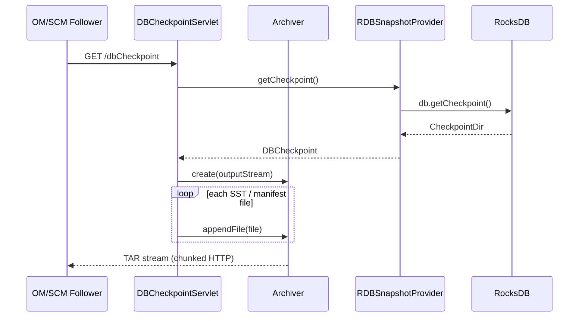

# hddscommon / framework-utils

_This feature page was generated from `study/atlas/components/hddscommon/framework-utils.md`. Author prose belongs above or below the BEGIN/END markers._

{/* BEGIN atlas-generated */}

**Classes:** 31    **Kinds:** service:9, metrics:8, interface:7, abstract:4, data:2, dto:1

## Overview

The `framework-utils` feature group is a collection of cross-cutting server utilities used by SCM, OM, Recon, and datanodes. `HddsServerUtil` (450 lines) is the primary factory for RPC server construction and retry policy configuration; it provides `getScmAddressForDataNodes`, `getScmAddressForClients`, and `createSCMRpcServer`. `HAUtils` reads SCM node lists from config and builds `SCMNodeDetails` objects consumed by failover proxy providers during HA initialization. `DBCheckpointServlet` streams a live RocksDB checkpoint as a TAR over HTTP for follower bootstrap; [HDDS-15766](https://issues.apache.org/jira/browse/HDDS-15766) made large tarball transfers reliable. `Archiver` wraps Apache Commons Compress and gained incremental `appendFile` support in [HDDS-15836](https://issues.apache.org/jira/browse/HDDS-15836) for streaming Recon OM DB sync. `BackgroundService` provides a managed periodic task executor; [HDDS-15429](https://issues.apache.org/jira/browse/HDDS-15429) fixed a deadlock between `updateAndRestart` and `PeriodicalTask` during pool size changes. `RocksDBStoreMetrics` exports per-column-family statistics as Hadoop metrics2 gauges, and `LogLevel` provides a Jetty servlet endpoint for runtime log level changes.

## Diagram

## Class table

### Sub-feature: `hdds.utils`

| reading_order | fqcn | kind | logic | loc | study (min) | role |
|--:|---|---|---|--:|--:|---|
| 1726 | <Fqcn>org.apache.hadoop.hdds.utils.CollectionUtils</Fqcn> | interface | mixed | 100~ | 20 | Utility methods for Java Collections. |
| 1727 | <Fqcn>org.apache.hadoop.hdds.utils.MetaStoreIterator</Fqcn> | interface | mixed | 25~ | 20 | Iterator for MetaDataStore DB. |
| 1728 | <Fqcn>org.apache.hadoop.hdds.utils.BackgroundTaskResult</Fqcn> | interface | mixed | 25~ | 20 | Result of a BackgroundTask. |
| 1729 | <Fqcn>org.apache.hadoop.hdds.utils.DBStoreHAManager</Fqcn> | interface | mixed | 25~ | 20 | Interface defined for getting HA related specific info from DB for SCM and OM. |
| 1730 | <Fqcn>org.apache.hadoop.hdds.utils.BackgroundTask</Fqcn> | interface | mixed | 25~ | 20 | A task thread to run by BackgroundService. |
| 1731 | <Fqcn>org.apache.hadoop.hdds.utils.BackgroundService</Fqcn> | abstract | mixed | 150~ | 45 | An abstract class for a background service in ozone. |
| 1732 | <Fqcn>org.apache.hadoop.hdds.utils.RDBSnapshotProvider</Fqcn> | abstract | mixed | 125~ | 30 | The RocksDB specified snapshot provider. |
| 1733 | <Fqcn>org.apache.hadoop.hdds.utils.FaultInjector</Fqcn> | abstract | mixed | 25~ | 30 | Used to inject certain faults for testing. |
| 1734 | <Fqcn>org.apache.hadoop.hdds.utils.HddsServerUtil</Fqcn> | service | logic-heavy | 450~ | 60 | Hdds stateless helper functions for server side components. |
| 1735 | <Fqcn>org.apache.hadoop.hdds.utils.HAUtils</Fqcn> | service | logic-heavy | 275~ | 45 | utility class used by SCM and OM for HA. |
| 1736 | <Fqcn>org.apache.hadoop.hdds.utils.DBCheckpointServlet</Fqcn> | service | logic-heavy | 275~ | 45 | Provides the current checkpoint Snapshot of the OM/SCM DB. |
| 1737 | <Fqcn>org.apache.hadoop.hdds.utils.LogLevel</Fqcn> | service | logic-heavy | 250~ | 45 | Change log level in runtime. |
| 1738 | <Fqcn>org.apache.hadoop.hdds.utils.Archiver</Fqcn> | service | logic-heavy | 200~ | 45 | Create and extract archives. |
| 1739 | <Fqcn>org.apache.hadoop.hdds.utils.MetadataKeyFilters</Fqcn> | service | mixed | 50~ | 30 | An utility class to filter levelDB keys. |
| 1740 | <Fqcn>org.apache.hadoop.hdds.utils.DecayRpcSchedulerUtil</Fqcn> | service | mixed | 50~ | 30 | Helper functions for DecayRpcScheduler metrics for Prometheus. |
| 1741 | <Fqcn>org.apache.hadoop.hdds.utils.BooleanTriFunction</Fqcn> | interface | mixed | 25~ | 30 | Defines a functional interface having three inputs and returns boolean as output. |
| 1742 | <Fqcn>org.apache.hadoop.hdds.utils.BackgroundTaskQueue</Fqcn> | service | mixed | 25~ | 30 | A priority queue that stores a number of BackgroundTask. |
| 1743 | <Fqcn>org.apache.hadoop.hdds.utils.TransactionInfo</Fqcn> | dto | data-only | 100~ | 10 | TransactionInfo which is persisted to DB. |
| 1744 | <Fqcn>org.apache.hadoop.hdds.utils.HttpServletUtils</Fqcn> | service | mixed | 100~ | 10 | Utility class for HTTP servlet operations. |
| 1745 | <Fqcn>org.apache.hadoop.hdds.utils.SignalLogger</Fqcn> | data | data-only | 50~ | 10 | This class logs a message whenever we're about to exit on a UNIX signal. |
| 1746 | <Fqcn>org.apache.hadoop.hdds.utils.RocksDBStoreMetrics</Fqcn> | metrics | logic-heavy | 200~ | 20 | All Rocksdb metrics. |
| 1747 | <Fqcn>org.apache.hadoop.hdds.utils.ProtocolMessageMetrics</Fqcn> | metrics | mixed | 75~ | 20 | Metrics to count all the subtypes of a specific message. |
| 1748 | <Fqcn>org.apache.hadoop.hdds.utils.DBCheckpointMetrics</Fqcn> | metrics | mixed | 75~ | 20 | This interface is for maintaining DB checkpoint statistics. |
| 1749 | <Fqcn>org.apache.hadoop.hdds.utils.TableCacheMetrics</Fqcn> | metrics | mixed | 50~ | 20 | This class emits table level cache metrics. |
| 1750 | <Fqcn>org.apache.hadoop.hdds.utils.PrometheusMetricsSinkUtil</Fqcn> | metrics | mixed | 50~ | 20 | Util class for org.apache.hadoop.hdds.server.http.PrometheusMetricsSink. |
| 1751 | <Fqcn>org.apache.hadoop.hdds.utils.UgiMetricsUtil</Fqcn> | metrics | mixed | 25~ | 20 | Util class for UGI metrics. |
| 1752 | <Fqcn>org.apache.hadoop.hdds.utils.CpuMetrics</Fqcn> | metrics | mixed | 25~ | 20 | Expose the next JMX metrics. |
| 1753 | <Fqcn>org.apache.hadoop.hdds.utils.NettyMetrics</Fqcn> | metrics | mixed | 25~ | 20 | This class emits Netty metrics. |

### Sub-feature: `ozone.util`

| reading_order | fqcn | kind | logic | loc | study (min) | role |
|--:|---|---|---|--:|--:|---|
| 1754 | <Fqcn>org.apache.hadoop.ozone.util.WithChecksum</Fqcn> | interface | mixed | 25~ | 20 | Represents a generic interface for objects capable of generating or providing a checksum value. |
| 1755 | <Fqcn>org.apache.hadoop.ozone.util.ObjectSerializer</Fqcn> | interface | mixed | 25~ | 20 | Represents a generic interface for serialization and deserialization operations of objects that extend the WithChecks... |
| 1756 | <Fqcn>org.apache.hadoop.ozone.util.YamlSerializer</Fqcn> | abstract | mixed | 75~ | 30 | An abstract serializer for objects that extend the WithChecksum interface. |

## Anchor details

### `HddsServerUtil`

- **path:** `hadoop-hdds/framework/src/main/java/org/apache/hadoop/hdds/utils/HddsServerUtil.java`
- **loc:** 450~    **difficulty:** 5    **study:** 60 min    **concurrency:** single-threaded    **persistence:** in-memory
- **key collaborators:** `org.apache.hadoop.hdds.HddsConfigKeys`, `org.apache.hadoop.hdds.HddsUtils`, `org.apache.hadoop.hdds.conf.ConfigurationSource`, `org.apache.hadoop.hdds.conf.OzoneConfiguration`, `org.apache.hadoop.hdds.protocol.SCMSecurityProtocol`, `org.apache.hadoop.hdds.protocol.SecretKeyProtocolScm`
- **test exemplar:** `hadoop-hdds/server-scm/src/test/java/org/apache/hadoop/hdds/scm/TestHddsServerUtil.java`
- **role:** Hdds stateless helper functions for server side components.
- **note:** Acts as the single place where RPC `Server` instances are created (`createSCMRpcServer`) and where retry policies are built for datanode-to-SCM connections. Contains address resolution helpers (`getScmAddressForDataNodes`, `getScmAddressForClients`) that read HA SCM node lists via `HAUtils`. Because it is stateless and widely imported, changes here have broad blast radius across SCM, OM, and datanode startup paths.

### `HAUtils`

- **path:** `hadoop-hdds/framework/src/main/java/org/apache/hadoop/hdds/utils/HAUtils.java`
- **loc:** 275~    **difficulty:** 4    **study:** 45 min    **concurrency:** single-threaded    **persistence:** in-memory
- **key collaborators:** `org.apache.hadoop.hdds.HddsConfigKeys`, `org.apache.hadoop.hdds.HddsUtils`, `org.apache.hadoop.hdds.conf.ConfigurationSource`, `org.apache.hadoop.hdds.conf.OzoneConfiguration`, `org.apache.hadoop.hdds.protocolPB.SCMSecurityProtocolClientSideTranslatorPB`, `org.apache.hadoop.hdds.scm.AddSCMRequest`
- **role:** utility class used by SCM and OM for HA.
- **note:** Reads `ScmConfigKeys.OZONE_SCM_NAMES` and `OZONE_SCM_SERVICE_IDS` to build an ordered list of `SCMNodeDetails` used by proxy providers when picking an SCM leader. [HDDS-15682](https://issues.apache.org/jira/browse/HDDS-15682) fixed the identity logic here to use the original configured host and port rather than a resolved address, preventing misidentification of SCM nodes after DNS lookup.

### `DBCheckpointServlet`

- **path:** `hadoop-hdds/framework/src/main/java/org/apache/hadoop/hdds/utils/DBCheckpointServlet.java`
- **loc:** 275~    **difficulty:** 4    **study:** 45 min    **concurrency:** single-threaded    **persistence:** in-memory
- **key collaborators:** `org.apache.hadoop.hdds.server.OzoneAdmins`, `org.apache.hadoop.hdds.utils.db.DBCheckpoint`, `org.apache.hadoop.hdds.utils.db.DBStore`, `org.apache.hadoop.ozone.lock.BootstrapStateHandler`
- **role:** Provides the current checkpoint Snapshot of the OM/SCM DB.
- **note:** Handles `GET /dbCheckpoint` requests; acquires a `BootstrapStateHandler` lock to prevent concurrent bootstraps, calls `RDBSnapshotProvider.getCheckpoint()`, then uses `Archiver` to stream SST files and the manifest as a chunked TAR response. [HDDS-15766](https://issues.apache.org/jira/browse/HDDS-15766) hardened the large-file path after the previous implementation failed silently when the TAR entry size exceeded a 32-bit threshold.

### `LogLevel`

- **path:** `hadoop-hdds/framework/src/main/java/org/apache/hadoop/hdds/utils/LogLevel.java`
- **loc:** 250~    **difficulty:** 4    **study:** 45 min    **concurrency:** single-threaded    **persistence:** in-memory
- **entry points:** `run`
- **key collaborators:** `org.apache.hadoop.hdds.annotation.InterfaceAudience`, `org.apache.hadoop.hdds.annotation.InterfaceStability`, `org.apache.hadoop.hdds.server.http.HttpServer2`
- **role:** Change log level in runtime.
- **note:** Registered as a Jetty servlet at `/logLevel`; accepts HTTP POST with `log=<logger-name>&level=<level>`. Supports both Logback and Log4j2 by probing the classpath at runtime. This is the only supported way to change log levels in a running cluster without restart; it is gated by `OzoneAdmins` auth in the HTTP server's filter chain.

### `Archiver`

- **path:** `hadoop-hdds/framework/src/main/java/org/apache/hadoop/hdds/utils/Archiver.java`
- **loc:** 200~    **difficulty:** 4    **study:** 45 min    **concurrency:** single-threaded    **persistence:** in-memory
- **entry points:** `create`, `close`
- **key collaborators:** `org.apache.hadoop.hdds.HddsUtils`, `org.apache.hadoop.ozone.OzoneConsts`
- **test exemplar:** `hadoop-hdds/framework/src/test/java/org/apache/hadoop/hdds/utils/TestArchiver.java`
- **role:** Create and extract archives.
- **note:** Wraps Apache Commons Compress `TarArchiveOutputStream`. [HDDS-15836](https://issues.apache.org/jira/browse/HDDS-15836) added `appendFile(Path)` to allow incremental writes into an open TAR stream without closing it, which `DBCheckpointServlet` uses to stream large RocksDB snapshots file-by-file rather than buffering the entire archive in memory.

### `RocksDBStoreMetrics`

- **path:** `hadoop-hdds/framework/src/main/java/org/apache/hadoop/hdds/utils/RocksDBStoreMetrics.java`
- **loc:** 200~    **difficulty:** 2    **study:** 20 min    **concurrency:** single-threaded    **persistence:** RocksDB
- **entry points:** `create`
- **key collaborators:** `org.apache.hadoop.hdds.StringUtils`, `org.apache.hadoop.hdds.utils.db.RocksDatabase`
- **role:** All Rocksdb metrics.
- **note:** Iterates over all column families in a `RocksDatabase` and registers per-CF gauges (block cache hits/misses, compaction bytes, memtable size) with Hadoop metrics2 under a configurable context name. Each OM and SCM DB instance creates its own `RocksDBStoreMetrics`; metric names are prefixed with the DB path to avoid collisions between multiple open databases in the same JVM.

## Design docs

- `hadoop-hdds/docs/content/design/scmha.md` — `HAUtils` is the implementation behind the SCM node discovery described in this doc.
- `hadoop-hdds/docs/content/design/omha.md` — `DBCheckpointServlet` and `Archiver` are the mechanism behind OM follower DB bootstrap described here.
- `hadoop-hdds/docs/content/design/dn-usedspace-calculation.md` — `BackgroundService` provides the periodic execution framework used by the datanode used-space refresh tasks covered in this doc.

## Seminal JIRAs / PRs

- [HDDS-15894](https://issues.apache.org/jira/browse/HDDS-15894). Add Table.clear for reusable table clearing
- [HDDS-15836](https://issues.apache.org/jira/browse/HDDS-15836). Add Archiver.appendFile for incremental TAR writes
- [HDDS-15766](https://issues.apache.org/jira/browse/HDDS-15766). Make Recon OM DB large tarball transfer reliable
- [HDDS-15682](https://issues.apache.org/jira/browse/HDDS-15682). Use original configured host and port to identify SCM nodes
- [HDDS-15429](https://issues.apache.org/jira/browse/HDDS-15429). Fix updateAndRestart deadlock with BackgroundService.PeriodicalTask
- [HDDS-15405](https://issues.apache.org/jira/browse/HDDS-15405). BackgroundService pool size unchanged by reconfiguration

## Sharp edges

- `BackgroundService.updateAndRestart` holds a lock while draining the existing pool and creating a new one; if a `PeriodicalTask` is mid-execution and holds a reference back to the service (e.g., to call `submit`), a deadlock occurs. [HDDS-15429](https://issues.apache.org/jira/browse/HDDS-15429) fixed this by releasing the lock before awaiting pool termination, but subclasses must not call back into `BackgroundService` from within a running task.
- `DBCheckpointServlet` acquires a `BootstrapStateHandler` lock for the entire TAR stream duration; a slow follower or network partition holds this lock, blocking subsequent bootstrap requests and potentially stalling OM HA failover recovery.
- `RocksDBStoreMetrics` registers gauges using mutable `AtomicLong` snapshots polled on each metrics collection cycle; if the column family is dropped between registration and collection, `RocksDatabase.getStatisticsForColumnFamily` throws and the entire metrics scrape for that DB instance fails silently.

## Related features

- [`hdds-db-utils.md`](/component/hddscommon/hdds-db-utils) — `RocksDatabase`, `DBStore`, and `DBCheckpoint` consumed by `DBCheckpointServlet` and `RocksDBStoreMetrics`
- [`framework-server.md`](/component/hddscommon/framework-server) — `ServerUtils` and `EventQueue` used alongside `HddsServerUtil` in SCM/OM startup
- [`framework-protocol.md`](/component/hddscommon/framework-protocol) — `HAUtils` builds the proxy targets consumed by the translator proxy providers
- [`scm-client-proxy.md`](/component/hddscommon/scm-client-proxy) — proxy providers use `HAUtils.getSCMAddresses`
- [`http-server.md`](/component/hddscommon/http-server) — `LogLevel` and `DBCheckpointServlet` are registered with `HttpServer2`
- [`metrics-utils.md`](/component/hddscommon/metrics-utils) — `RocksDBStoreMetrics` integrates with the Hadoop metrics2 infrastructure defined there

## Self-quiz

1. `HddsServerUtil.createSCMRpcServer` takes an `OzoneConfiguration` and a `BlockingService`. What RPC primitive does it return, and which configuration key controls the handler count?
2. `HAUtils` builds a list of `SCMNodeDetails`. What differentiates the list built for `getScmAddressForDataNodes` vs. the list for `getScmAddressForClients`?
3. `DBCheckpointServlet` acquires a `BootstrapStateHandler` lock. What does releasing that lock signal to other callers, and what can go wrong if a client disconnects mid-stream?
4. `BackgroundService` has an inner `PeriodicalTask`. What deadlock scenario was fixed by [HDDS-15429](https://issues.apache.org/jira/browse/HDDS-15429), and what code pattern in a subclass would re-introduce it?
5. `RocksDBStoreMetrics.create` takes a `RocksDatabase`. How does it avoid metric name collisions when multiple RocksDB instances are open in the same JVM?

Answers

Answer 1: `createSCMRpcServer` returns an `org.apache.hadoop.ipc.RPC.Server`. The handler count is controlled by `ScmConfigKeys.OZONE_SCM_HANDLER_COUNT_KEY` (default defined in `ScmConfigKeys`), read via `conf.getInt(...)`.

Answer 2: `getScmAddressForDataNodes` returns the datanode-facing RPC address (typically `ScmConfigKeys.OZONE_SCM_DATANODE_ADDRESS`), while `getScmAddressForClients` returns the client-facing address (`OZONE_SCM_CLIENT_ADDRESS`). In HA mode both lists contain one entry per SCM node, but on different ports.

Answer 3: Releasing the lock signals that the DB is no longer in a checkpoint-streaming state and a new checkpoint request can proceed. If the client disconnects mid-stream, the servlet's `finally` block still releases the lock, but the partial TAR written to the socket is truncated; the follower must detect the truncation (via checksum or TAR end-of-archive marker) and retry the full download.

Answer 4: The deadlock occurred when `updateAndRestart` held the service lock while calling `executor.shutdown()` and `executor.awaitTermination()`; if the running `PeriodicalTask` called `BackgroundService.submit(task)` before finishing, it tried to acquire the same lock, causing a deadlock. [HDDS-15429](https://issues.apache.org/jira/browse/HDDS-15429) fixed this by dropping the lock before the `awaitTermination` call. A subclass re-introduces the bug if any `BackgroundTask.call()` implementation calls any synchronized method on the parent `BackgroundService`.

Answer 5: `RocksDBStoreMetrics` prefixes each gauge name with the `dbName` parameter passed to `create(dbName, rocksDB)`. The `dbName` is typically the file path or a service-specific identifier (e.g., `OM`, `SCM`), ensuring gauges from different DB instances are registered under distinct metric names in the Hadoop metrics2 registry.

{/* END atlas-generated */}
