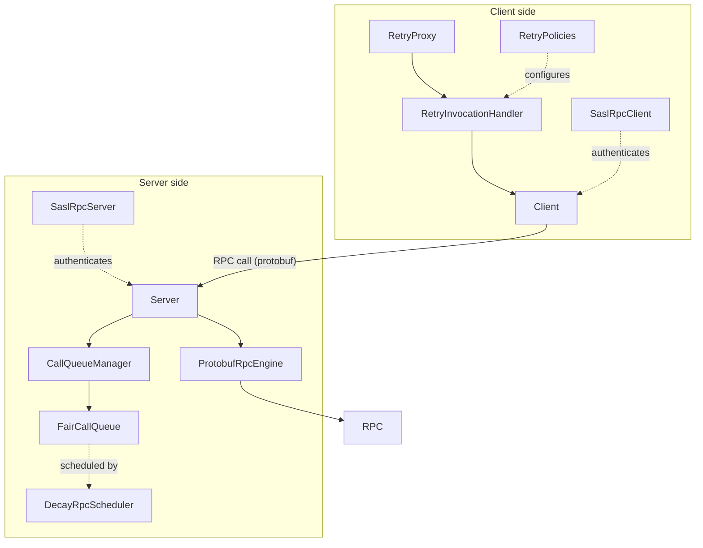

# hddscommon / hadoop-shaded

_This feature page was generated from `study/atlas/components/hddscommon/hadoop-shaded.md`. Author prose belongs above or below the BEGIN/END markers._

{/* BEGIN atlas-generated */}

**Classes:** 54    **Kinds:** service:19, interface:16, exception:8, abstract:5, data:3, metrics:2, factory:1

## Overview

The `hadoop-shaded` feature is a fork of Hadoop's IPC/RPC stack, relocated to the `ipc_/`, `io_/`, and `security_/` sub-packages (the trailing underscore prevents classpath collisions with Hadoop JARs co-deployed in YARN or MapReduce environments). The fork was initiated in [HDDS-13752](https://issues.apache.org/jira/browse/HDDS-13752). `Client` (1150 lines) manages per-server connection pools and drives async RPC dispatch; `Server` (2425 lines) runs listener, reader, and handler threads with a `CallQueueManager`-managed call queue; `ProtobufRpcEngine` deserializes protobuf requests and dispatches them to the registered `BlockingService`. `FairCallQueue` and `DecayRpcScheduler` implement weighted fair scheduling across client-identity priority buckets. `SaslRpcClient` and `SaslRpcServer` handle Kerberos and DIGEST-MD5 authentication; the SASL mechanism was made configurable in [HDDS-15168](https://issues.apache.org/jira/browse/HDDS-15168). `RetryInvocationHandler` (forked in [HDDS-15264](https://issues.apache.org/jira/browse/HDDS-15264)) and `RetryPolicies` (forked in [HDDS-15274](https://issues.apache.org/jira/browse/HDDS-15274)) wrap client proxies with policy-driven retry.

## Diagram

## Class table

### Sub-feature: `io_.retry`

| reading_order | fqcn | kind | logic | loc | study (min) | role |
|--:|---|---|---|--:|--:|---|
| 1769 | <Fqcn>org.apache.hadoop.io_.retry.RetryProxy</Fqcn> | service | mixed | 25~ | 20 | &lt;p&gt; A factory for creating retry proxies. |
| 1770 | <Fqcn>org.apache.hadoop.io_.retry.RetryPolicies</Fqcn> | service | logic-heavy | 250~ | 45 | inferred(from-md): Licensed to the Apache Software Foundation (ASF) under one or more contributor license agreements. |
| 1771 | <Fqcn>org.apache.hadoop.io_.retry.RetryInvocationHandler</Fqcn> | service | logic-heavy | 325~ | 45 | A RpcInvocationHandler which supports client side retry . |
| 1772 | <Fqcn>org.apache.hadoop.io_.retry.CallReturn</Fqcn> | service | mixed | 25~ | 30 | The call return from a method invocation. |

### Sub-feature: `ipc_`

| reading_order | fqcn | kind | logic | loc | study (min) | role |
|--:|---|---|---|--:|--:|---|
| 1773 | <Fqcn>org.apache.hadoop.ipc_.ProtobufRpcEngine</Fqcn> | service | logic-heavy | 300~ | 20 | inferred(from-md): Licensed to the Apache Software Foundation (ASF) under one or more contributor license agreements. |
| 1774 | <Fqcn>org.apache.hadoop.ipc_.FairCallQueueMXBean</Fqcn> | interface | mixed | 25~ | 20 | inferred: FairCallQueueMXBean — role not documented. |
| 1775 | <Fqcn>org.apache.hadoop.ipc_.IdentityProvider</Fqcn> | interface | mixed | 25~ | 20 | inferred: IdentityProvider — role not documented. |
| 1776 | <Fqcn>org.apache.hadoop.ipc_.RpcScheduler</Fqcn> | interface | mixed | 25~ | 20 | inferred: RpcScheduler — role not documented. |
| 1777 | <Fqcn>org.apache.hadoop.ipc_.RpcInvocationHandler</Fqcn> | interface | mixed | 25~ | 20 | inferred: RpcInvocationHandler — role not documented. |
| 1778 | <Fqcn>org.apache.hadoop.ipc_.CostProvider</Fqcn> | interface | mixed | 25~ | 20 | inferred: CostProvider — role not documented. |
| 1779 | <Fqcn>org.apache.hadoop.ipc_.Schedulable</Fqcn> | interface | mixed | 25~ | 20 | inferred: Schedulable — role not documented. |
| 1780 | <Fqcn>org.apache.hadoop.ipc_.ProtocolInfo</Fqcn> | interface | mixed | 25~ | 20 | inferred: ProtocolInfo — role not documented. |
| 1781 | <Fqcn>org.apache.hadoop.ipc_.RpcMultiplexer</Fqcn> | interface | mixed | 25~ | 20 | inferred: RpcMultiplexer — role not documented. |
| 1782 | <Fqcn>org.apache.hadoop.ipc_.DecayRpcSchedulerMXBean</Fqcn> | interface | mixed | 25~ | 20 | inferred: DecayRpcSchedulerMXBean — role not documented. |
| 1783 | <Fqcn>org.apache.hadoop.ipc_.RpcEngine</Fqcn> | interface | mixed | 25~ | 20 | inferred: RpcEngine — role not documented. |
| 1784 | <Fqcn>org.apache.hadoop.ipc_.ProtocolTranslator</Fqcn> | interface | mixed | 25~ | 20 | An interface implemented by client-side protocol translators to get the underlying proxy object the translator is ope... |
| 1785 | <Fqcn>org.apache.hadoop.ipc_.AlignmentContext</Fqcn> | interface | mixed | 25~ | 20 | inferred: AlignmentContext — role not documented. |
| 1786 | <Fqcn>org.apache.hadoop.ipc_.ProtobufRpcEngineCallback</Fqcn> | interface | mixed | 25~ | 20 | inferred: ProtobufRpcEngineCallback — role not documented. |
| 1787 | <Fqcn>org.apache.hadoop.ipc_.Server</Fqcn> | abstract | logic-heavy | 2425~ | 60 | inferred(from-md): A Server class provides standard configuration, logging and Service lifecyle management. |
| 1788 | <Fqcn>org.apache.hadoop.ipc_.RpcWritable</Fqcn> | abstract | mixed | 125~ | 30 | inferred: RpcWritable — role not documented. |
| 1789 | <Fqcn>org.apache.hadoop.ipc_.ProtoUtil</Fqcn> | abstract | mixed | 100~ | 30 | inferred: ProtoUtil — role not documented. |
| 1790 | <Fqcn>org.apache.hadoop.ipc_.ExternalCall</Fqcn> | abstract | mixed | 50~ | 30 | inferred: ExternalCall — role not documented. |
| 1791 | <Fqcn>org.apache.hadoop.ipc_.Client</Fqcn> | service | logic-heavy | 1150~ | 60 | inferred(from-md): Licensed to the Apache Software Foundation (ASF) under one or more contributor license agreements. |
| 1792 | <Fqcn>org.apache.hadoop.ipc_.DecayRpcScheduler</Fqcn> | service | logic-heavy | 700~ | 60 | inferred(from-md): Licensed to the Apache Software Foundation (ASF) under one or more contributor license agreements. |
| 1793 | <Fqcn>org.apache.hadoop.ipc_.FairCallQueue</Fqcn> | service | logic-heavy | 250~ | 45 | inferred(from-md): Licensed to the Apache Software Foundation (ASF) under one or more contributor license agreements. |
| 1794 | <Fqcn>org.apache.hadoop.ipc_.CallQueueManager</Fqcn> | service | logic-heavy | 250~ | 45 | inferred(from-md): Licensed to the Apache Software Foundation (ASF) under one or more contributor license agreements. |
| 1795 | <Fqcn>org.apache.hadoop.ipc_.CallerContext</Fqcn> | service | mixed | 75~ | 30 | inferred: CallerContext — role not documented. |
| 1796 | <Fqcn>org.apache.hadoop.ipc_.ResponseBuffer</Fqcn> | service | mixed | 75~ | 30 | inferred: ResponseBuffer — role not documented. |
| 1797 | <Fqcn>org.apache.hadoop.ipc_.ClientCache</Fqcn> | service | mixed | 50~ | 30 | inferred: ClientCache — role not documented. |
| 1798 | <Fqcn>org.apache.hadoop.ipc_.ClientId</Fqcn> | service | mixed | 50~ | 30 | inferred: ClientId — role not documented. |
| 1799 | <Fqcn>org.apache.hadoop.ipc_.WeightedRoundRobinMultiplexer</Fqcn> | service | mixed | 50~ | 30 | inferred: WeightedRoundRobinMultiplexer — role not documented. |
| 1800 | <Fqcn>org.apache.hadoop.ipc_.WeightedTimeCostProvider</Fqcn> | service | mixed | 50~ | 30 | inferred: WeightedTimeCostProvider — role not documented. |
| 1801 | <Fqcn>org.apache.hadoop.ipc_.ProtobufHelper</Fqcn> | service | mixed | 25~ | 30 | inferred: ProtobufHelper — role not documented. |
| 1802 | <Fqcn>org.apache.hadoop.ipc_.DefaultRpcScheduler</Fqcn> | service | mixed | 25~ | 30 | inferred: DefaultRpcScheduler — role not documented. |
| 1803 | <Fqcn>org.apache.hadoop.ipc_.DefaultCostProvider</Fqcn> | service | mixed | 25~ | 30 | inferred: DefaultCostProvider — role not documented. |
| 1804 | <Fqcn>org.apache.hadoop.ipc_.ProtocolProxy</Fqcn> | service | mixed | 25~ | 30 | inferred: ProtocolProxy — role not documented. |
| 1805 | <Fqcn>org.apache.hadoop.ipc_.RpcConstants</Fqcn> | service | mixed | 25~ | 30 | inferred: RpcConstants — role not documented. |
| 1806 | <Fqcn>org.apache.hadoop.ipc_.UserIdentityProvider</Fqcn> | service | mixed | 25~ | 30 | inferred: UserIdentityProvider — role not documented. |
| 1807 | <Fqcn>org.apache.hadoop.ipc_.RPC</Fqcn> | service | logic-heavy | 425~ | 10 | inferred: RPC — role not documented. |
| 1808 | <Fqcn>org.apache.hadoop.ipc_.ProcessingDetails</Fqcn> | service | mixed | 50~ | 10 | inferred: ProcessingDetails — role not documented. |
| 1809 | <Fqcn>org.apache.hadoop.ipc_.RemoteException</Fqcn> | exception | data-only | 50~ | 10 | inferred: RemoteException — role not documented. |
| 1810 | <Fqcn>org.apache.hadoop.ipc_.RpcException</Fqcn> | exception | data-only | 25~ | 10 | inferred: RpcException — role not documented. |
| 1811 | <Fqcn>org.apache.hadoop.ipc_.RpcClientException</Fqcn> | exception | data-only | 25~ | 10 | inferred: RpcClientException — role not documented. |
| 1812 | <Fqcn>org.apache.hadoop.ipc_.IpcException</Fqcn> | exception | data-only | 25~ | 10 | inferred: IpcException — role not documented. |
| 1813 | <Fqcn>org.apache.hadoop.ipc_.RpcNoSuchProtocolException</Fqcn> | exception | data-only | 25~ | 10 | inferred: RpcNoSuchProtocolException — role not documented. |
| 1814 | <Fqcn>org.apache.hadoop.ipc_.RpcServerException</Fqcn> | exception | data-only | 25~ | 10 | inferred: RpcServerException — role not documented. |
| 1815 | <Fqcn>org.apache.hadoop.ipc_.RpcNoSuchMethodException</Fqcn> | exception | data-only | 25~ | 10 | inferred: RpcNoSuchMethodException — role not documented. |
| 1816 | <Fqcn>org.apache.hadoop.ipc_.RetriableException</Fqcn> | exception | data-only | 25~ | 10 | inferred: RetriableException — role not documented. |

### Sub-feature: `ipc_.metrics`

| reading_order | fqcn | kind | logic | loc | study (min) | role |
|--:|---|---|---|--:|--:|---|
| 1817 | <Fqcn>org.apache.hadoop.ipc_.metrics.RpcMetrics</Fqcn> | metrics | mixed | 150~ | 20 | inferred: RpcMetrics — role not documented. |
| 1818 | <Fqcn>org.apache.hadoop.ipc_.metrics.RpcDetailedMetrics</Fqcn> | metrics | mixed | 25~ | 20 | inferred: RpcDetailedMetrics — role not documented. |

### Sub-feature: `security_`

| reading_order | fqcn | kind | logic | loc | study (min) | role |
|--:|---|---|---|--:|--:|---|
| 1819 | <Fqcn>org.apache.hadoop.security_.CustomizedCallbackHandler</Fqcn> | interface | mixed | 75~ | 20 | For handling customized Callback. |
| 1820 | <Fqcn>org.apache.hadoop.security_.SaslRpcClient</Fqcn> | service | logic-heavy | 475~ | 60 | inferred(from-md): Licensed to the Apache Software Foundation (ASF) under one or more contributor license agreements. |
| 1821 | <Fqcn>org.apache.hadoop.security_.SaslMechanismFactory</Fqcn> | factory | mixed | 50~ | 20 | SASL related constants. |
| 1822 | <Fqcn>org.apache.hadoop.security_.SaslRpcServer</Fqcn> | service | logic-heavy | 275~ | 10 | inferred: SaslRpcServer — role not documented. |

## Anchor details

### `ProtobufRpcEngine`

- **path:** `hadoop-hdds/common/src/main/java/org/apache/hadoop/ipc_/ProtobufRpcEngine.java`
- **loc:** 300~    **difficulty:** 2    **study:** 20 min    **concurrency:** thread-safe    **persistence:** in-memory
- **entry points:** `close`, `call`
- **role:** Licensed to the Apache Software Foundation (ASF) under one or more contributor license agreements.
- **note:** The entry point for all protobuf-based RPC on the Ozone server side. Its inner `Server` subclass registers a `BlockingService` per protocol; every incoming `RpcWritable` is deserialized here before being dispatched to OM/SCM handlers.

### `Server`

- **path:** `hadoop-hdds/common/src/main/java/org/apache/hadoop/ipc_/Server.java`
- **loc:** 2425~    **difficulty:** 5    **study:** 60 min    **concurrency:** thread-safe    **persistence:** in-memory
- **entry points:** `run`, `start`, `call`
- **key collaborators:** `org.apache.hadoop.hdds.utils.IOUtils`
- **role:** Licensed to the Apache Software Foundation (ASF) under one or more contributor license agreements.
- **note:** The core IPC server: a `Listener` thread accepts connections; `Reader` threads read request bytes from channels; `Handler` threads dequeue from `CallQueueManager` and invoke the registered `RpcEngine`. The `responder` thread drains async response buffers back to clients.

### `RetryPolicies`

- **path:** `hadoop-hdds/common/src/main/java/org/apache/hadoop/io_/retry/RetryPolicies.java`
- **loc:** 250~    **difficulty:** 4    **study:** 45 min    **concurrency:** single-threaded    **persistence:** in-memory
- **role:** Licensed to the Apache Software Foundation (ASF) under one or more contributor license agreements.
- **note:** Forked from Hadoop ([HDDS-15274](https://issues.apache.org/jira/browse/HDDS-15274)), provides static factory methods like `retryUpToMaximumCountWithFixedSleep` and `exponentialBackoffRetry`. Ozone callers use these to configure `RetryInvocationHandler` for OM and SCM client proxies.

### `Client`

- **path:** `hadoop-hdds/common/src/main/java/org/apache/hadoop/ipc_/Client.java`
- **loc:** 1150~    **difficulty:** 5    **study:** 60 min    **concurrency:** thread-safe    **persistence:** in-memory
- **entry points:** `read`, `run`, `call`, `close`
- **role:** Licensed to the Apache Software Foundation (ASF) under one or more contributor license agreements.
- **note:** Maintains a `ConnectionId -> Connection` pool; each `Connection` runs a reader thread that matches server response tags to pending `Call` futures. Serializes the request with `RpcWritable` and hands the `Call` to the connection; the caller blocks on a `CompletableFuture`.

### `DecayRpcScheduler`

- **path:** `hadoop-hdds/common/src/main/java/org/apache/hadoop/ipc_/DecayRpcScheduler.java`
- **loc:** 700~    **difficulty:** 5    **study:** 60 min    **concurrency:** thread-safe    **persistence:** in-memory
- **entry points:** `run`
- **role:** Licensed to the Apache Software Foundation (ASF) under one or more contributor license agreements.
- **note:** Tracks per-caller call-count using an exponential decay to prevent a single client from monopolizing handler threads. The decayed weight is periodically recalculated and fed to `WeightedRoundRobinMultiplexer` to assign callers to priority queues within `FairCallQueue`.

### `SaslRpcClient`

- **path:** `hadoop-hdds/common/src/main/java/org/apache/hadoop/security_/SaslRpcClient.java`
- **loc:** 475~    **difficulty:** 5    **study:** 60 min    **concurrency:** thread-safe    **persistence:** in-memory
- **entry points:** `read`, `write`, `handle`
- **key collaborators:** `org.apache.hadoop.hdds.utils.GlobPattern`
- **role:** Licensed to the Apache Software Foundation (ASF) under one or more contributor license agreements.
- **note:** Negotiates GSSAPI (Kerberos) or DIGEST-MD5 (token) authentication before handing the socket channel over to `Client`. [HDDS-15168](https://issues.apache.org/jira/browse/HDDS-15168) made the SASL mechanism list configurable via a config key so operators can restrict to one mechanism. `SaslMechanismFactory` provides the per-mechanism `SaslClient` instances.

### `RetryInvocationHandler`

- **path:** `hadoop-hdds/common/src/main/java/org/apache/hadoop/io_/retry/RetryInvocationHandler.java`
- **loc:** 325~    **difficulty:** 4    **study:** 45 min    **concurrency:** single-threaded    **persistence:** in-memory
- **entry points:** `close`
- **role:** A RpcInvocationHandler which supports client side retry .
- **note:** Forked from Hadoop ([HDDS-15264](https://issues.apache.org/jira/browse/HDDS-15264)). Wraps an `Invocable` and intercepts `invoke()`; on exception it calls `RetryPolicy.shouldRetry()` to decide whether to failover to a standby, sleep-and-retry, or propagate. `CallReturn` carries the per-call decision state between attempts.

### `FairCallQueue`

- **path:** `hadoop-hdds/common/src/main/java/org/apache/hadoop/ipc_/FairCallQueue.java`
- **loc:** 250~    **difficulty:** 4    **study:** 45 min    **concurrency:** actor/queue    **persistence:** in-memory
- **role:** Licensed to the Apache Software Foundation (ASF) under one or more contributor license agreements.
- **note:** Holds N `LinkedBlockingQueue` priority levels; `take()` uses a `WeightedRoundRobinMultiplexer` to select a level so that low-priority callers still drain rather than starve. `DecayRpcScheduler` provides the per-call priority assignment.

### `CallQueueManager`

- **path:** `hadoop-hdds/common/src/main/java/org/apache/hadoop/ipc_/CallQueueManager.java`
- **loc:** 250~    **difficulty:** 4    **study:** 45 min    **concurrency:** actor/queue    **persistence:** in-memory
- **role:** Licensed to the Apache Software Foundation (ASF) under one or more contributor license agreements.
- **note:** Wraps either a plain `LinkedBlockingQueue` (FIFO) or a `FairCallQueue` and coordinates live swap-on-config-reload. It also enforces the server-side call queue capacity limit that triggers backpressure to the client.

## Design docs

no dedicated design doc under hadoop-hdds/docs/content/ on this branch

## Seminal JIRAs / PRs

- [HDDS-13752](https://issues.apache.org/jira/browse/HDDS-13752). Copy Hadoop RPC code to Ozone
- [HDDS-15264](https://issues.apache.org/jira/browse/HDDS-15264). Fork RetryInvocationHandler from Hadoop
- [HDDS-15274](https://issues.apache.org/jira/browse/HDDS-15274). Fork RetryPolicies from Hadoop
- [HDDS-15168](https://issues.apache.org/jira/browse/HDDS-15168). Support configurable SASL mechanism
- [HDDS-15287](https://issues.apache.org/jira/browse/HDDS-15287). Remove unused deferred/async RPC
- [HDDS-15154](https://issues.apache.org/jira/browse/HDDS-15154). Remove unused RPC code
- [HDDS-15243](https://issues.apache.org/jira/browse/HDDS-15243). Remove unused GenericRefreshProtocol, RefreshCallQueueProtocol
- [HDDS-15205](https://issues.apache.org/jira/browse/HDDS-15205). Cut WritableRPCEngine

## Sharp edges

- `Server` and `Client` both derive from the Hadoop codebase and carry Hadoop-style `LOG` and metrics registrations; a class loaded by both Ozone and a co-deployed Hadoop component can produce duplicate JMX bean registration errors if the trailing-underscore package rename is bypassed.
- `DecayRpcScheduler` decays weights on a background thread; if the decay period is misconfigured relative to request rate, low-volume legitimate callers can be permanently pushed to the lowest priority bucket even after their burst has passed ([HDDS-13752](https://issues.apache.org/jira/browse/HDDS-13752) context).
- `SaslRpcClient` caches the negotiated auth token inside the `Connection` object; a token expiry between requests silently retries the SASL handshake but can produce confusing `GSSException: No valid credentials` if the KDC is unreachable at that moment (see [HDDS-15168](https://issues.apache.org/jira/browse/HDDS-15168) for the configurable mechanism path).

## Related features

- [`security-common.md`](/component/hddscommon/security-common) — Ozone-level Kerberos token types and `OzoneTokenIdentifier` that feed into `SaslRpcServer`
- [`security-tokens.md`](/component/hddscommon/security-tokens) — delegation token lifecycle used as DIGEST-MD5 credentials by `SaslRpcClient`
- [`framework-server.md`](/component/hddscommon/framework-server) — `HddsServerUtil` and gRPC server wiring that sits alongside this IPC layer
- [`ratis-integration.md`](/component/hddscommon/ratis-integration) — Ratis Raft RPC path that is separate from but parallel to this IPC stack
- [`hdds-primitives.md`](/component/hddscommon/hdds-primitives) — `HddsUtils` host/port helpers consumed by `Client` when resolving server addresses

## Self-quiz

1. What prevents `ipc_.Server` from conflicting with Hadoop's `org.apache.hadoop.ipc.Server` at runtime, and which JIRA introduced this isolation?
2. Explain how `DecayRpcScheduler` assigns a priority level to an incoming call and how `FairCallQueue` uses that priority to order handler dispatch.
3. `RetryInvocationHandler` can either sleep-and-retry on the same server or failover to a standby. Which field on the `RetryPolicy.RetryAction` distinguishes the two modes?
4. Trace the path of a protobuf RPC call from `Client.call()` through `Server` to the service handler, naming every class that touches the bytes.
5. What does `SaslMechanismFactory` produce, and which config key (added in [HDDS-15168](https://issues.apache.org/jira/browse/HDDS-15168)) restricts which mechanism `SaslRpcClient` will attempt?

Answers

Answer 1: The packages are renamed with a trailing underscore (`ipc_`, `io_`, `security_`) so their binary names differ from the upstream Hadoop classes. [HDDS-13752](https://issues.apache.org/jira/browse/HDDS-13752) introduced the fork and the naming convention.
Answer 2: `DecayRpcScheduler.getPriorityLevel()` looks up the caller's decayed call-count weight and maps it to a bucket index (0 = highest). `FairCallQueue` holds N `LinkedBlockingQueue` instances; `WeightedRoundRobinMultiplexer.getNextMultiplexerIndex()` picks which queue to drain on each `take()` according to configured weights.
Answer 3: `RetryPolicy.RetryAction.action` is `RETRY` for same-server retry and `FAILOVER_AND_RETRY` for standby failover. `RetryInvocationHandler` checks this and calls `hasCurrent.performFailover()` only for the failover case.
Answer 4: `Client.call()` serializes the request into a `RpcWritable.Buffer` and writes it on the `Connection`'s socket. `Server.Reader` reads the bytes; `Server.Handler` dequeues the `Call` and invokes `ProtobufRpcEngine.Server.call()`, which deserializes the protobuf message and calls the registered `BlockingService.callBlockingMethod()`.
Answer 5: `SaslMechanismFactory` produces a `SaslClient` or `SaslServer` for the selected mechanism (GSSAPI or DIGEST-MD5). The config key added by [HDDS-15168](https://issues.apache.org/jira/browse/HDDS-15168) is `hadoop.rpc.protection` / mechanism selector; operators set it to restrict to a single mechanism.

{/* END atlas-generated */}
