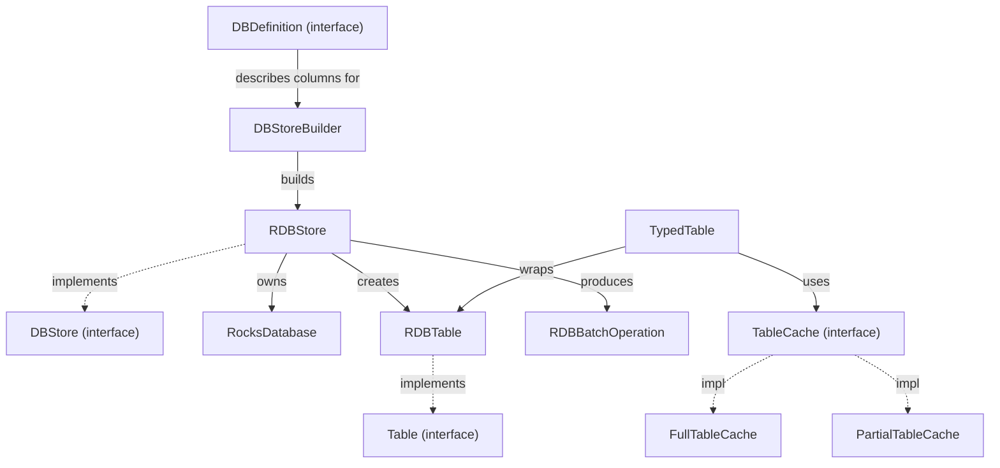

# hddscommon / hdds-db-utils

_This feature page was generated from `study/atlas/components/hddscommon/hdds-db-utils.md`. Author prose belongs above or below the BEGIN/END markers._

{/* BEGIN atlas-generated */}

**Classes:** 48    **Kinds:** service:25, interface:12, util:4, data:3, abstract:1, config:1, metrics:1, exception:1

## Overview

The `hdds-db-utils` feature is the typed RocksDB access layer shared by OM, SCM, Recon, and the datanode. `RocksDatabase` owns the native RocksDB handle, column-family lifecycle, and WAL flush; it was upgraded from RocksDB 7.7.3 to 10.10.1 in [HDDS-14225](https://issues.apache.org/jira/browse/HDDS-14225). `RDBStore` implements `DBStore` and creates one `RDBTable` per column family; `TypedTable` wraps `RDBTable` with `Codec`-based key/value serialization and an optional `TableCache` (full or partial). `RDBBatchOperation` accumulates puts and deletes into a `ManagedWriteBatch`; [HDDS-14241](https://issues.apache.org/jira/browse/HDDS-14241) refactored each operation into an object and [HDDS-14166](https://issues.apache.org/jira/browse/HDDS-14166) / [HDDS-14238](https://issues.apache.org/jira/browse/HDDS-14238) eliminated intermediate byte-array copies by using native slice comparison. `Table.clear()` was added in [HDDS-15894](https://issues.apache.org/jira/browse/HDDS-15894) to support Recon's reset workflow. The `cache` sub-package provides `FullTableCache` and `PartialTableCache` which serve reads without hitting RocksDB; `CacheStats` tracks hit/miss counts.

## Diagram

## Class table

### Sub-feature: `db.cache`

| reading_order | fqcn | kind | logic | loc | study (min) | role |
|--:|---|---|---|--:|--:|---|
| 1823 | <Fqcn>org.apache.hadoop.hdds.utils.db.cache.TableCache</Fqcn> | interface | mixed | 25~ | 20 | Cache used for RocksDB tables. |
| 1824 | <Fqcn>org.apache.hadoop.hdds.utils.db.cache.FullTableCache</Fqcn> | service | mixed | 125~ | 30 | Cache implementation for the table. |
| 1825 | <Fqcn>org.apache.hadoop.hdds.utils.db.cache.PartialTableCache</Fqcn> | service | mixed | 100~ | 30 | Cache implementation for the table. |
| 1826 | <Fqcn>org.apache.hadoop.hdds.utils.db.cache.TableNoCache</Fqcn> | service | mixed | 50~ | 30 | Dummy cache implementation for the table, means key/value are not cached. |
| 1827 | <Fqcn>org.apache.hadoop.hdds.utils.db.cache.CacheStatsRecorder</Fqcn> | service | mixed | 25~ | 30 | Records cache stats. |
| 1828 | <Fqcn>org.apache.hadoop.hdds.utils.db.cache.CacheStats</Fqcn> | service | mixed | 25~ | 30 | Include cache stat counters. |
| 1829 | <Fqcn>org.apache.hadoop.hdds.utils.db.cache.CacheKey</Fqcn> | service | mixed | 25~ | 30 | CacheKey for the RocksDB table. |
| 1830 | <Fqcn>org.apache.hadoop.hdds.utils.db.cache.CacheValue</Fqcn> | service | mixed | 25~ | 30 | CacheValue for the RocksDB Table. |
| 1831 | <Fqcn>org.apache.hadoop.hdds.utils.db.cache.CacheResult</Fqcn> | service | mixed | 25~ | 10 | CacheResult which is returned as response for Key exist in cache or not. |

### Sub-feature: `scm.metadata`

| reading_order | fqcn | kind | logic | loc | study (min) | role |
|--:|---|---|---|--:|--:|---|
| 1832 | <Fqcn>org.apache.hadoop.hdds.scm.metadata.DBTransactionBuffer</Fqcn> | interface | mixed | 25~ | 20 | DB transaction that abstracts the updates to the underlying datastore. |
| 1833 | <Fqcn>org.apache.hadoop.hdds.scm.metadata.SCMMetadataStore</Fqcn> | interface | mixed | 25~ | 20 | Generic interface for data stores for SCM. |
| 1834 | <Fqcn>org.apache.hadoop.hdds.scm.metadata.Replicate</Fqcn> | interface | mixed | 25~ | 20 | Indicates that a method will be called via Ratis. |
| 1835 | <Fqcn>org.apache.hadoop.hdds.scm.metadata.SCMDBTransactionBufferImpl</Fqcn> | service | mixed | 25~ | 30 | Default implementation for DBTransactionBuffer for SCM without Ratis. |

### Sub-feature: `utils.db`

| reading_order | fqcn | kind | logic | loc | study (min) | role |
|--:|---|---|---|--:|--:|---|
| 1836 | <Fqcn>org.apache.hadoop.hdds.utils.db.Table</Fqcn> | interface | mixed | 150~ | 20 | Interface for key-value store that stores ozone metadata. |
| 1837 | <Fqcn>org.apache.hadoop.hdds.utils.db.DBDefinition</Fqcn> | interface | mixed | 75~ | 20 | Simple interface to provide information to create a DBStore.. |
| 1838 | <Fqcn>org.apache.hadoop.hdds.utils.db.CodecRegistry</Fqcn> | service | mixed | 75~ | 20 | Collection of available codecs. |
| 1839 | <Fqcn>org.apache.hadoop.hdds.utils.db.TableIterator</Fqcn> | interface | mixed | 50~ | 20 | To iterate a Table. |
| 1840 | <Fqcn>org.apache.hadoop.hdds.utils.db.DBCheckpoint</Fqcn> | interface | mixed | 25~ | 20 | Generic DB Checkpoint interface. |
| 1841 | <Fqcn>org.apache.hadoop.hdds.utils.db.BatchOperationHandler</Fqcn> | interface | mixed | 25~ | 20 | Create and commit batch operation for one DB. |
| 1842 | <Fqcn>org.apache.hadoop.hdds.utils.db.BatchOperation</Fqcn> | interface | mixed | 25~ | 20 | Class represents a batch operation, collects multiple db operation. |
| 1843 | <Fqcn>org.apache.hadoop.hdds.utils.db.DBStore</Fqcn> | interface | mixed | 25~ | 20 | The DBStore interface provides the ability to create Tables, which store a specific type of Key-Value pair. |
| 1844 | <Fqcn>org.apache.hadoop.hdds.utils.db.RDBStoreAbstractIterator</Fqcn> | abstract | mixed | 100~ | 30 | An abstract Table.KeyValueIterator to iterate raw Table.KeyValues. |
| 1845 | <Fqcn>org.apache.hadoop.hdds.utils.db.RocksDatabase</Fqcn> | service | logic-heavy | 675~ | 60 | A wrapper class for org.rocksdb.RocksDB. |
| 1846 | <Fqcn>org.apache.hadoop.hdds.utils.db.TypedTable</Fqcn> | service | logic-heavy | 425~ | 60 | Strongly typed table implementation. |
| 1847 | <Fqcn>org.apache.hadoop.hdds.utils.db.RDBStore</Fqcn> | service | logic-heavy | 350~ | 45 | RocksDB Store that supports creating Tables in DB. |
| 1848 | <Fqcn>org.apache.hadoop.hdds.utils.db.RDBBatchOperation</Fqcn> | service | logic-heavy | 300~ | 45 | Batch operation implementation for rocks db. |
| 1849 | <Fqcn>org.apache.hadoop.hdds.utils.db.RDBTable</Fqcn> | service | logic-heavy | 250~ | 45 | RocksDB implementation of ozone metadata store. |
| 1850 | <Fqcn>org.apache.hadoop.hdds.utils.db.DBConfigFromFile</Fqcn> | service | mixed | 100~ | 30 | A Class that controls the standard config options of RocksDB. |
| 1851 | <Fqcn>org.apache.hadoop.hdds.utils.db.RocksDBConfiguration</Fqcn> | service | mixed | 100~ | 30 | Holds configuration items for OM RocksDB. |
| 1852 | <Fqcn>org.apache.hadoop.hdds.utils.db.InodeMetadataRocksDBCheckpoint</Fqcn> | service | mixed | 100~ | 30 | RocksDB checkpoint implementation that uses hardlinks to optimize disk space for inode-based metadata checkpoints. |
| 1853 | <Fqcn>org.apache.hadoop.hdds.utils.db.DBColumnFamilyDefinition</Fqcn> | service | mixed | 75~ | 30 | Class represents one single column table with the required codecs and types. |
| 1854 | <Fqcn>org.apache.hadoop.hdds.utils.db.RDBStoreCodecBufferIterator</Fqcn> | service | mixed | 50~ | 30 | Implement RDBStoreAbstractIterator using CodecBuffer. |
| 1855 | <Fqcn>org.apache.hadoop.hdds.utils.db.RDBStoreByteArrayIterator</Fqcn> | service | mixed | 50~ | 30 | RocksDB store iterator using the byte[] API. |
| 1856 | <Fqcn>org.apache.hadoop.hdds.utils.db.RDBCheckpointManager</Fqcn> | service | mixed | 50~ | 30 | RocksDB Checkpoint Manager, used to create and cleanup checkpoints. |
| 1857 | <Fqcn>org.apache.hadoop.hdds.utils.db.RocksDBCheckpoint</Fqcn> | service | mixed | 50~ | 30 | Class to hold information and location of a RocksDB Checkpoint. |
| 1858 | <Fqcn>org.apache.hadoop.hdds.utils.db.DBUpdatesWrapper</Fqcn> | service | mixed | 25~ | 30 | Wrapper class to hold DB data read from the RocksDB log file. |
| 1859 | <Fqcn>org.apache.hadoop.hdds.utils.db.AutoCloseSupplier</Fqcn> | interface | mixed | 25~ | 30 | An AutoCloseable Supplier. |
| 1860 | <Fqcn>org.apache.hadoop.hdds.utils.db.RDBSstFileLoader</Fqcn> | service | mixed | 25~ | 30 | Load rocksdb sst files. |
| 1861 | <Fqcn>org.apache.hadoop.hdds.utils.db.RDBCheckpointUtils</Fqcn> | service | mixed | 25~ | 30 | RocksDB Checkpoint Utilities. |
| 1862 | <Fqcn>org.apache.hadoop.hdds.utils.db.TableConfig</Fqcn> | config | data-only | 50~ | 20 | Class that maintains Table Configuration. |
| 1863 | <Fqcn>org.apache.hadoop.hdds.utils.db.ByteStringCodec</Fqcn> | util | mixed | 50~ | 20 | Codec to serialize/deserialize a ByteString. |
| 1864 | <Fqcn>org.apache.hadoop.hdds.utils.db.CodecBufferCodec</Fqcn> | util | mixed | 50~ | 20 | A concrete implementation of the Codec interface for the CodecBuffer type. |
| 1865 | <Fqcn>org.apache.hadoop.hdds.utils.db.ByteArrayCodec</Fqcn> | util | mixed | 25~ | 20 | No-op codec for byte arrays. |
| 1866 | <Fqcn>org.apache.hadoop.hdds.utils.db.FixedLengthStringCodec</Fqcn> | util | mixed | 25~ | 20 | A Codec to serialize/deserialize String using StandardCharsets#ISO_8859_1, a fixed-length one-byte-per-character enco... |
| 1867 | <Fqcn>org.apache.hadoop.hdds.utils.db.DBStoreBuilder</Fqcn> | data | logic-heavy | 275~ | 10 | DBStore Builder. |
| 1868 | <Fqcn>org.apache.hadoop.hdds.utils.db.DBProfile</Fqcn> | data | data-only | 100~ | 10 | User visible configs based RocksDB tuning page. |
| 1869 | <Fqcn>org.apache.hadoop.hdds.utils.db.RDBMetrics</Fqcn> | metrics | mixed | 75~ | 20 | Class to hold RocksDB metrics. |
| 1870 | <Fqcn>org.apache.hadoop.hdds.utils.db.SequenceNumberNotFoundException</Fqcn> | exception | data-only | 25~ | 10 | Thrown if RocksDB is unable to find requested data from WAL file. |

## Anchor details

### `RocksDatabase`

- **path:** `hadoop-hdds/framework/src/main/java/org/apache/hadoop/hdds/utils/db/RocksDatabase.java`
- **loc:** 675~    **difficulty:** 5    **study:** 60 min    **concurrency:** thread-safe    **persistence:** RocksDB
- **entry points:** `close`
- **key collaborators:** `org.apache.hadoop.hdds.StringUtils`, `org.apache.hadoop.hdds.utils.db.managed.ManagedCheckpoint`, `org.apache.hadoop.hdds.utils.db.managed.ManagedColumnFamilyOptions`, `org.apache.hadoop.hdds.utils.db.managed.ManagedCompactRangeOptions`, `org.apache.hadoop.hdds.utils.db.managed.ManagedDBOptions`, `org.apache.hadoop.hdds.utils.db.managed.ManagedFlushOptions`
- **role:** A wrapper class for &#123;@link org.
- **note:** Upgraded to RocksDB 10.10.1 in [HDDS-14225](https://issues.apache.org/jira/browse/HDDS-14225). Manages a `ColumnFamilyHandle` map keyed by column-family name; exposes `flush()`, `compactRange()`, and `createCheckpoint()` that OM and SCM call during snapshot and replication workflows. Guards iterators against use-after-close during volume failure ([HDDS-137](https://issues.apache.org/jira/browse/HDDS-137)ea).

### `TypedTable`

- **path:** `hadoop-hdds/framework/src/main/java/org/apache/hadoop/hdds/utils/db/TypedTable.java`
- **loc:** 425~    **difficulty:** 5    **study:** 60 min    **concurrency:** single-threaded    **persistence:** RocksDB
- **entry points:** `close`
- **key collaborators:** `org.apache.hadoop.hdds.utils.db.cache.CacheKey`, `org.apache.hadoop.hdds.utils.db.cache.CacheResult`, `org.apache.hadoop.hdds.utils.db.cache.CacheValue`, `org.apache.hadoop.hdds.utils.db.cache.FullTableCache`, `org.apache.hadoop.hdds.utils.db.cache.PartialTableCache`, `org.apache.hadoop.hdds.utils.db.cache.TableCache`
- **test exemplar:** `hadoop-hdds/framework/src/test/java/org/apache/hadoop/hdds/utils/db/TestTypedTable.java`
- **role:** Strongly typed table implementation.
- **note:** The primary `Table<KEY, VALUE>` implementation seen by OM and SCM code. All `get(KEY key)` calls check the `TableCache` first; a `CacheResult.Status.NOT_EXIST` entry acts as a tombstone so in-flight deletes are visible before the batch is committed. Iterator usage goes through `RDBStoreCodecBufferIterator` or `RDBStoreByteArrayIterator` depending on whether `CodecBuffer` direct I/O is available.

### `RDBStore`

- **path:** `hadoop-hdds/framework/src/main/java/org/apache/hadoop/hdds/utils/db/RDBStore.java`
- **loc:** 350~    **difficulty:** 4    **study:** 45 min    **concurrency:** single-threaded    **persistence:** RocksDB
- **entry points:** `close`
- **key collaborators:** `org.apache.hadoop.hdds.utils.db.cache.TableCache`, `org.apache.hadoop.hdds.conf.ConfigurationSource`, `org.apache.hadoop.hdds.utils.IOUtils`, `org.apache.hadoop.hdds.utils.RocksDBStoreMetrics`, `org.apache.hadoop.hdds.utils.db.managed.ManagedCompactRangeOptions`, `org.apache.hadoop.hdds.utils.db.managed.ManagedDBOptions`
- **test exemplar:** `hadoop-hdds/framework/src/test/java/org/apache/hadoop/hdds/utils/db/TestRDBStore.java`
- **role:** RocksDB Store that supports creating Tables in DB.
- **note:** Implements `DBStore` and `BatchOperationHandler`. On open, it reads column-family definitions from a `DBDefinition` and creates one `RDBTable` per family. It also registers `RDBMetrics` and wraps the DB options from `DBConfigFromFile` so operators can tune RocksDB via an external INI file without rebuilding.

### `RDBBatchOperation`

- **path:** `hadoop-hdds/framework/src/main/java/org/apache/hadoop/hdds/utils/db/RDBBatchOperation.java`
- **loc:** 300~    **difficulty:** 4    **study:** 45 min    **concurrency:** single-threaded    **persistence:** in-memory
- **entry points:** `close`, `apply`, `commit`
- **key collaborators:** `org.apache.hadoop.hdds.utils.IOUtils`, `org.apache.hadoop.hdds.utils.db.managed.ManagedDirectSlice`, `org.apache.hadoop.hdds.utils.db.managed.ManagedSlice`, `org.apache.hadoop.hdds.utils.db.managed.ManagedWriteBatch`, `org.apache.hadoop.hdds.utils.db.managed.ManagedWriteOptions`
- **test exemplar:** `hadoop-hdds/framework/src/test/java/org/apache/hadoop/hdds/utils/db/TestRDBBatchOperation.java`
- **role:** Batch operation implementation for rocks db.
- **note:** [HDDS-14241](https://issues.apache.org/jira/browse/HDDS-14241) refactored each put/delete into a typed operation object so the batch can be introspected and replayed. [HDDS-14166](https://issues.apache.org/jira/browse/HDDS-14166) / [HDDS-14238](https://issues.apache.org/jira/browse/HDDS-14238) replaced intermediate `byte[]` allocations with `ManagedDirectSlice` pointing into existing buffers, cutting GC pressure on high-throughput OM write paths.

### `RDBTable`

- **path:** `hadoop-hdds/framework/src/main/java/org/apache/hadoop/hdds/utils/db/RDBTable.java`
- **loc:** 250~    **difficulty:** 4    **study:** 45 min    **concurrency:** single-threaded    **persistence:** RocksDB
- **key collaborators:** `org.apache.hadoop.hdds.annotation.InterfaceAudience`
- **test exemplar:** `hadoop-hdds/framework/src/test/java/org/apache/hadoop/hdds/utils/db/TestRDBTable.java`
- **role:** RocksDB implementation of ozone metadata store.
- **note:** The raw byte-level `Table<byte[], byte[]>` that calls directly into the RocksDB JNI (`RocksDatabase.get`, `put`, `delete`, `newIterator`). `TypedTable` delegates here after codec serialization. `clear()` (added in [HDDS-15894](https://issues.apache.org/jira/browse/HDDS-15894)) drops all keys in the column family via a RocksDB range deletion.

## Design docs

no dedicated design doc under hadoop-hdds/docs/content/ on this branch

## Seminal JIRAs / PRs

- [HDDS-15894](https://issues.apache.org/jira/browse/HDDS-15894). Add Table.clear for reusable table clearing
- [HDDS-14225](https://issues.apache.org/jira/browse/HDDS-14225). Upgrade RocksDB from 7.7.3 to 10.10.1
- [HDDS-14166](https://issues.apache.org/jira/browse/HDDS-14166). Get rid of byte array operations from RDBBatchOperation for PUT and DELETE
- [HDDS-14241](https://issues.apache.org/jira/browse/HDDS-14241). Implement Operations as objects in RDBBatchOperation
- [HDDS-14238](https://issues.apache.org/jira/browse/HDDS-14238). Move RDBBatchOperation Byte comparison to native comparison
- [HDDS-14227](https://issues.apache.org/jira/browse/HDDS-14227). Introduce factory method for RDBBatchOperation
- [HDDS-137](https://issues.apache.org/jira/browse/HDDS-137)ea. Guard RocksDB iterator against closed DB during volume failure

## Sharp edges

- `TypedTable` caches in-flight deletes as `CacheResult.Status.NOT_EXIST` tombstones; if the `TableCache` is never flushed (e.g., after an uncommitted batch is dropped on error), stale tombstones will shadow live RocksDB entries until the cache is explicitly invalidated.
- `RocksDatabase` iterators obtained before a volume failure can become invalid after `close()` is called on the underlying `RocksDB` handle; [HDDS-137](https://issues.apache.org/jira/browse/HDDS-137)ea added a guard, but callers that hold iterators across checkpoints must still explicitly handle `RocksDBException` with status `Invalid`.
- `DBConfigFromFile` reads RocksDB tuning from an operator-supplied INI; a malformed or missing file silently falls back to defaults, making it hard to detect misconfiguration in production (no warning in the log at open time).

## Related features

- [`hdds-utils.md`](/component/hddscommon/hdds-utils) — `CodecBuffer` and `Codec` types that `TypedTable` and `RDBBatchOperation` depend on for serialization
- [`framework-utils.md`](/component/hddscommon/framework-utils) — `managed-rocksdb` wrappers (`ManagedRocksDB`, `ManagedWriteBatch`) that `RocksDatabase` delegates to
- [`upgrade-common.md`](/component/hddscommon/upgrade-common) — schema version and layout feature checks that gate column-family additions at DB open
- [`ratis-integration.md`](/component/hddscommon/ratis-integration) — SCM HA uses `DBTransactionBuffer` / `Replicate` from this feature to buffer writes before Raft commit
- [`scm-common.md`](/component/hddscommon/scm-common) — `SCMMetadataStore` and `SCMDBTransactionBufferImpl` defined in this feature group

## Self-quiz

1. `TypedTable.get(KEY key)` can return a result without hitting RocksDB. Explain the two `CacheResult.Status` values that make this possible.
2. `RDBBatchOperation.commit()` calls `writeBatch.write()`. Which class ultimately issues the JNI call, and how did [HDDS-14238](https://issues.apache.org/jira/browse/HDDS-14238) reduce allocation overhead?
3. What is the difference between `FullTableCache` and `PartialTableCache`, and when does OM use each?
4. How does `RDBStore` expose operator-controlled RocksDB tuning without code changes, and which class parses the external configuration?
5. `Table.clear()` was added in [HDDS-15894](https://issues.apache.org/jira/browse/HDDS-15894). Describe its implementation in `RDBTable` and which Recon workflow motivated it.

Answers

Answer 1: `CacheResult.Status.EXISTS` means the cache holds a valid value (skip RocksDB). `CacheResult.Status.NOT_EXIST` is a tombstone meaning the key was deleted in an in-flight batch but not yet committed; `TypedTable.get()` returns `null` for this status without reading RocksDB.
Answer 2: `RocksDatabase` issues the JNI call via the `ManagedWriteBatch` native handle. [HDDS-14238](https://issues.apache.org/jira/browse/HDDS-14238) replaced intermediate `byte[]` comparisons with `ManagedDirectSlice` objects that point into existing off-heap buffers, avoiding allocation and copy on each put/delete.
Answer 3: `FullTableCache` loads all rows at startup and serves all reads from memory (used for tables like `volumeTable` and `bucketTable` that OM caches entirely). `PartialTableCache` holds only recently written entries (used for large tables like `keyTable` where full preload is impractical).
Answer 4: `DBConfigFromFile` reads a RocksDB-format options file from a path configured via `ozone.metadata.dirs`. `RDBStore` passes the resulting `ManagedDBOptions` to `RocksDatabase.open()`.
Answer 5: `RDBTable.clear()` issues a `RocksDB.deleteRange()` from the first key to a sentinel beyond the last key in the column family, efficiently clearing all entries via a range tombstone. The motivation was Recon's full-resync workflow, which needs to truncate tables before replaying the OM DB snapshot.

{/* END atlas-generated */}
