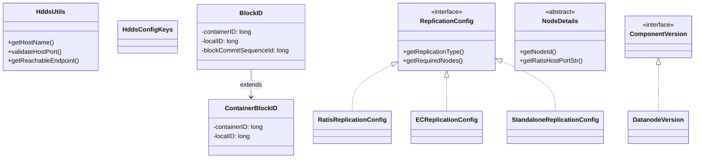

# hddscommon / hdds-primitives

_This feature page was generated from `study/atlas/components/hddscommon/hdds-primitives.md`. Author prose belongs above or below the BEGIN/END markers._

{/* BEGIN atlas-generated */}

**Classes:** 28    **Kinds:** service:9, config:9, interface:4, data:4, abstract:1, factory:1

## Overview

The `hdds-primitives` feature collects the foundational value types, constants, and stateless utilities that every Ozone service depends on. `HddsUtils` (~525 lines) is the central static helper, providing host/port parsing (`getHostName`, `validateHostPort`), endpoint reachability probes (`getReachableEndpoint`), and container-related helpers; host/port handling was made IPv6-safe in [HDDS-15773](https://issues.apache.org/jira/browse/HDDS-15773). `HddsConfigKeys` and `ScmConfigKeys` are constant-holder interfaces for string config key literals, avoiding hard-coded strings scattered across modules. The `client` sub-package holds `BlockID` and `ContainerBlockID` (SCM-allocated block references), `ReplicationConfig` and its subtypes (`RatisReplicationConfig`, `ECReplicationConfig`, `StandaloneReplicationConfig`), and `OzoneQuota`. `DatanodeVersion` and `ComponentVersion` enumerate layout version features consumed by the upgrade framework. `NodeDetails` is the base type for SCM HA and OM HA node identity objects.

## Diagram

## Class table

### Sub-feature: `hdds`

| reading_order | fqcn | kind | logic | loc | study (min) | role |
|--:|---|---|---|--:|--:|---|
| 1871 | <Fqcn>org.apache.hadoop.hdds.ComponentVersion</Fqcn> | interface | mixed | 25~ | 20 | Base type for component version enums. |
| 1872 | <Fqcn>org.apache.hadoop.hdds.NodeDetails</Fqcn> | abstract | mixed | 75~ | 30 | Basic information about nodes in an HA setup. |
| 1873 | <Fqcn>org.apache.hadoop.hdds.HddsUtils</Fqcn> | service | logic-heavy | 525~ | 60 | HDDS specific stateless utility functions. |
| 1874 | <Fqcn>org.apache.hadoop.hdds.StringUtils</Fqcn> | service | mixed | 75~ | 30 | Simple utility class to collection string conversion methods. |
| 1875 | <Fqcn>org.apache.hadoop.hdds.ExitManager</Fqcn> | service | mixed | 25~ | 30 | An Exit Manager used to shutdown service in case of unrecoverable error. |
| 1876 | <Fqcn>org.apache.hadoop.hdds.JavaUtils</Fqcn> | service | mixed | 25~ | 30 | Various reusable utility methods related to Java. |
| 1877 | <Fqcn>org.apache.hadoop.hdds.HddsConfigKeys</Fqcn> | config | logic-heavy | 300~ | 20 | This class contains constants for configuration keys and default values used in hdds. |
| 1878 | <Fqcn>org.apache.hadoop.hdds.HddsIdFactory</Fqcn> | factory | mixed | 25~ | 20 | HDDS Id generator. |
| 1879 | <Fqcn>org.apache.hadoop.hdds.DatanodeVersion</Fqcn> | data | data-only | 25~ | 10 | Versioning for datanode. |

### Sub-feature: `hdds.annotation`

| reading_order | fqcn | kind | logic | loc | study (min) | role |
|--:|---|---|---|--:|--:|---|
| 1880 | <Fqcn>org.apache.hadoop.hdds.annotation.InterfaceAudience</Fqcn> | service | mixed | 25~ | 20 | Annotation to inform users of a package, class or method's intended audience. |
| 1881 | <Fqcn>org.apache.hadoop.hdds.annotation.InterfaceStability</Fqcn> | service | mixed | 25~ | 20 | Annotation to inform users of how much to rely on a particular package, class or method not changing over time. |

### Sub-feature: `hdds.client`

| reading_order | fqcn | kind | logic | loc | study (min) | role |
|--:|---|---|---|--:|--:|---|
| 1882 | <Fqcn>org.apache.hadoop.hdds.client.BlockID</Fqcn> | service | mixed | 100~ | 30 | BlockID of Ozone (containerID + localID + blockCommitSequenceId + replicaIndex). |
| 1883 | <Fqcn>org.apache.hadoop.hdds.client.DecommissionUtils</Fqcn> | service | mixed | 75~ | 30 | Decommission specific stateless utility functions. |
| 1884 | <Fqcn>org.apache.hadoop.hdds.client.ReplicationConfigValidator</Fqcn> | service | mixed | 50~ | 30 | Validator to check if replication config is enabled. |
| 1885 | <Fqcn>org.apache.hadoop.hdds.client.ContainerBlockID</Fqcn> | service | mixed | 50~ | 30 | BlockID returned by SCM during allocation of block (containerID + localID). |
| 1886 | <Fqcn>org.apache.hadoop.hdds.client.ECReplicationConfig</Fqcn> | config | data-only | 150~ | 20 | Replication configuration for EC replication. |
| 1887 | <Fqcn>org.apache.hadoop.hdds.client.ReplicationConfig</Fqcn> | config | data-only | 125~ | 20 | Replication configuration for any ReplicationType with all the required parameters. |
| 1888 | <Fqcn>org.apache.hadoop.hdds.client.DefaultReplicationConfig</Fqcn> | config | data-only | 75~ | 20 | Replication configuration for EC replication. |
| 1889 | <Fqcn>org.apache.hadoop.hdds.client.RatisReplicationConfig</Fqcn> | config | data-only | 75~ | 20 | Replication configuration for Ratis replication. |
| 1890 | <Fqcn>org.apache.hadoop.hdds.client.StandaloneReplicationConfig</Fqcn> | config | data-only | 75~ | 20 | Replication configuration for STANDALONE replication. |
| 1891 | <Fqcn>org.apache.hadoop.hdds.client.ReplicatedReplicationConfig</Fqcn> | config | data-only | 25~ | 20 | Interface extension to denote replication configurations that work by copying the data replicationFactor times, like... |
| 1892 | <Fqcn>org.apache.hadoop.hdds.client.OzoneQuota</Fqcn> | service | mixed | 150~ | 10 | represents an OzoneQuota Object that can be applied to a storage volume. |
| 1893 | <Fqcn>org.apache.hadoop.hdds.client.ReplicationType</Fqcn> | data | data-only | 50~ | 10 | The replication type to be used while writing key into ozone. |
| 1894 | <Fqcn>org.apache.hadoop.hdds.client.ReplicationFactor</Fqcn> | data | data-only | 50~ | 10 | The replication factor to be used while writing key into ozone. |

### Sub-feature: `hdds.fs`

| reading_order | fqcn | kind | logic | loc | study (min) | role |
|--:|---|---|---|--:|--:|---|
| 1895 | <Fqcn>org.apache.hadoop.hdds.fs.SpaceUsageSource</Fqcn> | interface | mixed | 50~ | 20 | Interface for implementations that can tell how much space is used in a directory. |

### Sub-feature: `hdds.recon`

| reading_order | fqcn | kind | logic | loc | study (min) | role |
|--:|---|---|---|--:|--:|---|
| 1896 | <Fqcn>org.apache.hadoop.hdds.recon.ReconConfigKeys</Fqcn> | config | data-only | 50~ | 20 | This class contains constants for Recon related configuration keys used in SCM and Datanode. |
| 1897 | <Fqcn>org.apache.hadoop.hdds.recon.ReconConfig</Fqcn> | config | data-only | 50~ | 20 | The configuration class for the Recon service. |

### Sub-feature: `hdds.server`

| reading_order | fqcn | kind | logic | loc | study (min) | role |
|--:|---|---|---|--:|--:|---|
| 1898 | <Fqcn>org.apache.hadoop.hdds.server.JsonUtils</Fqcn> | service | mixed | 100~ | 30 | JSON Utility functions used in ozone. |

## Anchor details

### `HddsUtils`

- **path:** `hadoop-hdds/common/src/main/java/org/apache/hadoop/hdds/HddsUtils.java`
- **loc:** 525~    **difficulty:** 5    **study:** 60 min    **concurrency:** single-threaded    **persistence:** in-memory
- **key collaborators:** `org.apache.hadoop.hdds.annotation.InterfaceAudience`, `org.apache.hadoop.hdds.annotation.InterfaceStability`, `org.apache.hadoop.hdds.client.BlockID`, `org.apache.hadoop.hdds.conf.ConfigurationException`, `org.apache.hadoop.hdds.conf.ConfigurationSource`, `org.apache.hadoop.hdds.conf.OzoneConfiguration`
- **test exemplar:** `hadoop-hdds/common/src/test/java/org/apache/hadoop/hdds/TestHddsUtils.java`
- **role:** HDDS specific stateless utility functions.
- **note:** [HDDS-15773](https://issues.apache.org/jira/browse/HDDS-15773) added bracket handling (`[::1]`) so `getHostName` and `validateHostPort` correctly parse IPv6 literals; previously these helpers stripped brackets, causing Ratis peer addresses to fail DNS resolution. `getReachableEndpoint` iterates a list of SCM/OM addresses and returns the first one that is TCP-connectable, used during client bootstrap.

## Design docs

- `hadoop-hdds/docs/content/design/ec.md` — `ECReplicationConfig` is the config type for erasure-coded keys described there
- `hadoop-hdds/docs/content/design/decommissioning.md` — `DecommissionUtils` and `NodeDetails` support the decommission state machine described in this doc
- `hadoop-hdds/docs/content/design/topology.md` — `HddsUtils.getReachableEndpoint` and topology-aware endpoint selection referenced here

## Seminal JIRAs / PRs

- [HDDS-15773](https://issues.apache.org/jira/browse/HDDS-15773). Make HddsUtils host:port helpers IPv6-safe
- [HDDS-15768](https://issues.apache.org/jira/browse/HDDS-15768). Bracket IPv6 literals in Ratis peer addresses
- [HDDS-15758](https://issues.apache.org/jira/browse/HDDS-15758). Commit PutBlock without Raft in Client
- [HDDS-15533](https://issues.apache.org/jira/browse/HDDS-15533). DNS refresh on heartbeat failure for DN to SCM
- [HDDS-12563](https://issues.apache.org/jira/browse/HDDS-12563). Cache and reuse ContainerID object

## Sharp edges

- Before [HDDS-15773](https://issues.apache.org/jira/browse/HDDS-15773), `HddsUtils.getHostName()` silently stripped brackets from IPv6 addresses like `[::1]`, causing Ratis peers and SCM addresses to fail DNS resolution in dual-stack deployments without any error at configuration time.
- `ReplicationConfig` subtypes are deserialized from proto using a static `fromProto()` pattern; adding a new replication type requires updating the proto enum, the `fromProto` switch, and any callers that pattern-match on `getReplicationType()` — missing one causes `IllegalArgumentException` at runtime.

## Related features

- [`hdds-utils.md`](/component/hddscommon/hdds-utils) — `IOUtils`, `StringUtils`, and codec helpers that `HddsUtils` collaborates with
- [`config-common.md`](/component/hddscommon/config-common) — `OzoneConfiguration` and `ConfigurationSource` consumed by `HddsUtils` for key lookups
- [`upgrade-common.md`](/component/hddscommon/upgrade-common) — `ComponentVersion` and `DatanodeVersion` used by the upgrade and finalization framework
- [`pipeline-common.md`](/component/hddscommon/pipeline-common) — `BlockID` and `ContainerBlockID` used in pipeline and container allocation paths
- [`scm-common.md`](/component/hddscommon/scm-common) — `NodeDetails` subclassed by SCM HA node identity types

## Self-quiz

1. `HddsUtils.getReachableEndpoint` iterates a list of addresses and returns one. What is the selection criterion, and how does [HDDS-15773](https://issues.apache.org/jira/browse/HDDS-15773) affect IPv6 addresses in that list?
2. `BlockID` has three fields beyond `ContainerBlockID`. Name them and explain which one is assigned by the datanode rather than SCM.
3. `ReplicationConfig` is an interface with several implementations. What static method is the canonical way to deserialize one from its protobuf representation, and where is that method defined?
4. `DatanodeVersion` implements `ComponentVersion`. What is the purpose of the `ComponentVersion` interface in the upgrade framework?
5. `HddsConfigKeys` contains string constants for configuration keys. Why is this pattern preferable to using string literals at each call site?

Answers

Answer 1: `getReachableEndpoint` tries a TCP connect to each address in order and returns the first that succeeds. [HDDS-15773](https://issues.apache.org/jira/browse/HDDS-15773) ensured that IPv6 bracket notation (`[::1]:9862`) is preserved when parsing, so the connect attempt uses the correct address rather than a malformed string.
Answer 2: `blockCommitSequenceId` (assigned by the datanode's Ratis log when the block is committed), `replicaIndex` (for EC stripes, identifies which parity/data shard), and the inherited `containerID` + `localID` from `ContainerBlockID`.
Answer 3: `ReplicationConfig.fromProto(HddsProtos.ReplicationFactor, HddsProtos.ReplicationType)` or `ReplicationConfig.fromTypeAndFactor(...)` defined on the `ReplicationConfig` interface itself; it dispatches to the appropriate subtype constructor.
Answer 4: `ComponentVersion` provides a common `getVersion()` and `compareTo()` contract so the upgrade framework can compare a node's reported layout version against the cluster's finalized version and block operations that require a newer layout.
Answer 5: Using constants avoids typos, enables refactoring tools to find all references, and makes it straightforward to search for all code that reads a given config key across the codebase.

{/* END atlas-generated */}
