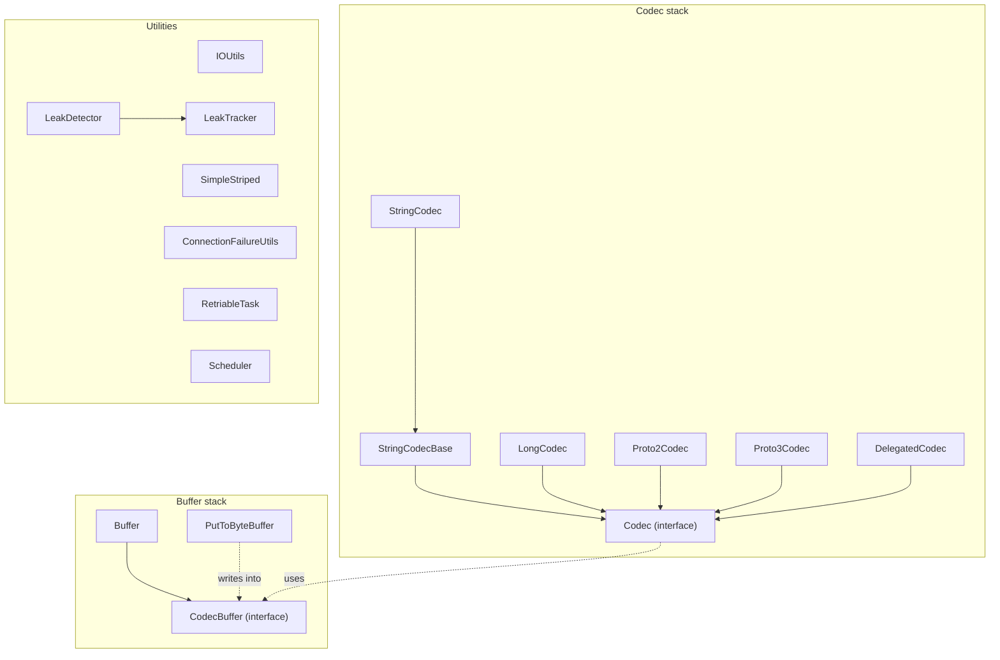

# hddscommon / hdds-utils

_This feature page was generated from `study/atlas/components/hddscommon/hdds-utils.md`. Author prose belongs above or below the BEGIN/END markers._

{/* BEGIN atlas-generated */}

**Classes:** 39    **Kinds:** service:21, util:10, dto:3, interface:2, abstract:1, data:1, exception:1

## Overview

The `hdds-utils` feature provides the codec, buffer, and general-purpose utility classes shared across Ozone's storage and service layers. `CodecBuffer` is a reference-counted `ByteBuffer` wrapper that avoids extra copies when reading from RocksDB via the direct `ByteBuffer` API; `CodecBufferPool` backs it with `PooledByteBufAllocator`. [HDDS-14162](https://issues.apache.org/jira/browse/HDDS-14162) plugged `CodecBuffer` into the native SST reader JNI path, eliminating heap copies on block reads. `Codec<T>` is the serialization interface used by `TypedTable`; concrete implementations cover all primitive and protobuf types (`LongCodec`, `Proto2Codec`, `Proto3Codec`, `StringCodec`). `StringCodec` serializes keys as UTF-8; [HDDS-15355](https://issues.apache.org/jira/browse/HDDS-15355) removed the fallback encoding path to prevent silent charset mismatches. `ConnectionFailureUtils` classifies network exceptions that require DNS re-resolution (used by [HDDS-15531](https://issues.apache.org/jira/browse/HDDS-15531) client-to-OM retry logic). `SimpleStriped` wraps Guava's `Striped` with a fair-lock policy; `LeakDetector` uses `ReferenceQueue` to report unclosed resources.

## Diagram

## Class table

### Sub-feature: `common.utils`

| reading_order | fqcn | kind | logic | loc | study (min) | role |
|--:|---|---|---|--:|--:|---|
| 1899 | <Fqcn>org.apache.hadoop.ozone.common.utils.BufferUtils</Fqcn> | service | mixed | 100~ | 30 | Utilities for buffers. |

### Sub-feature: `hdds.utils`

| reading_order | fqcn | kind | logic | loc | study (min) | role |
|--:|---|---|---|--:|--:|---|
| 1900 | <Fqcn>org.apache.hadoop.hdds.utils.Cache</Fqcn> | interface | mixed | 25~ | 20 | Cache interface. |
| 1901 | <Fqcn>org.apache.hadoop.hdds.utils.GlobPattern</Fqcn> | service | mixed | 100~ | 30 | A class for POSIX glob pattern with brace expansions. |
| 1902 | <Fqcn>org.apache.hadoop.hdds.utils.IOUtils</Fqcn> | service | mixed | 75~ | 30 | Static helper utilities for IO / Closable classes. |
| 1903 | <Fqcn>org.apache.hadoop.hdds.utils.LegacyHadoopConfigurationSource</Fqcn> | service | mixed | 75~ | 30 | Configuration source to wrap Hadoop Configuration object. |
| 1904 | <Fqcn>org.apache.hadoop.hdds.utils.SlidingWindow</Fqcn> | service | mixed | 75~ | 30 | A sliding window implementation that combines time-based expiry with a maximum size constraint. |
| 1905 | <Fqcn>org.apache.hadoop.hdds.utils.ConnectionFailureUtils</Fqcn> | service | mixed | 50~ | 30 | Shared classifier for exceptions where the cached peer IP is no longer reachable and DNS re-resolution is the only pl... |
| 1906 | <Fqcn>org.apache.hadoop.hdds.utils.Scheduler</Fqcn> | service | mixed | 50~ | 30 | This class encapsulates ScheduledExecutorService. |
| 1907 | <Fqcn>org.apache.hadoop.hdds.utils.RetriableTask</Fqcn> | service | mixed | 50~ | 30 | Callable implementation that retries a delegate task according to the specified RetryPolicy. |
| 1908 | <Fqcn>org.apache.hadoop.hdds.utils.ResourceCache</Fqcn> | service | mixed | 50~ | 30 | Cache with FIFO functionality with limit. |
| 1909 | <Fqcn>org.apache.hadoop.hdds.utils.LeakDetector</Fqcn> | service | mixed | 25~ | 30 | Simple general resource leak detector using ReferenceQueue and java.lang.ref.WeakReference to observe resource object... |
| 1910 | <Fqcn>org.apache.hadoop.hdds.utils.CompositeKey</Fqcn> | service | mixed | 25~ | 30 | This is a utility to combine multiple objects as a key that can be used in hash map access. |
| 1911 | <Fqcn>org.apache.hadoop.hdds.utils.LeakTracker</Fqcn> | service | mixed | 25~ | 30 | A token to track resource closure. |
| 1912 | <Fqcn>org.apache.hadoop.hdds.utils.UniqueId</Fqcn> | service | mixed | 25~ | 30 | This class uses system current time milliseconds to generate unique id. |
| 1913 | <Fqcn>org.apache.hadoop.hdds.utils.SimpleStriped</Fqcn> | service | mixed | 25~ | 30 | A custom factory to force creation of Striped locks with fair order policy. |
| 1914 | <Fqcn>org.apache.hadoop.hdds.utils.VersionInfo</Fqcn> | dto | data-only | 50~ | 10 | This class returns build information about Hadoop components. |
| 1915 | <Fqcn>org.apache.hadoop.hdds.utils.RatisVersionInfo</Fqcn> | dto | data-only | 25~ | 10 | This class returns build information about Ratis projects. |
| 1916 | <Fqcn>org.apache.hadoop.hdds.utils.HddsVersionInfo</Fqcn> | dto | data-only | 25~ | 10 | This class returns build information about Hadoop components. |

### Sub-feature: `ozone.utils`

| reading_order | fqcn | kind | logic | loc | study (min) | role |
|--:|---|---|---|--:|--:|---|
| 1917 | <Fqcn>org.apache.hadoop.ozone.utils.FormattingCLIUtils</Fqcn> | service | mixed | 150~ | 45 | We define this class to output information in a tabular format, making the printed information easier to read. |

### Sub-feature: `utils.db`

| reading_order | fqcn | kind | logic | loc | study (min) | role |
|--:|---|---|---|--:|--:|---|
| 1918 | <Fqcn>org.apache.hadoop.hdds.utils.db.CodecBuffer</Fqcn> | service | logic-heavy | 300~ | 20 | A buffer used by Codec for supporting RocksDB direct ByteBuffer APIs. |
| 1919 | <Fqcn>org.apache.hadoop.hdds.utils.db.StringCodecBase</Fqcn> | abstract | mixed | 150~ | 45 | An abstract Codec to serialize/deserialize String using a Charset provided by subclasses. |
| 1920 | <Fqcn>org.apache.hadoop.hdds.utils.db.Buffer</Fqcn> | service | mixed | 50~ | 30 | inferred: Buffer — role not documented. |
| 1921 | <Fqcn>org.apache.hadoop.hdds.utils.db.PutToByteBuffer</Fqcn> | interface | mixed | 25~ | 30 | A function puts data from a source to the ByteBuffer specified in the parameter. |
| 1922 | <Fqcn>org.apache.hadoop.hdds.utils.db.CopyObject</Fqcn> | interface | mixed | 25~ | 30 | Declare a single #copyObject() method. |
| 1923 | <Fqcn>org.apache.hadoop.hdds.utils.db.Proto2Codec</Fqcn> | util | mixed | 75~ | 20 | Codecs to serialize/deserialize Protobuf v2 messages. |
| 1924 | <Fqcn>org.apache.hadoop.hdds.utils.db.Proto3Codec</Fqcn> | util | mixed | 75~ | 20 | Codecs to serialize/deserialize Protobuf v3 messages. |
| 1925 | <Fqcn>org.apache.hadoop.hdds.utils.db.DelegatedCodec</Fqcn> | util | mixed | 75~ | 20 | A <Fqcn>org.apache.hadoop.hdds.utils.db.Codec</Fqcn> to serialize/deserialize objects by delegation. |
| 1926 | <Fqcn>org.apache.hadoop.hdds.utils.db.LongCodec</Fqcn> | util | mixed | 50~ | 20 | Codec to serialize/deserialize Long. |
| 1927 | <Fqcn>org.apache.hadoop.hdds.utils.db.BooleanCodec</Fqcn> | util | mixed | 50~ | 20 | Codec to serialize/deserialize Boolean. |
| 1928 | <Fqcn>org.apache.hadoop.hdds.utils.db.UuidCodec</Fqcn> | util | mixed | 50~ | 20 | Codec to serialize/deserialize UUID. |
| 1929 | <Fqcn>org.apache.hadoop.hdds.utils.db.Codec</Fqcn> | util | mixed | 50~ | 20 | Codec interface to serialize/deserialize objects to/from bytes. |
| 1930 | <Fqcn>org.apache.hadoop.hdds.utils.db.IntegerCodec</Fqcn> | util | mixed | 50~ | 20 | Codec to serialize/deserialize Integer. |
| 1931 | <Fqcn>org.apache.hadoop.hdds.utils.db.StringCodec</Fqcn> | util | mixed | 25~ | 20 | A Codec to serialize/deserialize String using StandardCharsets#UTF_8, a variable-length character encoding. |
| 1932 | <Fqcn>org.apache.hadoop.hdds.utils.db.ShortCodec</Fqcn> | util | mixed | 25~ | 20 | Codec to serialize/deserialize Short. |
| 1933 | <Fqcn>org.apache.hadoop.hdds.utils.db.IteratorType</Fqcn> | data | data-only | 25~ | 10 | The iterator type. |
| 1934 | <Fqcn>org.apache.hadoop.hdds.utils.db.CodecException</Fqcn> | exception | data-only | 25~ | 10 | Exceptions thrown from the Codec subclasses. |

### Sub-feature: `utils.io`

| reading_order | fqcn | kind | logic | loc | study (min) | role |
|--:|---|---|---|--:|--:|---|
| 1935 | <Fqcn>org.apache.hadoop.hdds.utils.io.RandomAccessFileChannel</Fqcn> | service | mixed | 75~ | 30 | RandomAccessFile and its FileChannel. |
| 1936 | <Fqcn>org.apache.hadoop.hdds.utils.io.ByteBufferInputStream</Fqcn> | service | mixed | 50~ | 30 | Warp a ByteBuffer as an InputStream. |
| 1937 | <Fqcn>org.apache.hadoop.hdds.utils.io.LengthOutputStream</Fqcn> | service | mixed | 25~ | 30 | An FilterOutputStream recording the length of bytes written. |

## Anchor details

### `CodecBuffer`

- **path:** `hadoop-hdds/common/src/main/java/org/apache/hadoop/hdds/utils/db/CodecBuffer.java`
- **loc:** 300~    **difficulty:** 2    **study:** 20 min    **concurrency:** single-threaded    **persistence:** RocksDB
- **entry points:** `apply`, `close`
- **key collaborators:** `org.apache.hadoop.hdds.StringUtils`
- **role:** A buffer used by Codec for supporting RocksDB direct ByteBuffer APIs.
- **note:** Reference-counted; `close()` decrements the ref-count and returns the backing buffer to the `CodecBufferPool` when it reaches zero. [HDDS-14162](https://issues.apache.org/jira/browse/HDDS-14162) wired this into the native SST reader JNI path so block data is written directly from the RocksDB off-heap read buffer into the Ozone pipeline without an extra heap copy. `LeakDetector` tracks unclosed instances in test/debug mode.

## Design docs

no dedicated design doc under hadoop-hdds/docs/content/ on this branch

## Seminal JIRAs / PRs

- [HDDS-15909](https://issues.apache.org/jira/browse/HDDS-15909). Refactor OzoneManagerLock
- [HDDS-15531](https://issues.apache.org/jira/browse/HDDS-15531). DNS refresh on connection failure for Client to OM
- [HDDS-15355](https://issues.apache.org/jira/browse/HDDS-15355). Support StringCodec without fallback
- [HDDS-14025](https://issues.apache.org/jira/browse/HDDS-14025). Move background services from hdds-common to hdds-server-framework
- [HDDS-14162](https://issues.apache.org/jira/browse/HDDS-14162). Fix Native Jni Lib to read SST files using CodecBuffer

## Sharp edges

- `StringCodec` uses UTF-8 with no fallback after [HDDS-15355](https://issues.apache.org/jira/browse/HDDS-15355); any RocksDB table that was previously written with the ISO-8859-1 `FixedLengthStringCodec` and then migrated to `StringCodec` will silently misread multi-byte characters if the codec swap is not accompanied by a data migration.
- `CodecBuffer` is reference-counted but not thread-safe; passing a `CodecBuffer` across threads without explicit ownership transfer (increment before hand-off, decrement in the consumer) leaks the backing buffer back into the pool in an indeterminate state.
- `ConnectionFailureUtils` identifies network errors that warrant DNS re-resolution; its heuristics rely on exception message matching, which can miss vendor-specific `SocketException` subclasses and fail to trigger the re-resolution path introduced in [HDDS-15531](https://issues.apache.org/jira/browse/HDDS-15531).

## Related features

- [`hdds-db-utils.md`](/component/hddscommon/hdds-db-utils) — `TypedTable`, `RDBBatchOperation`, and iterators that consume `Codec` and `CodecBuffer` from this feature
- [`hdds-primitives.md`](/component/hddscommon/hdds-primitives) — `StringUtils` used by `CodecBuffer` and several codecs
- [`framework-utils.md`](/component/hddscommon/framework-utils) — `BackgroundService` moved to the framework layer ([HDDS-14025](https://issues.apache.org/jira/browse/HDDS-14025)), previously in the same utils hierarchy
- [`ratis-integration.md`](/component/hddscommon/ratis-integration) — `SimpleStriped` used in Ratis-level locking paths

## Self-quiz

1. `StringCodecBase` is abstract with `StringCodec` and `FixedLengthStringCodec` as subclasses. What is the key behavioral difference between them, and why did [HDDS-15355](https://issues.apache.org/jira/browse/HDDS-15355) remove the fallback from `StringCodec`?
2. Describe the lifecycle of a `CodecBuffer` from allocation through release, naming the classes involved at each step.
3. `ConnectionFailureUtils` is used in the [HDDS-15531](https://issues.apache.org/jira/browse/HDDS-15531) DNS re-resolution path. What types of exceptions does it classify, and what action does the caller take after a positive classification?
4. `LeakDetector` uses `ReferenceQueue`. Explain the mechanism: how does it detect that a `CodecBuffer` was GC'd without being closed?
5. `SimpleStriped` forces fair-order lock creation. Why is fairness important in Ozone's lock usage, and which feature file contains the class that most commonly uses `SimpleStriped`?

Answers

Answer 1: `StringCodec` serializes with UTF-8 and uses variable-length encoding; `FixedLengthStringCodec` uses ISO-8859-1 and pads to a fixed byte width, enabling direct binary comparison without deserialization. [HDDS-15355](https://issues.apache.org/jira/browse/HDDS-15355) removed the UTF-8 fallback from `StringCodec` because silently falling back to a second charset caused codec-mismatch bugs when tables were opened with the wrong codec class.
Answer 2: A caller requests a buffer from `CodecBufferPool` (backed by `PooledByteBufAllocator`). `Buffer` wraps the result. The caller writes data via `PutToByteBuffer` or direct `ByteBuffer` access, then passes the `CodecBuffer` to a consumer. `close()` decrements the reference count; at zero, the pool returns the native buffer. `LeakDetector` wraps the buffer in a `LeakTracker` phantom reference to detect if GC happens before `close()`.
Answer 3: `ConnectionFailureUtils` classifies `ConnectException`, `NoRouteToHostException`, and similar socket-level failures. On positive classification, the OM client ([HDDS-15531](https://issues.apache.org/jira/browse/HDDS-15531)) invalidates the cached peer IP and forces a fresh DNS lookup before the next retry attempt.
Answer 4: `LeakDetector` creates a `PhantomReference<CodecBuffer>` paired with a `LeakTracker` and registers it with a `ReferenceQueue`. A background thread polls the queue; when a phantom reference is enqueued (meaning the `CodecBuffer` is GC-eligible), `LeakTracker` checks whether `close()` was called and logs or throws if it was not.
Answer 5: Fairness prevents indefinitely deferred lock acquisition under contention, which matters for OM and SCM where many threads compete for per-bucket or per-volume locks. `OzoneManagerLock` (in `ozone-manager`) is the class that most commonly uses `SimpleStriped`; see `upgrade-common.md` or the OM feature file for its context.

<UnresolvedNote context="this feature page" items={["java.lang.ref.WeakReference"]} />

{/* END atlas-generated */}
