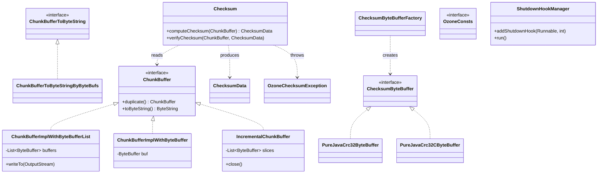

# hddscommon / ozone-common-primitives

_This feature page was generated from `study/atlas/components/hddscommon/ozone-common-primitives.md`. Author prose belongs above or below the BEGIN/END markers._

{/* BEGIN atlas-generated */}

**Classes:** 48    **Kinds:** service:26, interface:9, data:3, metrics:3, exception:3, dto:2, config:1, factory:1

## Overview

This feature group provides the foundational buffer abstractions, checksum machinery, shared constants, and lifecycle utilities used across all Ozone services and datanodes. The checksum subsystem — `Checksum`, `ChecksumData`, `PureJavaCrc32ByteBuffer`, and `PureJavaCrc32CByteBuffer` — computes and verifies per-chunk integrity using CRC32, CRC32C, SHA256, or BLAKE3; `Checksum.computeChecksum(ChunkBuffer)` returns a `ChecksumData` proto and `verifyChecksum` throws `OzoneChecksumException` on mismatch. The `ChunkBuffer` interface and its implementations (`ChunkBufferImplWithByteBufferList`, `IncrementalChunkBuffer`, `ChunkBufferImplWithByteBuffer`) supply zero-copy buffer composition for the write path, deferring serialization to a single `toByteString()` call. `OzoneConsts` is the authoritative source for string constants — bucket and key name constraints, default block and chunk sizes, and metadata column-family names — while `OzoneConfigKeys` holds the full set of configuration key strings. `ShutdownHookManager` enforces priority-ordered JVM shutdown so critical service cleanup (RocksDB, WAL flush) runs before lower-priority hooks.

## Diagram

## Class table

### Sub-feature: `common.helpers`

| reading_order | fqcn | kind | logic | loc | study (min) | role |
|--:|---|---|---|--:|--:|---|
| 1976 | <Fqcn>org.apache.hadoop.ozone.container.common.helpers.BlockData</Fqcn> | service | mixed | 175~ | 45 | Helper class to convert Protobuf to Java classes. |
| 1977 | <Fqcn>org.apache.hadoop.ozone.container.common.helpers.ChunkInfoList</Fqcn> | service | mixed | 25~ | 30 | Helper class to convert between protobuf lists and Java lists of org.apache.hadoop.hdds.protocol.datanode.proto.Conta... |
| 1978 | <Fqcn>org.apache.hadoop.ozone.container.common.helpers.ChunkInfo</Fqcn> | dto | data-only | 100~ | 10 | Java class that represents ChunkInfo ProtoBuf class. |

### Sub-feature: `common.statemachine`

| reading_order | fqcn | kind | logic | loc | study (min) | role |
|--:|---|---|---|--:|--:|---|
| 1979 | <Fqcn>org.apache.hadoop.ozone.common.statemachine.StateMachine</Fqcn> | service | mixed | 25~ | 30 | Template class that wraps simple event driven state machine. |
| 1980 | <Fqcn>org.apache.hadoop.ozone.common.statemachine.InvalidStateTransitionException</Fqcn> | exception | data-only | 25~ | 10 | Class wraps invalid state transition exception. |

### Sub-feature: `ozone`

| reading_order | fqcn | kind | logic | loc | study (min) | role |
|--:|---|---|---|--:|--:|---|
| 1981 | <Fqcn>org.apache.hadoop.ozone.Versioned</Fqcn> | interface | mixed | 25~ | 20 | Base class defining the version in the entire system. |
| 1982 | <Fqcn>org.apache.hadoop.ozone.OzoneConsts</Fqcn> | service | logic-heavy | 325~ | 45 | Set of constants used in Ozone implementation. |
| 1983 | <Fqcn>org.apache.hadoop.ozone.OzoneSecurityUtil</Fqcn> | service | mixed | 50~ | 30 | Ozone security Util class. |
| 1984 | <Fqcn>org.apache.hadoop.ozone.OzoneConfigKeys</Fqcn> | config | logic-heavy | 525~ | 20 | This class contains constants for configuration keys used in Ozone. |
| 1985 | <Fqcn>org.apache.hadoop.ozone.ClientVersion</Fqcn> | data | data-only | 50~ | 10 | Versioning for protocol clients. |
| 1986 | <Fqcn>org.apache.hadoop.ozone.OzoneManagerVersion</Fqcn> | data | data-only | 50~ | 10 | Versioning for Ozone Manager. |

### Sub-feature: `ozone.common`

| reading_order | fqcn | kind | logic | loc | study (min) | role |
|--:|---|---|---|--:|--:|---|
| 1987 | <Fqcn>org.apache.hadoop.ozone.common.ChecksumByteBufferImpl</Fqcn> | service | mixed | 75~ | 20 | ChecksumByteBuffer implementation based on Checksum. |
| 1988 | <Fqcn>org.apache.hadoop.ozone.common.ChunkBuffer</Fqcn> | interface | mixed | 50~ | 20 | Buffer for a block chunk. |
| 1989 | <Fqcn>org.apache.hadoop.ozone.common.ChunkBufferToByteString</Fqcn> | interface | mixed | 25~ | 20 | For converting to ByteStrings. |
| 1990 | <Fqcn>org.apache.hadoop.ozone.common.ChecksumByteBuffer</Fqcn> | interface | mixed | 25~ | 20 | A sub-interface of Checksum with a method to update checksum from a ByteBuffer. |
| 1991 | <Fqcn>org.apache.hadoop.ozone.common.PureJavaCrc32ByteBuffer</Fqcn> | service | logic-heavy | 525~ | 60 | Similar to org.apache.hadoop.util.PureJavaCrc32 except that this class previously implemented ChecksumByteBuffer. |
| 1992 | <Fqcn>org.apache.hadoop.ozone.common.PureJavaCrc32CByteBuffer</Fqcn> | service | logic-heavy | 525~ | 60 | Similar to org.apache.hadoop.util.PureJavaCrc32C except that this class previously implemented ChecksumByteBuffer. |
| 1993 | <Fqcn>org.apache.hadoop.ozone.common.IncrementalChunkBuffer</Fqcn> | service | logic-heavy | 225~ | 45 | Use a list of ByteBuffer to implement a single ChunkBuffer so that the buffer can be allocated incrementally. |
| 1994 | <Fqcn>org.apache.hadoop.ozone.common.ChunkBufferImplWithByteBufferList</Fqcn> | service | logic-heavy | 200~ | 45 | ChunkBuffer implementation using a list of ByteBuffers. |
| 1995 | <Fqcn>org.apache.hadoop.ozone.common.Checksum</Fqcn> | service | logic-heavy | 200~ | 45 | Class to compute and verify checksums for chunks. |
| 1996 | <Fqcn>org.apache.hadoop.ozone.common.ChunkBufferImplWithByteBuffer</Fqcn> | service | mixed | 125~ | 30 | ChunkBuffer implementation using a single ByteBuffer. |
| 1997 | <Fqcn>org.apache.hadoop.ozone.common.ChecksumData</Fqcn> | service | mixed | 100~ | 30 | Java class that represents Checksum ProtoBuf class. |
| 1998 | <Fqcn>org.apache.hadoop.ozone.common.BlockGroup</Fqcn> | service | mixed | 75~ | 30 | A group of blocks relations relevant, e.g belong to a certain object key. |
| 1999 | <Fqcn>org.apache.hadoop.ozone.common.DeleteBlockGroupResult</Fqcn> | service | mixed | 50~ | 30 | Result to delete a group of blocks. |
| 2000 | <Fqcn>org.apache.hadoop.ozone.common.ChunkBufferToByteStringByByteBufs</Fqcn> | service | mixed | 50~ | 30 | A ChunkBufferToByteString implementation using a list of ByteBufs. |
| 2001 | <Fqcn>org.apache.hadoop.ozone.common.ChecksumCache</Fqcn> | service | mixed | 50~ | 30 | Cache previous checksums to avoid recomputing them. |
| 2002 | <Fqcn>org.apache.hadoop.ozone.common.DeletedBlock</Fqcn> | service | mixed | 25~ | 30 | DeletedBlock of Ozone (BlockID + usedBytes). |
| 2003 | <Fqcn>org.apache.hadoop.ozone.common.ChecksumByteBufferFactory</Fqcn> | factory | mixed | 50~ | 20 | Class containing factories for creating various checksum impls. |
| 2004 | <Fqcn>org.apache.hadoop.ozone.common.Storage</Fqcn> | abstract | mixed | 175~ | 10 | Storage information file. |
| 2005 | <Fqcn>org.apache.hadoop.ozone.common.StorageInfo</Fqcn> | dto | data-only | 125~ | 10 | Common class for storage information. |
| 2006 | <Fqcn>org.apache.hadoop.ozone.common.InconsistentStorageStateException</Fqcn> | exception | data-only | 25~ | 10 | The exception is thrown when file system state is inconsistent and is not recoverable. |
| 2007 | <Fqcn>org.apache.hadoop.ozone.common.OzoneChecksumException</Fqcn> | exception | data-only | 25~ | 10 | Thrown for checksum errors. |

### Sub-feature: `ozone.ha`

| reading_order | fqcn | kind | logic | loc | study (min) | role |
|--:|---|---|---|--:|--:|---|
| 2008 | <Fqcn>org.apache.hadoop.ozone.ha.ConfUtils</Fqcn> | service | mixed | 50~ | 30 | Utilities related to configuration. |

### Sub-feature: `ozone.lock`

| reading_order | fqcn | kind | logic | loc | study (min) | role |
|--:|---|---|---|--:|--:|---|
| 2009 | <Fqcn>org.apache.hadoop.ozone.lock.ReadWriteLockable</Fqcn> | interface | mixed | 25~ | 20 | Interface for objects with a read-write lock. |
| 2010 | <Fqcn>org.apache.hadoop.ozone.lock.BootstrapStateHandler</Fqcn> | interface | mixed | 25~ | 20 | Bootstrap state handler interface. |

### Sub-feature: `ozone.util`

| reading_order | fqcn | kind | logic | loc | study (min) | role |
|--:|---|---|---|--:|--:|---|
| 2011 | <Fqcn>org.apache.hadoop.ozone.util.ClosableIterator</Fqcn> | interface | mixed | 25~ | 20 | An Iterator that may hold resources until it is closed. |
| 2012 | <Fqcn>org.apache.hadoop.ozone.util.SeekableIterator</Fqcn> | interface | mixed | 25~ | 20 | An Iterator that may hold resources until it is closed. |
| 2013 | <Fqcn>org.apache.hadoop.ozone.util.ShutdownHookManager</Fqcn> | service | logic-heavy | 200~ | 45 | The &lt;code&gt;ShutdownHookManager&lt;/code&gt; enables running shutdownHook in a deterministic order, higher priority first. |
| 2014 | <Fqcn>org.apache.hadoop.ozone.util.OzoneNetUtils</Fqcn> | service | mixed | 75~ | 30 | Ozone Network related utils. |
| 2015 | <Fqcn>org.apache.hadoop.ozone.util.MetricUtil</Fqcn> | service | mixed | 75~ | 30 | Encloses helpers to deal with metrics. |
| 2016 | <Fqcn>org.apache.hadoop.ozone.util.MutableMinMax</Fqcn> | service | mixed | 50~ | 30 | A mutable metric that tracks the minimum and maximum values of a dataset over time. |
| 2017 | <Fqcn>org.apache.hadoop.ozone.util.ProtobufUtils</Fqcn> | service | mixed | 25~ | 30 | Contains utilities to ease common protobuf to java object conversions. |
| 2018 | <Fqcn>org.apache.hadoop.ozone.util.UUIDv7</Fqcn> | service | mixed | 25~ | 30 | Utility class for generating UUIDv7. |
| 2019 | <Fqcn>org.apache.hadoop.ozone.util.StringWithByteString</Fqcn> | service | mixed | 25~ | 30 | Class to encapsulate and cache the conversion of a Java String to a ByteString. |
| 2020 | <Fqcn>org.apache.hadoop.ozone.util.UUIDUtil</Fqcn> | service | mixed | 25~ | 30 | Helper methods to deal with random UUIDs. |
| 2021 | <Fqcn>org.apache.hadoop.ozone.util.CacheMetrics</Fqcn> | metrics | mixed | 75~ | 20 | Reusable component that emits cache metrics for a particular cache. |
| 2022 | <Fqcn>org.apache.hadoop.ozone.util.PerformanceMetricsInitializer</Fqcn> | metrics | mixed | 25~ | 20 | Utility class for initializing PerformanceMetrics in a MetricsSource. |
| 2023 | <Fqcn>org.apache.hadoop.ozone.util.PerformanceMetrics</Fqcn> | metrics | mixed | 25~ | 20 | The PerformanceMetrics class encapsulates a collection of related metrics including a MutableStat, MutableQuantiles,... |

## Anchor details

### `PureJavaCrc32ByteBuffer`

- **path:** `hadoop-hdds/common/src/main/java/org/apache/hadoop/ozone/common/PureJavaCrc32ByteBuffer.java`
- **loc:** 525~    **difficulty:** 5    **study:** 60 min    **concurrency:** single-threaded    **persistence:** in-memory
- **role:** Software-only CRC32 (Ethernet polynomial) implementation of `ChecksumByteBuffer`, used when the JVM's hardware-accelerated `java.util.zip.CRC32` is unavailable or bypassed. The 525-line body is an unrolled lookup-table approach operating directly on `ByteBuffer` slices without array copies. [HDDS-15111](https://issues.apache.org/jira/browse/HDDS-15111) removed unused byte-buffer variants that had diverged from the main path.

### `PureJavaCrc32CByteBuffer`

- **path:** `hadoop-hdds/common/src/main/java/org/apache/hadoop/ozone/common/PureJavaCrc32CByteBuffer.java`
- **loc:** 525~    **difficulty:** 5    **study:** 60 min    **concurrency:** single-threaded    **persistence:** in-memory
- **role:** Mirrors `PureJavaCrc32ByteBuffer` but uses the Castagnoli polynomial (CRC32C), which is the default checksum type for Ozone chunks and is also accelerated by the SSE4.2 instruction on x86. This class is the fallback path when hardware CRC32C is not detected at runtime.

### `OzoneConsts`

- **path:** `hadoop-hdds/common/src/main/java/org/apache/hadoop/ozone/OzoneConsts.java`
- **loc:** 325~    **difficulty:** 4    **study:** 45 min    **concurrency:** single-threaded    **persistence:** RocksDB
- **key collaborators:** `org.apache.hadoop.hdds.annotation.InterfaceAudience`
- **test exemplar:** `hadoop-hdds/common/src/test/java/org/apache/hadoop/ozone/TestOzoneConsts.java`
- **role:** Set of constants used in Ozone implementation. Covers volume/bucket/key/snapshot name-length limits, RocksDB column-family name strings, default chunk and block sizes, protocol version strings, and S3-compatibility tokens. Adding a new table or protocol field typically means adding a constant here first.

### `IncrementalChunkBuffer`

- **path:** `hadoop-hdds/common/src/main/java/org/apache/hadoop/ozone/common/IncrementalChunkBuffer.java`
- **loc:** 225~    **difficulty:** 4    **study:** 45 min    **concurrency:** single-threaded    **persistence:** in-memory
- **entry points:** `close`
- **key collaborators:** `org.apache.hadoop.hdds.utils.db.CodecBuffer`, `org.apache.hadoop.ozone.common.utils.BufferUtils`
- **role:** Accumulates incoming `ByteBuffer` slices incrementally (one per network read or codec buffer) and defers the copy into a single `ByteString` until `toByteString()` is called for Protobuf serialization. This avoids a full-chunk pre-allocation on the write path; `close()` releases all accumulated slices back to the pool.

### `ShutdownHookManager`

- **path:** `hadoop-hdds/common/src/main/java/org/apache/hadoop/ozone/util/ShutdownHookManager.java`
- **loc:** 200~    **difficulty:** 4    **study:** 45 min    **concurrency:** thread-safe    **persistence:** in-memory
- **entry points:** `run`
- **key collaborators:** `org.apache.hadoop.hdds.HddsUtils`, `org.apache.hadoop.hdds.annotation.InterfaceAudience`, `org.apache.hadoop.hdds.annotation.InterfaceStability`, `org.apache.hadoop.hdds.conf.ConfigurationSource`, `org.apache.hadoop.hdds.conf.OzoneConfiguration`
- **role:** Wraps JVM shutdown hooks in a priority queue so hooks registered with higher priority integers run first. Services such as SCM and OM register hooks at specific priorities to flush WALs and close RocksDB before lower-priority hooks clean up thread pools or logging.

### `ChunkBufferImplWithByteBufferList`

- **path:** `hadoop-hdds/common/src/main/java/org/apache/hadoop/ozone/common/ChunkBufferImplWithByteBufferList.java`
- **loc:** 200~    **difficulty:** 4    **study:** 45 min    **concurrency:** single-threaded    **persistence:** in-memory
- **key collaborators:** `org.apache.hadoop.ozone.common.utils.BufferUtils`
- **test exemplar:** `hadoop-hdds/common/src/test/java/org/apache/hadoop/ozone/common/TestChunkBufferImplWithByteBufferList.java`
- **role:** Implements `ChunkBuffer` as an ordered list of `ByteBuffer` segments without copying. Iteration and `writeTo(OutputStream)` are zero-copy, walking the list in order; `duplicate()` produces a shallow copy sharing the same underlying buffers for read-only consumers such as checksum verification.

### `Checksum`

- **path:** `hadoop-hdds/common/src/main/java/org/apache/hadoop/ozone/common/Checksum.java`
- **loc:** 200~    **difficulty:** 4    **study:** 45 min    **concurrency:** single-threaded    **persistence:** in-memory
- **key collaborators:** `org.apache.hadoop.hdds.utils.db.IntegerCodec`, `org.apache.hadoop.ozone.common.utils.BufferUtils`
- **test exemplar:** `hadoop-hdds/common/src/test/java/org/apache/hadoop/ozone/common/TestChecksum.java`
- **role:** Computes and verifies per-chunk checksums for the four supported algorithms (CRC32, CRC32C, SHA256, BLAKE3). `computeChecksum(ChunkBuffer)` slices the buffer into `bytesPerChecksum`-sized windows and returns a `ChecksumData` proto; `verifyChecksum` recomputes over the same windows and throws `OzoneChecksumException` on the first mismatch.

## Design docs

no dedicated design doc under hadoop-hdds/docs/content/ on this branch

## Seminal JIRAs / PRs

- [HDDS-15602](https://issues.apache.org/jira/browse/HDDS-15602). Read pipeline ID does not need secure random
- [HDDS-15531](https://issues.apache.org/jira/browse/HDDS-15531). DNS refresh on connection failure for Client to OM
- [HDDS-15111](https://issues.apache.org/jira/browse/HDDS-15111). Remove unused ChecksumByteBuffer implementations from PureJava CRC helpers
- [HDDS-15509](https://issues.apache.org/jira/browse/HDDS-15509). Add protobuf schema for S3 bucket tags
- [HDDS-15171](https://issues.apache.org/jira/browse/HDDS-15171). Add available space check on follower during bootstrap

## Sharp edges

- `PureJavaCrc32ByteBuffer` and `PureJavaCrc32CByteBuffer` are not thread-safe; each call site must allocate its own instance or wrap in a `ThreadLocal`. Sharing a single instance across threads silently corrupts CRC state.
- `IncrementalChunkBuffer.close()` must be called to release pooled `CodecBuffer` slices back to the allocator; forgetting it causes off-heap memory to leak under heavy write load.
- `OzoneConsts` mixes RocksDB column-family names, S3 path prefixes, and Protobuf field constants in a single 325-line interface. A misspelled constant compiles cleanly but produces a silent schema mismatch at startup.

## Related features

- [`pipeline-common.md`](/component/hddscommon/pipeline-common) — `Pipeline` and `PipelineID` consume `ChunkBuffer` indirectly through container write paths
- [`protocol-common.md`](/component/hddscommon/protocol-common) — `DatanodeDetails` uses `OzoneConsts` port-name strings
- [`ratis-integration.md`](/component/hddscommon/ratis-integration) — `RatisHelper` wraps container commands serialized using `ChunkBuffer`
- [`container-common.md`](/component/hddscommon/container-common) — container helpers use `Checksum` and `ChecksumData` for chunk integrity
- [`hdds-primitives.md`](/component/hddscommon/hdds-primitives) — lower-level HDDS primitives that this feature builds on
- [`config-common.md`](/component/hddscommon/config-common) — `OzoneConfigKeys` constants consumed by configuration binding

## Self-quiz

1. `Checksum.computeChecksum` slices the input into windows using which field of `ChecksumData`, and what proto message does it return?
2. What is the difference between `ChunkBufferImplWithByteBufferList` and `IncrementalChunkBuffer` in terms of when buffer allocation occurs?
3. `PureJavaCrc32CByteBuffer` implements which interface, and what method on that interface accepts a `ByteBuffer` argument?
4. Why does `ShutdownHookManager` use an integer priority rather than insertion order, and which Ozone service registers hooks at the highest priority?
5. `OzoneConsts` is an interface, not a class. What consequence does that have for how callers reference its constants, and why is it annotated `@InterfaceAudience.Private`?

Answers

Answer 1: `computeChecksum` uses `bytesPerChecksum` from the `Checksum` configuration to slice the `ChunkBuffer` into windows, and returns a `ChecksumData` proto containing a list of per-window checksum values.
Answer 2: `ChunkBufferImplWithByteBufferList` wraps pre-allocated `ByteBuffer` objects passed in at construction time. `IncrementalChunkBuffer` starts empty and adds slices one at a time via `put()`; allocation happens incrementally as data arrives, and the final copy into `ByteString` happens lazily at `toByteString()`.
Answer 3: `PureJavaCrc32CByteBuffer` implements `ChecksumByteBuffer`, which extends `java.util.zip.Checksum` and adds `update(ByteBuffer)`.
Answer 4: Priority ordering ensures services with critical cleanup (RocksDB flush, WAL close) always run before less critical hooks regardless of hook registration order. SCM and OM register their RocksDB close hooks at higher priority than, for example, logging shutdown.
Answer 5: Being an interface means callers use `OzoneConsts.SOME_CONSTANT` without instantiating it, and all fields are implicitly `public static final`. The `@InterfaceAudience.Private` annotation signals that constants may change between releases without public API guarantees.

<UnresolvedNote context="this feature page" items={["org.apache.hadoop.util.PureJavaCrc32","org.apache.hadoop.util.PureJavaCrc32C"]} />

{/* END atlas-generated */}
