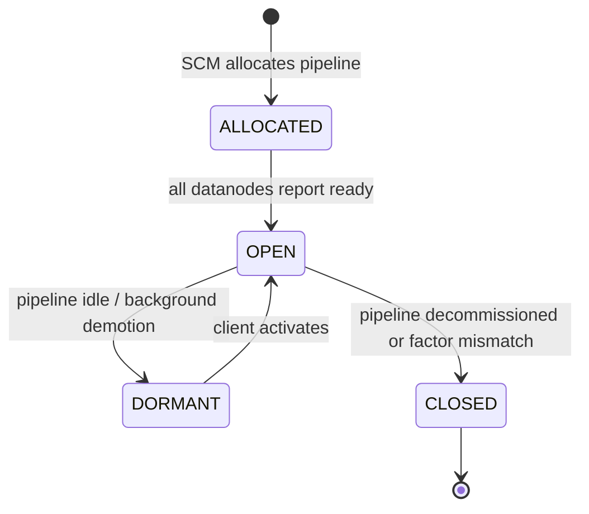

# hddscommon / pipeline-common

_This feature page was generated from `study/atlas/components/hddscommon/pipeline-common.md`. Author prose belongs above or below the BEGIN/END markers._

{/* BEGIN atlas-generated */}

**Classes:** 5    **Kinds:** exception:3, service:2

## Overview

This feature group defines the shared data model for Ratis and standalone pipelines as used by both SCM (which manages pipeline lifecycle) and clients (which select a pipeline for writes). `Pipeline` is the central immutable DTO: it holds a `PipelineID` (UUID wrapper), a `ReplicationConfig` (replication type and factor), a `PipelineState` (ALLOCATED, OPEN, DORMANT, or CLOSED), an ordered `List<DatanodeDetails>` where the Ratis leader appears first, and a per-datanode map of leader election timestamps. `PipelineID` was simplified by [HDDS-15602](https://issues.apache.org/jira/browse/HDDS-15602), replacing `SecureRandom` UUID generation with `UUID.randomUUID()` for read pipelines that do not require cryptographic strength. The three exception classes (`PipelineNotFoundException`, `DuplicatedPipelineIdException`, `InvalidPipelineStateException`) give callers typed signals for the three most common pipeline-manager error conditions. [HDDS-12970](https://issues.apache.org/jira/browse/HDDS-12970) moved datanode identity into `DatanodeID` so `Pipeline` no longer carries full `DatanodeDetails` copies everywhere.

## Diagram

## Class table

### Sub-feature: `scm.pipeline`

| reading_order | fqcn | kind | logic | loc | study (min) | role |
|--:|---|---|---|--:|--:|---|
| 573 | <Fqcn>org.apache.hadoop.hdds.scm.pipeline.Pipeline</Fqcn> | service | logic-heavy | 475~ | 60 | Represents a group of datanodes which store a container. |
| 574 | <Fqcn>org.apache.hadoop.hdds.scm.pipeline.PipelineID</Fqcn> | service | mixed | 75~ | 30 | ID for the pipeline, the ID is based on UUID. |
| 575 | <Fqcn>org.apache.hadoop.hdds.scm.pipeline.PipelineNotFoundException</Fqcn> | exception | data-only | 25~ | 10 | Signals that a pipeline is missing from PipelineManager. |
| 576 | <Fqcn>org.apache.hadoop.hdds.scm.pipeline.DuplicatedPipelineIdException</Fqcn> | exception | data-only | 25~ | 10 | Signals that a pipeline id is found duplicated. |
| 577 | <Fqcn>org.apache.hadoop.hdds.scm.pipeline.InvalidPipelineStateException</Fqcn> | exception | data-only | 25~ | 10 | Signals that a pipeline state is not valid for an operation. |

## Anchor details

### `Pipeline`

- **path:** `hadoop-hdds/common/src/main/java/org/apache/hadoop/hdds/scm/pipeline/Pipeline.java`
- **loc:** 475~    **difficulty:** 5    **study:** 60 min    **concurrency:** single-threaded    **persistence:** in-memory
- **entry points:** `build`
- **key collaborators:** `org.apache.hadoop.hdds.client.ECReplicationConfig`, `org.apache.hadoop.hdds.client.ReplicatedReplicationConfig`, `org.apache.hadoop.hdds.client.ReplicationConfig`, `org.apache.hadoop.hdds.client.StandaloneReplicationConfig`, `org.apache.hadoop.hdds.protocol.DatanodeDetails`, `org.apache.hadoop.hdds.protocol.DatanodeID`
- **test exemplar:** `hadoop-hdds/common/src/test/java/org/apache/hadoop/hdds/scm/pipeline/TestPipeline.java`
- **role:** Represents a group of datanodes which store a container. `Pipeline.Builder` enforces invariants: a RATIS pipeline must have exactly 1 or 3 nodes and the node list order determines which datanode is treated as the current Ratis leader. `getLeaderNode()` returns the first element; [HDDS-13171](https://issues.apache.org/jira/browse/HDDS-13171) introduced `replaceNode()` to swap a datanode when node membership changes without discarding the whole pipeline.

## Design docs

no dedicated design doc under hadoop-hdds/docs/content/ on this branch

## Seminal JIRAs / PRs

- [HDDS-15602](https://issues.apache.org/jira/browse/HDDS-15602). Read pipeline ID does not need secure random
- [HDDS-13171](https://issues.apache.org/jira/browse/HDDS-13171). Replace pipelineID if nodes are changed
- [HDDS-12970](https://issues.apache.org/jira/browse/HDDS-12970). Use DatanodeID in Pipeline
- [HDDS-12939](https://issues.apache.org/jira/browse/HDDS-12939). Remove UnknownPipelineStateException
- [HDDS-13016](https://issues.apache.org/jira/browse/HDDS-13016). Add getAllNodeCount() method to NodeManager

## Sharp edges

- `Pipeline` is immutable after construction; callers that need to change the node list must go through `Pipeline.Builder` and replace the pipeline reference atomically. Direct field mutation is not possible, but stale cached `Pipeline` objects seen by clients will silently use the old node order until refreshed.
- `PipelineID` equality is UUID-based. Two `Pipeline` objects with the same UUID but different node lists are considered the same pipeline by maps and sets; this was the root cause of [HDDS-13171](https://issues.apache.org/jira/browse/HDDS-13171) where a membership change required an explicit ID replacement.

## Related features

- [`protocol-common.md`](/component/hddscommon/protocol-common) — `DatanodeDetails` and `DatanodeID` are the node identity types carried inside `Pipeline`
- [`ratis-integration.md`](/component/hddscommon/ratis-integration) — `RatisHelper` converts `Pipeline` into `RaftGroup` and `RaftPeer` objects
- [`scm-common.md`](/component/hddscommon/scm-common) — SCM PipelineManager owns the authoritative pipeline registry
- [`container-common.md`](/component/hddscommon/container-common) — containers are allocated against a specific `Pipeline`
- [`ozone-common-primitives.md`](/component/hddscommon/ozone-common-primitives) — `OzoneConsts` pipeline-state strings used in serialization

## Self-quiz

1. What are the four valid states in `PipelineState`, and what event transitions a pipeline from OPEN to DORMANT?
2. `Pipeline.getLeaderNode()` returns which element of the node list, and what does `PipelineID` use as its equality key?
3. Why did [HDDS-15602](https://issues.apache.org/jira/browse/HDDS-15602) change `PipelineID` to use `UUID.randomUUID()` instead of `SecureRandom`, and for which type of pipeline does this apply?
4. What invariant does `Pipeline.Builder` enforce for RATIS pipelines, and which exception is thrown on violation?
5. `DuplicatedPipelineIdException` vs `PipelineNotFoundException`: describe a concrete scenario in SCM PipelineManager that would trigger each.

Answers

Answer 1: ALLOCATED, OPEN, DORMANT, CLOSED. A pipeline transitions from OPEN to DORMANT when SCM's background thread demotes idle pipelines to free Ratis election resources.
Answer 2: `getLeaderNode()` returns `nodes.get(0)`, the first element of the ordered list. `PipelineID` equality is based solely on its UUID value.
Answer 3: Read pipelines (used for read-only container access) do not require cryptographically unpredictable IDs; `UUID.randomUUID()` is sufficient and faster than `SecureRandom`-seeded generation. The change applies to read-pipeline ID creation in the client.
Answer 4: The builder requires exactly 1 or 3 nodes for RATIS replication type. Passing any other count causes an `IllegalArgumentException` at `build()` time.
Answer 5: `DuplicatedPipelineIdException` is thrown when SCM tries to add a new pipeline whose UUID already exists in the in-memory registry (e.g., during SCM HA replay of a double-applied log entry). `PipelineNotFoundException` is thrown when a client or SCM handler looks up a pipeline by ID that has already been closed and removed from the registry.

{/* END atlas-generated */}
