# hddscommon / scm-client-proxy

_This feature page was generated from `study/atlas/components/hddscommon/scm-client-proxy.md`. Author prose belongs above or below the BEGIN/END markers._

{/* BEGIN atlas-generated */}

**Classes:** 10    **Kinds:** service:6, interface:1, abstract:1, config:1, dto:1

## Overview

The scm-client-proxy feature provides the client-side failover infrastructure that OM, datanode, and other services use to reach the active SCM node in an HA ring. `SCMFailoverProxyProviderBase` is the central abstract class: it holds the list of `SCMProxyInfo` objects derived from static configuration or the OM-advertised SCM service list, tracks the current proxy index, and advances that index on every `performFailover()` call. Four concrete subclasses — `SCMBlockLocationFailoverProxyProvider`, `SCMContainerLocationFailoverProxyProvider`, `SCMSecurityProtocolFailoverProxyProvider`, and `SecretKeyProtocolFailoverProxyProvider` — each instantiate the protocol-specific Hadoop RPC or gRPC proxy object. `SingleSecretKeyProtocolProxyProvider` handles the non-HA single-node case. `ScmTopologyClient` runs a background thread that periodically refreshes the network topology tree. Since [HDDS-15532](https://issues.apache.org/jira/browse/HDDS-15532), address re-resolution via DNS is triggered on `IOException` so that SCM IP changes after startup are detected. `SCMClientConfig` groups the client-side retry count and timeout knobs.

## Diagram

```mermaid
classDiagram
  class SCMFailoverProxyProviderBase {
    +List~SCMProxyInfo~ proxies
    +int currentProxyIndex
    +performFailover()
    +getProxy()
  }
  class SCMProxyInfo {
    +InetSocketAddress address
    +String nodeId
  }
  class SCMBlockLocationFailoverProxyProvider {
    +createProxy() ScmBlockLocationProtocolPB
  }
  class SCMContainerLocationFailoverProxyProvider {
    +createProxy() StorageContainerLocationProtocolPB
  }
  class SCMSecurityProtocolFailoverProxyProvider {
    +createProxy() SCMSecurityProtocolPB
  }
  class SecretKeyProtocolFailoverProxyProvider {
    +createProxy() SCMSecretKeyProtocolPB
  }
  class SingleSecretKeyProtocolProxyProvider
  class ScmClient {
    <<interface>>
  }
  class ScmTopologyClient {
    +start()
    +getNetworkTopology() NetworkTopology
  }
  class SCMClientConfig {
    +retryCount
    +retryInterval
  }
  SCMFailoverProxyProviderBase --> SCMProxyInfo : holds list of
  SCMFailoverProxyProviderBase <|-- SCMBlockLocationFailoverProxyProvider
  SCMFailoverProxyProviderBase <|-- SCMContainerLocationFailoverProxyProvider
  SCMFailoverProxyProviderBase <|-- SCMSecurityProtocolFailoverProxyProvider
  SCMFailoverProxyProviderBase <|-- SecretKeyProtocolFailoverProxyProvider
  ScmTopologyClient --> ScmClient : uses
  SCMClientConfig ..> SCMFailoverProxyProviderBase : configures
  SingleSecretKeyProtocolProxyProvider ..> SCMFailoverProxyProviderBase : alternative (no HA)
click SCMFailoverProxyProviderBase href "/class/scmfailoverproxyproviderbase" "Open SCMFailoverProxyProviderBase"
click SCMProxyInfo href "/class/scmproxyinfo" "Open SCMProxyInfo"
click SCMBlockLocationFailoverProxyProvider href "/class/scmblocklocationfailoverproxyprovider" "Open SCMBlockLocationFailoverProxyProvider"
click SCMContainerLocationFailoverProxyProvider href "/class/scmcontainerlocationfailoverproxyprovider" "Open SCMContainerLocationFailoverProxyProvider"
click SCMSecurityProtocolFailoverProxyProvider href "/class/scmsecurityprotocolfailoverproxyprovider" "Open SCMSecurityProtocolFailoverProxyProvider"
click SecretKeyProtocolFailoverProxyProvider href "/class/secretkeyprotocolfailoverproxyprovider" "Open SecretKeyProtocolFailoverProxyProvider"
click SingleSecretKeyProtocolProxyProvider href "/class/singlesecretkeyprotocolproxyprovider" "Open SingleSecretKeyProtocolProxyProvider"
click ScmClient href "/class/scmclient-035141" "Open ScmClient"
click ScmTopologyClient href "/class/scmtopologyclient" "Open ScmTopologyClient"
click SCMClientConfig href "/class/scmclientconfig" "Open SCMClientConfig"
```

## Class table

### Sub-feature: `scm.client`

| reading_order | fqcn | kind | logic | loc | study (min) | role |
|--:|---|---|---|--:|--:|---|
| 2028 | <Fqcn>org.apache.hadoop.hdds.scm.client.ScmClient</Fqcn> | interface | mixed | 100~ | 20 | The interface to call into underlying container layer. |
| 2029 | <Fqcn>org.apache.hadoop.hdds.scm.client.ScmTopologyClient</Fqcn> | service | mixed | 75~ | 30 | This client implements a background thread which periodically checks and gets the latest network topology cluster tre... |

### Sub-feature: `scm.proxy`

| reading_order | fqcn | kind | logic | loc | study (min) | role |
|--:|---|---|---|--:|--:|---|
| 2030 | <Fqcn>org.apache.hadoop.hdds.scm.proxy.SCMFailoverProxyProviderBase</Fqcn> | abstract | logic-heavy | 325~ | 45 | A failover proxy provider base abstract class. |
| 2031 | <Fqcn>org.apache.hadoop.hdds.scm.proxy.SingleSecretKeyProtocolProxyProvider</Fqcn> | service | mixed | 25~ | 30 | Proxy provider for SCMSecretKeyProtocolService against a single SCM node (no fail-over). |
| 2032 | <Fqcn>org.apache.hadoop.hdds.scm.proxy.SCMSecurityProtocolFailoverProxyProvider</Fqcn> | service | mixed | 25~ | 30 | Failover proxy provider for SCMSecurityProtocol server. |
| 2033 | <Fqcn>org.apache.hadoop.hdds.scm.proxy.SCMContainerLocationFailoverProxyProvider</Fqcn> | service | mixed | 25~ | 30 | Failover proxy provider for StorageContainerLocationProtocolPB. |
| 2034 | <Fqcn>org.apache.hadoop.hdds.scm.proxy.SCMBlockLocationFailoverProxyProvider</Fqcn> | service | mixed | 25~ | 30 | Failover proxy provider for SCM block location. |
| 2035 | <Fqcn>org.apache.hadoop.hdds.scm.proxy.SecretKeyProtocolFailoverProxyProvider</Fqcn> | service | mixed | 25~ | 30 | Failover proxy provider for SCMSecretKeyProtocolService server. |
| 2036 | <Fqcn>org.apache.hadoop.hdds.scm.proxy.SCMClientConfig</Fqcn> | config | data-only | 75~ | 20 | Config for SCM Block Client. |
| 2037 | <Fqcn>org.apache.hadoop.hdds.scm.proxy.SCMProxyInfo</Fqcn> | dto | data-only | 50~ | 10 | Class to store SCM proxy info. |

## Anchor details

### `SCMFailoverProxyProviderBase`

- **path:** `hadoop-hdds/framework/src/main/java/org/apache/hadoop/hdds/scm/proxy/SCMFailoverProxyProviderBase.java`
- **loc:** 325~    **difficulty:** 4    **study:** 45 min    **concurrency:** thread-safe    **persistence:** in-memory
- **entry points:** `close`
- **key collaborators:** `org.apache.hadoop.hdds.conf.ConfigurationException`, `org.apache.hadoop.hdds.conf.ConfigurationSource`, `org.apache.hadoop.hdds.ratis.ServerNotLeaderException`, `org.apache.hadoop.hdds.scm.ha.SCMHAUtils`, `org.apache.hadoop.hdds.scm.ha.SCMNodeInfo`, `org.apache.hadoop.hdds.utils.ConnectionFailureUtils`
- **role:** A failover proxy provider base abstract class.
- `performFailover()` simply increments the current proxy index modulo the pool size; a `ServerNotLeaderException` triggers an immediate index advance while generic `IOException` additionally triggers DNS re-resolution of SCM hostnames ([HDDS-15532](https://issues.apache.org/jira/browse/HDDS-15532)). The `RetryPolicy` composed over these proxies is the Ozone-forked variant from [HDDS-15274](https://issues.apache.org/jira/browse/HDDS-15274), not the upstream Hadoop copy.

## Design docs

- `hadoop-hdds/docs/content/design/scmha.md` — describes the SCM HA ring topology, leader election, and how clients select the active node.

## Seminal JIRAs / PRs

- [HDDS-15532](https://issues.apache.org/jira/browse/HDDS-15532). DNS refresh on connection failure for OM to SCM
- [HDDS-15274](https://issues.apache.org/jira/browse/HDDS-15274). Fork RetryPolicies from Hadoop
- [HDDS-13753](https://issues.apache.org/jira/browse/HDDS-13753). Use forked Hadoop RPC
- [HDDS-14725](https://issues.apache.org/jira/browse/HDDS-14725). Print retry messages to stderr when SCMs unavailable
- [HDDS-11768](https://issues.apache.org/jira/browse/HDDS-11768). Extract SCM failover proxy provider logic
- [HDDS-14108](https://issues.apache.org/jira/browse/HDDS-14108). Provide option in scm safemode status to show all SCM nodes

## Sharp edges

- DNS re-resolution on failover ([HDDS-15532](https://issues.apache.org/jira/browse/HDDS-15532)) only fires when an `IOException` is caught during proxy creation; a long-lived proxy that is already open will not re-resolve on its own, so a SCM IP change only takes effect after the next failover cycle.
- `SCMClientConfig` sets both the maximum retry count and the interval; if a deployer sets the retry count too low, the client will abort failover before the new SCM leader is elected (`SCMFailoverProxyProviderBase` has no knowledge of Ratis election timeouts).

## Related features

- [`scm-common.md`](/component/hddscommon/scm-common) — shared SCM DTOs and config keys consumed by these proxies
- [`protocol-common.md`](/component/hddscommon/protocol-common) — Hadoop RPC plumbing that the proxy providers instantiate
- [`framework-protocol.md`](/component/hddscommon/framework-protocol) — the forked RetryPolicies and RPC utilities
- [`ratis-integration.md`](/component/hddscommon/ratis-integration) — `ServerNotLeaderException` that triggers leader-based failover
- [`security-common.md`](/component/hddscommon/security-common) — TLS/Kerberos config consulted when building gRPC proxies

## Self-quiz

1. `SCMFailoverProxyProviderBase.performFailover()` uses modular arithmetic to advance to the next proxy. What is the full condition under which DNS re-resolution also fires, and which JIRA introduced it?
2. Which four concrete subclasses of `SCMFailoverProxyProviderBase` exist, and what Protobuf protocol does each serve?
3. `SingleSecretKeyProtocolProxyProvider` does not extend `SCMFailoverProxyProviderBase`. What does that imply about its failover behavior?
4. `SCMProxyInfo` holds an `InetSocketAddress`. Where is this address populated: from static config, from the OM SCM service list, or both? Name the collaborator class that resolves these.
5. `ScmTopologyClient` has a `start()` entry point and runs a background thread. What does it fetch on each refresh cycle, and which field of `ScmClient` does it call to get that data?

Answers

Answer 1: DNS re-resolution fires when an `IOException` (not only `ServerNotLeaderException`) is caught during `performFailover()`. [HDDS-15532](https://issues.apache.org/jira/browse/HDDS-15532) added this so that SCM IP changes after startup are picked up without a service restart.
Answer 2: `SCMBlockLocationFailoverProxyProvider` (ScmBlockLocationProtocolPB), `SCMContainerLocationFailoverProxyProvider` (StorageContainerLocationProtocolPB), `SCMSecurityProtocolFailoverProxyProvider` (SCMSecurityProtocolPB), `SecretKeyProtocolFailoverProxyProvider` (SCMSecretKeyProtocolPB).
Answer 3: `SingleSecretKeyProtocolProxyProvider` targets a single, non-HA SCM node, so there is no failover index to advance; a connection failure is surfaced as an error rather than retried against another node.
Answer 4: The address is populated from both sources; `SCMHAUtils` (a collaborator of `SCMFailoverProxyProviderBase`) merges static config addresses with the service list advertised by OM.
Answer 5: `ScmTopologyClient` calls `ScmBlockLocationProtocol.getNetworkTopology()` on each refresh cycle and stores the result as a `NetworkTopologyImpl` for placement-aware block allocation.

{/* END atlas-generated */}
