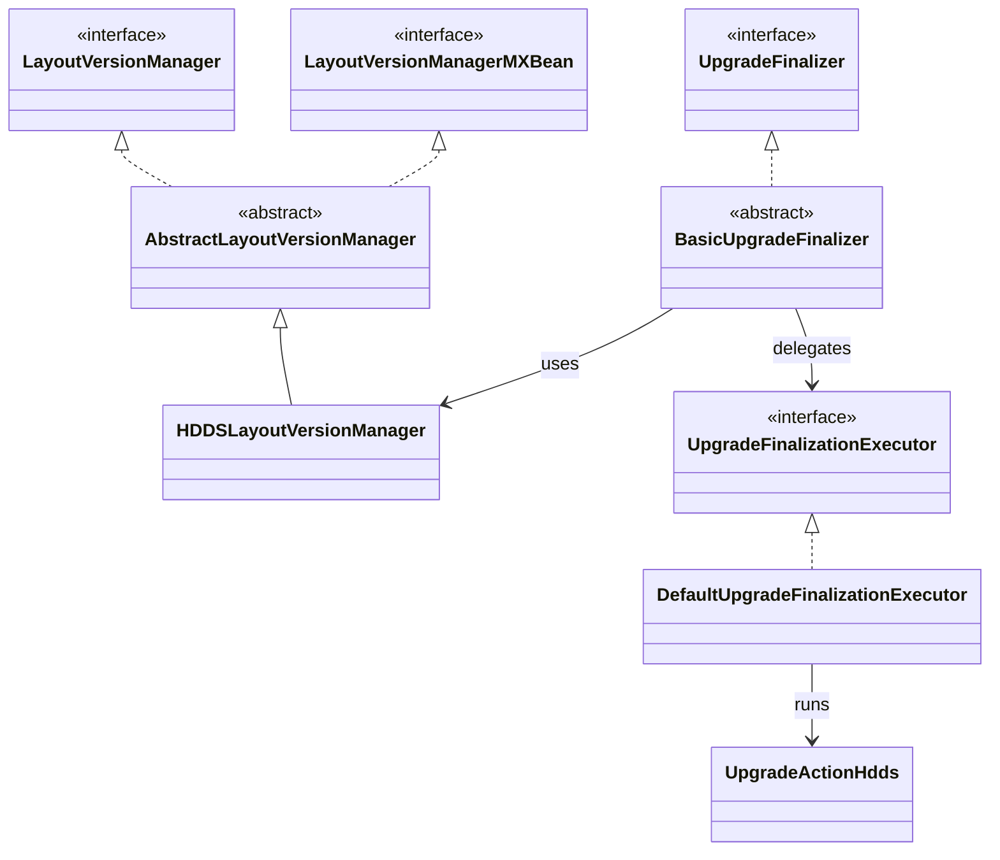

# hddscommon / upgrade-framework

_This feature page was generated from `study/atlas/components/hddscommon/upgrade-framework.md`. Author prose belongs above or below the BEGIN/END markers._

{/* BEGIN atlas-generated */}

**Classes:** 9    **Kinds:** interface:5, abstract:2, service:2

## Overview

`upgrade-framework` provides the concrete finalization machinery that executes upgrade transitions for SCM and datanodes. `BasicUpgradeFinalizer<S,V>` is the abstract base that drives the `UpgradeState` FSM (STARTING_FINALIZATION → FINALIZATION_IN_PROGRESS → FINALIZATION_DONE/FAILED); it is parameterized on the service type `S` and the layout version manager type `V`, and is subclassed by the SCM and datanode finalizer implementations. `DefaultUpgradeFinalizationExecutor` runs the registered `HDDSUpgradeAction` implementations for each advancing layout feature version and then persists the new metadata layout version to `Storage`. `AbstractLayoutVersionManager` maintains the sorted list of `LayoutFeature` constants, compares software vs. metadata layout versions, and gates feature availability via `isAllowed`. `HDDSLayoutVersionManager` binds `AbstractLayoutVersionManager` to `HDDSLayoutFeature` and is the concrete instance used by both SCM and datanodes. `LayoutVersionManager` and `UpgradeFinalizer` are the read-only interface and the finalization interface respectively. `LayoutVersionInstanceFactory` was removed in [HDDS-14568](https://issues.apache.org/jira/browse/HDDS-14568) after it was found to be unused.

## Diagram

## Class table

### Sub-feature: `hdds.upgrade`

| reading_order | fqcn | kind | logic | loc | study (min) | role |
|--:|---|---|---|--:|--:|---|
| 2086 | <Fqcn>org.apache.hadoop.hdds.upgrade.HDDSLayoutVersionManager</Fqcn> | service | mixed | 50~ | 30 | Class to manage layout versions and features for Storage Container Manager and DataNodes. |

### Sub-feature: `ozone.upgrade`

| reading_order | fqcn | kind | logic | loc | study (min) | role |
|--:|---|---|---|--:|--:|---|
| 2087 | <Fqcn>org.apache.hadoop.ozone.upgrade.UpgradeFinalizationExecutor</Fqcn> | interface | mixed | 25~ | 20 | An upgrade finalization executor runs the finalization methods of an UpgradeFinalizer, providing them the state they... |
| 2088 | <Fqcn>org.apache.hadoop.ozone.upgrade.UpgradeActionHdds</Fqcn> | interface | mixed | 25~ | 20 | Annotation to specify upgrade action run during HDDS (SCM or Datanode) finalization. |
| 2089 | <Fqcn>org.apache.hadoop.ozone.upgrade.LayoutVersionManager</Fqcn> | interface | mixed | 25~ | 20 | Read Only interface to an Ozone component's Version Manager. |
| 2090 | <Fqcn>org.apache.hadoop.ozone.upgrade.UpgradeFinalizer</Fqcn> | interface | mixed | 25~ | 20 | Interface to define the upgrade finalizer implementations. |
| 2091 | <Fqcn>org.apache.hadoop.ozone.upgrade.LayoutVersionManagerMXBean</Fqcn> | interface | mixed | 25~ | 20 | Interface for exposing Layout version metrics to JMX. |
| 2092 | <Fqcn>org.apache.hadoop.ozone.upgrade.BasicUpgradeFinalizer</Fqcn> | abstract | logic-heavy | 225~ | 45 | Base UpgradeFinalizer implementation to be extended by services. |
| 2093 | <Fqcn>org.apache.hadoop.ozone.upgrade.AbstractLayoutVersionManager</Fqcn> | abstract | mixed | 175~ | 45 | Layout Version Manager containing generic method implementations. |
| 2094 | <Fqcn>org.apache.hadoop.ozone.upgrade.DefaultUpgradeFinalizationExecutor</Fqcn> | service | mixed | 25~ | 30 | DefaultUpgradeFinalizationExecutor for driving the main part of finalization. |

## Anchor details

### `BasicUpgradeFinalizer`

- **path:** `hadoop-hdds/framework/src/main/java/org/apache/hadoop/ozone/upgrade/BasicUpgradeFinalizer.java`
- **loc:** 225~    **difficulty:** 4    **study:** 45 min    **concurrency:** thread-safe    **persistence:** in-memory
- **key collaborators:** `org.apache.hadoop.ozone.common.Storage`
- **test exemplar:** `hadoop-hdds/framework/src/test/java/org/apache/hadoop/ozone/upgrade/TestBasicUpgradeFinalizer.java`
- **role:** Base UpgradeFinalizer implementation to be extended by services.
- **note:** `finalize(String upgradeClientID, S service)` serializes access via an internal lock, advances through the `UpgradeState` FSM, and polls upgrade-action completion so that a client calling `queryUpgradeFinalizationProgress` receives live status updates. The `upgradeClientID` is a string token used to correlate concurrent admin requests; a second caller with a different ID gets a "finalization already in progress" status rather than a second execution.

## Design docs

- `hadoop-hdds/docs/content/design/upgrade-dev-primer.md` — explains `AbstractLayoutVersionManager`, `BasicUpgradeFinalizer`, and how to register a new `HDDSUpgradeAction`.
- `hadoop-hdds/docs/content/design/nonrolling-upgrade.md` — covers the full finalization sequence that `BasicUpgradeFinalizer` and `DefaultUpgradeFinalizationExecutor` implement.

## Seminal JIRAs / PRs

- [HDDS-12188](https://issues.apache.org/jira/browse/HDDS-12188). Move server-only upgrade classes from hdds-common to hdds-server-framework
- [HDDS-12354](https://issues.apache.org/jira/browse/HDDS-12354). Move Storage and UpgradeFinalizer to hdds-server-framework
- [HDDS-14568](https://issues.apache.org/jira/browse/HDDS-14568). Remove unused LayoutVersionInstanceFactory
- [HDDS-14569](https://issues.apache.org/jira/browse/HDDS-14569). Remove support for upgrade actions outside of finalization

## Sharp edges

- `AbstractLayoutVersionManager.isAllowed(LayoutFeature)` compares the feature's `layoutVersion()` against the current metadata layout version, not the software layout version; callers that confuse the two will incorrectly gate features as unavailable on a node that has been software-upgraded but not yet finalized.
- `BasicUpgradeFinalizer` uses an internal `ExecutorService` that is shut down in `close()`; if a service shuts down mid-finalization without calling `close()`, that thread leaks silently.

## Related features

- [upgrade-common.md](/component/hddscommon/upgrade-common) — `LayoutFeature`, `HDDSUpgradeAction`, and `UpgradeFinalization` interfaces that this feature implements
- [framework-server.md](/component/hddscommon/framework-server) — server lifecycle that calls `BasicUpgradeFinalizer.finalize` and registers `HDDSLayoutVersionManager`
- [hdds-db-utils.md](/component/hddscommon/hdds-db-utils) — `Storage` class persists the on-disk metadata layout version that `DefaultUpgradeFinalizationExecutor` advances
- [scm-common.md](/component/hddscommon/scm-common) — SCM subclasses `BasicUpgradeFinalizer` for its own finalization path

## Self-quiz

1. `AbstractLayoutVersionManager` tracks two version numbers. Name them and explain the difference between them during a rolling upgrade.
2. What does `DefaultUpgradeFinalizationExecutor.execute` do after all `HDDSUpgradeAction` implementations have run successfully?
3. Why was `LayoutVersionInstanceFactory` removed in [HDDS-14568](https://issues.apache.org/jira/browse/HDDS-14568) rather than kept for potential future use?
4. `BasicUpgradeFinalizer.finalize` accepts an `upgradeClientID` string. What happens if two concurrent admin callers use different IDs?
5. How does `HDDSLayoutVersionManager` discover which `HDDSUpgradeAction` implementations to register — by classpath scanning, annotation processing, or explicit registration?

Answers

Answer 1: `metadataLayoutVersion` is the version persisted on disk, reflecting the highest feature version whose migration has been finalized. `softwareLayoutVersion` is the highest version the running binary understands. During a rolling upgrade, a newly started node has a higher `softwareLayoutVersion` but the same `metadataLayoutVersion` until finalization runs.
Answer 2: After all actions succeed, `DefaultUpgradeFinalizationExecutor` calls `Storage.persistCurrentState()` (or equivalent) to advance the on-disk `metadataLayoutVersion` to match `softwareLayoutVersion`, making the upgrade permanent.
Answer 3: [HDDS-14568](https://issues.apache.org/jira/browse/HDDS-14568) found that `LayoutVersionInstanceFactory` had no remaining callers after earlier refactors moved its use cases to `UpgradeActionHdds` annotation-based discovery. Keeping dead framework code would have required ongoing maintenance with no benefit.
Answer 4: The second caller receives a status response of `FINALIZATION_IN_PROGRESS` with the existing state, without triggering a second finalization execution. `BasicUpgradeFinalizer` guards re-entry with a lock and checks the current `UpgradeState` before starting.
Answer 5: `HDDSLayoutVersionManager` uses `UpgradeActionHdds` annotation-based discovery via a Java `ServiceLoader`-style scan: classes annotated with `@UpgradeActionHdds` are registered by the concrete `HDDSLayoutVersionManager` constructor, which iterates the `HDDSLayoutFeature` enum and collects associated actions.

{/* END atlas-generated */}
