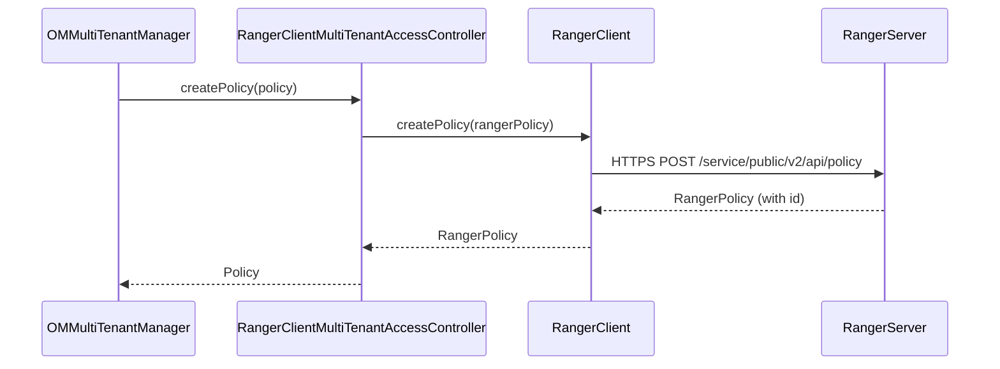

# interfaces / multitenancy-ranger

_This feature page was generated from `study/atlas/components/interfaces/multitenancy-ranger.md`. Author prose belongs above or below the BEGIN/END markers._

{/* BEGIN atlas-generated */}

**Classes:** 1    **Kinds:** service:1

## Overview

The `multitenancy-ranger` feature contains a single class, `RangerClientMultiTenantAccessController`, which is the Apache Ranger-backed implementation of the `MultiTenantAccessController` interface used by Ozone's multi-tenancy subsystem. The class wraps `RangerClient` to create, update, and delete Ranger policies and roles when OM tenant operations (create tenant, assign user, revoke user, delete tenant) are executed. Authentication to Ranger can be either SIMPLE (plain username/password from config) or Kerberos (using the OM Kerberos principal and keytab); the choice is made at construction time based on whether both `OZONE_OM_RANGER_HTTPS_ADMIN_API_USER` and `OZONE_OM_RANGER_HTTPS_ADMIN_API_PASSWD` are set. The class translates Ozone `IAccessAuthorizer.ACLType` values to Ranger access-type strings via a bidirectional map initialized from `MultiTenantAccessController.getRangerAclStrings()`.

## Diagram

## Class table

### Sub-feature: `om.multitenant`

| reading_order | fqcn | kind | logic | loc | study (min) | role |
|--:|---|---|---|--:|--:|---|
| 2524 | <Fqcn>org.apache.hadoop.ozone.om.multitenant.RangerClientMultiTenantAccessController</Fqcn> | service | logic-heavy | 350~ | 45 | Implementation of MultiTenantAccessController using the RangerClient to communicate with Ranger. |

## Anchor details

### `RangerClientMultiTenantAccessController`

- **path:** `hadoop-ozone/multitenancy-ranger/src/main/java/org/apache/hadoop/ozone/om/multitenant/RangerClientMultiTenantAccessController.java`
- **loc:** 350~    **difficulty:** 4    **study:** 45 min    **concurrency:** single-threaded    **persistence:** in-memory
- **key collaborators:** `org.apache.hadoop.hdds.conf.ConfigurationSource`, `org.apache.hadoop.ozone.OmUtils`, `org.apache.hadoop.ozone.OzoneConsts`, `org.apache.hadoop.ozone.security.acl.IAccessAuthorizer`
- **test exemplar:** `hadoop-ozone/multitenancy-ranger/src/test/java/org/apache/hadoop/ozone/om/multitenant/TestRangerClientMultiTenantAccessController.java`
- **role:** Implementation of MultiTenantAccessController using the RangerClient to communicate with Ranger.

The constructor does not validate Ranger credentials at build time — `RangerClient` defers authentication until the first actual API call. This means a misconfigured keytab or wrong password will not surface until the first `createPolicy`/`createRole` call, at which point `RangerServiceException` with HTTP 401 is thrown. The `_HOST` placeholder in the OM Kerberos principal is resolved manually via `SecurityUtil.getServerPrincipal` because `RangerClient` does not perform host substitution itself. The class also temporarily overrides `UserGroupInformation.getLoginUser()` during `RangerClient` construction and restores it in a `finally` block to avoid polluting the JVM-wide login state.

## Design docs

- `hadoop-hdds/docs/content/design/token.md` — covers Ozone security tokens and delegation, which multi-tenancy builds on.
- `hadoop-hdds/docs/content/design/secure-s3.md` — design for S3 authentication in secure mode, relevant to multi-tenancy S3 secret handling.

## Seminal JIRAs / PRs

- [HDDS-12454](https://issues.apache.org/jira/browse/HDDS-12454). Create new module for multitenancy with Ranger.
- [HDDS-14813](https://issues.apache.org/jira/browse/HDDS-14813). Bump Ranger to 2.8.0.
- [HDDS-14644](https://issues.apache.org/jira/browse/HDDS-14644). Move test-utils code back to src/main.

## Sharp edges

- `RangerClient` does not validate credentials at construction; a wrong password or missing keytab silently succeeds during `RangerClientMultiTenantAccessController` creation but causes HTTP 401 on the first operation. OM logs a specific message for 401 via `decodeRSEStatusCodes`, but the original `RangerServiceException` is re-thrown, so the caller must handle it.
- When using SIMPLE auth, `OZONE_OM_RANGER_HTTPS_ADMIN_API_PASSWD` is stored in plain text in the Ozone configuration. Deployers using secure mode should prefer Kerberos authentication.
- The class is `single-threaded` (no internal synchronization); callers in `OMMultiTenantManager` are responsible for serializing concurrent Ranger calls.

## Related features

- `components/ozone-manager/multitenancy.md` — OM-side multi-tenancy logic that uses this controller.
- `components/interfaces/s3gateway.md` — S3 Gateway that enforces Ranger policies set by the multi-tenancy subsystem.

## Self-quiz

1. What two authentication methods does `RangerClientMultiTenantAccessController` support, and which configuration keys determine which is used at runtime?
2. Why does the constructor temporarily set and then restore `UserGroupInformation.getLoginUser()`, and what risk does it mitigate?
3. `RangerClient` does not validate credentials at construction. What is the first observable symptom of a misconfiguration, and which method in the class logs a hint about it?
4. The class translates `IAccessAuthorizer.ACLType` to Ranger access-type strings. Which method populates the translation map, and where is that method defined?
5. `RangerServiceException` with HTTP 400 is logged with a specific hint. What does the hint say, and what operator action does it suggest?

Answers

Answer 1: SIMPLE (plain username + password via `OZONE_OM_RANGER_HTTPS_ADMIN_API_USER` and `OZONE_OM_RANGER_HTTPS_ADMIN_API_PASSWD`) and KERBEROS (via `OZONE_OM_KERBEROS_PRINCIPAL_KEY` and `OZONE_OM_KERBEROS_KEYTAB_FILE_KEY`). SIMPLE is used when both user and password keys are non-null.
Answer 2: `RangerClient` construction internally calls Kerberos login, which may change the JVM-wide login user. Saving and restoring `UserGroupInformation.getLoginUser()` prevents this from affecting other OM threads that rely on the OM's own Kerberos identity.
Answer 3: The first actual Ranger API call (e.g., `createPolicy`) throws `RangerServiceException`. `decodeRSEStatusCodes` logs "Auth failure. Please double check Ranger-related configs" for HTTP 401.
Answer 4: `MultiTenantAccessController.getRangerAclStrings()` (defined in `MultiTenantAccessController` interface). The constructor passes the result to `aclToString` and inverts it into `stringToAcl`.
Answer 5: "Request failure. If this is an assign-user operation, check if the user name exists in Ranger." This hints that Ranger returns 400 when a role assignment references a user that has never logged into Ranger.

{/* END atlas-generated */}
