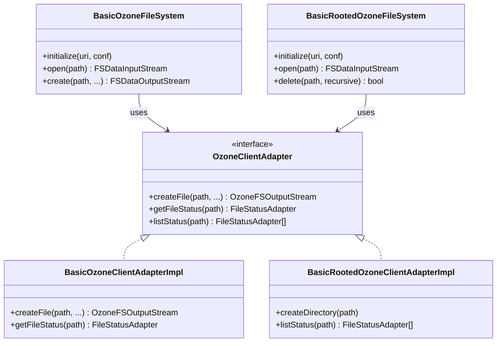

# interfaces / ozonefs-common

_This feature page was generated from `study/atlas/components/interfaces/ozonefs-common.md`. Author prose belongs above or below the BEGIN/END markers._

{/* BEGIN atlas-generated */}

**Classes:** 23    **Kinds:** service:20, interface:1, data:1, dto:1

## Overview

`ozonefs-common` is the Hadoop-version-agnostic core of the OzoneFileSystem implementation. It provides two parallel FileSystem hierarchies: the flat-bucket `o3fs://` path style (rooted at a single bucket) and the rooted `ofs://` path style (rooted at an Ozone cluster, spanning volumes and buckets). Each hierarchy has a `FileSystem` subclass (`BasicOzoneFileSystem` for o3fs, `BasicRootedOzoneFileSystem` for ofs) and a corresponding adapter (`BasicOzoneClientAdapterImpl`, `BasicRootedOzoneClientAdapterImpl`) that translates `FileSystem` API calls into Ozone client calls. The `OzoneClientAdapter` interface defines the contract between the two layers, decoupling the Hadoop API from the Ozone client library. Both adapters handle bucket-layout differences (FSO vs. OBS), snapshot path resolution (`/.snapshot/`), listing pagination, and data-stream vs. classic-RPC write path selection. Hadoop-version-specific classes in `ozonefs-hadoop2`, `ozonefs-hadoop3`, and `ozonefs-hadoop-current` extend these base classes to add version-specific capabilities.

## Diagram

## Class table

### Sub-feature: `client-adapter`

| reading_order | fqcn | kind | logic | loc | study (min) | role |
|--:|---|---|---|--:|--:|---|
| 1152 | <Fqcn>org.apache.hadoop.fs.ozone.OzoneClientAdapter</Fqcn> | interface | mixed | 50~ | 20 | Lightweight adapter to separate hadoop/ozone classes. |
| 1153 | <Fqcn>org.apache.hadoop.fs.ozone.BasicOzoneClientAdapterImpl</Fqcn> | service | logic-heavy | 625~ | 60 | Basic Implementation of the OzoneFileSystem calls. |
| 1154 | <Fqcn>org.apache.hadoop.fs.ozone.FileStatusAdapter</Fqcn> | service | mixed | 125~ | 30 | Class to hold the internal information of a FileStatus. |
| 1155 | <Fqcn>org.apache.hadoop.fs.ozone.OzoneClientAdapterImpl</Fqcn> | service | mixed | 25~ | 30 | Implementation of the OzoneFileSystem calls. |

### Sub-feature: `ofs-rooted`

| reading_order | fqcn | kind | logic | loc | study (min) | role |
|--:|---|---|---|--:|--:|---|
| 1156 | <Fqcn>org.apache.hadoop.fs.ozone.BasicRootedOzoneFileSystem</Fqcn> | service | logic-heavy | 1200~ | 60 | The minimal Rooted Ozone Filesystem implementation. |
| 1157 | <Fqcn>org.apache.hadoop.fs.ozone.BasicRootedOzoneClientAdapterImpl</Fqcn> | service | logic-heavy | 1075~ | 60 | Basic Implementation of the RootedOzoneFileSystem calls. |
| 1158 | <Fqcn>org.apache.hadoop.fs.ozone.RootedOzoneClientAdapterImpl</Fqcn> | service | mixed | 25~ | 30 | Implementation of the RootedOzoneFileSystem calls. |

### Sub-feature: `o3fs-bucket`

| reading_order | fqcn | kind | logic | loc | study (min) | role |
|--:|---|---|---|--:|--:|---|
| 1159 | <Fqcn>org.apache.hadoop.fs.ozone.BasicOzoneFileSystem</Fqcn> | service | logic-heavy | 1000~ | 60 | The minimal Ozone Filesystem implementation. |

### Sub-feature: `io-streams`

| reading_order | fqcn | kind | logic | loc | study (min) | role |
|--:|---|---|---|--:|--:|---|
| 1160 | <Fqcn>org.apache.hadoop.fs.ozone.OzoneFSInputStream</Fqcn> | service | mixed | 125~ | 30 | The input stream for Ozone file system. |
| 1161 | <Fqcn>org.apache.hadoop.fs.ozone.OzoneFSOutputStream</Fqcn> | service | mixed | 50~ | 30 | The output stream for Ozone file system. |
| 1162 | <Fqcn>org.apache.hadoop.fs.ozone.CapableOzoneFSDataStreamOutput</Fqcn> | service | mixed | 25~ | 30 | This class is used to workaround Hadoop2 compatibility issues. |
| 1163 | <Fqcn>org.apache.hadoop.fs.ozone.OzoneFSDataStreamOutput</Fqcn> | service | mixed | 25~ | 30 | The ByteBuffer output stream for Ozone file system. |
| 1164 | <Fqcn>org.apache.hadoop.fs.ozone.CapableOzoneFSInputStream</Fqcn> | service | mixed | 25~ | 30 | inferred: CapableOzoneFSInputStream — role not documented. |
| 1165 | <Fqcn>org.apache.hadoop.fs.ozone.CapableOzoneFSOutputStream</Fqcn> | service | mixed | 25~ | 30 | This class is used to workaround Hadoop2 compatibility issues. |

### Sub-feature: `fs-types`

| reading_order | fqcn | kind | logic | loc | study (min) | role |
|--:|---|---|---|--:|--:|---|
| 1166 | <Fqcn>org.apache.hadoop.fs.ozone.OzonePathCapabilities</Fqcn> | service | mixed | 25~ | 30 | Utility class to help implement hasPathCapability API in Ozone file system. |

### Sub-feature: `metrics`

| reading_order | fqcn | kind | logic | loc | study (min) | role |
|--:|---|---|---|--:|--:|---|
| 1167 | <Fqcn>org.apache.hadoop.fs.ozone.OzoneFSStorageStatistics</Fqcn> | service | mixed | 75~ | 30 | Storage statistics for OzoneFileSystem. |

### Sub-feature: `fs.ozone`

| reading_order | fqcn | kind | logic | loc | study (min) | role |
|--:|---|---|---|--:|--:|---|
| 1168 | <Fqcn>org.apache.hadoop.fs.ozone.LeaseRecoveryClientDNHandler</Fqcn> | service | mixed | 75~ | 30 | Handles lease recovery call between client and DN. |
| 1169 | <Fqcn>org.apache.hadoop.fs.ozone.OzoneDelegationTokenRenewer</Fqcn> | service | mixed | 25~ | 30 | Ozone Delegation Token Renewer. |
| 1170 | <Fqcn>org.apache.hadoop.fs.ozone.O3fsDtFetcher</Fqcn> | service | mixed | 25~ | 30 | A DT fetcher for OzoneFileSystem. |
| 1171 | <Fqcn>org.apache.hadoop.fs.ozone.BasicOzFs</Fqcn> | service | mixed | 25~ | 30 | ozone implementation of AbstractFileSystem. |
| 1172 | <Fqcn>org.apache.hadoop.fs.ozone.Constants</Fqcn> | service | mixed | 25~ | 30 | Constants for Ozone FileSystem implementation. |
| 1173 | <Fqcn>org.apache.hadoop.fs.ozone.Statistic</Fqcn> | data | data-only | 75~ | 10 | Statistic which are collected in OzoneFileSystem. |
| 1174 | <Fqcn>org.apache.hadoop.fs.ozone.BasicKeyInfo</Fqcn> | dto | data-only | 25~ | 10 | Minimum set of Ozone key information attributes. |

## Anchor details

### `BasicRootedOzoneFileSystem`

- **path:** `hadoop-ozone/ozonefs-common/src/main/java/org/apache/hadoop/fs/ozone/BasicRootedOzoneFileSystem.java`
- **loc:** 1200~    **difficulty:** 5    **study:** 60 min    **concurrency:** single-threaded    **persistence:** in-memory
- **entry points:** `close`, `open`, `create`
- **key collaborators:** `org.apache.hadoop.hdds.annotation.InterfaceAudience`, `org.apache.hadoop.hdds.annotation.InterfaceStability`, `org.apache.hadoop.hdds.conf.ConfigurationSource`, `org.apache.hadoop.hdds.conf.OzoneConfiguration`, `org.apache.hadoop.hdds.conf.StorageUnit`, `org.apache.hadoop.hdds.tracing.TracingUtil`
- **role:** The minimal Rooted Ozone Filesystem implementation.

`BasicRootedOzoneFileSystem` expects the URI authority to be an OM service-id or host:port; `initialize()` enforces this with a specific error message and a `PATH_DEPTH_TO_BUCKET = 2` depth check (`ofs://om/volume/bucket`). The `delete(path, recursive)` method delegates to `adapterImpl` but must handle the special case where `path` is a volume or bucket root: it calls `adapterImpl.deleteObject` only when `recursive=true` is safe to propagate. Snapshot paths (`/.snapshot/<name>/...`) are detected by scanning the path components for `OM_SNAPSHOT_INDICATOR` and are routed to read-only adapter calls.

### `BasicRootedOzoneClientAdapterImpl`

- **path:** `hadoop-ozone/ozonefs-common/src/main/java/org/apache/hadoop/fs/ozone/BasicRootedOzoneClientAdapterImpl.java`
- **loc:** 1075~    **difficulty:** 5    **study:** 60 min    **concurrency:** single-threaded    **persistence:** in-memory
- **entry points:** `close`
- **key collaborators:** `org.apache.hadoop.hdds.client.ReplicatedReplicationConfig`, `org.apache.hadoop.hdds.client.ReplicationConfig`, `org.apache.hadoop.hdds.client.ReplicationFactor`, `org.apache.hadoop.hdds.client.StandaloneReplicationConfig`, `org.apache.hadoop.hdds.conf.ConfigurationSource`, `org.apache.hadoop.hdds.conf.OzoneConfiguration`
- **role:** Basic Implementation of the RootedOzoneFileSystem calls.

This class creates volumes and buckets on demand during `createDirectory` calls when they do not exist, treating `VOLUME_ALREADY_EXISTS` and `BUCKET_ALREADY_EXISTS` exceptions as non-errors. The choice between Ratis data-stream and classic RPC write is made per-create call: if Ratis streaming is enabled and the write exceeds `streamingAutoThreshold`, a `SelectorOutputStream` is used that switches from classic to data-stream mid-write.

### `BasicOzoneFileSystem`

- **path:** `hadoop-ozone/ozonefs-common/src/main/java/org/apache/hadoop/fs/ozone/BasicOzoneFileSystem.java`
- **loc:** 1000~    **difficulty:** 5    **study:** 60 min    **concurrency:** single-threaded    **persistence:** in-memory
- **entry points:** `close`, `open`, `create`
- **key collaborators:** `org.apache.hadoop.hdds.annotation.InterfaceAudience`, `org.apache.hadoop.hdds.annotation.InterfaceStability`, `org.apache.hadoop.hdds.conf.ConfigurationSource`, `org.apache.hadoop.hdds.conf.OzoneConfiguration`, `org.apache.hadoop.hdds.conf.StorageUnit`, `org.apache.hadoop.hdds.utils.LegacyHadoopConfigurationSource`
- **role:** The minimal Ozone Filesystem implementation.

`BasicOzoneFileSystem` encodes the volume and bucket directly in the URI authority (`o3fs://bucket.volume.om-service-id/key`), so the bucket is fixed at `initialize()` time. All FS operations resolve to a single `OzoneBucket` obtained from the adapter. This is in contrast to `BasicRootedOzoneFileSystem`, which resolves volume and bucket from the path on every call. inferred: `getFileStatus` for the root path (`/`) returns a synthetic directory status since no key with path `/` exists in the bucket.

### `BasicOzoneClientAdapterImpl`

- **path:** `hadoop-ozone/ozonefs-common/src/main/java/org/apache/hadoop/fs/ozone/BasicOzoneClientAdapterImpl.java`
- **loc:** 625~    **difficulty:** 5    **study:** 60 min    **concurrency:** single-threaded    **persistence:** in-memory
- **entry points:** `close`
- **key collaborators:** `org.apache.hadoop.hdds.client.ReplicatedReplicationConfig`, `org.apache.hadoop.hdds.client.ReplicationConfig`, `org.apache.hadoop.hdds.client.ReplicationFactor`, `org.apache.hadoop.hdds.client.StandaloneReplicationConfig`, `org.apache.hadoop.hdds.conf.ConfigurationSource`, `org.apache.hadoop.hdds.conf.OzoneConfiguration`
- **role:** Basic Implementation of the OzoneFileSystem calls.

`BasicOzoneClientAdapterImpl` resolves `SnapshotDiffResponse` status polling in `getSnapshotDiffReport`: it retries until the diff job reaches `DONE` status, sleeping between retries. The `getFileStatus` method translates `OMException.ResultCodes.KEY_NOT_FOUND`, `FILE_NOT_FOUND`, `DIRECTORY_NOT_FOUND`, and `NOT_A_FILE` into `FileNotFoundException` to conform to the Hadoop `FileSystem` contract.

## Design docs

- `hadoop-hdds/docs/content/interface/O3fs.md` — O3FS (o3fs://) filesystem interface documentation.
- `hadoop-hdds/docs/content/interface/Ofs.md` — OFS (ofs://) rooted filesystem interface documentation.
- `hadoop-hdds/docs/content/design/ofs.md` — design doc for the rooted OFS implementation.

## Seminal JIRAs / PRs

- [HDDS-15920](https://issues.apache.org/jira/browse/HDDS-15920). Fix ByteBuffer positioned read behavior at EOF in OzoneFSInputStream.
- [HDDS-15877](https://issues.apache.org/jira/browse/HDDS-15877). Extend getFileStatus head-op optimization to o3fs and remaining type-only callers.
- [HDDS-15678](https://issues.apache.org/jira/browse/HDDS-15678). OFS isDirectory/isFile should not trigger pipeline refresh or return block locations.
- [HDDS-14177](https://issues.apache.org/jira/browse/HDDS-14177). OFS#getTrashRoot should use the internal FS username instead of current UGI.
- [HDDS-14043](https://issues.apache.org/jira/browse/HDDS-14043). Fix ls -e UnsupportedOperationException on ofs/o3fs.
- [HDDS-14035](https://issues.apache.org/jira/browse/HDDS-14035). Positioned-read should not do pre-read.
- [HDDS-13615](https://issues.apache.org/jira/browse/HDDS-13615). ofs.listStatusIterator() reports files in encrypted buckets as unencrypted.

## Sharp edges

- `BasicRootedOzoneFileSystem.initialize()` throws `IllegalArgumentException` (not `IOException`) when the URI authority is null or malformed. Callers using `FileSystem.get(URI, conf)` will see an unchecked exception rather than the normal checked `IOException`, which some MapReduce frameworks do not catch. (See URI_EXCEPTION_TEXT in the class.)
- `BasicOzoneClientAdapterImpl.getSnapshotDiffReport` polls OM in a busy-wait loop with no configurable timeout. If the diff job is stuck, this will block the calling thread indefinitely.
- `HDDS-15678`: OFS `isDirectory`/`isFile` previously fetched block locations unnecessarily. The fix added a separate lightweight `headObject` path; code paths that bypass `getFileStatus` directly and call the old path will still pay the pipeline-refresh cost.

## Related features

- `components/interfaces/ozonefs-hadoop2.md` — Hadoop 2-compatible shim extending this base.
- `components/interfaces/ozonefs-hadoop3.md` — Hadoop 3-compatible shim extending this base.
- `components/interfaces/ozonefs-hadoop-current.md` — current Hadoop shim with full capability support.
- `components/interfaces/s3gateway.md` — S3 Gateway, the alternative HTTP interface to the same Ozone namespace.
- `components/ozone-manager/namespace.md` — OM namespace that both FS implementations call for metadata.

## Self-quiz

1. `BasicRootedOzoneFileSystem` and `BasicOzoneFileSystem` differ in how they identify the target bucket. Describe the difference and what it means for `initialize()` behavior.
2. `BasicRootedOzoneClientAdapterImpl.createDirectory` handles `VOLUME_ALREADY_EXISTS`. What other OM exception is swallowed, and why is it safe to ignore?
3. Under what condition does `BasicRootedOzoneClientAdapterImpl` switch from a classic RPC write to a Ratis data-stream write mid-operation, and which class represents the switchable output stream?
4. `BasicOzoneClientAdapterImpl.getSnapshotDiffReport` polls OM. What is the termination condition, and what is the risk if it never terminates?
5. `BasicRootedOzoneFileSystem.delete(path, recursive=false)` on a non-empty directory should fail. Trace through `BasicRootedOzoneClientAdapterImpl` to identify which OM exception is expected and how it surfaces as the Hadoop `FileSystem` contract requires.

Answers

Answer 1: `BasicOzoneFileSystem` encodes the bucket in the URI authority (`o3fs://bucket.volume.om/`), so the bucket is fixed at `initialize()`. `BasicRootedOzoneFileSystem` uses only an OM address in the authority (`ofs://om-service-id/`) and resolves volume/bucket from path components on every call.
Answer 2: `BUCKET_ALREADY_EXISTS` is also swallowed. It is safe because `createDirectory` is idempotent — if the bucket already exists with the correct layout the operation is a no-op.
Answer 3: When Ratis streaming is enabled (`OZONE_FS_DATASTREAM_ENABLED`) and the write exceeds `streamingAutoThreshold`, a `SelectorOutputStream` is used. `SelectorOutputStream` buffers initial writes and switches to `OzoneDataStreamOutput` once the threshold is crossed.
Answer 4: Termination is when `SnapshotDiffResponse.getJobStatus() == DONE`. If the OM diff job never completes (e.g., due to a stuck background thread), the poll loop never exits — there is no configurable timeout, so the calling FS thread blocks indefinitely.
Answer 5: `adapterImpl.deleteObject(path, false)` is called. The OM returns `OMException` with result code `DIRECTORY_NOT_EMPTY` (or `BUCKET_NOT_EMPTY`). `BasicRootedOzoneClientAdapterImpl` translates this to `PathIsNotEmptyDirectoryException`, which `BasicRootedOzoneFileSystem.delete` re-throws, satisfying the Hadoop `FileSystem` contract.

{/* END atlas-generated */}
