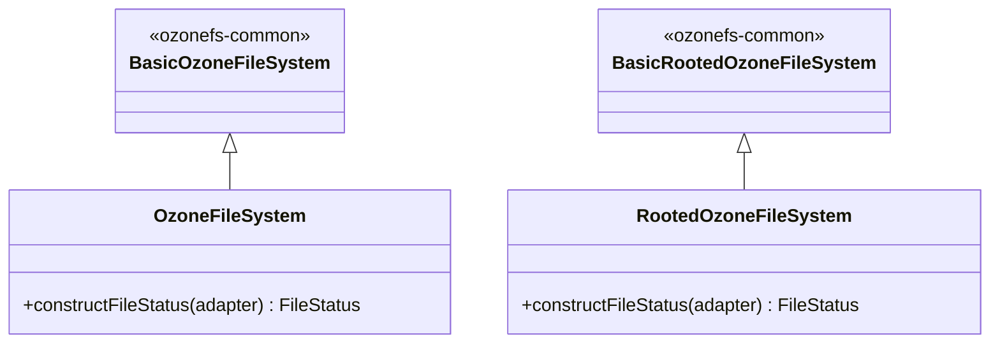

# interfaces / ozonefs-hadoop3

_This feature page was generated from `study/atlas/components/interfaces/ozonefs-hadoop3.md`. Author prose belongs above or below the BEGIN/END markers._

{/* BEGIN atlas-generated */}

**Classes:** 4    **Kinds:** service:4

## Overview

`ozonefs-hadoop3` (module `hadoop-ozone/ozonefs-hadoop3`) is the shaded compatibility shim for clusters running Hadoop 3.x that predate the current Hadoop release's APIs. Like `ozonefs-hadoop2`, this module extends the `Basic*` base classes from `ozonefs-common` but produces `FileStatus` objects compatible with the Hadoop 3 API rather than Hadoop 2 or the current release. The four classes (`OzoneFileSystem`, `RootedOzoneFileSystem`, `OzFs`, `RootedOzFs`) follow the same pattern: they are thin overrides of the common base, with `constructFileStatus` using the appropriate constructor variant and possibly adding Hadoop-3-specific capabilities that are absent in the common base. The module is shaded to avoid protobuf and guava classpath conflicts on Hadoop 3 clusters that bundle their own versions.

## Diagram

## Class table

### Sub-feature: `fs.ozone`

| reading_order | fqcn | kind | logic | loc | study (min) | role |
|--:|---|---|---|--:|--:|---|
| 2529 | <Fqcn>org.apache.hadoop.fs.ozone.OzoneFileSystem</Fqcn> | service | mixed | 125~ | 30 | The Ozone Filesystem implementation. |
| 2530 | <Fqcn>org.apache.hadoop.fs.ozone.OzoneFileSystem</Fqcn> | service | mixed | 25~ | 30 | Minimal Ozone File System compatible with Hadoop 2.x. |
| 2531 | <Fqcn>org.apache.hadoop.fs.ozone.OzoneFileSystem</Fqcn> | service | mixed | 125~ | 30 | The Ozone Filesystem implementation. |
| 2532 | <Fqcn>org.apache.hadoop.fs.ozone.RootedOzoneFileSystem</Fqcn> | service | mixed | 125~ | 30 | The Rooted Ozone Filesystem (OFS) implementation. |
| 2533 | <Fqcn>org.apache.hadoop.fs.ozone.RootedOzoneFileSystem</Fqcn> | service | mixed | 25~ | 30 | Minimal Rooted Ozone File System compatible with Hadoop 2.x. |
| 2534 | <Fqcn>org.apache.hadoop.fs.ozone.RootedOzoneFileSystem</Fqcn> | service | mixed | 125~ | 30 | The Rooted Ozone Filesystem (OFS) implementation. |
| 2535 | <Fqcn>org.apache.hadoop.fs.ozone.OzFs</Fqcn> | service | mixed | 25~ | 30 | ozone implementation of AbstractFileSystem. |
| 2536 | <Fqcn>org.apache.hadoop.fs.ozone.OzFs</Fqcn> | service | mixed | 25~ | 30 | ozone implementation of AbstractFileSystem. |
| 2537 | <Fqcn>org.apache.hadoop.fs.ozone.OzFs</Fqcn> | service | mixed | 25~ | 30 | ozone implementation of AbstractFileSystem. |
| 2538 | <Fqcn>org.apache.hadoop.fs.ozone.RootedOzFs</Fqcn> | service | mixed | 25~ | 30 | Ozone implementation of AbstractFileSystem. |
| 2539 | <Fqcn>org.apache.hadoop.fs.ozone.RootedOzFs</Fqcn> | service | mixed | 25~ | 30 | Ozone implementation of AbstractFileSystem. |
| 2540 | <Fqcn>org.apache.hadoop.fs.ozone.RootedOzFs</Fqcn> | service | mixed | 25~ | 30 | Ozone implementation of AbstractFileSystem. |

## Anchor details

_No logic-heavy anchors in this feature; the classes are primarily thin Hadoop-3-compatible subclasses of ozonefs-common base classes._

## Design docs

- `hadoop-hdds/docs/content/interface/O3fs.md` — O3FS filesystem interface documentation.
- `hadoop-hdds/docs/content/interface/Ofs.md` — OFS (rooted) filesystem interface documentation.

## Seminal JIRAs / PRs

- [HDDS-14682](https://issues.apache.org/jira/browse/HDDS-14682). Unify OzoneManagerProtocolPB failover proxy provider.
- [HDDS-14056](https://issues.apache.org/jira/browse/HDDS-14056). Relocate protobuf in ozone-filesystem shaded jars.
- [HDDS-13753](https://issues.apache.org/jira/browse/HDDS-13753). Use forked Hadoop RPC.
- [HDDS-12281](https://issues.apache.org/jira/browse/HDDS-12281). Fix license headers and imports for ozone-filesystem-hadoop3.
- [HDDS-11952](https://issues.apache.org/jira/browse/HDDS-11952). Enable sortpom in hadoop-ozone.
- [HDDS-11517](https://issues.apache.org/jira/browse/HDDS-11517). Update version to 2.0.0-SNAPSHOT.

## Sharp edges

- Because this module produces a shaded jar, any Ozone client-side APIs exposed through `OzoneFileSystem` will have their internal types relocated. Code that casts the `FileSystem` to `OzoneFileSystem` and calls Ozone-specific methods (e.g., `getEcPolicy()`) may encounter `ClassCastException` if the caller and the jar use different class loaders.
- The distinction between `ozonefs-hadoop3` and `ozonefs-hadoop-current` is determined by the Hadoop minor version bundled with the cluster. Deployers must choose the correct jar; using `ozonefs-hadoop3` on a current Hadoop cluster silently misses capabilities like `LeaseRecoverable` and `SafeMode`.

## Related features

- `components/interfaces/ozonefs-common.md` — base classes extended by this module.
- `components/interfaces/ozonefs-hadoop2.md` — Hadoop 2 shim (analogous module for Hadoop 2).
- `components/interfaces/ozonefs-hadoop-current.md` — current Hadoop shim with full capabilities.

## Self-quiz

1. Why does `ozonefs-hadoop3` exist as a separate module rather than using `ozonefs-hadoop-current` on all Hadoop 3 clusters?
2. What is the primary difference in the `constructFileStatus` override between `ozonefs-hadoop2` and `ozonefs-hadoop3`?
3. Which capabilities present in `ozonefs-hadoop-current` are absent from `ozonefs-hadoop3`, and what is the user-visible consequence of deploying the wrong jar?
4. Why is the jar shaded rather than providing the classes as a non-shaded library?
5. `OzFs` in this module implements `AbstractFileSystem`. What method must it override to return the correct `FileSystem` implementation class?

Answers

Answer 1: Certain Hadoop 3.x minor releases lack APIs like `KeyProviderTokenIssuer`, `LeaseRecoverable`, and `SafeMode` that are present in the current supported release. `ozonefs-hadoop3` provides a compatible subset that compiles and runs on those older Hadoop 3 cluster versions.
Answer 2: `ozonefs-hadoop2` uses the Hadoop 2 `FileStatus` 10-argument constructor (without encryption/ACL fields). `ozonefs-hadoop3` uses the Hadoop 3 constructor which adds `isEncrypted` and related fields but may omit fields added after Hadoop 3.3.
Answer 3: `KeyProviderTokenIssuer`, `LeaseRecoverable`, and `SafeMode` are absent. Deploying the wrong jar means lease recovery (e.g., after a client crash mid-write) must be done via `ozone admin` rather than via the FileSystem API, and transparent encryption token delegation does not work automatically.
Answer 4: Shading avoids classpath conflicts: Ozone bundles protobuf 3.x and guava, while Hadoop 3 clusters typically bundle older versions of both. Without relocation, the wrong version would be loaded at runtime.
Answer 5: `OzFs.getCanonicalServiceName()` and `OzFs.createFileSystem(URI, Configuration)` must be overridden to return the correct `OzoneFileSystem` class from this module.

{/* END atlas-generated */}
