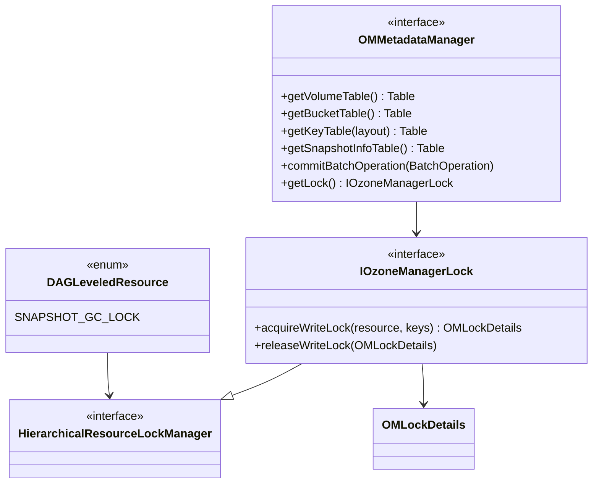

# om / interface-storage

_This feature page was generated from `study/atlas/components/om/interface-storage.md`. Author prose belongs above or below the BEGIN/END markers._

{/* BEGIN atlas-generated */}

**Classes:** 11    **Kinds:** service:4, interface:3, dto:2, data:1, metrics:1

## Overview

The `interface-storage` feature contains the foundational interfaces and data types that the OM storage layer is built on. `OMMetadataManager` is the primary storage interface, defining typed table accessors for every OM RocksDB column family (volumeTable, bucketTable, keyTable, openKeyTable, fileTable, directoryTable, deletedTable, snapshotInfoTable, etc.) and the `commitBatchOperation` method. `IOzoneManagerLock` defines the locking contract, extended from `HierarchicalResourceLockManager` which adds DAG-based locking for resources like snapshot GC. `OMLockDetails` records timing and lock-type metadata for each lock acquisition, feeding `OMLockMetrics`. `DAGLeveledResource` enumerates DAG-level locks (`SNAPSHOT_GC_LOCK`, etc.) used by snapshot-aware services. `OzoneAclStorage` and `OzoneAclStorageUtil` centralize the storage and manipulation of `OzoneAcl` lists on any OM metadata object. `ExpiredOpenKeys` bundles the set of open keys that have expired, passed between `OpenKeyCleanupService` and the request layer.

## Diagram

## Class table

### Sub-feature: `om.helpers`

| reading_order | fqcn | kind | logic | loc | study (min) | role |
|--:|---|---|---|--:|--:|---|
| 470 | <Fqcn>org.apache.hadoop.ozone.om.helpers.OzoneAclStorageUtil</Fqcn> | service | mixed | 25~ | 30 | Helper class for ozone acls operations. |
| 471 | <Fqcn>org.apache.hadoop.ozone.om.helpers.OzoneAclStorage</Fqcn> | service | mixed | 25~ | 30 | OzoneAclStorage classes define bucket ACLs used in OZONE. |
| 472 | <Fqcn>org.apache.hadoop.ozone.om.helpers.OmPrefixInfo</Fqcn> | dto | data-only | 150~ | 10 | Wrapper class for Ozone prefix path info, currently mainly target for ACL but can be extended for other OzFS optimiza... |

### Sub-feature: `om.lock`

| reading_order | fqcn | kind | logic | loc | study (min) | role |
|--:|---|---|---|--:|--:|---|
| 473 | <Fqcn>org.apache.hadoop.ozone.om.lock.IOzoneManagerLock</Fqcn> | interface | mixed | 100~ | 20 | Interface for OM Metadata locks. |
| 474 | <Fqcn>org.apache.hadoop.ozone.om.lock.HierarchicalResourceLockManager</Fqcn> | interface | mixed | 25~ | 20 | Interface for Hierachical Resource Lock where the lock order acquired on resource is going to be deterministic and th... |
| 475 | <Fqcn>org.apache.hadoop.ozone.om.lock.OMLockDetails</Fqcn> | service | mixed | 75~ | 30 | This class is for recording detailed consumed time on Locks. |
| 476 | <Fqcn>org.apache.hadoop.ozone.om.lock.DAGLeveledResource</Fqcn> | data | data-only | 25~ | 10 | The DAGLeveledResource enum represents a set of resources that are associated with specific locks in the Ozone Manage... |
| 477 | <Fqcn>org.apache.hadoop.ozone.om.lock.LockUsageInfo</Fqcn> | dto | data-only | 25~ | 10 | Maintains lock related information useful in updating OMLockMetrics. |
| 478 | <Fqcn>org.apache.hadoop.ozone.om.lock.OMLockMetrics</Fqcn> | metrics | mixed | 75~ | 20 | This class is for maintaining the various Ozone Manager Lock Metrics. |

### Sub-feature: `ozone.om`

| reading_order | fqcn | kind | logic | loc | study (min) | role |
|--:|---|---|---|--:|--:|---|
| 479 | <Fqcn>org.apache.hadoop.ozone.om.OMMetadataManager</Fqcn> | interface | mixed | 150~ | 20 | OM metadata manager interface. |
| 480 | <Fqcn>org.apache.hadoop.ozone.om.ExpiredOpenKeys</Fqcn> | service | mixed | 25~ | 30 | The expired open keys. |

## Anchor details

_No logic-heavy anchors in this feature; the classes are primarily data / dto / config / cli._

## Design docs

- `hadoop-hdds/docs/content/concept/RocksDB.md` — RocksDB usage in Ozone including OM table layout
- `hadoop-hdds/docs/content/design/locks.md` — OM locking hierarchy referenced by `IOzoneManagerLock`

## Seminal JIRAs / PRs

- [HDDS-15907](https://issues.apache.org/jira/browse/HDDS-15907). Do not use Collection in IOzoneManagerLock (interface change)
- [HDDS-13076](https://issues.apache.org/jira/browse/HDDS-13076). Refactor OzoneManagerLock class to rename Resource class to LeveledResource
- [HDDS-8974](https://issues.apache.org/jira/browse/HDDS-8974). Introduce detailed lock information (OMLockDetails)

## Sharp edges

- `OMMetadataManager.getKeyTable(BucketLayout)` must be called with the correct layout; passing `FSO` for an OBS bucket or vice versa silently returns the wrong table, leading to missing keys or phantom entries. Always derive the layout from `OmBucketInfo.getBucketLayout()`.
- `IOzoneManagerLock` was changed to not use `Collection` in [HDDS-15907](https://issues.apache.org/jira/browse/HDDS-15907). Any code that previously accepted `Collection<OMLockDetails>` for batch release must be updated to use the new typed signature.

## Related features

- `components/om/om-locking.md` — `OzoneManagerLock` is the implementation of `IOzoneManagerLock`
- `components/om/om-server.md` — `OmMetadataManagerImpl` implements `OMMetadataManager`

## Self-quiz

1. `OMMetadataManager.getKeyTable(BucketLayout)` returns different tables for FSO vs OBS. Which tables are returned for each layout?
2. `DAGLeveledResource` defines DAG-level locks. Name one concrete resource and the service that acquires it.
3. `OmPrefixInfo` stores Ozone prefix path ACLs. How is it serialized for on-disk storage and which table stores it?
4. `IOzoneManagerLock` was changed in [HDDS-15907](https://issues.apache.org/jira/browse/HDDS-15907). What was the previous signature and why was it changed?
5. What is `ExpiredOpenKeys` and how is it used by `OpenKeyCleanupService`?

Answers

Answer 1: FSO returns `fileTable` (for file keys) and `openFileTable` (for open keys). OBS returns `keyTable` and `openKeyTable`.
Answer 2: `SNAPSHOT_GC_LOCK` — acquired by `SnapshotDeletingService` before processing a snapshot entry to prevent concurrent snapshot GC operations.
Answer 3: `OmPrefixInfo` serializes via `OmPrefixInfo.getProtobuf()` to `OzoneManagerProtocolProtos.OmPrefixInfo`. It is stored in `prefixTable` using the prefix path as the key.
Answer 4: The previous signature used `Collection<OMLockDetails>` as a return type, which did not enforce ordering. [HDDS-15907](https://issues.apache.org/jira/browse/HDDS-15907) changed it to avoid `Collection` since the lock release order matters and must match the acquisition order.
Answer 5: `ExpiredOpenKeys` is a container holding a list of expired open key entries (keys that were opened but never committed within the expiry window). `OpenKeyCleanupService.call()` builds `ExpiredOpenKeys` from the open key table and passes it to `KeyManagerImpl` to generate the cleanup request.

{/* END atlas-generated */}
