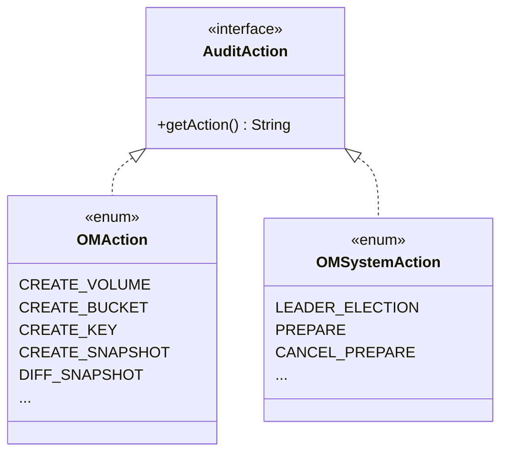

# om / om-audit

_This feature page was generated from `study/atlas/components/om/om-audit.md`. Author prose belongs above or below the BEGIN/END markers._

{/* BEGIN atlas-generated */}

**Classes:** 2    **Kinds:** data:2

## Overview

The `om-audit` feature contains two enums that enumerate audit action types for the OM audit log. `OMAction` covers user-visible operations: `CREATE_VOLUME`, `DELETE_BUCKET`, `GET_KEY`, `CREATE_SNAPSHOT`, `DIFF_SNAPSHOT`, etc. — each corresponding to an OM request type. `OMSystemAction` covers internal/system operations: `LEADER_ELECTION`, `PREPARE`, `CANCEL_PREPARE`, etc., logged by `OzoneManagerStateMachine` on state-machine events rather than by user requests. Both implement `AuditAction`. `OmMetadataReader` and `OzoneManagerRequestHandler` create `AuditMessage` objects using these enums and route them to the `AuditLogger` for structured log output.

## Diagram

## Class table

### Sub-feature: `ozone.audit`

| reading_order | fqcn | kind | logic | loc | study (min) | role |
|--:|---|---|---|--:|--:|---|
| 1426 | <Fqcn>org.apache.hadoop.ozone.audit.OMAction</Fqcn> | data | data-only | 100~ | 10 | Enum to define Audit Action types for OzoneManager. |
| 1427 | <Fqcn>org.apache.hadoop.ozone.audit.OMSystemAction</Fqcn> | data | data-only | 25~ | 10 | Enum to define Audit Action types for system audit in OzoneManager. |

## Anchor details

_No logic-heavy anchors in this feature; the classes are primarily data / dto / config / cli._

## Design docs

- no dedicated design doc for OM audit under `hadoop-hdds/docs/content/` on this branch; audit log format is documented in `hadoop-hdds/docs/content/tools/debug/AuditParser.md`

## Seminal JIRAs / PRs

- [HDDS-8203](https://issues.apache.org/jira/browse/HDDS-8203). Log OM Garbage Collection logs to an OM System audit log file (OMSystemAction)
- TODO(verify) — additional JIRAs for individual OMAction enum value additions are spread across many commits

## Sharp edges

- `OMSystemAction` values are logged by `OzoneManagerStateMachine` on the Ratis apply thread. If the audit log writer blocks (e.g., disk full), it stalls the apply thread and causes Ratis heartbeat timeouts.

## Related features

- `components/om/om-server.md` — `OmMetadataReader` and `OzoneManager` use `OMAction` when building audit messages
- `components/om/om-ratis.md` — `OzoneManagerStateMachine` uses `OMSystemAction` for state-machine events

## Self-quiz

1. What interface do `OMAction` and `OMSystemAction` both implement, and what method must they provide?
2. Which class in `om-ratis` uses `OMSystemAction` and for what purpose?
3. Which class in `om-server` uses `OMAction` for every read-path operation?
4. `OMAction` has an entry for `DIFF_SNAPSHOT`. Which class in `om-protocol` logs this action?
5. Are `OMAction` and `OMSystemAction` written to the same audit log file or separate files?

Answers

Answer 1: `AuditAction` from the Hadoop audit framework; they must provide `getAction()` returning the action name string.
Answer 2: `OzoneManagerStateMachine` uses `OMSystemAction` (e.g., `LEADER_ELECTION`) when logging state-machine events to the system audit log.
Answer 3: `OmMetadataReader` — it creates an `AuditMessage` with the appropriate `OMAction` for every read-path call (lookupKey, listBuckets, etc.).
Answer 4: `OzoneManagerRequestHandler.handleReadRequest` logs `OMAction.DIFF_SNAPSHOT` when dispatching a snapshot diff request.
Answer 5: `OMSystemAction` events are written to a separate OM system audit log file ([HDDS-8203](https://issues.apache.org/jira/browse/HDDS-8203)); `OMAction` events go to the regular OM audit log.

{/* END atlas-generated */}
