# om / om-background-services

_This feature page was generated from `study/atlas/components/om/om-background-services.md`. Author prose belongs above or below the BEGIN/END markers._

{/* BEGIN atlas-generated */}

**Classes:** 13    **Kinds:** service:11, abstract:1, metrics:1

## Overview

The `om-background-services` feature holds the suite of periodic background tasks that the OM leader runs to keep metadata clean and space reclaimed. All services extend `BackgroundService` from the HDDS framework. `AbstractKeyDeletingService` factors out snapshot-chain awareness shared by `KeyDeletingService`, `DirectoryDeletingService`, and `SnapshotDeletingService`. `KeyDeletingService` reads the deleted-key table, batches them per SCM block-group, and calls `PurgeKeys` through Ratis. `DirectoryDeletingService` similarly processes the deleted-directory table for FSO buckets, using `ReclaimableKeyFilter` and `ReclaimableDirFilter` to skip entries still referenced by earlier snapshots. `SnapshotDeletingService` walks the snapshot chain and reclaims space when a snapshot is deleted. `KeyLifecycleService` enforces S3-style object lifecycle rules (expiration, abort incomplete MPU) by scanning bucket lifecycle configurations. `OMRangerBGSyncService` keeps the Ranger policy store synchronized with the OM multi-tenancy DB state. Supporting services handle open-key cleanup, MPU abort, compaction, and snapshot-diff job GC.

## Diagram

```mermaid
flowchart TD
  AbstractKeyDeletingService["AbstractKeyDeletingService<br/>(abstract base)"]
  KeyDeletingService["KeyDeletingService<br/>(deleted key table -> SCM purge)"]
  DirectoryDeletingService["DirectoryDeletingService<br/>(deleted dir table, FSO)"]
  SnapshotDeletingService["SnapshotDeletingService<br/>(snapshot chain GC)"]
  OpenKeyCleanupService["OpenKeyCleanupService<br/>(hanging open keys)"]
  MultipartUploadCleanupService["MultipartUploadCleanupService<br/>(incomplete MPU)"]
  KeyLifecycleService["KeyLifecycleService<br/>(S3 lifecycle rules)"]
  OMRangerBGSyncService["OMRangerBGSyncService<br/>(Ranger policy sync)"]
  CompactionService["CompactionService<br/>(RocksDB compaction)"]
  AbstractKeyDeletingService --> KeyDeletingService
  AbstractKeyDeletingService --> DirectoryDeletingService
  AbstractKeyDeletingService --> SnapshotDeletingService
click AbstractKeyDeletingService href "/class/abstractkeydeletingservice" "Open AbstractKeyDeletingService"
click KeyDeletingService href "/class/keydeletingservice" "Open KeyDeletingService"
click DirectoryDeletingService href "/class/directorydeletingservice" "Open DirectoryDeletingService"
click SnapshotDeletingService href "/class/snapshotdeletingservice" "Open SnapshotDeletingService"
click OpenKeyCleanupService href "/class/openkeycleanupservice" "Open OpenKeyCleanupService"
click MultipartUploadCleanupService href "/class/multipartuploadcleanupservice" "Open MultipartUploadCleanupService"
click KeyLifecycleService href "/class/keylifecycleservice" "Open KeyLifecycleService"
click OMRangerBGSyncService href "/class/omrangerbgsyncservice" "Open OMRangerBGSyncService"
click CompactionService href "/class/compactionservice" "Open CompactionService"
```

## Class table

### Sub-feature: `om.service`

| reading_order | fqcn | kind | logic | loc | study (min) | role |
|--:|---|---|---|--:|--:|---|
| 977 | <Fqcn>org.apache.hadoop.ozone.om.service.AbstractKeyDeletingService</Fqcn> | abstract | mixed | 125~ | 30 | Abstracts common code from KeyDeletingService and DirectoryDeletingService which is now used by SnapshotDeletingServi... |
| 978 | <Fqcn>org.apache.hadoop.ozone.om.service.KeyLifecycleService</Fqcn> | service | logic-heavy | 1625~ | 60 | This is the background service to manage object lifecycle based on bucket lifecycle configuration. |
| 979 | <Fqcn>org.apache.hadoop.ozone.om.service.QuotaRepairTask</Fqcn> | service | logic-heavy | 625~ | 60 | Quota repair task. |
| 980 | <Fqcn>org.apache.hadoop.ozone.om.service.DirectoryDeletingService</Fqcn> | service | logic-heavy | 575~ | 60 | Background service responsible for purging deleted directories and files in the Ozone Manager (OM) and associated sna... |
| 981 | <Fqcn>org.apache.hadoop.ozone.om.service.OMRangerBGSyncService</Fqcn> | service | logic-heavy | 525~ | 60 | Background Sync thread that reads Multi-Tenancy state from OM DB and applies it to Ranger. |
| 982 | <Fqcn>org.apache.hadoop.ozone.om.service.KeyDeletingService</Fqcn> | service | logic-heavy | 525~ | 60 | This is the background service to delete keys. |
| 983 | <Fqcn>org.apache.hadoop.ozone.om.service.SnapshotDeletingService</Fqcn> | service | logic-heavy | 300~ | 45 | Background Service to clean-up deleted snapshot and reclaim space. |
| 984 | <Fqcn>org.apache.hadoop.ozone.om.service.OpenKeyCleanupService</Fqcn> | service | mixed | 175~ | 45 | This is the background service to delete hanging open keys. |
| 985 | <Fqcn>org.apache.hadoop.ozone.om.service.SnapshotDiffCleanupService</Fqcn> | service | mixed | 150~ | 45 | Background service to clean-up snapDiff jobs which are stable and corresponding reports. |
| 986 | <Fqcn>org.apache.hadoop.ozone.om.service.MultipartUploadCleanupService</Fqcn> | service | mixed | 125~ | 30 | This is the background service to abort incomplete Multipart Upload. |
| 987 | <Fqcn>org.apache.hadoop.ozone.om.service.CompactionService</Fqcn> | service | mixed | 100~ | 30 | This is the background service to compact OM rocksdb tables. |
| 988 | <Fqcn>org.apache.hadoop.ozone.om.service.CompactDBUtil</Fqcn> | service | mixed | 50~ | 30 | Utility class for compacting OM RocksDB column families. |
| 989 | <Fqcn>org.apache.hadoop.ozone.om.service.KeyLifecycleServiceMetrics</Fqcn> | metrics | mixed | 125~ | 20 | Class contains metrics related to the OM KeyLifeCycle services. |

## Anchor details

### `KeyLifecycleService`

- **path:** `hadoop-ozone/ozone-manager/src/main/java/org/apache/hadoop/ozone/om/service/KeyLifecycleService.java`
- **loc:** 1625~    **difficulty:** 5    **study:** 60 min    **concurrency:** thread-safe    **persistence:** RocksDB
- **entry points:** `call`
- **key collaborators:** `org.apache.hadoop.hdds.conf.ConfigurationSource`, `org.apache.hadoop.hdds.conf.StorageUnit`, `org.apache.hadoop.hdds.utils.BackgroundService`, `org.apache.hadoop.hdds.utils.BackgroundTask`, `org.apache.hadoop.hdds.utils.BackgroundTaskQueue`, `org.apache.hadoop.hdds.utils.BackgroundTaskResult`
- **test exemplar:** `hadoop-ozone/ozone-manager/src/test/java/org/apache/hadoop/ozone/om/service/TestKeyLifecycleService.java`
- **role:** This is the background service to manage object lifecycle based on bucket lifecycle configuration.

The key structural insight is that it iterates per-bucket lifecycle configurations and evaluates each `OmLCRule` against keys in the keyTable. When expiration rules match, it either moves keys to the Ozone Trash path (if `OZONE_KEY_LIFECYCLE_SERVICE_MOVE_TO_TRASH_ENABLED` is set) or submits `DeleteKey` requests via Ratis. It also handles `AbortIncompleteMultipartUpload` rules by scanning the MPU table. Resume state (`OmLifecycleScanState`) is persisted to the lifecycle state table via `OMLifecycleSaveScanStateRequest` to survive OM restarts mid-scan.

### `QuotaRepairTask`

- **path:** `hadoop-ozone/ozone-manager/src/main/java/org/apache/hadoop/ozone/om/service/QuotaRepairTask.java`
- **loc:** 625~    **difficulty:** 5    **study:** 60 min    **concurrency:** thread-safe    **persistence:** in-memory
- **key collaborators:** `org.apache.hadoop.hdds.conf.OzoneConfiguration`, `org.apache.hadoop.hdds.server.JsonUtils`, `org.apache.hadoop.hdds.utils.db.DBCheckpoint`, `org.apache.hadoop.hdds.utils.db.Table`, `org.apache.hadoop.hdds.utils.db.TableIterator`, `org.apache.hadoop.ozone.om.OMMetadataManager`
- **test exemplar:** `hadoop-ozone/ozone-manager/src/test/java/org/apache/hadoop/ozone/om/service/TestQuotaRepairTask.java`
- **role:** Quota repair task.

Triggered by the `QuotaRepairUpgradeAction` after upgrade finalization. It performs a full table scan of keyTable, fileTable, and directoryTable and recomputes per-volume and per-bucket `usedBytes`/`usedNamespace` counters. The repair is driven through Ratis so changes are replicated; it also includes snapshot pending-delete usage in its calculations ([HDDS-15204](https://issues.apache.org/jira/browse/HDDS-15204)).

### `DirectoryDeletingService`

- **path:** `hadoop-ozone/ozone-manager/src/main/java/org/apache/hadoop/ozone/om/service/DirectoryDeletingService.java`
- **loc:** 575~    **difficulty:** 5    **study:** 60 min    **concurrency:** thread-safe    **persistence:** in-memory
- **entry points:** `start`, `close`, `call`
- **key collaborators:** `org.apache.hadoop.hdds.HddsUtils`, `org.apache.hadoop.hdds.conf.OzoneConfiguration`, `org.apache.hadoop.hdds.conf.ReconfigurationHandler`, `org.apache.hadoop.hdds.conf.StorageUnit`, `org.apache.hadoop.hdds.utils.BackgroundTask`, `org.apache.hadoop.hdds.utils.BackgroundTaskResult`
- **test exemplar:** `hadoop-ozone/ozone-manager/src/test/java/org/apache/hadoop/ozone/om/service/TestDirectoryDeletingService.java`
- **role:** Background service responsible for purging deleted directories and files in the Ozone Manager (OM) and associated snapshots.

When `OZONE_SNAPSHOT_DEEP_CLEANING_ENABLED` is set, the service also iterates across all deep-clean-enabled snapshots in the chain, not just the active OM. For each store it uses `ReclaimableDirFilter` and `ReclaimableKeyFilter` to verify that an entry is not referenced by any earlier snapshot before sending a `OMDirectoriesPurgeRequestWithFSO` through Ratis. Snapshot exclusive-size counters are updated atomically after each purge batch.

### `OMRangerBGSyncService`

- **path:** `hadoop-ozone/ozone-manager/src/main/java/org/apache/hadoop/ozone/om/service/OMRangerBGSyncService.java`
- **loc:** 525~    **difficulty:** 5    **study:** 60 min    **concurrency:** single-threaded    **persistence:** in-memory
- **entry points:** `start`, `call`
- **key collaborators:** `org.apache.hadoop.hdds.utils.BackgroundService`, `org.apache.hadoop.hdds.utils.BackgroundTask`, `org.apache.hadoop.hdds.utils.BackgroundTaskQueue`, `org.apache.hadoop.hdds.utils.BackgroundTaskResult`, `org.apache.hadoop.hdds.utils.db.Table`, `org.apache.hadoop.hdds.utils.db.TableIterator`
- **role:** Background Sync thread that reads Multi-Tenancy state from OM DB and applies it to Ranger.

Uses `MultiTenantAccessController` to push tenant/user/role mappings to Ranger. Compares the Ranger service policy version against the OM DB-stored version via `SetRangerServiceVersionRequest`; only syncs if they diverge. Uses optimistic read with an `AuthorizerLock` to avoid blocking OM request threads ([HDDS-7178](https://issues.apache.org/jira/browse/HDDS-7178)).

### `KeyDeletingService`

- **path:** `hadoop-ozone/ozone-manager/src/main/java/org/apache/hadoop/ozone/om/service/KeyDeletingService.java`
- **loc:** 525~    **difficulty:** 5    **study:** 60 min    **concurrency:** single-threaded    **persistence:** in-memory
- **entry points:** `call`
- **key collaborators:** `org.apache.hadoop.hdds.HddsUtils`, `org.apache.hadoop.hdds.conf.ConfigurationSource`, `org.apache.hadoop.hdds.conf.StorageUnit`, `org.apache.hadoop.hdds.scm.protocol.ScmBlockLocationProtocol`, `org.apache.hadoop.hdds.tracing.TracingUtil`, `org.apache.hadoop.hdds.utils.BackgroundTask`
- **test exemplar:** `hadoop-ozone/ozone-manager/src/test/java/org/apache/hadoop/ozone/om/service/TestKeyDeletingService.java`
- **role:** This is the background service to delete keys.

Reads from `deletedTable` in batches (size controlled by `OZONE_KEY_DELETING_LIMIT_PER_TASK`). Uses `ReclaimableKeyFilter` to skip keys still referenced by a snapshot. Before submitting the `PurgeKeys` Ratis request it calls `ScmBlockLocationProtocol.deleteKeyBlocks()` to schedule block deletion on SCM. Empty-file blocks are not sent to SCM ([HDDS-14418](https://issues.apache.org/jira/browse/HDDS-14418)). The service respects the Ratis buffer limit and will defer the batch if the buffer is too full ([HDDS-14432](https://issues.apache.org/jira/browse/HDDS-14432)).

### `SnapshotDeletingService`

- **path:** `hadoop-ozone/ozone-manager/src/main/java/org/apache/hadoop/ozone/om/service/SnapshotDeletingService.java`
- **loc:** 300~    **difficulty:** 4    **study:** 45 min    **concurrency:** single-threaded    **persistence:** in-memory
- **entry points:** `call`
- **key collaborators:** `org.apache.hadoop.hdds.conf.OzoneConfiguration`, `org.apache.hadoop.hdds.conf.StorageUnit`, `org.apache.hadoop.hdds.utils.BackgroundTask`, `org.apache.hadoop.hdds.utils.BackgroundTaskResult`, `org.apache.hadoop.hdds.utils.db.Table`, `org.apache.hadoop.ozone.ClientVersion`
- **test exemplar:** `hadoop-ozone/ozone-manager/src/test/java/org/apache/hadoop/ozone/om/service/TestSnapshotDeletingService.java`
- **role:** Background Service to clean-up deleted snapshot and reclaim space.

Enforces a single-thread pool (`SNAPSHOT_DELETING_CORE_POOL_SIZE = 1`) to avoid concurrent processing of the same snapshot entry. Acquires `SNAPSHOT_GC_LOCK` (a DAG-level resource lock) before processing. Moves keys that can be reclaimed to the active deleted table via `SnapshotMoveTableKeysRequest`, then issues `SnapshotPurgeRequest` when all keys have been moved. Stamps `lastTransactionInfo` on deletion to prevent premature GC when the transaction log is lagging ([HDDS-15888](https://issues.apache.org/jira/browse/HDDS-15888)).

## Design docs

- `hadoop-hdds/docs/content/design/s3-object-lifecycle-management.md` — design for S3 lifecycle management implemented in `KeyLifecycleService`
- `hadoop-hdds/docs/content/design/efficient-snapdiff.md` — snapshot-chain-aware deletion strategy used by `DirectoryDeletingService` and `KeyDeletingService`
- no dedicated design doc for `KeyDeletingService` / `SnapshotDeletingService` under `hadoop-hdds/docs/content/` on this branch

## Seminal JIRAs / PRs

- [HDDS-13474](https://issues.apache.org/jira/browse/HDDS-13474). Support abort incomplete multipart upload action (KeyLifecycleService MPU abort)
- [HDDS-14432](https://issues.apache.org/jira/browse/HDDS-14432). SnapshotDeletingService incorrectly checks Ratis Buffer Limit
- [HDDS-15204](https://issues.apache.org/jira/browse/HDDS-15204). Quota repair includes snapshot pending-delete usage
- [HDDS-15080](https://issues.apache.org/jira/browse/HDDS-15080). DirectoryDeletingService is using single thread (added configurable pool)
- [HDDS-15429](https://issues.apache.org/jira/browse/HDDS-15429). Fix updateAndRestart deadlock with BackgroundService.PeriodicalTask
- [HDDS-15405](https://issues.apache.org/jira/browse/HDDS-15405). BackgroundService pool size unchanged by reconfiguration
- [HDDS-15888](https://issues.apache.org/jira/browse/HDDS-15888). Stamp lastTransactionInfo on snapshot deletion to avoid premature GC

## Sharp edges

- `SnapshotDeletingService` uses a hard-coded single-thread pool; running it on a follower (not leader) is a no-op but the code does not explicitly guard against it — the `AbstractKeyDeletingService.isRunningOnLeader()` check is the only protection.
- `KeyDeletingService` skips SCM block deletion for empty files, but if an upgrade leaves stale zero-block entries in deletedTable from an older release, those entries silently disappear without block cleanup ([HDDS-14418](https://issues.apache.org/jira/browse/HDDS-14418)).
- `DirectoryDeletingService` snapshot deep-clean path iterates the entire snapshot chain per task run; with many deep-clean snapshots the task can time out and defer work indefinitely if `serviceTimeout` is set too low relative to snapshot count.

## Related features

- `components/om/om-snapshot.md` — snapshot chain data structures consumed by the deletion services
- `components/om/om-request-key.md` — `OMDirectoriesPurgeRequestWithFSO` and `OMKeyPurgeRequest` are the Ratis request classes submitted by these services
- `components/om/om-server.md` — `KeyManagerImpl` initializes and starts all background services
- `components/om/om-upgrade.md` — `QuotaRepairUpgradeAction` triggers `QuotaRepairTask` during finalization

## Self-quiz

1. `KeyDeletingService.call()` eventually submits a Ratis request. What is the exact Protobuf request type, and which class in `om-request-key` handles its `validateAndUpdateCache`?
2. Why does `SnapshotDeletingService` restrict itself to one thread (`SNAPSHOT_DELETING_CORE_POOL_SIZE = 1`) and what lock does it acquire before processing?
3. `DirectoryDeletingService` uses two filter classes to determine reclaimability. Name them and explain the invariant each enforces.
4. `KeyLifecycleService` persists scan resume state to survive OM restarts. What table does it write to and via what Ratis request class?
5. When `KeyDeletingService` encounters a key that is still referenced by a snapshot, what does it do — skip the entire batch, skip just that key, or defer the whole task?

Answers

Answer 1: `PurgeKeysRequest` (proto type `PURGE_KEYS`); handled by `OMKeyPurgeRequest.validateAndUpdateCache` in the `om-request-key` feature.
Answer 2: A single thread prevents concurrent reads from the same deleted-snapshot table that could produce duplicate `SnapshotPurgeRequest`s. The lock is `SNAPSHOT_GC_LOCK` (a `DAGLeveledResource`).
Answer 3: `ReclaimableDirFilter` checks that the directory inode ID does not appear in the previous snapshot's directoryTable; `ReclaimableKeyFilter` checks that the key's object ID does not appear in the previous snapshot's keyTable or fileTable.
Answer 4: It writes to the lifecycle state table (`lifecycleStateTable` in `OMDBDefinition`) via `OMLifecycleSaveScanStateRequest`.
Answer 5: It skips just that key (moves it past in the batch); the filter returns `false` and the key is excluded from the `PurgeKeysRequest` while the rest of the batch continues.

{/* END atlas-generated */}
