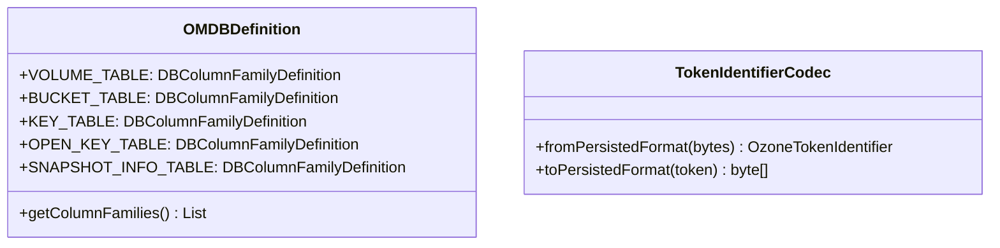

# om / om-codecs

_This feature page was generated from `study/atlas/components/om/om-codecs.md`. Author prose belongs above or below the BEGIN/END markers._

{/* BEGIN atlas-generated */}

**Classes:** 2    **Kinds:** service:1, util:1

## Overview

The `om-codecs` feature contains the OM database schema definition and a token serialization codec. `OMDBDefinition` registers all OM RocksDB column families with their key and value codecs using the `DBDefinition`/`DBColumnFamilyDefinition` framework from `hadoop-hdds/managed-rocksdb`. It defines constants like `DIRECTORY_TABLE`, `KEY_TABLE`, `OPEN_KEY_TABLE`, `SNAPSHOT_INFO_TABLE`, etc., which are referenced throughout the codebase as canonical table names. `OMMetadataManagerImpl` opens the RocksDB using this definition. `TokenIdentifierCodec` serializes and deserializes `OzoneTokenIdentifier` objects for the delegation-token table using protobuf.

## Diagram

## Class table

### Sub-feature: `om.codec`

| reading_order | fqcn | kind | logic | loc | study (min) | role |
|--:|---|---|---|--:|--:|---|
| 514 | <Fqcn>org.apache.hadoop.ozone.om.codec.OMDBDefinition</Fqcn> | service | mixed | 175~ | 45 | OM database definitions. |
| 515 | <Fqcn>org.apache.hadoop.ozone.om.codec.TokenIdentifierCodec</Fqcn> | util | mixed | 25~ | 20 | Codec to serialize/deserialize OzoneTokenIdentifier. |

## Anchor details

_No logic-heavy anchors in this feature; the classes are primarily data / dto / config / cli._

## Design docs

- `hadoop-hdds/docs/content/concept/RocksDB.md` — RocksDB column family layout, used by `OMDBDefinition`

## Seminal JIRAs / PRs

- [HDDS-14037](https://issues.apache.org/jira/browse/HDDS-14037). Create DBDefinition and corresponding MetadataManager for SnapshotDiff DB (followed same pattern as OMDBDefinition)
- TODO(verify) — original OMDBDefinition creation JIRA not identified in recent git log

## Sharp edges

- `OMDBDefinition` column family constants are referenced as string literals in `CleanupTableInfo` annotations on every `OMClientResponse` subclass. Adding a new column family requires updating `OMDBDefinition` and every response class that touches the new table. Missing one will leave stale entries after a snapshot restore or bootstrap.

## Related features

- `components/om/om-server.md` — `OmMetadataManagerImpl` uses `OMDBDefinition` to open the RocksDB
- `components/om/om-security.md` — `TokenIdentifierCodec` is used by `OzoneDelegationTokenSecretManager` for token persistence
- `components/om/om-ratis.md` — `OzoneManagerDoubleBuffer` uses `OMDBDefinition` table names in `CleanupTableInfo`

## Self-quiz

1. `OMDBDefinition` extends `DBDefinition`. What method does `DBDefinition` require that `OMDBDefinition` must implement?
2. `TokenIdentifierCodec` serializes `OzoneTokenIdentifier`. What is the on-disk format and which RocksDB table stores these?
3. A new OM feature needs a new column family. What changes must be made to `OMDBDefinition`?
4. `CleanupTableInfo` annotations on `OMClientResponse` subclasses list table names from `OMDBDefinition`. What is this annotation used for?
5. How does `OmMetadataManagerImpl` use `OMDBDefinition.getColumnFamilies()` when opening the RocksDB?

Answers

Answer 1: `getColumnFamilies()` returning a list of `DBColumnFamilyDefinition` objects — one per RocksDB column family.
Answer 2: Protobuf-serialized bytes (`OzoneTokenIdentifier.toByteArray()`). Stored in `dTokenTable` (delegation token table).
Answer 3: Add a new `DBColumnFamilyDefinition` constant with the table name, key codec, and value codec; add it to the list returned by `getColumnFamilies()`; add a corresponding accessor method.
Answer 4: `CleanupTableInfo` lists which tables a given `OMClientResponse` modifies. `OzoneManagerDoubleBuffer` uses this to know which table caches to invalidate after flushing the response.
Answer 5: It passes the list to `DBStore.getTable(definition)` for each column family definition to get typed table handles at startup.

{/* END atlas-generated */}
