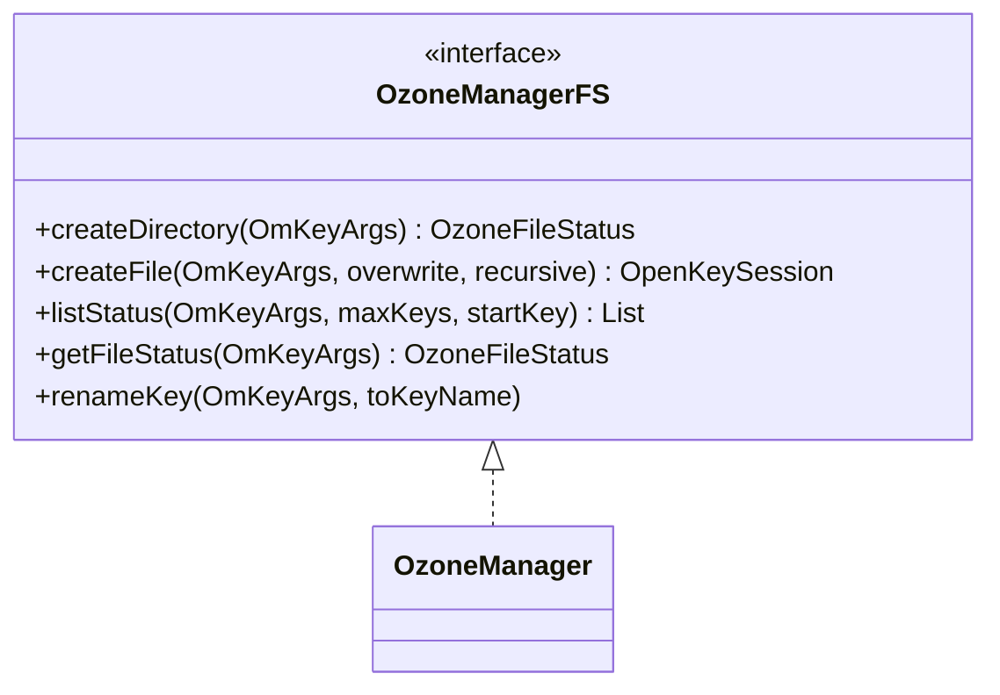

# om / om-fs

_This feature page was generated from `study/atlas/components/om/om-fs.md`. Author prose belongs above or below the BEGIN/END markers._

{/* BEGIN atlas-generated */}

**Classes:** 1    **Kinds:** interface:1

## Overview

The `om-fs` feature contains a single interface `OzoneManagerFS`, which exposes filesystem-level operations that the OFS filesystem (`OzoneFileSystem`) and the `TrashOzoneFileSystem` require from the OM. It defines methods like `createDirectory`, `renameKey`, `createFile`, `listStatus`, and `getFileStatus` using the `OmKeyArgs` abstraction. `OzoneManager` implements this interface (in addition to the main OM protocol interface), providing the OFS client with a type-safe entry point for filesystem semantics on top of the key/volume/bucket namespace.

## Diagram

## Class table

### Sub-feature: `om.fs`

| reading_order | fqcn | kind | logic | loc | study (min) | role |
|--:|---|---|---|--:|--:|---|
| 1428 | <Fqcn>org.apache.hadoop.ozone.om.fs.OzoneManagerFS</Fqcn> | interface | mixed | 25~ | 20 | Ozone Manager FileSystem interface. |

## Anchor details

_No logic-heavy anchors in this feature; the classes are primarily data / dto / config / cli._

## Design docs

- `hadoop-hdds/docs/content/design/ofs.md` — OFS filesystem design, which drives `OzoneManagerFS` method requirements
- `hadoop-hdds/docs/content/interface/Ofs.md` — OFS user documentation

## Seminal JIRAs / PRs

- [HDDS-15678](https://issues.apache.org/jira/browse/HDDS-15678). OFS isDirectory/isFile should not trigger pipeline refresh or return block locations
- TODO(verify) — original `OzoneManagerFS` interface creation JIRA not identified in recent git log

## Sharp edges

- `OzoneManagerFS.listStatus` is a read-only operation but may trigger a pipeline refresh for the returned keys if block locations are requested. `HDDS-15678` changed OFS `isDirectory`/`isFile` to not request block locations to avoid unnecessary SCM calls.

## Related features

- `components/om/om-server.md` — `OzoneManager` and `TrashOzoneFileSystem` implement `OzoneManagerFS`
- `components/om/om-key-manager.md` — `KeyManagerImpl.listStatus` and `getFileStatus` are the actual implementations called via `OzoneManager`

## Self-quiz

1. `OzoneManagerFS` defines `listStatus`. What class in `om-server` implements this method for the trash path?
2. Which client-side filesystem implementation calls `OzoneManagerFS` methods — `O3FileSystem` or `OzoneFileSystem`?
3. `OzoneManagerFS.createFile` returns what type, and how does the caller use this to subsequently commit the key?
4. Why is `OzoneManagerFS` a separate interface from the main OM Protobuf RPC interface?
5. After [HDDS-15678](https://issues.apache.org/jira/browse/HDDS-15678), `isDirectory` on an OFS path no longer triggers a pipeline refresh. What does this prevent?

Answers

Answer 1: `TrashOzoneFileSystem` in `om-server` implements `OzoneManagerFS` for the trash filesystem path.
Answer 2: `OzoneFileSystem` (the OFS client) calls `OzoneManagerFS` methods directly via the RPC layer; `O3FileSystem` uses the older S3-compat path.
Answer 3: It returns `OpenKeySession` containing the `OmKeyInfo` with pre-allocated blocks. The caller uses the session's `getId()` as the clientId to subsequently call `commitKey`.
Answer 4: It provides a cleaner interface for filesystem-semantic callers (OFS, trash) that need directory/file abstractions, separating them from the general OM request protocol.
Answer 5: It prevents unnecessary `GetPipeline` calls to SCM for every `stat` on a directory, which would load the SCM with reads on large directory trees.

{/* END atlas-generated */}
