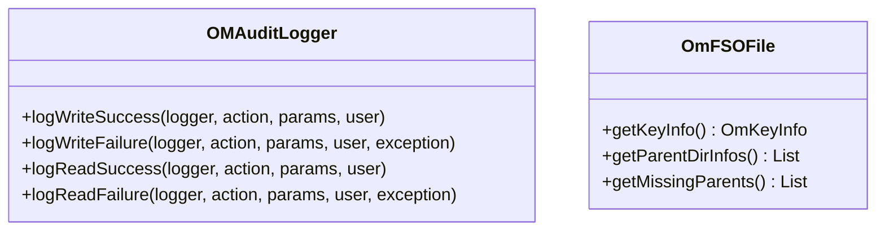

# om / om-helpers

_This feature page was generated from `study/atlas/components/om/om-helpers.md`. Author prose belongs above or below the BEGIN/END markers._

{/* BEGIN atlas-generated */}

**Classes:** 2    **Kinds:** service:2

## Overview

The `om-helpers` feature contains two utility helpers used inside OM request classes. `OMAuditLogger` wraps the `AuditLogger` framework to provide a single `logWriteSuccess`, `logWriteFailure`, `logReadSuccess`, and `logReadFailure` API with standard message construction, reused by many request and response classes. `OmFSOFile` is a helper for FSO-bucket file creation: it bundles the directory path components needed to create parent directories along with the file key, simplifying the interface between `OMFileCreateRequestWithFSO` and the metadata manager when a `createFile` call requires intermediate directory creation.

## Diagram

## Class table

### Sub-feature: `om.helpers`

| reading_order | fqcn | kind | logic | loc | study (min) | role |
|--:|---|---|---|--:|--:|---|
| 1429 | <Fqcn>org.apache.hadoop.ozone.om.helpers.OMAuditLogger</Fqcn> | service | mixed | 150~ | 45 | This class is used for OM Audit logs. |
| 1430 | <Fqcn>org.apache.hadoop.ozone.om.helpers.OmFSOFile</Fqcn> | service | mixed | 100~ | 30 | This class is used exclusively in FSO buckets.. |

## Anchor details

_No logic-heavy anchors in this feature; the classes are primarily data / dto / config / cli._

## Design docs

- no dedicated design doc for these helpers under `hadoop-hdds/docs/content/` on this branch

## Seminal JIRAs / PRs

- TODO(verify) — these helpers are internal utilities; JIRA coverage is distributed across requests that use them

## Sharp edges

- `OMAuditLogger` logs the `user` field from `UserGroupInformation.getCurrentUser()` at the time of the call. In a Ratis-applied context, the current UGI may be the OM service user rather than the original client, leading to incorrect user attribution in audit logs if not explicitly overridden.

## Related features

- `components/om/om-audit.md` — `OMAction` and `OMSystemAction` enums used with `OMAuditLogger`
- `components/om/om-request-file.md` — `OMFileCreateRequestWithFSO` uses `OmFSOFile`

## Self-quiz

1. `OMAuditLogger.logWriteSuccess` takes an `AuditAction`. What two enum types are valid values?
2. `OmFSOFile.getParentDirInfos()` returns a list. What does this list contain and when is it non-empty?
3. Both `OMAuditLogger` methods are static. Why is this appropriate here?
4. Where is `OmFSOFile` constructed — in `preExecute` or in `validateAndUpdateCache`?
5. `OMAuditLogger.logWriteFailure` takes an `Exception`. What happens to this exception after logging?

Answers

Answer 1: `OMAction` (for user-visible write operations) and `OMSystemAction` (for system operations, though these are rarely passed to `logWriteSuccess`).
Answer 2: `OmDirectoryInfo` entries for parent directories that were created as part of the `createFile` call with `recursive=true`. It is non-empty when the file path has intermediate directories that do not yet exist.
Answer 3: Audit logging has no mutable state; the logger is parameterized by the `AuditLogger` instance which is already held by the calling class. Static methods avoid the overhead of constructing a helper object per request.
Answer 4: inferred: `OmFSOFile` is constructed during `validateAndUpdateCache` in `OMFileRequest` after the directory lookup has resolved the path components.
Answer 5: The exception is logged and then the method returns; the exception is not re-thrown. The caller is responsible for returning an error `OMClientResponse`.

{/* END atlas-generated */}
