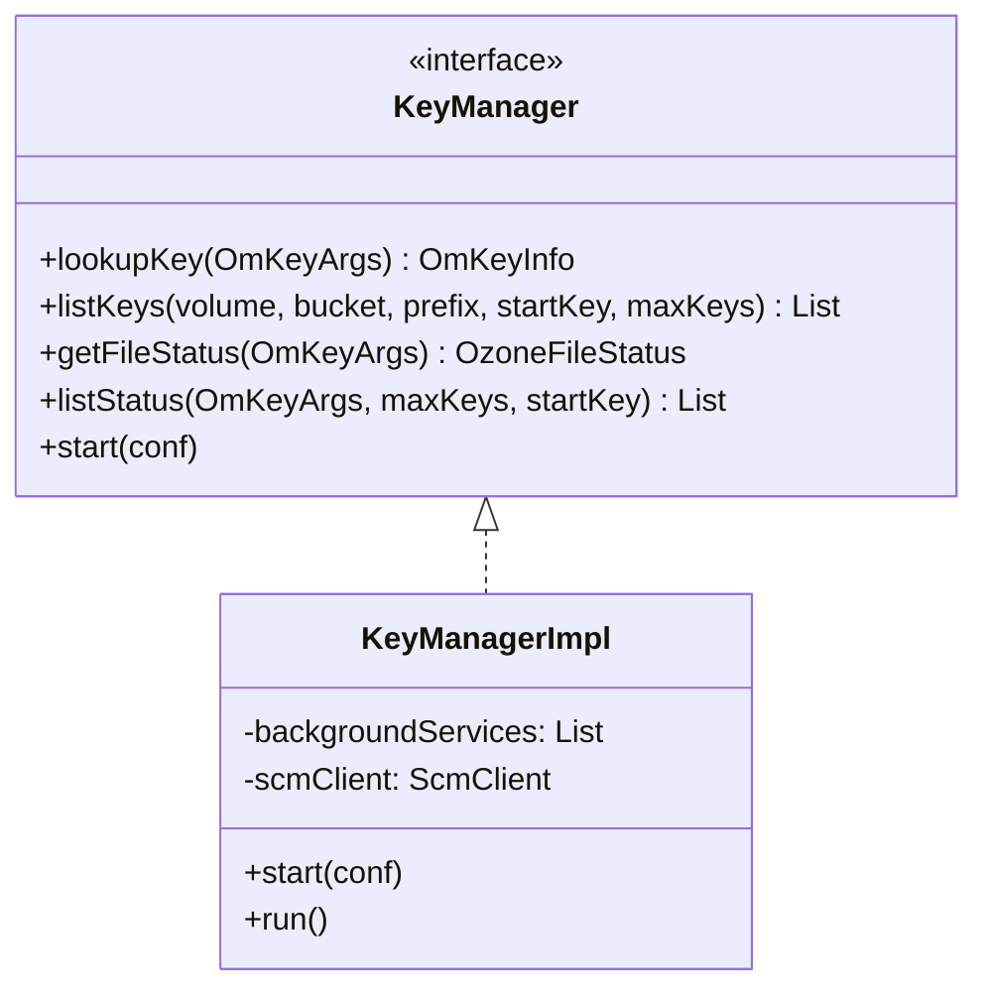

# om / om-key-manager

_This feature page was generated from `study/atlas/components/om/om-key-manager.md`. Author prose belongs above or below the BEGIN/END markers._

{/* BEGIN atlas-generated */}

**Classes:** 2    **Kinds:** interface:1, service:1

## Overview

The `om-key-manager` feature holds the `KeyManager` interface and its sole implementation `KeyManagerImpl`. `KeyManager` defines all read-path key operations — `lookupKey`, `listKeys`, `listOpenFiles`, `getFileStatus`, `listStatus`, `allocateBlock`, `generateS3SecretKey`, and related helpers. `KeyManagerImpl` implements these by reading from `OMMetadataManager` (RocksDB) and, for read-heavy list operations, merging the RocksDB table cache with the persisted table via `ListIterator`. It also manages the lifecycle of `BackgroundService` instances (key deleting, directory deleting, snapshot deleting, MPU cleanup, compaction, open-key cleanup, lifecycle service) via its `start()` method, making it the orchestrator for all background tasks. Block allocation calls to SCM happen in `allocateBlock`, which contacts `ScmBlockLocationProtocol` and returns `ContainerBlockID` assignments. Streaming writes use `sortDatanodes` logic moved to OM in [HDDS-15059](https://issues.apache.org/jira/browse/HDDS-15059).

## Diagram

## Class table

### Sub-feature: `ozone.om`

| reading_order | fqcn | kind | logic | loc | study (min) | role |
|--:|---|---|---|--:|--:|---|
| 468 | <Fqcn>org.apache.hadoop.ozone.om.KeyManager</Fqcn> | interface | mixed | 75~ | 20 | Handles key level commands. |
| 469 | <Fqcn>org.apache.hadoop.ozone.om.KeyManagerImpl</Fqcn> | service | logic-heavy | 1850~ | 60 | Implementation of keyManager. |

## Anchor details

### `KeyManagerImpl`

- **path:** `hadoop-ozone/ozone-manager/src/main/java/org/apache/hadoop/ozone/om/KeyManagerImpl.java`
- **loc:** 1850~    **difficulty:** 5    **study:** 60 min    **concurrency:** single-threaded    **persistence:** in-memory
- **entry points:** `start`, `run`
- **key collaborators:** `org.apache.hadoop.hdds.client.BlockID`, `org.apache.hadoop.hdds.client.ReplicationConfig`, `org.apache.hadoop.hdds.conf.OzoneConfiguration`, `org.apache.hadoop.hdds.protocol.DatanodeDetails`, `org.apache.hadoop.hdds.scm.ScmConfigKeys`, `org.apache.hadoop.hdds.scm.container.common.helpers.ContainerWithPipeline`
- **test exemplar:** `hadoop-ozone/integration-test/src/test/java/org/apache/hadoop/ozone/om/TestKeyManagerImpl.java`
- **role:** Primary read-path and background-service orchestrator for key-level operations in the OM.

The `start()` method instantiates and starts all background services with configured intervals and thread pools. `lookupKey` acquires a bucket read lock, looks up the key in the cache-merged table, and returns the `OmKeyInfo`. `listStatus` for FSO buckets performs a path traversal in the directory tree to find immediate children. The etag field on `OmKeyInfo` is set at commit time; `fileName` inconsistency between cache and DB was a known hazard ([HDDS-13982](https://issues.apache.org/jira/browse/HDDS-13982)).

## Design docs

- `hadoop-hdds/docs/content/design/namespace-support.md` — FSO namespace and key listing design
- no dedicated design doc specifically for `KeyManagerImpl` under `hadoop-hdds/docs/content/` on this branch

## Seminal JIRAs / PRs

- [HDDS-13982](https://issues.apache.org/jira/browse/HDDS-13982). OmKeyInfo fileName possible inconsistency between cache and DB
- [HDDS-15059](https://issues.apache.org/jira/browse/HDDS-15059). Shift streaming write sortDatanodes logic to OM
- [HDDS-14661](https://issues.apache.org/jira/browse/HDDS-14661). Handle split table writes for Multipart Upload
- [HDDS-15740](https://issues.apache.org/jira/browse/HDDS-15740). Validate partNumber on GetObject and return InvalidPart for out-of-range parts

## Sharp edges

- `KeyManagerImpl.lookupKey` merges the RocksDB write-through cache with the persisted table; the cache is ephemeral and lost on OM restart. After a crash, until the Ratis log is fully replayed, a `lookupKey` may return stale data or `KEY_NOT_FOUND` even if the key commit was in the Raft log.
- `fileName` on `OmKeyInfo` stored in cache can diverge from what is stored in RocksDB if a rename is applied to the persistent table but the cache entry is not invalidated ([HDDS-13982](https://issues.apache.org/jira/browse/HDDS-13982)).

## Related features

- `components/om/om-background-services.md` — `KeyManagerImpl.start()` spawns all background services
- `components/om/om-request-key.md` — write-path key requests that modify the tables read by `KeyManagerImpl`
- `components/om/om-server.md` — `OzoneManager` holds a `KeyManagerImpl` instance and delegates read calls to it

## Self-quiz

1. `KeyManagerImpl.start()` starts several background services. Name three of them and identify their corresponding service classes.
2. When `lookupKey` is called for an FSO bucket, what additional lookup step is required compared to an OBS bucket?
3. Which SCM protocol does `KeyManagerImpl.allocateBlock` call, and what does it receive in response?
4. What is the invariant about `fileName` in `OmKeyInfo` and which JIRA documented the inconsistency?
5. `listStatus` for FSO buckets performs a directory tree traversal. What table(s) does it scan and what is the key format?

Answers

Answer 1: `KeyDeletingService`, `DirectoryDeletingService`, `OpenKeyCleanupService` (others include `MultipartUploadCleanupService`, `CompactionService`, `SnapshotDeletingService`, `KeyLifecycleService`).
Answer 2: For FSO, the key is stored in `fileTable` under a parent directory inode ID, so `lookupKey` must first resolve the path components to find the parent directory's object ID, then look up the key in `fileTable` by `parentId/fileName`.
Answer 3: It calls `ScmBlockLocationProtocol.allocateBlock()` and receives a list of `AllocatedBlock` objects, each containing a `ContainerBlockID` and pipeline info.
Answer 4: `fileName` should match the last path component in the key name. [HDDS-13982](https://issues.apache.org/jira/browse/HDDS-13982) documented a case where renaming a key updated the key name in the persistent table but the cache entry still held the old `fileName`.
Answer 5: It scans `directoryTable` and `fileTable` using the prefix `volumeId/bucketId/parentId/` to list immediate children of the directory at the given path.

{/* END atlas-generated */}
