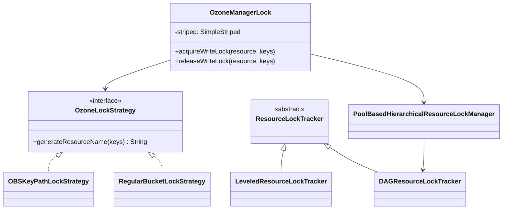

# om / om-locking

_This feature page was generated from `study/atlas/components/om/om-locking.md`. Author prose belongs above or below the BEGIN/END markers._

{/* BEGIN atlas-generated */}

**Classes:** 11    **Kinds:** service:9, interface:1, abstract:1

## Overview

The `om-locking` feature provides a hierarchical, striped read-write locking scheme that serializes concurrent OM requests. `OzoneManagerLock` is the central class: it enforces a weight-ordered locking hierarchy (S3-bucket=0, volume=1, bucket=2, user=3, S3-secret=4, prefix=5) using `SimpleStriped<ReentrantReadWriteLock>` from Guava to reduce contention while preventing lock inversion. Each resource type uses a strategy pattern: `OBSKeyPathLockStrategy` hashes a volume+bucket+key path, while `RegularBucketLockStrategy` hashes just volume+bucket. `PoolBasedHierarchicalResourceLockManager` manages DAG-level resources (snapshot GC lock, etc.) using a reusable pool of `ReadWriteLock` instances. `OmReadOnlyLock` is a no-op implementation used for snapshot read paths where no locking is needed. `LeveledResourceLockTracker` is a per-request singleton that records which locks have been acquired, enabling deterministic release ordering.

## Diagram

## Class table

### Sub-feature: `om.lock`

| reading_order | fqcn | kind | logic | loc | study (min) | role |
|--:|---|---|---|--:|--:|---|
| 503 | <Fqcn>org.apache.hadoop.ozone.om.lock.OzoneLockStrategy</Fqcn> | interface | mixed | 25~ | 20 | This is a common strategy interface for all concrete lock strategies. |
| 504 | <Fqcn>org.apache.hadoop.ozone.om.lock.ResourceLockTracker</Fqcn> | abstract | mixed | 25~ | 30 | Abstract class that tracks resource locks based on a generic resource type. |
| 505 | <Fqcn>org.apache.hadoop.ozone.om.lock.OzoneManagerLock</Fqcn> | service | logic-heavy | 375~ | 45 | Provides different locks to handle concurrency in OzoneMaster. |
| 506 | <Fqcn>org.apache.hadoop.ozone.om.lock.PoolBasedHierarchicalResourceLockManager</Fqcn> | service | mixed | 175~ | 45 | A lock manager implementation that manages hierarchical resource locks using a pool of reusable ReadWriteLock instances. |
| 507 | <Fqcn>org.apache.hadoop.ozone.om.lock.DAGResourceLockTracker</Fqcn> | service | mixed | 100~ | 30 | Specialized implementation of ResourceLockTracker to manage locks for DAGLeveledResource types. |
| 508 | <Fqcn>org.apache.hadoop.ozone.om.lock.OmReadOnlyLock</Fqcn> | service | mixed | 75~ | 30 | Read only "lock" for snapshots Uses no lock. |
| 509 | <Fqcn>org.apache.hadoop.ozone.om.lock.OBSKeyPathLockStrategy</Fqcn> | service | mixed | 50~ | 30 | Implementation of OzoneLockStrategy interface. |
| 510 | <Fqcn>org.apache.hadoop.ozone.om.lock.ReadOnlyHierarchicalResourceLockManager</Fqcn> | service | mixed | 50~ | 30 | A read only lock manager that does not acquire any lock. |
| 511 | <Fqcn>org.apache.hadoop.ozone.om.lock.LeveledResourceLockTracker</Fqcn> | service | mixed | 50~ | 30 | The LeveledResourceLockTracker class is a singleton that extends the ResourceLockTracker to manage locks on leveled r... |
| 512 | <Fqcn>org.apache.hadoop.ozone.om.lock.RegularBucketLockStrategy</Fqcn> | service | mixed | 25~ | 30 | Implementation of OzoneLockStrategy interface. |
| 513 | <Fqcn>org.apache.hadoop.ozone.om.lock.OzoneLockProvider</Fqcn> | service | mixed | 25~ | 30 | OzoneLockProvider class returns the appropriate lock strategy pattern implementation based on the configuration flags... |

## Anchor details

### `OzoneManagerLock`

- **path:** `hadoop-ozone/ozone-manager/src/main/java/org/apache/hadoop/ozone/om/lock/OzoneManagerLock.java`
- **loc:** 375~    **difficulty:** 4    **study:** 45 min    **concurrency:** thread-safe    **persistence:** in-memory
- **key collaborators:** `org.apache.hadoop.hdds.conf.ConfigurationSource`, `org.apache.hadoop.hdds.utils.CompositeKey`, `org.apache.hadoop.hdds.utils.SimpleStriped`
- **test exemplar:** `hadoop-ozone/ozone-manager/src/test/java/org/apache/hadoop/ozone/om/lock/TestOzoneManagerLock.java`
- **role:** Provides different locks to handle concurrency in OzoneMaster.

The lock weight table is encoded directly in the `LeveledResource` enum (weight 0–5). `acquireWriteLock(resource, keys)` calls `OzoneLockProvider.getLockStrategy(resource)` to obtain the correct strategy, then uses `SimpleStriped` to get the actual `ReentrantReadWriteLock`. The class tracks per-resource lock timing in `OMLockDetails` and updates `OMLockMetrics` on release, producing per-resource wait-time histograms. Striped lock size is configurable per resource type via `OZONE_MANAGER_STRIPED_LOCK_SIZE_PREFIX` ([HDDS-8765](https://issues.apache.org/jira/browse/HDDS-8765)).

## Design docs

- `hadoop-hdds/docs/content/design/locks.md` — design document for the OM locking scheme including hierarchy and striping

## Seminal JIRAs / PRs

- [HDDS-6581](https://issues.apache.org/jira/browse/HDDS-6581). Introduce KEY_PATH_LOCK in OMKeyCreateRequest class
- [HDDS-6583](https://issues.apache.org/jira/browse/HDDS-6583). Introduce lock strategy pattern implementations based on configuration flags
- [HDDS-8765](https://issues.apache.org/jira/browse/HDDS-8765). OzoneManagerLock to use striped locks to improve performance
- [HDDS-8974](https://issues.apache.org/jira/browse/HDDS-8974). Introduce detailed lock information (OMLockDetails)
- [HDDS-13076](https://issues.apache.org/jira/browse/HDDS-13076). Refactor OzoneManagerLock class to rename Resource class to LeveledResource
- [HDDS-15907](https://issues.apache.org/jira/browse/HDDS-15907). Do not use Collection in IOzoneManagerLock
- [HDDS-15909](https://issues.apache.org/jira/browse/HDDS-15909). Refactor OzoneManagerLock

## Sharp edges

- Locks must be acquired in weight order (S3-bucket &lt; volume &lt; bucket &lt; user &lt; S3-secret &lt; prefix). Acquiring a lower-weight lock after a higher-weight lock in the same request thread is detected at runtime and throws an exception — but only when assertions are enabled; in production the deadlock is silent ([HDDS-7755](https://issues.apache.org/jira/browse/HDDS-7755)).
- `OmReadOnlyLock` acquires no lock at all. Snapshot read paths that use it assume the snapshot RocksDB is immutable; any write to a snapshot DB from outside this assumption would be undetected.

## Related features

- `components/om/interface-storage.md` — `IOzoneManagerLock` interface and `DAGLeveledResource` enum defined here
- `components/om/om-request-key.md` — `OMKeyRequest` acquires bucket lock before `validateAndUpdateCache`
- `components/om/om-snapshot.md` — `MultiSnapshotLocks` wraps `OzoneManagerLock` for multi-snapshot operations

## Self-quiz

1. What weight order does `OzoneManagerLock` assign to volume lock versus bucket lock, and why does that order matter for `OMKeyRequest`?
2. `OBSKeyPathLockStrategy` and `RegularBucketLockStrategy` differ in how they compute the lock stripe. What is the key difference and when is each used?
3. `OmReadOnlyLock` implements `IOzoneManagerLock` but acquires no lock. Under what condition is it safe to use it and how does `OzoneManager` select it?
4. How does `OzoneManagerLock` expose per-resource wait-time metrics, and which class holds those metric counters?
5. What happens at runtime if a request thread tries to acquire a volume lock while already holding a bucket lock in the same `OzoneManagerLock` instance?

Answers

Answer 1: Volume lock weight=1, bucket lock weight=2. A key request must acquire volume first (to validate the volume exists) then bucket (to validate the bucket). Reversing the order on any code path would create a lock inversion with another request acquiring them in the correct order.
Answer 2: `OBSKeyPathLockStrategy` hashes volume+bucket+key together, giving key-level granularity for OBS buckets; `RegularBucketLockStrategy` hashes only volume+bucket. `OzoneLockProvider` selects the strategy based on whether the bucket is OBS with `KEY_PATH_LOCK` configured.
Answer 3: When `OmSnapshot` is opened, `OzoneManager.getOmSnapshot()` returns an `OmSnapshot` whose metadata manager uses `OmReadOnlyLock`. It is safe because the snapshot RocksDB file is written once at snapshot creation and never mutated.
Answer 4: `OzoneManagerLock.acquireWriteLock` records start time in `OMLockDetails`; on `releaseWriteLock` it computes the hold duration and updates `OMLockMetrics` histograms.
Answer 5: An assertion failure (or explicit check) throws `RuntimeException: cannot acquire lock of weight X when lock of weight Y is already held`. See the weight-checking logic in `OzoneManagerLock.acquireLock`.

{/* END atlas-generated */}
