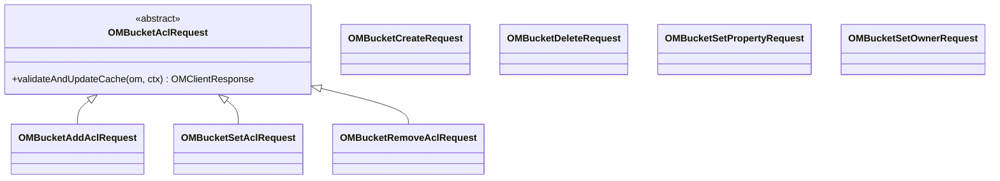

# om / om-request-bucket

_This feature page was generated from `study/atlas/components/om/om-request-bucket.md`. Author prose belongs above or below the BEGIN/END markers._

{/* BEGIN atlas-generated */}

**Classes:** 8    **Kinds:** dto:7, abstract:1

## Overview

The `om-request-bucket` feature contains write-path Ratis request classes for all bucket-level operations. `OMBucketCreateRequest` validates bucket name, verifies the parent volume exists, acquires a volume+bucket write lock, and writes `OmBucketInfo` to `bucketTable`. `OMBucketDeleteRequest` checks that the bucket is empty before removing it. `OMBucketSetPropertyRequest` updates mutable bucket properties (quota, encryption key, versioning, replication config). `OMBucketSetOwnerRequest` changes the bucket owner field. The ACL subpackage provides `OMBucketAclRequest` as an abstract base for bucket ACL operations (`add`, `set`, `remove`). All classes follow the two-method pattern: `preExecute` for validation, `validateAndUpdateCache` for the cache/DB update.

## Diagram

## Class table

### Sub-feature: `bucket.acl`

| reading_order | fqcn | kind | logic | loc | study (min) | role |
|--:|---|---|---|--:|--:|---|
| 485 | <Fqcn>org.apache.hadoop.ozone.om.request.bucket.acl.OMBucketAclRequest</Fqcn> | abstract | mixed | 100~ | 30 | Base class for Bucket acl request. |
| 486 | <Fqcn>org.apache.hadoop.ozone.om.request.bucket.acl.OMBucketAddAclRequest</Fqcn> | dto | data-only | 75~ | 10 | Handle add Acl request for bucket. |
| 487 | <Fqcn>org.apache.hadoop.ozone.om.request.bucket.acl.OMBucketSetAclRequest</Fqcn> | dto | data-only | 75~ | 10 | Handle setAcl request for bucket. |
| 488 | <Fqcn>org.apache.hadoop.ozone.om.request.bucket.acl.OMBucketRemoveAclRequest</Fqcn> | dto | data-only | 75~ | 10 | Handle removeAcl request for bucket. |

### Sub-feature: `request.bucket`

| reading_order | fqcn | kind | logic | loc | study (min) | role |
|--:|---|---|---|--:|--:|---|
| 489 | <Fqcn>org.apache.hadoop.ozone.om.request.bucket.OMBucketCreateRequest</Fqcn> | dto | logic-heavy | 325~ | 10 | Handles CreateBucket Request. |
| 490 | <Fqcn>org.apache.hadoop.ozone.om.request.bucket.OMBucketSetPropertyRequest</Fqcn> | dto | logic-heavy | 250~ | 10 | Handle SetBucketProperty Request. |
| 491 | <Fqcn>org.apache.hadoop.ozone.om.request.bucket.OMBucketDeleteRequest</Fqcn> | dto | data-only | 175~ | 10 | Handles DeleteBucket Request. |
| 492 | <Fqcn>org.apache.hadoop.ozone.om.request.bucket.OMBucketSetOwnerRequest</Fqcn> | dto | data-only | 125~ | 10 | Handle set owner request for bucket. |

## Anchor details

_No logic-heavy anchors in this feature; the classes are primarily data / dto / config / cli._

## Design docs

- `hadoop-hdds/docs/content/concept/VolumesBucketsKeys.md` — volume/bucket/key namespace
- `hadoop-hdds/docs/content/security/SecurityAcls.md` — ACL model used by bucket ACL request classes

## Seminal JIRAs / PRs

- [HDDS-8511](https://issues.apache.org/jira/browse/HDDS-8511). Enforce strict S3-compliant name for object store buckets
- [HDDS-14111](https://issues.apache.org/jira/browse/HDDS-14111). Make OmBucketInfo ACL list immutable
- [HDDS-14207](https://issues.apache.org/jira/browse/HDDS-14207). Inconsistent Ozone admin check (affected bucket operations)

## Sharp edges

- `OMBucketDeleteRequest` checks bucket emptiness by verifying no keys exist in `keyTable` (OBS) or `fileTable`/`directoryTable` (FSO). This check is non-atomic with the delete: between the check and the Ratis commit, a concurrent key creation could succeed, resulting in a deleted-but-non-empty bucket with orphaned keys.

## Related features

- `components/om/om-bucket-manager.md` — `BucketManagerImpl` provides the read path; write path is here
- `components/om/om-request-volume.md` — parent volume must exist; `OMVolumeRequest` provides volume lock helpers

## Self-quiz

1. `OMBucketCreateRequest.preExecute` enforces S3-compliant naming for OBS buckets. What does this check and which JIRA added it?
2. `OMBucketDeleteRequest` verifies the bucket is empty. Which tables does it check for FSO vs OBS buckets?
3. `OMBucketSetPropertyRequest` can update quotas. What constraints does it validate on the new quota value?
4. What locks does `OMBucketCreateRequest.validateAndUpdateCache` acquire and in what order?
5. `OMBucketAclRequest.validateAndUpdateCache` updates the ACL list in `OmBucketInfo`. Where is this info persisted?

Answers

Answer 1: For OBS buckets, the bucket name must not contain `/` or start with `.`. [HDDS-8511](https://issues.apache.org/jira/browse/HDDS-8511) added strict S3-compliant name validation.
Answer 2: For OBS, it checks `keyTable` prefix `volumeName/bucketName/`. For FSO, it checks `directoryTable` and `fileTable` using the bucket's `objectID` as the parent scope.
Answer 3: The new quota must be &gt;= current usage. Setting quota to -1 (unlimited) is always allowed. Setting quota lower than current usage is rejected with `QUOTA_EXCEEDS_AVAILABLE_STORAGE`.
Answer 4: Volume read lock first (`VOLUME_LOCK`, volumeName), then bucket write lock (`BUCKET_LOCK`, volumeName, bucketName) — in weight order.
Answer 5: The updated `OmBucketInfo` is written to `bucketTable` in the `validateAndUpdateCache` batch operation.

{/* END atlas-generated */}
