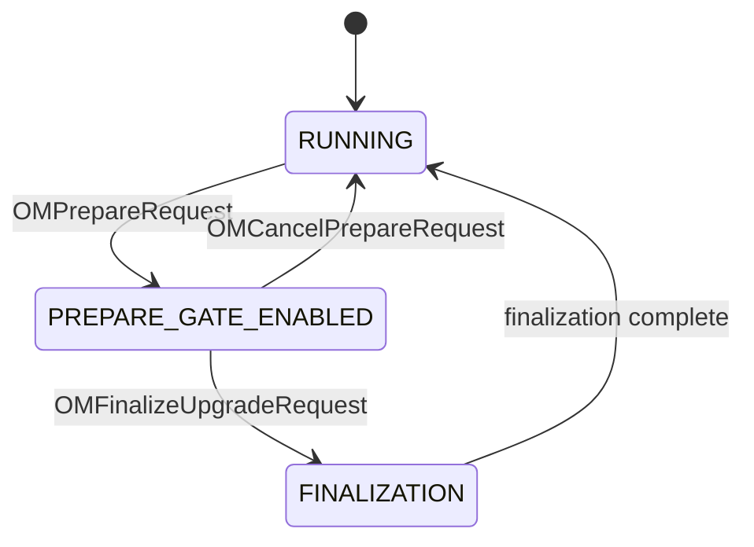

# om / om-request-upgrade

_This feature page was generated from `study/atlas/components/om/om-request-upgrade.md`. Author prose belongs above or below the BEGIN/END markers._

{/* BEGIN atlas-generated */}

**Classes:** 3    **Kinds:** dto:3

## Overview

The `om-request-upgrade` feature contains the three Ratis request classes needed for OM upgrades. `OMPrepareRequest` implements the prepare phase: it flushes all pending transactions to RocksDB, takes a DB snapshot, and purges the Raft log, leaving the OM in a clean state for upgrade. While prepared, only upgrade-related requests are accepted. `OMCancelPrepareRequest` cancels prepare mode and resumes normal operations. `OMFinalizeUpgradeRequest` triggers layout-version finalization, running all registered `OmUpgradeAction` handlers and advancing `OMLayoutFeature` to the final version. These requests are issued by `ozone admin om prepare` / `finalize` CLI commands.

## Diagram

## Class table

### Sub-feature: `request.upgrade`

| reading_order | fqcn | kind | logic | loc | study (min) | role |
|--:|---|---|---|--:|--:|---|
| 1469 | <Fqcn>org.apache.hadoop.ozone.om.request.upgrade.OMPrepareRequest</Fqcn> | dto | data-only | 150~ | 10 | OM Request used to flush all transactions to disk, take a DB snapshot, and purge the logs, leaving Ratis in a clean s... |
| 1470 | <Fqcn>org.apache.hadoop.ozone.om.request.upgrade.OMCancelPrepareRequest</Fqcn> | dto | data-only | 50~ | 10 | OM request class to cancel preparation. |
| 1471 | <Fqcn>org.apache.hadoop.ozone.om.request.upgrade.OMFinalizeUpgradeRequest</Fqcn> | dto | data-only | 50~ | 10 | Handles finalizeUpgrade request. |

## Anchor details

_No logic-heavy anchors in this feature; the classes are primarily data / dto / config / cli._

## Design docs

- `hadoop-hdds/docs/content/design/omprepare.md` — OM prepare mode design
- `hadoop-hdds/docs/content/design/nonrolling-upgrade.md` — OM upgrade finalization flow

## Seminal JIRAs / PRs

- [HDDS-14347](https://issues.apache.org/jira/browse/HDDS-14347). Handle upgrades to support S3 lifecycle (OMFinalizeUpgradeRequest used for lifecycle)
- [HDDS-14569](https://issues.apache.org/jira/browse/HDDS-14569). Remove support for upgrade actions that run outside of finalization
- [HDDS-14568](https://issues.apache.org/jira/browse/HDDS-14568). Remove unused LayoutVersionInstanceFactory from the upgrade framework
- [HDDS-11866](https://issues.apache.org/jira/browse/HDDS-11866). Remove code paths for non-Ratis OM

## Sharp edges

- `OMPrepareRequest.validateAndUpdateCache` pauses `OzoneManagerDoubleBuffer` and flushes all pending writes before taking the snapshot. This is a blocking operation on the Ratis apply thread — no other requests are processed until prepare completes. A large pending write queue can cause significant latency.
- While in prepare mode, `OzoneManagerStateMachine.applyTransaction` rejects all non-upgrade requests with `NOT_SUPPORTED_OPERATION`. Any in-flight client requests at prepare time will fail and must be retried after finalization.

## Related features

- `components/om/om-upgrade.md` — `OMLayoutFeature`, `OMLayoutVersionManager`, and `OmUpgradeAction` used during finalization
- `components/om/om-ratis.md` — `OzoneManagerDoubleBuffer` is paused by `OMPrepareRequest`
- `components/om/om-server.md` — `OzoneManagerPrepareState` tracks the prepare state

## Self-quiz

1. `OMPrepareRequest` pauses `OzoneManagerDoubleBuffer`. What does this do and why is it necessary before prepare?
2. While in prepare mode, what happens to normal write requests like `CreateKey`?
3. `OMFinalizeUpgradeRequest` triggers `OmUpgradeAction` handlers. Where are these handlers registered?
4. After `OMCancelPrepareRequest`, is the prepare snapshot deleted?
5. `OMPrepareRequest` purges the Raft log. Why is this important for upgrade safety?

Answers

Answer 1: Pausing `OzoneManagerDoubleBuffer` stops it from flushing new batches, allowing all pending entries to drain. Once paused, `OMPrepareRequest` takes a RocksDB snapshot of the fully-flushed state.
Answer 2: They are rejected with `OMException(NOT_SUPPORTED_OPERATION)` by the prepare gate in `OzoneManagerStateMachine.applyTransaction`. Clients must retry after finalization.
Answer 3: They are annotated with `@UpgradeActionOm` and discovered via reflection by `OMLayoutVersionManager`. Each handler is associated with a specific `OMLayoutFeature` version.
Answer 4: inferred: the prepare snapshot remains but the prepare gate is cleared, so normal operation resumes. The snapshot directory is eventually cleaned up.
Answer 5: Purging the Raft log ensures that a newly-joined follower bootstrapping after upgrade will not replay old pre-upgrade entries that might not be compatible with the new layout version.

{/* END atlas-generated */}
