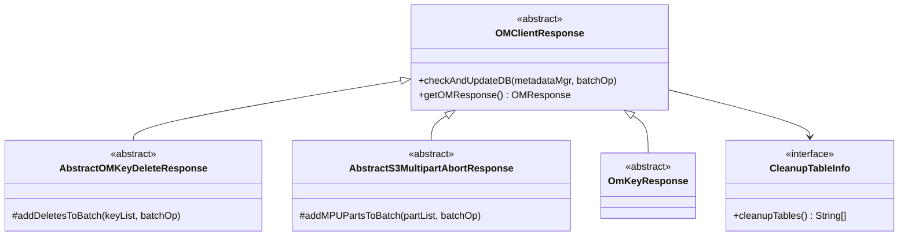

# om / om-response

_This feature page was generated from `study/atlas/components/om/om-response.md`. Author prose belongs above or below the BEGIN/END markers._

{/* BEGIN atlas-generated */}

**Classes:** 84    **Kinds:** dto:62, service:17, abstract:4, interface:1

## Overview

The `om-response` feature contains the 84 `OMClientResponse` implementation classes — one per request type, plus abstract bases. Every `OMClientResponse` subclass implements `checkAndUpdateDB(OMMetadataManager, BatchOperation)`, which is called by `OzoneManagerDoubleBuffer` to apply the request's side effects to RocksDB. The `@CleanupTableInfo` annotation on each class lists the column family names that the response writes to, enabling `OzoneManagerDoubleBuffer` to invalidate the correct table caches after flush. Abstract bases factor out shared logic: `AbstractOMKeyDeleteResponse` handles the common pattern of moving keys from any table to `deletedTable`; `AbstractS3MultipartAbortResponse` handles moving MPU part keys to the deleted table. The 62 `dto` responses simply call `super.checkAndUpdateDB` with an empty batch (read-only request responses); the 17 `service` responses contain actual write logic.

## Diagram

## Class table

### Sub-feature: `acl.prefix`

| reading_order | fqcn | kind | logic | loc | study (min) | role |
|--:|---|---|---|--:|--:|---|
| 304 | <Fqcn>org.apache.hadoop.ozone.om.response.key.acl.prefix.OMPrefixAclResponse</Fqcn> | dto | data-only | 25~ | 10 | Response for Prefix Acl request. |

### Sub-feature: `bucket.acl`

| reading_order | fqcn | kind | logic | loc | study (min) | role |
|--:|---|---|---|--:|--:|---|
| 305 | <Fqcn>org.apache.hadoop.ozone.om.response.bucket.acl.OMBucketAclResponse</Fqcn> | dto | data-only | 25~ | 10 | Response for Bucket acl request. |

### Sub-feature: `key.acl`

| reading_order | fqcn | kind | logic | loc | study (min) | role |
|--:|---|---|---|--:|--:|---|
| 306 | <Fqcn>org.apache.hadoop.ozone.om.response.key.acl.OMKeyAclResponseWithFSO</Fqcn> | service | mixed | 25~ | 30 | Response for Bucket acl request for prefix layout. |
| 307 | <Fqcn>org.apache.hadoop.ozone.om.response.key.acl.OMKeyAclResponse</Fqcn> | dto | data-only | 25~ | 10 | Response for Bucket acl request. |

### Sub-feature: `om.response`

| reading_order | fqcn | kind | logic | loc | study (min) | role |
|--:|---|---|---|--:|--:|---|
| 308 | <Fqcn>org.apache.hadoop.ozone.om.response.CleanupTableInfo</Fqcn> | interface | mixed | 25~ | 20 | Annotation to provide information about clean up table information for OMClientResponse. |
| 309 | <Fqcn>org.apache.hadoop.ozone.om.response.OMClientResponse</Fqcn> | abstract | mixed | 25~ | 30 | Interface for OM Responses, each OM response should implement this interface. |
| 310 | <Fqcn>org.apache.hadoop.ozone.om.response.DummyOMClientResponse</Fqcn> | dto | data-only | 25~ | 10 | A dummy OMClientResponse implementation. |

### Sub-feature: `response.bucket`

| reading_order | fqcn | kind | logic | loc | study (min) | role |
|--:|---|---|---|--:|--:|---|
| 311 | <Fqcn>org.apache.hadoop.ozone.om.response.bucket.OMBucketDeleteResponse</Fqcn> | dto | data-only | 50~ | 10 | Response for DeleteBucket request. |
| 312 | <Fqcn>org.apache.hadoop.ozone.om.response.bucket.OMBucketCreateResponse</Fqcn> | dto | data-only | 50~ | 10 | Response for CreateBucket request. |
| 313 | <Fqcn>org.apache.hadoop.ozone.om.response.bucket.OMBucketSetOwnerResponse</Fqcn> | dto | data-only | 25~ | 10 | Response for set owner request. |
| 314 | <Fqcn>org.apache.hadoop.ozone.om.response.bucket.OMBucketSetPropertyResponse</Fqcn> | dto | data-only | 25~ | 10 | Response for SetBucketProperty request. |

### Sub-feature: `response.file`

| reading_order | fqcn | kind | logic | loc | study (min) | role |
|--:|---|---|---|--:|--:|---|
| 315 | <Fqcn>org.apache.hadoop.ozone.om.response.file.OMDirectoryCreateResponseWithFSO</Fqcn> | service | mixed | 75~ | 30 | Response for create directory request. |
| 316 | <Fqcn>org.apache.hadoop.ozone.om.response.file.OMFileCreateResponseWithFSO</Fqcn> | service | mixed | 50~ | 30 | Response for create file request - prefix layout. |
| 317 | <Fqcn>org.apache.hadoop.ozone.om.response.file.OMDirectoryCreateResponse</Fqcn> | dto | data-only | 50~ | 10 | Response for create directory request. |
| 318 | <Fqcn>org.apache.hadoop.ozone.om.response.file.OMRecoverLeaseResponse</Fqcn> | dto | data-only | 25~ | 10 | Performs tasks for RecoverLease request responses. |
| 319 | <Fqcn>org.apache.hadoop.ozone.om.response.file.OMFileCreateResponse</Fqcn> | dto | data-only | 25~ | 10 | Response for crate file request. |

### Sub-feature: `response.key`

| reading_order | fqcn | kind | logic | loc | study (min) | role |
|--:|---|---|---|--:|--:|---|
| 320 | <Fqcn>org.apache.hadoop.ozone.om.response.key.AbstractOMKeyDeleteResponse</Fqcn> | abstract | mixed | 50~ | 30 | Base class for responses that need to move keys from an arbitrary table to the deleted table. |
| 321 | <Fqcn>org.apache.hadoop.ozone.om.response.key.OmKeyResponse</Fqcn> | abstract | mixed | 25~ | 30 | OmKeyResponse. |
| 322 | <Fqcn>org.apache.hadoop.ozone.om.response.key.OMDirectoriesPurgeResponseWithFSO</Fqcn> | service | mixed | 125~ | 30 | Response for OMDirectoriesPurgeRequestWithFSO request. |
| 323 | <Fqcn>org.apache.hadoop.ozone.om.response.key.OMKeysDeleteResponseWithFSO</Fqcn> | service | mixed | 75~ | 30 | Response for DeleteKeys request. |
| 324 | <Fqcn>org.apache.hadoop.ozone.om.response.key.OMKeyRenameResponseWithFSO</Fqcn> | service | mixed | 75~ | 30 | Response for RenameKey request - prefix layout. |
| 325 | <Fqcn>org.apache.hadoop.ozone.om.response.key.OMKeyDeleteResponseWithFSO</Fqcn> | service | mixed | 75~ | 30 | Response for DeleteKey request. |
| 326 | <Fqcn>org.apache.hadoop.ozone.om.response.key.OMKeyCommitResponseWithFSO</Fqcn> | service | mixed | 50~ | 30 | Response for CommitKey request - prefix layout1. |
| 327 | <Fqcn>org.apache.hadoop.ozone.om.response.key.OMKeySetTimesResponseWithFSO</Fqcn> | service | mixed | 25~ | 30 | Response for Bucket acl request for prefix layout. |
| 328 | <Fqcn>org.apache.hadoop.ozone.om.response.key.OMAllocateBlockResponseWithFSO</Fqcn> | service | mixed | 25~ | 30 | Response for AllocateBlock request - prefix layout. |
| 329 | <Fqcn>org.apache.hadoop.ozone.om.response.key.OMKeyCreateResponseWithFSO</Fqcn> | service | mixed | 25~ | 30 | Response for CreateKey request - prefix layout. |
| 330 | <Fqcn>org.apache.hadoop.ozone.om.response.key.OMKeyCommitResponse</Fqcn> | dto | data-only | 100~ | 10 | Response for CommitKey request. |
| 331 | <Fqcn>org.apache.hadoop.ozone.om.response.key.OMKeyPurgeResponse</Fqcn> | dto | data-only | 75~ | 10 | Response for OMKeyPurgeRequest request. |
| 332 | <Fqcn>org.apache.hadoop.ozone.om.response.key.OMKeysDeleteResponse</Fqcn> | dto | data-only | 75~ | 10 | Response for DeleteKey request. |
| 333 | <Fqcn>org.apache.hadoop.ozone.om.response.key.OMKeyRenameResponse</Fqcn> | dto | data-only | 50~ | 10 | Response for RenameKey request. |
| 334 | <Fqcn>org.apache.hadoop.ozone.om.response.key.OMKeysRenameResponse</Fqcn> | dto | data-only | 50~ | 10 | Response for RenameKeys request. |
| 335 | <Fqcn>org.apache.hadoop.ozone.om.response.key.OMKeyCreateResponse</Fqcn> | dto | data-only | 50~ | 10 | Response for CreateKey request. |
| 336 | <Fqcn>org.apache.hadoop.ozone.om.response.key.OMKeyDeleteResponse</Fqcn> | dto | data-only | 50~ | 10 | Response for DeleteKey request. |
| 337 | <Fqcn>org.apache.hadoop.ozone.om.response.key.OMOpenKeysDeleteResponse</Fqcn> | dto | data-only | 25~ | 10 | Handles responses to move open keys from the open key table to the delete table. |
| 338 | <Fqcn>org.apache.hadoop.ozone.om.response.key.OMAllocateBlockResponse</Fqcn> | dto | data-only | 25~ | 10 | Response for AllocateBlock request. |
| 339 | <Fqcn>org.apache.hadoop.ozone.om.response.key.OMKeySetTimesResponse</Fqcn> | dto | data-only | 25~ | 10 | Response for Bucket acl request. |

### Sub-feature: `response.lifecycle`

| reading_order | fqcn | kind | logic | loc | study (min) | role |
|--:|---|---|---|--:|--:|---|
| 340 | <Fqcn>org.apache.hadoop.ozone.om.response.lifecycle.OMLifecycleSetServiceStatusResponse</Fqcn> | dto | data-only | 25~ | 10 | Response for SetLifecycleServiceStatus request. |
| 341 | <Fqcn>org.apache.hadoop.ozone.om.response.lifecycle.OMLifecycleConfigurationDeleteResponse</Fqcn> | dto | data-only | 25~ | 10 | Response for SetLifecycleConfiguration request. |
| 342 | <Fqcn>org.apache.hadoop.ozone.om.response.lifecycle.OMLifecycleSaveScanStateResponse</Fqcn> | dto | data-only | 25~ | 10 | Response for SaveLifecycleScanState request. |
| 343 | <Fqcn>org.apache.hadoop.ozone.om.response.lifecycle.OMLifecycleConfigurationSetResponse</Fqcn> | dto | data-only | 25~ | 10 | Response for SetLifecycleConfiguration request. |

### Sub-feature: `response.security`

| reading_order | fqcn | kind | logic | loc | study (min) | role |
|--:|---|---|---|--:|--:|---|
| 344 | <Fqcn>org.apache.hadoop.ozone.om.response.security.OMGetDelegationTokenResponse</Fqcn> | dto | data-only | 25~ | 10 | Handle response for GetDelegationToken request. |
| 345 | <Fqcn>org.apache.hadoop.ozone.om.response.security.OMRenewDelegationTokenResponse</Fqcn> | dto | data-only | 25~ | 10 | Handle response for RenewDelegationToken request. |
| 346 | <Fqcn>org.apache.hadoop.ozone.om.response.security.OMCancelDelegationTokenResponse</Fqcn> | dto | data-only | 25~ | 10 | Handle response for CancelDelegationToken request. |

### Sub-feature: `response.snapshot`

| reading_order | fqcn | kind | logic | loc | study (min) | role |
|--:|---|---|---|--:|--:|---|
| 347 | <Fqcn>org.apache.hadoop.ozone.om.response.snapshot.OMSnapshotMoveDeletedKeysResponse</Fqcn> | dto | data-only | 175~ | 10 | Response for OMSnapshotMoveDeletedKeysRequest. |
| 348 | <Fqcn>org.apache.hadoop.ozone.om.response.snapshot.OMSnapshotMoveTableKeysResponse</Fqcn> | dto | data-only | 100~ | 10 | Response for OMSnapshotMoveDeletedKeysRequest. |
| 349 | <Fqcn>org.apache.hadoop.ozone.om.response.snapshot.OMSnapshotPurgeResponse</Fqcn> | dto | data-only | 75~ | 10 | Response for OMSnapshotPurgeRequest. |
| 350 | <Fqcn>org.apache.hadoop.ozone.om.response.snapshot.OMSnapshotRenameResponse</Fqcn> | dto | data-only | 25~ | 10 | Response for OMSnapshotRenameRequest. |
| 351 | <Fqcn>org.apache.hadoop.ozone.om.response.snapshot.OMSnapshotSetPropertyResponse</Fqcn> | dto | data-only | 25~ | 10 | Response for OMSnapshotSetPropertyRequest. |
| 352 | <Fqcn>org.apache.hadoop.ozone.om.response.snapshot.OMSnapshotCreateResponse</Fqcn> | dto | data-only | 25~ | 10 | Response for OMSnapshotCreateRequest. |
| 353 | <Fqcn>org.apache.hadoop.ozone.om.response.snapshot.OMSnapshotDeleteResponse</Fqcn> | dto | data-only | 25~ | 10 | Response for OMSnapshotDeleteRequest. |

### Sub-feature: `response.upgrade`

| reading_order | fqcn | kind | logic | loc | study (min) | role |
|--:|---|---|---|--:|--:|---|
| 354 | <Fqcn>org.apache.hadoop.ozone.om.response.upgrade.OMPrepareResponse</Fqcn> | dto | data-only | 25~ | 10 | Response for prepare request. |
| 355 | <Fqcn>org.apache.hadoop.ozone.om.response.upgrade.OMCancelPrepareResponse</Fqcn> | dto | data-only | 25~ | 10 | Response for cancel prepare. |
| 356 | <Fqcn>org.apache.hadoop.ozone.om.response.upgrade.OMFinalizeUpgradeResponse</Fqcn> | dto | data-only | 25~ | 10 | Response for finalizeUpgrade request. |

### Sub-feature: `response.util`

| reading_order | fqcn | kind | logic | loc | study (min) | role |
|--:|---|---|---|--:|--:|---|
| 357 | <Fqcn>org.apache.hadoop.ozone.om.response.util.OMEchoRPCWriteResponse</Fqcn> | dto | data-only | 25~ | 10 | Response for EchoRPC request (write). |

### Sub-feature: `response.volume`

| reading_order | fqcn | kind | logic | loc | study (min) | role |
|--:|---|---|---|--:|--:|---|
| 358 | <Fqcn>org.apache.hadoop.ozone.om.response.volume.OMVolumeSetOwnerResponse</Fqcn> | dto | data-only | 50~ | 10 | Response for set owner request. |
| 359 | <Fqcn>org.apache.hadoop.ozone.om.response.volume.OMVolumeCreateResponse</Fqcn> | dto | data-only | 25~ | 10 | Response for CreateVolume request. |
| 360 | <Fqcn>org.apache.hadoop.ozone.om.response.volume.OMVolumeAclOpResponse</Fqcn> | dto | data-only | 25~ | 10 | Response for om volume acl operation request. |
| 361 | <Fqcn>org.apache.hadoop.ozone.om.response.volume.OMVolumeSetQuotaResponse</Fqcn> | dto | data-only | 25~ | 10 | Response for set quota request. |
| 362 | <Fqcn>org.apache.hadoop.ozone.om.response.volume.OMVolumeDeleteResponse</Fqcn> | dto | data-only | 25~ | 10 | Response for DeleteVolume request. |
| 363 | <Fqcn>org.apache.hadoop.ozone.om.response.volume.OMQuotaRepairResponse</Fqcn> | dto | data-only | 25~ | 10 | Response for OMQuotaRepairRequest request. |

### Sub-feature: `s3.multipart`

| reading_order | fqcn | kind | logic | loc | study (min) | role |
|--:|---|---|---|--:|--:|---|
| 364 | <Fqcn>org.apache.hadoop.ozone.om.response.s3.multipart.AbstractS3MultipartAbortResponse</Fqcn> | abstract | mixed | 75~ | 30 | Base class for responses that need to move multipart info part keys to the deleted table. |
| 365 | <Fqcn>org.apache.hadoop.ozone.om.response.s3.multipart.S3MultipartUploadCompleteResponseWithFSO</Fqcn> | service | mixed | 75~ | 30 | Response for Multipart Upload Complete request. |
| 366 | <Fqcn>org.apache.hadoop.ozone.om.response.s3.multipart.S3InitiateMultipartUploadResponseWithFSO</Fqcn> | service | mixed | 50~ | 30 | Response for S3 Initiate Multipart Upload request for prefix layout. |
| 367 | <Fqcn>org.apache.hadoop.ozone.om.response.s3.multipart.S3MultipartUploadCommitPartResponseWithFSO</Fqcn> | service | mixed | 25~ | 30 | Response for S3MultipartUploadCommitPartWithFSO request. |
| 368 | <Fqcn>org.apache.hadoop.ozone.om.response.s3.multipart.S3MultipartUploadAbortResponseWithFSO</Fqcn> | service | mixed | 25~ | 30 | Response for Multipart Abort Request - prefix layout. |
| 369 | <Fqcn>org.apache.hadoop.ozone.om.response.s3.multipart.S3MultipartUploadCompleteResponse</Fqcn> | dto | data-only | 75~ | 10 | Response for Multipart Upload Complete request. |
| 370 | <Fqcn>org.apache.hadoop.ozone.om.response.s3.multipart.S3MultipartUploadCommitPartResponse</Fqcn> | dto | data-only | 75~ | 10 | Response for S3MultipartUploadCommitPart request. |
| 371 | <Fqcn>org.apache.hadoop.ozone.om.response.s3.multipart.S3MultipartUploadAbortResponse</Fqcn> | dto | data-only | 50~ | 10 | Response for Multipart Abort Request. |
| 372 | <Fqcn>org.apache.hadoop.ozone.om.response.s3.multipart.S3InitiateMultipartUploadResponse</Fqcn> | dto | data-only | 50~ | 10 | Response for S3 Initiate Multipart Upload request. |
| 373 | <Fqcn>org.apache.hadoop.ozone.om.response.s3.multipart.S3ExpiredMultipartUploadsAbortResponse</Fqcn> | dto | data-only | 25~ | 10 | Handles response to abort expired MPUs. |

### Sub-feature: `s3.security`

| reading_order | fqcn | kind | logic | loc | study (min) | role |
|--:|---|---|---|--:|--:|---|
| 374 | <Fqcn>org.apache.hadoop.ozone.om.response.s3.security.S3RevokeSecretResponse</Fqcn> | dto | data-only | 25~ | 10 | Response for RevokeS3Secret request. |
| 375 | <Fqcn>org.apache.hadoop.ozone.om.response.s3.security.S3GetSecretResponse</Fqcn> | dto | data-only | 25~ | 10 | Response for GetS3Secret request. |
| 376 | <Fqcn>org.apache.hadoop.ozone.om.response.s3.security.OMSetSecretResponse</Fqcn> | dto | data-only | 25~ | 10 | Response for SetSecret request. |

### Sub-feature: `s3.tagging`

| reading_order | fqcn | kind | logic | loc | study (min) | role |
|--:|---|---|---|--:|--:|---|
| 377 | <Fqcn>org.apache.hadoop.ozone.om.response.s3.tagging.S3DeleteObjectTaggingResponseWithFSO</Fqcn> | service | mixed | 25~ | 30 | Response for delete object tagging request for FSO bucket. |
| 378 | <Fqcn>org.apache.hadoop.ozone.om.response.s3.tagging.S3PutObjectTaggingResponseWithFSO</Fqcn> | service | mixed | 25~ | 30 | Response for put object tagging request for FSO bucket. |
| 379 | <Fqcn>org.apache.hadoop.ozone.om.response.s3.tagging.S3DeleteObjectTaggingResponse</Fqcn> | dto | data-only | 25~ | 10 | Response for delete object tagging request. |
| 380 | <Fqcn>org.apache.hadoop.ozone.om.response.s3.tagging.S3PutObjectTaggingResponse</Fqcn> | dto | data-only | 25~ | 10 | Response for put object tagging request. |

### Sub-feature: `s3.tenant`

| reading_order | fqcn | kind | logic | loc | study (min) | role |
|--:|---|---|---|--:|--:|---|
| 381 | <Fqcn>org.apache.hadoop.ozone.om.response.s3.tenant.OMTenantRevokeUserAccessIdResponse</Fqcn> | dto | data-only | 50~ | 10 | Response for OMTenantRevokeUserAccessIdRequest. |
| 382 | <Fqcn>org.apache.hadoop.ozone.om.response.s3.tenant.OMTenantCreateResponse</Fqcn> | dto | data-only | 50~ | 10 | Response for OMTenantCreate request. |
| 383 | <Fqcn>org.apache.hadoop.ozone.om.response.s3.tenant.OMTenantAssignUserAccessIdResponse</Fqcn> | dto | data-only | 50~ | 10 | Response for OMAssignUserToTenantRequest. |
| 384 | <Fqcn>org.apache.hadoop.ozone.om.response.s3.tenant.OMTenantDeleteResponse</Fqcn> | dto | data-only | 25~ | 10 | Response for DeleteTenant request. |
| 385 | <Fqcn>org.apache.hadoop.ozone.om.response.s3.tenant.OMTenantAssignAdminResponse</Fqcn> | dto | data-only | 25~ | 10 | Response for OMTenantAssignAdminRequest. |
| 386 | <Fqcn>org.apache.hadoop.ozone.om.response.s3.tenant.OMTenantRevokeAdminResponse</Fqcn> | dto | data-only | 25~ | 10 | Response for OMTenantAssignAdminRequest. |
| 387 | <Fqcn>org.apache.hadoop.ozone.om.response.s3.tenant.OMSetRangerServiceVersionResponse</Fqcn> | dto | data-only | 25~ | 10 | Response for OMSetRangerServiceVersionRequest. |

## Anchor details

_No logic-heavy anchors in this feature; the classes are primarily data / dto / config / cli._

## Design docs

- no dedicated design doc for the response layer under `hadoop-hdds/docs/content/` on this branch; response classes are tightly coupled to their corresponding request classes

## Seminal JIRAs / PRs

- [HDDS-13919](https://issues.apache.org/jira/browse/HDDS-13919). S3 Conditional Writes (PutObject) — new response classes for conditional commit
- [HDDS-14661](https://issues.apache.org/jira/browse/HDDS-14661). Handle split table writes for Multipart Upload (changed MPU response classes)
- [HDDS-15650](https://issues.apache.org/jira/browse/HDDS-15650). Fix snapshotUsedNamespace underflow in `OMDirectoriesPurgeResponseWithFSO`

## Sharp edges

- The `@CleanupTableInfo` annotation on each response class must list all tables that `checkAndUpdateDB` writes to. Missing a table causes `OzoneManagerDoubleBuffer` to not invalidate the corresponding cache after flush, leading to stale cache reads. Adding a new table write to a response without updating the annotation is a silent correctness bug.
- `DummyOMClientResponse` (not in the class table but present in the codebase) is returned when `applyTransaction` encounters an error before dispatching; it has an empty `checkAndUpdateDB` and an error `OMResponse`.

## Related features

- `components/om/om-ratis.md` — `OzoneManagerDoubleBuffer.add(OMClientResponse)` is called with every response
- `components/om/om-request-key.md` — request classes produce the corresponding `WithFSO` response classes
- `components/om/om-codecs.md` — `OMDBDefinition` table name constants used in `@CleanupTableInfo`

## Self-quiz

1. What is the contract of `OMClientResponse.checkAndUpdateDB(OMMetadataManager, BatchOperation)`?
2. `AbstractOMKeyDeleteResponse.addDeletesToBatch` moves keys. From which table to which table?
3. `@CleanupTableInfo` lists table names. What does `OzoneManagerDoubleBuffer` do with this information after a flush?
4. A `dto` response has an empty `checkAndUpdateDB`. What does this mean for the response's effect on RocksDB?
5. `OMDirectoriesPurgeResponseWithFSO` also updates snapshot exclusive-size. What table stores this and which JIRA fixed the underflow?

Answers

Answer 1: The method applies the response's DB mutations to the provided `BatchOperation`. The mutations are committed atomically when `OzoneManagerDoubleBuffer` calls `metadataMgr.commitBatchOperation(batch)`.
Answer 2: From `deletedKeyTable` source entries to `deletedTable` (the active deleted-key table).
Answer 3: It calls `omMetadataManager.clearTableCache(tableName)` (or the equivalent) for each listed table to evict stale cache entries.
Answer 4: A `dto` response with empty `checkAndUpdateDB` means the request was either read-only (no DB side effect) or the response carries a failed status where no DB writes should occur.
Answer 5: `snapshotInfoTable` stores `SnapshotInfo` which holds the `exclusiveSize` field. The underflow was fixed in [HDDS-15650](https://issues.apache.org/jira/browse/HDDS-15650) by correctly accounting for namespace size when FSO directories are deleted and purged.

{/* END atlas-generated */}
