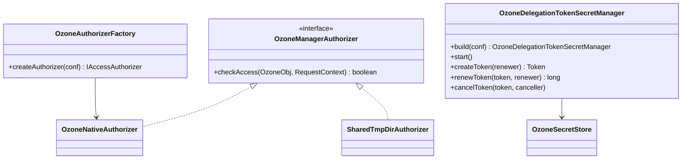

# om / om-security

_This feature page was generated from `study/atlas/components/om/om-security.md`. Author prose belongs above or below the BEGIN/END markers._

{/* BEGIN atlas-generated */}

**Classes:** 10    **Kinds:** service:8, interface:1, factory:1

## Overview

The `om-security` feature handles OM access authorization, delegation tokens, certificate management, and S3 request authentication. `OzoneDelegationTokenSecretManager` issues, renews, and cancels Kerberos delegation tokens for OM clients; it holds the active secret key and persists token state to `OzoneSecretStore`. `OzoneNativeAuthorizer` is the built-in ACL enforcement engine: it checks user identity against bucket/volume/key ACL lists without requiring Ranger. `OzoneManagerAuthorizer` is a sub-interface of `IAccessAuthorizer` specifically for OM. `OzoneAuthorizerFactory` creates the authorizer — either `OzoneNativeAuthorizer`, a Ranger-backed implementation, or `SharedTmpDirAuthorizer` for the shared tmp dir. `AWSV4AuthValidator` verifies AWS Signature v4 payloads for S3 requests. `OMCertificateClient` manages the OM's own x.509 certificate for mTLS with SCM and other services.

## Diagram

## Class table

### Sub-feature: `ozone.common`

| reading_order | fqcn | kind | logic | loc | study (min) | role |
|--:|---|---|---|--:|--:|---|
| 1028 | <Fqcn>org.apache.hadoop.ozone.common.BekInfoUtils</Fqcn> | service | mixed | 25~ | 30 | Utility class for common bucket encryption key operations. |

### Sub-feature: `ozone.security`

| reading_order | fqcn | kind | logic | loc | study (min) | role |
|--:|---|---|---|--:|--:|---|
| 1029 | <Fqcn>org.apache.hadoop.ozone.security.OzoneDelegationTokenSecretManager</Fqcn> | service | logic-heavy | 450~ | 60 | SecretManager for Ozone Master. |
| 1030 | <Fqcn>org.apache.hadoop.ozone.security.OMCertificateClient</Fqcn> | service | mixed | 75~ | 30 | Certificate client for OzoneManager. |
| 1031 | <Fqcn>org.apache.hadoop.ozone.security.OzoneSecretStore</Fqcn> | service | mixed | 50~ | 30 | SecretStore for Ozone Master. |
| 1032 | <Fqcn>org.apache.hadoop.ozone.security.AWSV4AuthValidator</Fqcn> | service | mixed | 50~ | 30 | AWS v4 authentication payload validator. |
| 1033 | <Fqcn>org.apache.hadoop.ozone.security.S3SecurityUtil</Fqcn> | service | mixed | 25~ | 30 | Utility class which holds methods required for parse/validation of S3 Authentication Information which is part of OMR... |

### Sub-feature: `security.acl`

| reading_order | fqcn | kind | logic | loc | study (min) | role |
|--:|---|---|---|--:|--:|---|
| 1034 | <Fqcn>org.apache.hadoop.ozone.security.acl.OzoneManagerAuthorizer</Fqcn> | interface | mixed | 25~ | 20 | A subinterface of IAccessAuthorizer specifically for Ozone Manager. |
| 1035 | <Fqcn>org.apache.hadoop.ozone.security.acl.OzoneNativeAuthorizer</Fqcn> | service | mixed | 175~ | 45 | Native (internal) implementation of IAccessAuthorizer. |
| 1036 | <Fqcn>org.apache.hadoop.ozone.security.acl.SharedTmpDirAuthorizer</Fqcn> | service | mixed | 25~ | 30 | SharedTmp implementation of IAccessAuthorizer. |
| 1037 | <Fqcn>org.apache.hadoop.ozone.security.acl.OzoneAuthorizerFactory</Fqcn> | factory | mixed | 50~ | 20 | Creates IAccessAuthorizer instances based on configuration. |

## Anchor details

### `OzoneDelegationTokenSecretManager`

- **path:** `hadoop-ozone/ozone-manager/src/main/java/org/apache/hadoop/ozone/security/OzoneDelegationTokenSecretManager.java`
- **loc:** 450~    **difficulty:** 5    **study:** 60 min    **concurrency:** thread-safe    **persistence:** in-memory
- **entry points:** `build`, `start`, `run`
- **key collaborators:** `org.apache.hadoop.hdds.annotation.InterfaceAudience`, `org.apache.hadoop.hdds.annotation.InterfaceStability`, `org.apache.hadoop.hdds.conf.OzoneConfiguration`, `org.apache.hadoop.hdds.security.OzoneSecretManager`, `org.apache.hadoop.hdds.security.SecurityConfig`, `org.apache.hadoop.hdds.security.exception.SCMSecurityException`
- **test exemplar:** `hadoop-ozone/ozone-manager/src/test/java/org/apache/hadoop/ozone/security/TestOzoneDelegationTokenSecretManager.java`
- **role:** SecretManager for Ozone Master.

Extends `OzoneSecretManager` and manages the secret key lifecycle: periodically rotates the master signing key (configurable `keyUpdateInterval`) and removes expired keys. Token lifetime is bounded by the secret-key expiry — an expired key causes token validation to fail even before the token's nominal expiry. [HDDS-13343](https://issues.apache.org/jira/browse/HDDS-13343) fixed a case where the delegation token lifetime was not considered when computing the secret key expiry, allowing tokens to outlive their signing key. [HDDS-9234](https://issues.apache.org/jira/browse/HDDS-9234) fixed expired secret keys aborting leader OM startup.

## Design docs

- `hadoop-hdds/docs/content/design/token.md` — delegation token design for Ozone
- `hadoop-hdds/docs/content/security/SecureOzone.md` — enabling Kerberos security in Ozone
- `hadoop-hdds/docs/content/security/SecurityWithRanger.md` — Ranger-based authorization configuration

## Seminal JIRAs / PRs

- [HDDS-13343](https://issues.apache.org/jira/browse/HDDS-13343). Consider delegation token lifetime for secret key expiry
- [HDDS-13234](https://issues.apache.org/jira/browse/HDDS-13234). Expired secret key can abort leader OM startup
- [HDDS-13435](https://issues.apache.org/jira/browse/HDDS-13435). Add an OzoneManagerAuthorizer interface
- [HDDS-14843](https://issues.apache.org/jira/browse/HDDS-14843). Support cluster-wide blacklist on OM
- [HDDS-11866](https://issues.apache.org/jira/browse/HDDS-11866). Remove code paths for non-Ratis OM

## Sharp edges

- Delegation token expiry is bounded by the signing secret key's expiry, not just the token's own `maxLifetime`. If the secret key rotates before the token expires, the token becomes invalid — this is a security feature but can surprise clients with long-lived tokens ([HDDS-13343](https://issues.apache.org/jira/browse/HDDS-13343)).
- `OzoneNativeAuthorizer` checks ACLs from the in-memory `OzoneAclStorage`; ACL changes made via Ratis are applied asynchronously, so immediately after `SetAcl` there is a brief window where the authorizer may use the old ACL list.

## Related features

- `components/om/om-request.md` — `OMGetDelegationTokenRequest`, `OMRenewDelegationTokenRequest` are the write-path request classes
- `components/om/om-multitenant.md` — multi-tenant access control uses `MultiTenantAccessController` as the authorizer in tenant mode
- `components/om/om-server.md` — `OzoneManager` holds `OzoneDelegationTokenSecretManager` and calls it during token operations

## Self-quiz

1. What is the relationship between the secret key rotation interval and delegation token expiry in `OzoneDelegationTokenSecretManager`?
2. `OzoneAuthorizerFactory` creates different authorizers. Under what configuration does it choose `OzoneNativeAuthorizer` vs a Ranger-backed implementation?
3. `AWSV4AuthValidator` validates AWS Signature v4. What does it check, and for which type of OM request is it called?
4. `OMCertificateClient` manages the OM's x.509 certificate. What does it use this certificate for?
5. When an expired secret key is found on OM startup, what was the bug ([HDDS-13234](https://issues.apache.org/jira/browse/HDDS-13234)) and how was it fixed?

Answers

Answer 1: The token lifetime must not exceed the secret key's remaining validity. `OzoneDelegationTokenSecretManager` enforces this by capping `getTokenExpiryTime()` at `currentKey.getExpiryDate()` ([HDDS-13343](https://issues.apache.org/jira/browse/HDDS-13343)).
Answer 2: When `ozone.security.authorization.provider.enabled=false`, `OzoneNativeAuthorizer` is used. When it is `true` and a Ranger plugin class is configured, `OzoneAuthorizerFactory` loads the Ranger-backed authorizer via reflection.
Answer 3: It validates the HMAC signature and timestamp freshness of AWS v4 signed requests. It is called for S3 requests routed through the S3 Gateway to OM.
Answer 4: For mTLS — the OM presents its x.509 certificate during TLS handshake with SCM and other OM peers, and uses the private key to sign Ratis proposals if TLS is enabled.
Answer 5: On startup, `OzoneDelegationTokenSecretManager.start()` attempted to add the current secret key to the key store; if the key was already expired this threw an exception and aborted OM startup. The fix was to skip loading expired keys.

{/* END atlas-generated */}
