# om / om-server

_This feature page was generated from `study/atlas/components/om/om-server.md`. Author prose belongs above or below the BEGIN/END markers._

{/* BEGIN atlas-generated */}

**Classes:** 70    **Kinds:** service:42, interface:17, metrics:10, exception:1

## Overview

The `om-server` feature is the OM runtime: process start-up, the central `OzoneManager` service class, the metadata store, snapshot management, and all cross-cutting server utilities. `OzoneManager` is a 4050-line class that owns all subsystems: it starts the Ratis server, the protocol servers (Hadoop RPC and gRPC), the security services, the key and bucket managers, and the background services. `OmMetadataManagerImpl` provides the RocksDB-backed implementation of `OMMetadataManager` — it registers all column families via `OMDBDefinition` and provides table-cache-merged access via `ListIterator`. `OmSnapshotManager` holds the `SnapshotCache` and creates per-snapshot `OmMetadataManager` views for diff and read operations. `OMMultiTenantManagerImpl` is the tenant orchestrator. `OmMetadataReader` handles read-only metadata queries (shared by the active OM and snapshot views). `SnapshotChainManager` maintains the doubly-linked list of snapshot IDs per bucket, used by deletion and diff services to walk the chain. `OMDBCheckpointServlet` serves the OM DB tarball to followers for bootstrap and to Recon for observation.

## Diagram

```mermaid
flowchart TD
  OzoneManager["OzoneManager<br/>(central service, owns all subsystems)"]
  OmMetadataManagerImpl["OmMetadataManagerImpl<br/>(RocksDB tables, cache merge)"]
  OmSnapshotManager["OmSnapshotManager<br/>(snapshot cache, snapshot views)"]
  OMMultiTenantManagerImpl["OMMultiTenantManagerImpl<br/>(tenant orchestrator)"]
  OmMetadataReader["OmMetadataReader<br/>(read-only metadata API)"]
  SnapshotChainManager["SnapshotChainManager<br/>(snapshot linked list)"]
  OMDBCheckpointServlet["OMDBCheckpointServlet<br/>(DB tarball for bootstrap/Recon)"]
  OzoneManagerRatisServer["OzoneManagerRatisServer<br/>(om-ratis)"]
  KeyManagerImpl["KeyManagerImpl<br/>(om-key-manager)"]
  OzoneManager --> OmMetadataManagerImpl
  OzoneManager --> OmSnapshotManager
  OzoneManager --> OMMultiTenantManagerImpl
  OzoneManager --> OmMetadataReader
  OzoneManager --> SnapshotChainManager
  OzoneManager --> OMDBCheckpointServlet
  OzoneManager --> OzoneManagerRatisServer
  OzoneManager --> KeyManagerImpl
click OzoneManager href "/class/ozonemanager" "Open OzoneManager"
click OmMetadataManagerImpl href "/class/ommetadatamanagerimpl" "Open OmMetadataManagerImpl"
click OmSnapshotManager href "/class/omsnapshotmanager" "Open OmSnapshotManager"
click OMMultiTenantManagerImpl href "/class/ommultitenantmanagerimpl" "Open OMMultiTenantManagerImpl"
click OmMetadataReader href "/class/ommetadatareader" "Open OmMetadataReader"
click SnapshotChainManager href "/class/snapshotchainmanager" "Open SnapshotChainManager"
click OMDBCheckpointServlet href "/class/omdbcheckpointservlet" "Open OMDBCheckpointServlet"
click OzoneManagerRatisServer href "/class/ozonemanagerratisserver" "Open OzoneManagerRatisServer"
click KeyManagerImpl href "/class/keymanagerimpl" "Open KeyManagerImpl"
```

## Class table

### Sub-feature: `om.ha`

| reading_order | fqcn | kind | logic | loc | study (min) | role |
|--:|---|---|---|--:|--:|---|
| 398 | <Fqcn>org.apache.hadoop.ozone.om.ha.OMService</Fqcn> | interface | mixed | 25~ | 20 | Interface for stateful background service in OM. |
| 399 | <Fqcn>org.apache.hadoop.ozone.om.ha.OMHANodeDetails</Fqcn> | service | logic-heavy | 200~ | 45 | Class which maintains peer information and it's own OM node information. |
| 400 | <Fqcn>org.apache.hadoop.ozone.om.ha.OMServiceManager</Fqcn> | service | mixed | 25~ | 30 | Manipulate background services in OM. |
| 401 | <Fqcn>org.apache.hadoop.ozone.om.ha.OMHAMetrics</Fqcn> | metrics | mixed | 75~ | 20 | Class to maintain metrics and info related to OM HA. |
| 402 | <Fqcn>org.apache.hadoop.ozone.om.ha.OMPeriodicMetrics</Fqcn> | metrics | mixed | 75~ | 20 | Generic framework for metrics that need to get updated on a specified interval. |
| 403 | <Fqcn>org.apache.hadoop.ozone.om.ha.OMServiceException</Fqcn> | exception | data-only | 25~ | 10 | Checked exceptions thrown by an OMService. |

### Sub-feature: `om.s3`

| reading_order | fqcn | kind | logic | loc | study (min) | role |
|--:|---|---|---|--:|--:|---|
| 404 | <Fqcn>org.apache.hadoop.ozone.om.s3.S3SecretStoreProvider</Fqcn> | interface | mixed | 25~ | 20 | S3 secret store provider. |
| 405 | <Fqcn>org.apache.hadoop.ozone.om.s3.S3SecretCacheProvider</Fqcn> | interface | mixed | 25~ | 20 | Provider of S3SecretCache. |
| 406 | <Fqcn>org.apache.hadoop.ozone.om.s3.S3SecretStoreConfigurationKeys</Fqcn> | service | mixed | 25~ | 30 | Configuration keys for S3 secret store and cache. |
| 407 | <Fqcn>org.apache.hadoop.ozone.om.s3.LocalS3StoreProvider</Fqcn> | service | mixed | 25~ | 30 | Implementation of provider with local S3 secret store. |

### Sub-feature: `ozone.om`

| reading_order | fqcn | kind | logic | loc | study (min) | role |
|--:|---|---|---|--:|--:|---|
| 408 | <Fqcn>org.apache.hadoop.ozone.om.ListIterator</Fqcn> | service | logic-heavy | 225~ | 20 | Common class to do listing of resources after merging rocksDB table cache and actual table. |
| 409 | <Fqcn>org.apache.hadoop.ozone.om.OMMultiTenantManager</Fqcn> | interface | mixed | 150~ | 20 | OM MultiTenant manager interface. |
| 410 | <Fqcn>org.apache.hadoop.ozone.om.OzoneManagerStarter</Fqcn> | cli | mixed | 125~ | 20 | This class provides a command line interface to start the OM using Picocli. |
| 411 | <Fqcn>org.apache.hadoop.ozone.om.SnapshotChainInfo</Fqcn> | dto | data-only | 50~ | 20 | SnapshotChain supporting SnapshotInfo class. |
| 412 | <Fqcn>org.apache.hadoop.ozone.om.S3SecretManager</Fqcn> | interface | mixed | 50~ | 20 | Interface to manager s3 secret. |
| 413 | <Fqcn>org.apache.hadoop.ozone.om.S3SecretFunction</Fqcn> | interface | mixed | 25~ | 20 | Functional interface for s3 secret locked actions. |
| 414 | <Fqcn>org.apache.hadoop.ozone.om.TenantOp</Fqcn> | interface | mixed | 25~ | 20 | Interface for tenant operations. |
| 415 | <Fqcn>org.apache.hadoop.ozone.om.OMStarterInterface</Fqcn> | interface | mixed | 25~ | 20 | This interface is used by the OzoneManagerStarter class to allow the dependencies to be injected to the CLI class. |
| 416 | <Fqcn>org.apache.hadoop.ozone.om.IOzoneAcl</Fqcn> | interface | mixed | 25~ | 20 | Interface for Ozone Acl management. |
| 417 | <Fqcn>org.apache.hadoop.ozone.om.S3SecretStore</Fqcn> | interface | mixed | 25~ | 20 | S3 secret store interface. |
| 418 | <Fqcn>org.apache.hadoop.ozone.om.PrefixManager</Fqcn> | interface | mixed | 25~ | 20 | Handles prefix commands. |
| 419 | <Fqcn>org.apache.hadoop.ozone.om.OMMXBean</Fqcn> | interface | mixed | 25~ | 20 | This is the JMX management interface for OM information. |
| 420 | <Fqcn>org.apache.hadoop.ozone.om.S3SecretCache</Fqcn> | interface | mixed | 25~ | 20 | Cache layer of S3 secrets. |
| 421 | <Fqcn>org.apache.hadoop.ozone.om.S3Batcher</Fqcn> | interface | mixed | 25~ | 20 | Batcher for write and read operations. |
| 422 | <Fqcn>org.apache.hadoop.ozone.om.OzoneManager</Fqcn> | service | logic-heavy | 4050~ | 60 | inferred(from-md): Central OM service: owns the Ratis server, protocol servers, metadata manager, key/bucket managers, security services... |
| 423 | <Fqcn>org.apache.hadoop.ozone.om.OmMetadataManagerImpl</Fqcn> | service | logic-heavy | 1375~ | 60 | Ozone metadata manager interface. |
| 424 | <Fqcn>org.apache.hadoop.ozone.om.OmSnapshotManager</Fqcn> | service | logic-heavy | 775~ | 60 | This class is used to manage/create OM snapshots. |
| 425 | <Fqcn>org.apache.hadoop.ozone.om.OMMultiTenantManagerImpl</Fqcn> | service | logic-heavy | 725~ | 60 | Implements OMMultiTenantManager. |
| 426 | <Fqcn>org.apache.hadoop.ozone.om.OmMetadataReader</Fqcn> | service | logic-heavy | 525~ | 60 | OM Metadata Reading class for the OM and Snapshot managers. |
| 427 | <Fqcn>org.apache.hadoop.ozone.om.OMDBCheckpointServlet</Fqcn> | service | logic-heavy | 475~ | 60 | Provides the current checkpoint Snapshot of the OM DB. |
| 428 | <Fqcn>org.apache.hadoop.ozone.om.TrashOzoneFileSystem</Fqcn> | service | logic-heavy | 475~ | 60 | FileSystem to be used by the Trash Emptier. |
| 429 | <Fqcn>org.apache.hadoop.ozone.om.SnapshotChainManager</Fqcn> | service | logic-heavy | 450~ | 60 | This class is used for creating and accessing Snapshot Chains. |
| 430 | <Fqcn>org.apache.hadoop.ozone.om.OMDBCheckpointServletInodeBasedXfer</Fqcn> | service | logic-heavy | 375~ | 45 | Specialized OMDBCheckpointServlet implementation that transfers Ozone Manager database checkpoints using inode-based... |
| 431 | <Fqcn>org.apache.hadoop.ozone.om.PrefixManagerImpl</Fqcn> | service | logic-heavy | 250~ | 45 | Implementation of PrefixManager. |
| 432 | <Fqcn>org.apache.hadoop.ozone.om.OmSnapshot</Fqcn> | service | logic-heavy | 225~ | 45 | Metadata Reading class for OM Snapshots. |
| 433 | <Fqcn>org.apache.hadoop.ozone.om.TrashPolicyOzone</Fqcn> | service | logic-heavy | 225~ | 45 | TrashPolicy for Ozone Specific Trash Operations.Through this implementation of TrashPolicy ozone-specific trash optim... |
| 434 | <Fqcn>org.apache.hadoop.ozone.om.OzoneListStatusHelper</Fqcn> | service | logic-heavy | 225~ | 45 | Helper class for fetching List Status for a path. |
| 435 | <Fqcn>org.apache.hadoop.ozone.om.OmSnapshotLocalData</Fqcn> | service | mixed | 175~ | 45 | OmSnapshotLocalData is the in-memory representation of snapshot local metadata. |
| 436 | <Fqcn>org.apache.hadoop.ozone.om.SstFilteringService</Fqcn> | service | mixed | 175~ | 45 | a from all the tables (columnFamilies) defined in the rocksdb This is a background service which will cleanup and fil... |
| 437 | <Fqcn>org.apache.hadoop.ozone.om.OmSnapshotLocalDataYaml</Fqcn> | service | mixed | 150~ | 45 | Class for creating and reading snapshot local properties / data YAML files. |
| 438 | <Fqcn>org.apache.hadoop.ozone.om.OzoneManagerPrepareState</Fqcn> | service | mixed | 150~ | 45 | Controls the prepare state of the OzoneManager containing the instance. |
| 439 | <Fqcn>org.apache.hadoop.ozone.om.ScmClient</Fqcn> | service | mixed | 150~ | 45 | Wrapper class for Scm protocol clients. |
| 440 | <Fqcn>org.apache.hadoop.ozone.om.GrpcOzoneManagerServer</Fqcn> | service | mixed | 125~ | 30 | Separated network server for gRPC transport OzoneManagerService s3g-&gt;OM. |
| 441 | <Fqcn>org.apache.hadoop.ozone.om.OMDBArchiver</Fqcn> | service | mixed | 100~ | 30 | Class for handling operations relevant to archiving the OM DB tarball. |
| 442 | <Fqcn>org.apache.hadoop.ozone.om.OMStorage</Fqcn> | service | mixed | 100~ | 30 | Ozone Manager VERSION file representation. |
| 443 | <Fqcn>org.apache.hadoop.ozone.om.OzonePrefixPathImpl</Fqcn> | service | mixed | 100~ | 30 | Implementation of OzonePrefixPath interface. |
| 444 | <Fqcn>org.apache.hadoop.ozone.om.ResolvedBucket</Fqcn> | service | mixed | 100~ | 30 | Bundles information about a bucket, which is possibly a symlink, and the real bucket that it resolves to, if it is in... |
| 445 | <Fqcn>org.apache.hadoop.ozone.om.PendingKeysDeletion</Fqcn> | service | mixed | 75~ | 30 | Tracks metadata for keys pending deletion and their associated blocks. |
| 446 | <Fqcn>org.apache.hadoop.ozone.om.ServiceInfoProvider</Fqcn> | service | mixed | 75~ | 30 | n the responsibility of caching the actual CA certificates in PEM format, and handle the update of these cached value... |
| 447 | <Fqcn>org.apache.hadoop.ozone.om.OzoneAclUtils</Fqcn> | service | mixed | 75~ | 30 | Ozone Acl Wrapper class. |
| 448 | <Fqcn>org.apache.hadoop.ozone.om.S3SecretManagerImpl</Fqcn> | service | mixed | 75~ | 30 | S3 Secret manager. |
| 449 | <Fqcn>org.apache.hadoop.ozone.om.S3SecretLockedManager</Fqcn> | service | mixed | 75~ | 30 | Wrapper with lock logic of S3SecretManager. |
| 450 | <Fqcn>org.apache.hadoop.ozone.om.OzoneManagerUtils</Fqcn> | service | mixed | 75~ | 30 | Ozone Manager utility class. |
| 451 | <Fqcn>org.apache.hadoop.ozone.om.OzoneManagerHttpServer</Fqcn> | service | mixed | 50~ | 30 | HttpServer wrapper for the OzoneManager. |
| 452 | <Fqcn>org.apache.hadoop.ozone.om.OzoneManagerServiceGrpc</Fqcn> | service | mixed | 50~ | 30 | Grpc Service for handling S3 gateway OzoneManagerProtocol client requests. |
| 453 | <Fqcn>org.apache.hadoop.ozone.om.OzoneConfigUtil</Fqcn> | service | mixed | 50~ | 30 | Utility class for ozone configurations. |
| 454 | <Fqcn>org.apache.hadoop.ozone.om.SnapshotListJSONServlet</Fqcn> | service | mixed | 50~ | 30 | Provides REST access to Ozone Snapshot List. |
| 455 | <Fqcn>org.apache.hadoop.ozone.om.DeleteKeysResult</Fqcn> | service | mixed | 25~ | 30 | Used in <Fqcn>org.apache.hadoop.ozone.om.service.DirectoryDeletingService</Fqcn> to capture the result of each delete task. |
| 456 | <Fqcn>org.apache.hadoop.ozone.om.OMPolicyProvider</Fqcn> | service | mixed | 25~ | 30 | PolicyProvider for OM protocols. |
| 457 | <Fqcn>org.apache.hadoop.ozone.om.ServiceListJSONServlet</Fqcn> | service | mixed | 25~ | 30 | Provides REST access to Ozone Service List. |
| 458 | <Fqcn>org.apache.hadoop.ozone.om.S3InMemoryCache</Fqcn> | service | mixed | 25~ | 30 | S3 secret cache implementation based on in-memory cache. |
| 459 | <Fqcn>org.apache.hadoop.ozone.om.OzoneTrash</Fqcn> | service | mixed | 25~ | 30 | OzoneTrash which takes an OM as parameter . |
| 460 | <Fqcn>org.apache.hadoop.ozone.om.OMMetrics</Fqcn> | metrics | logic-heavy | 1300~ | 20 | This class is for maintaining Ozone Manager statistics. |
| 461 | <Fqcn>org.apache.hadoop.ozone.om.OMPerformanceMetrics</Fqcn> | metrics | logic-heavy | 275~ | 20 | Including OM performance related metrics. |
| 462 | <Fqcn>org.apache.hadoop.ozone.om.DeletingServiceMetrics</Fqcn> | metrics | logic-heavy | 250~ | 20 | Class contains metrics related to the OM Deletion services. |
| 463 | <Fqcn>org.apache.hadoop.ozone.om.OmSnapshotMetrics</Fqcn> | metrics | mixed | 125~ | 20 | This class is for maintaining Snapshot Manager statistics. |
| 464 | <Fqcn>org.apache.hadoop.ozone.om.OmSnapshotInternalMetrics</Fqcn> | metrics | mixed | 125~ | 20 | This class contains internal Snapshot Operation metrics. |
| 465 | <Fqcn>org.apache.hadoop.ozone.om.BucketUtilizationMetrics</Fqcn> | metrics | mixed | 50~ | 20 | A class for collecting and reporting bucket utilization metrics. |
| 466 | <Fqcn>org.apache.hadoop.ozone.om.OmMetricsInfo</Fqcn> | metrics | mixed | 25~ | 20 | OmMetricsInfo stored in a file, which will be used during OM restart to initialize the metrics. |
| 467 | <Fqcn>org.apache.hadoop.ozone.om.OmMetadataReaderMetrics</Fqcn> | metrics | mixed | 25~ | 20 | Interface OM Metadata Reading metrics classes. |

## Anchor details

### `ListIterator`

- **path:** `hadoop-ozone/ozone-manager/src/main/java/org/apache/hadoop/ozone/om/ListIterator.java`
- **loc:** 225~    **difficulty:** 2    **study:** 20 min    **concurrency:** single-threaded    **persistence:** in-memory
- **entry points:** `close`
- **key collaborators:** `org.apache.hadoop.hdds.utils.IOUtils`, `org.apache.hadoop.hdds.utils.db.CopyObject`, `org.apache.hadoop.hdds.utils.db.Table`, `org.apache.hadoop.hdds.utils.db.TableIterator`, `org.apache.hadoop.hdds.utils.db.cache.CacheKey`, `org.apache.hadoop.hdds.utils.db.cache.CacheValue`
- **role:** Common class to do listing of resources after merging rocksDB table cache and actual table.

This is an interface (despite being classified as `logic-heavy`). Implementations merge the in-memory write-through cache (un-committed Ratis entries) with the on-disk RocksDB table. Concrete implementations are inner classes in `OmMetadataManagerImpl`. The merge ensures that a `listKeys` call on the leader sees entries that have been submitted via Ratis but not yet flushed to RocksDB by `OzoneManagerDoubleBuffer`.

### `OzoneManager`

- **path:** `hadoop-ozone/ozone-manager/src/main/java/org/apache/hadoop/ozone/om/OzoneManager.java`
- **loc:** 4050~    **difficulty:** 5    **study:** 60 min    **concurrency:** thread-safe    **persistence:** in-memory
- **entry points:** `run`, `close`, `start`
- **key collaborators:** `org.apache.hadoop.ozone.om.ha.OMHAMetrics`, `org.apache.hadoop.ozone.om.ha.OMHANodeDetails`, `org.apache.hadoop.ozone.om.ha.OMServiceManager`, `org.apache.hadoop.ozone.om.s3.S3SecretCacheProvider`, `org.apache.hadoop.ozone.om.s3.S3SecretStoreProvider`, `org.apache.hadoop.hdds.ExitManager`
- **role:** Central OM service: owns the Ratis server, protocol servers, metadata manager, key/bucket managers, security services, and all background tasks.

`start()` sequence: init storage, create DB, start Ratis server, register for leader notifications, start protocol RPC servers, then conditionally start background services (only on leader). `OzoneManagerPrepareState` controls whether write requests are accepted during OM prepare mode (used for upgrade). The `S3SecretStoreProvider` and `S3SecretCacheProvider` are pluggable so that S3 secrets can be stored locally or in an external store.

### `OmMetadataManagerImpl`

- **path:** `hadoop-ozone/ozone-manager/src/main/java/org/apache/hadoop/ozone/om/OmMetadataManagerImpl.java`
- **loc:** 1375~    **difficulty:** 5    **study:** 60 min    **concurrency:** single-threaded    **persistence:** RocksDB
- **entry points:** `start`, `close`
- **key collaborators:** `org.apache.hadoop.hdds.client.BlockID`, `org.apache.hadoop.hdds.conf.OzoneConfiguration`, `org.apache.hadoop.hdds.utils.TableCacheMetrics`, `org.apache.hadoop.hdds.utils.TransactionInfo`, `org.apache.hadoop.hdds.utils.db.BatchOperation`, `org.apache.hadoop.hdds.utils.db.DBCheckpoint`
- **role:** RocksDB-backed implementation of OMMetadataManager; registers all OM column families and provides cache-merged table access.

Opens the OM RocksDB with all column families defined in `OMDBDefinition`. Provides `commitBatchOperation(batch)` which is called by `OzoneManagerDoubleBuffer` to atomically flush a batch of `OMClientResponse` changes. Table caches are write-through: every `validateAndUpdateCache` call inserts into the cache before the batch is flushed to disk. `TableCacheMetrics` tracks cache hit/miss ratios per table.

### `OmSnapshotManager`

- **path:** `hadoop-ozone/ozone-manager/src/main/java/org/apache/hadoop/ozone/om/OmSnapshotManager.java`
- **loc:** 775~    **difficulty:** 5    **study:** 60 min    **concurrency:** single-threaded    **persistence:** RocksDB
- **entry points:** `close`
- **key collaborators:** `org.apache.hadoop.hdds.StringUtils`, `org.apache.hadoop.hdds.conf.OzoneConfiguration`, `org.apache.hadoop.hdds.ratis.RatisHelper`, `org.apache.hadoop.hdds.server.ServerUtils`, `org.apache.hadoop.hdds.utils.TransactionInfo`, `org.apache.hadoop.hdds.utils.db.BatchOperation`
- **test exemplar:** `hadoop-ozone/ozone-manager/src/test/java/org/apache/hadoop/ozone/om/TestOmSnapshotManager.java`
- **role:** This class is used to manage/create OM snapshots.

### `OMMultiTenantManagerImpl`

- **path:** `hadoop-ozone/ozone-manager/src/main/java/org/apache/hadoop/ozone/om/OMMultiTenantManagerImpl.java`
- **loc:** 725~    **difficulty:** 5    **study:** 60 min    **concurrency:** thread-safe    **persistence:** in-memory
- **entry points:** `start`
- **key collaborators:** `org.apache.hadoop.hdds.conf.OzoneConfiguration`, `org.apache.hadoop.hdds.utils.db.Table`, `org.apache.hadoop.hdds.utils.db.TableIterator`, `org.apache.hadoop.ozone.om.exceptions.OMException`, `org.apache.hadoop.ozone.om.helpers.OmDBAccessIdInfo`, `org.apache.hadoop.ozone.om.helpers.OmDBTenantState`
- **test exemplar:** `hadoop-ozone/ozone-manager/src/test/java/org/apache/hadoop/ozone/om/TestOMMultiTenantManagerImpl.java`
- **role:** Implements OMMultiTenantManager.

### `OmMetadataReader`

- **path:** `hadoop-ozone/ozone-manager/src/main/java/org/apache/hadoop/ozone/om/OmMetadataReader.java`
- **loc:** 525~    **difficulty:** 5    **study:** 60 min    **concurrency:** single-threaded    **persistence:** in-memory
- **key collaborators:** `org.apache.hadoop.ozone.OzoneAcl`, `org.apache.hadoop.ozone.OzoneConsts`, `org.apache.hadoop.ozone.audit.AuditAction`, `org.apache.hadoop.ozone.audit.AuditEventStatus`, `org.apache.hadoop.ozone.audit.AuditLogger`, `org.apache.hadoop.ozone.audit.AuditMessage`
- **role:** OM Metadata Reading class for the OM and Snapshot managers.

### `OMDBCheckpointServlet`

- **path:** `hadoop-ozone/ozone-manager/src/main/java/org/apache/hadoop/ozone/om/OMDBCheckpointServlet.java`
- **loc:** 475~    **difficulty:** 5    **study:** 60 min    **concurrency:** single-threaded    **persistence:** RocksDB
- **entry points:** `init`
- **key collaborators:** `org.apache.hadoop.hdds.conf.OzoneConfiguration`, `org.apache.hadoop.hdds.recon.ReconConfig`, `org.apache.hadoop.hdds.utils.DBCheckpointServlet`, `org.apache.hadoop.hdds.utils.db.DBCheckpoint`, `org.apache.hadoop.hdds.utils.db.RDBCheckpointUtils`, `org.apache.hadoop.hdds.utils.db.RDBStore`
- **role:** Provides the current checkpoint Snapshot of the OM DB.

### `TrashOzoneFileSystem`

- **path:** `hadoop-ozone/ozone-manager/src/main/java/org/apache/hadoop/ozone/om/TrashOzoneFileSystem.java`
- **loc:** 475~    **difficulty:** 5    **study:** 60 min    **concurrency:** single-threaded    **persistence:** in-memory
- **entry points:** `open`, `create`
- **key collaborators:** `org.apache.hadoop.hdds.conf.OzoneConfiguration`, `org.apache.hadoop.hdds.utils.db.cache.CacheKey`, `org.apache.hadoop.hdds.utils.db.cache.CacheValue`, `org.apache.hadoop.ozone.ClientVersion`, `org.apache.hadoop.ozone.OFSPath`, `org.apache.hadoop.ozone.om.exceptions.OMException`
- **role:** FileSystem to be used by the Trash Emptier.

### `SnapshotChainManager`

- **path:** `hadoop-ozone/ozone-manager/src/main/java/org/apache/hadoop/ozone/om/SnapshotChainManager.java`
- **loc:** 450~    **difficulty:** 5    **study:** 60 min    **concurrency:** thread-safe    **persistence:** RocksDB
- **key collaborators:** `org.apache.hadoop.hdds.utils.db.Table`, `org.apache.hadoop.hdds.utils.db.TableIterator`, `org.apache.hadoop.ozone.om.helpers.SnapshotInfo`
- **role:** This class is used for creating and accessing Snapshot Chains.

### `OMDBCheckpointServletInodeBasedXfer`

- **path:** `hadoop-ozone/ozone-manager/src/main/java/org/apache/hadoop/ozone/om/OMDBCheckpointServletInodeBasedXfer.java`
- **loc:** 375~    **difficulty:** 4    **study:** 45 min    **concurrency:** single-threaded    **persistence:** RocksDB
- **entry points:** `init`
- **key collaborators:** `org.apache.hadoop.hdds.conf.OzoneConfiguration`, `org.apache.hadoop.hdds.recon.ReconConfig`, `org.apache.hadoop.hdds.utils.DBCheckpointServlet`, `org.apache.hadoop.hdds.utils.db.DBCheckpoint`, `org.apache.hadoop.hdds.utils.db.Table`, `org.apache.hadoop.hdds.utils.db.TableIterator`
- **role:** Specialized OMDBCheckpointServlet implementation that transfers Ozone Manager database checkpoints using inode-based...

### `PrefixManagerImpl`

- **path:** `hadoop-ozone/ozone-manager/src/main/java/org/apache/hadoop/ozone/om/PrefixManagerImpl.java`
- **loc:** 250~    **difficulty:** 4    **study:** 45 min    **concurrency:** single-threaded    **persistence:** in-memory
- **key collaborators:** `org.apache.hadoop.hdds.utils.db.TableIterator`, `org.apache.hadoop.ozone.OmUtils`, `org.apache.hadoop.ozone.OzoneAcl`, `org.apache.hadoop.ozone.om.exceptions.OMException`, `org.apache.hadoop.ozone.om.helpers.OmBucketInfo`, `org.apache.hadoop.ozone.om.helpers.OmPrefixInfo`
- **role:** Implementation of PrefixManager.

### `OmSnapshot`

- **path:** `hadoop-ozone/ozone-manager/src/main/java/org/apache/hadoop/ozone/om/OmSnapshot.java`
- **loc:** 225~    **difficulty:** 4    **study:** 45 min    **concurrency:** single-threaded    **persistence:** in-memory
- **entry points:** `close`
- **key collaborators:** `org.apache.hadoop.hdds.client.RatisReplicationConfig`, `org.apache.hadoop.ozone.OzoneAcl`, `org.apache.hadoop.ozone.audit.AuditLogger`, `org.apache.hadoop.ozone.audit.AuditLoggerType`, `org.apache.hadoop.ozone.om.helpers.BasicOmKeyInfo`, `org.apache.hadoop.ozone.om.helpers.KeyInfoWithVolumeContext`
- **role:** Metadata Reading class for OM Snapshots.

## Design docs

- `hadoop-hdds/docs/content/concept/OzoneManager.md` — OM architecture overview
- `hadoop-hdds/docs/content/design/omha.md` — OM HA (OzoneManager + Ratis)
- `hadoop-hdds/docs/content/design/omprepare.md` — OM prepare mode and safe upgrade

## Seminal JIRAs / PRs

- [HDDS-15059](https://issues.apache.org/jira/browse/HDDS-15059). Shift streaming write sortDatanodes logic to OM
- [HDDS-15624](https://issues.apache.org/jira/browse/HDDS-15624). Resolve link bucket properties in listBucket
- [HDDS-15678](https://issues.apache.org/jira/browse/HDDS-15678). OFS isDirectory/isFile should not trigger pipeline refresh or return block locations
- [HDDS-15600](https://issues.apache.org/jira/browse/HDDS-15600). Fix ListObjects response for encoding-type and empty delimiter
- [HDDS-15552](https://issues.apache.org/jira/browse/HDDS-15552). Ratis events should not be published as metrics
- [HDDS-14356](https://issues.apache.org/jira/browse/HDDS-14356). Support OM Service Framework

## Sharp edges

- `OzoneManager` has ~4000 lines and owns every subsystem; changes to initialization order or `start()` sequence can silently break dependencies. The Ratis server must be started before protocol RPC servers, and background services must only start after the OM is confirmed leader.
- `OmMetadataManagerImpl.commitBatchOperation` is called from `OzoneManagerDoubleBuffer`'s flush daemon; if RocksDB write stalls (disk full), the daemon blocks, which propagates back-pressure to the Ratis apply thread and eventually triggers leader election.

## Related features

- `components/om/om-ratis.md` — `OzoneManagerRatisServer` and `OzoneManagerStateMachine` owned by `OzoneManager`
- `components/om/om-key-manager.md` — `KeyManagerImpl` owned and started by `OzoneManager`
- `components/om/om-snapshot.md` — `OmSnapshotManager` and `SnapshotChainManager` owned by `OzoneManager`

## Self-quiz

1. `OzoneManager.start()` starts background services only when the OM is leader. What mechanism notifies `OzoneManager` that it has become leader?
2. `ListIterator` merges the table cache with the RocksDB table. What consistency guarantee does this provide for a `listKeys` call on the leader?
3. `OmMetadataManagerImpl` uses a write-through cache. What is the cache eviction policy and what happens to cache entries on OM restart?
4. `OMDBCheckpointServlet` serves two types of checkpoint. Name them and describe when each is used.
5. `SnapshotChainManager` maintains a per-bucket doubly-linked list of snapshot IDs. What does it store and which two services consume it?

Answers

Answer 1: `OzoneManagerStateMachine.notifyLeaderChanged` calls `ozoneManager.startLeaderServices()`, which starts background services and sets the OM state to ACTIVE.
Answer 2: A `listKeys` call will see all entries that have been submitted to Ratis (i.e., whose `validateAndUpdateCache` has been called) even if `OzoneManagerDoubleBuffer` has not yet flushed them to RocksDB. This provides read-your-writes consistency for the leader.
Answer 3: The cache uses LRU eviction with a configurable size limit per table. On OM restart the cache is empty; entries are populated as new Ratis entries are applied via `validateAndUpdateCache`.
Answer 4: `OMDBCheckpointServlet` serves the raw checkpoint tarball; `OMDBCheckpointServletInodeBasedXfer` serves a more efficient inode-based transfer that avoids re-transferring unchanged SST files. Followers use both for bootstrap; Recon uses the regular servlet for its observation DB.
Answer 5: `SnapshotChainManager` stores each snapshot's `snapshotId`, `prevGlobalSnapshotId`, and `prevPathSnapshotId` in a doubly-linked structure. Consumed by `SnapshotDeletingService` (walks chain to find keys to move) and `DirectoryDeletingService` (walks chain to find deep-clean snapshots).

{/* END atlas-generated */}
