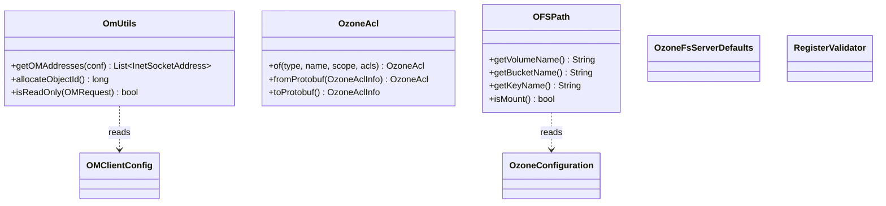

# ozonecommon / ozone-common-primitives

_This feature page was generated from `study/atlas/components/ozonecommon/ozone-common-primitives.md`. Author prose belongs above or below the BEGIN/END markers._

{/* BEGIN atlas-generated */}

**Classes:** 9    **Kinds:** service:5, interface:1, config:1, data:1, exception:1

## Overview

The `ozone-common-primitives` feature group contains the foundational utility classes and types shared across all Ozone layers. `OmUtils` is the largest piece: a stateless utility class with ~750 lines covering OM address parsing from configuration, object ID generation with epoch and transaction ID encoding, OM service discovery, and helper predicates used by both the client and server. `OzoneAcl` is an immutable ACL entry encoding identity type (USER, GROUP, WORLD, ANONYMOUS, CLIENT_IP, IP), ACL bits as a compact `int`, and scope (ACCESS vs. DEFAULT); it serializes to `OzoneAclInfo` proto. `OFSPath` parses Rooted Ozone Filesystem (OFS) URI paths into volume, bucket, mount, and key components, handling the special `/tmp` mount point that maps to a per-user or shared bucket depending on configuration. `OMClientConfig`, `OzoneFsServerDefaults`, and the validator annotations round out the group with client-side tuning and server-side filesystem defaults.

## Diagram

## Class table

### Sub-feature: `ozone`

| reading_order | fqcn | kind | logic | loc | study (min) | role |
|--:|---|---|---|--:|--:|---|
| 2190 | <Fqcn>org.apache.hadoop.ozone.OmUtils</Fqcn> | service | logic-heavy | 750~ | 60 | Stateless helper functions for the server and client side of OM communication. |
| 2191 | <Fqcn>org.apache.hadoop.ozone.OzoneAcl</Fqcn> | service | logic-heavy | 225~ | 45 | OzoneACL classes define bucket ACLs used in OZONE. |
| 2192 | <Fqcn>org.apache.hadoop.ozone.OFSPath</Fqcn> | service | logic-heavy | 225~ | 45 | Utility class for Rooted Ozone Filesystem (OFS) path processing. |
| 2193 | <Fqcn>org.apache.hadoop.ozone.OzoneFsServerDefaults</Fqcn> | service | mixed | 25~ | 30 | Provides server default configuration values to clients. |
| 2194 | <Fqcn>org.apache.hadoop.ozone.OzoneIllegalArgumentException</Fqcn> | exception | data-only | 25~ | 10 | Indicates that a method has been passed illegal or invalid argument. |

### Sub-feature: `ozone.conf`

| reading_order | fqcn | kind | logic | loc | study (min) | role |
|--:|---|---|---|--:|--:|---|
| 2195 | <Fqcn>org.apache.hadoop.ozone.conf.OMClientConfig</Fqcn> | config | data-only | 25~ | 20 | Config for OM Client. |

### Sub-feature: `request.validation`

| reading_order | fqcn | kind | logic | loc | study (min) | role |
|--:|---|---|---|--:|--:|---|
| 2196 | <Fqcn>org.apache.hadoop.ozone.request.validation.RegisterValidator</Fqcn> | interface | mixed | 25~ | 20 | Annotations to register a validator. |
| 2197 | <Fqcn>org.apache.hadoop.ozone.request.validation.RequestProcessingPhase</Fqcn> | data | data-only | 25~ | 10 | Processing phase defines when a request validator should run. |

### Sub-feature: `web.utils`

| reading_order | fqcn | kind | logic | loc | study (min) | role |
|--:|---|---|---|--:|--:|---|
| 2198 | <Fqcn>org.apache.hadoop.ozone.web.utils.OzoneUtils</Fqcn> | service | mixed | 75~ | 30 | Set of Utility functions used in ozone. |

## Anchor details

### `OmUtils`

- **path:** `hadoop-ozone/common/src/main/java/org/apache/hadoop/ozone/OmUtils.java`
- **loc:** 750~    **difficulty:** 5    **study:** 60 min    **concurrency:** single-threaded    **persistence:** in-memory
- **key collaborators:** `org.apache.hadoop.ozone.conf.OMClientConfig`, `org.apache.hadoop.hdds.conf.ConfigurationException`, `org.apache.hadoop.hdds.conf.ConfigurationSource`, `org.apache.hadoop.hdds.conf.OzoneConfiguration`, `org.apache.hadoop.hdds.scm.client.HddsClientUtils`, `org.apache.hadoop.ozone.ha.ConfUtils`
- **test exemplar:** `hadoop-ozone/common/src/test/java/org/apache/hadoop/ozone/TestOmUtils.java`
- **role:** Stateless helper functions for the server and client side of OM communication.
- `allocateObjectId()` encodes a 64-bit object ID where the top 2 bits hold an epoch (to prevent ID collisions across OM restores from older snapshots), the next 8 bits allow for recursive directory creation steps, and the remaining 54 bits hold the Ratis transaction index. `isReadOnly(OMRequest)` dispatches on the `cmdType` proto enum to determine whether a request must be routed to the leader.

### `OzoneAcl`

- **path:** `hadoop-ozone/common/src/main/java/org/apache/hadoop/ozone/OzoneAcl.java`
- **loc:** 225~    **difficulty:** 4    **study:** 45 min    **concurrency:** single-threaded    **persistence:** in-memory
- **key collaborators:** `org.apache.hadoop.ozone.security.acl.IAccessAuthorizer`
- **role:** OzoneACL classes define bucket ACLs used in OZONE.
- `OzoneAcl` is `@Immutable`; ACL bits are packed into a single `int` (not `BitSet`) since [HDDS-10745](https://issues.apache.org/jira/browse/HDDS-10745). `toString()` and `hashCode()` are memoized via `MemoizedSupplier` to reduce repeated serialization cost in hot paths. The `LINK_BUCKET_DEFAULT_ACL` constant is the fixed default ACL applied to S3-style link buckets.

### `OFSPath`

- **path:** `hadoop-ozone/common/src/main/java/org/apache/hadoop/ozone/OFSPath.java`
- **loc:** 225~    **difficulty:** 4    **study:** 45 min    **concurrency:** single-threaded    **persistence:** in-memory
- **key collaborators:** `org.apache.hadoop.hdds.annotation.InterfaceAudience`, `org.apache.hadoop.hdds.annotation.InterfaceStability`, `org.apache.hadoop.hdds.conf.OzoneConfiguration`, `org.apache.hadoop.ozone.security.acl.OzoneObjInfo`
- **test exemplar:** `hadoop-ozone/ozonefs-common/src/test/java/org/apache/hadoop/fs/ozone/TestOFSPath.java`
- **role:** Utility class for Rooted Ozone Filesystem (OFS) path processing.
- The `/tmp` mount point has two modes controlled by `OZONE_OM_ENABLE_OFS_SHARED_TMP_DIR`: when disabled, each user gets a per-user bucket named by the MD5 hash of their username; when enabled, all users share a single `tmp/tmp` bucket. The bucket name derivation is in `initOFSPath` and is consulted by `OzoneFileSystem.getTrashRoot` ([HDDS-14177](https://issues.apache.org/jira/browse/HDDS-14177)).

## Design docs

- `hadoop-hdds/docs/content/design/ofs.md` — design for Rooted Ozone Filesystem; `OFSPath` is central to path parsing there
- `hadoop-hdds/docs/content/design/locks.md` — references `OmUtils.isReadOnly` in the context of OM lock ordering

## Seminal JIRAs / PRs

- [HDDS-15804](https://issues.apache.org/jira/browse/HDDS-15804). Use Set instead of List for ACLs in OMKeyRequest (relates to `OzoneAcl` collection semantics)
- [HDDS-10745](https://issues.apache.org/jira/browse/HDDS-10745). Do not use BitSet for OzoneAcl.aclBitSet (switched from BitSet to int)
- [HDDS-14509](https://issues.apache.org/jira/browse/HDDS-14509). Allow client to choose the read consistency level (added `isReadOnly` predicate to `OmUtils`)
- [HDDS-14664](https://issues.apache.org/jira/browse/HDDS-14664). Remove unused OmUtils.getOmAddressForClients
- [HDDS-14177](https://issues.apache.org/jira/browse/HDDS-14177). OFS#getTrashRoot should use the internal FS username instead of current UGI
- [HDDS-15447](https://issues.apache.org/jira/browse/HDDS-15447). Persist bucket scanned key pointer (uses `OmUtils.allocateObjectId` context)

## Sharp edges

- `OmUtils.allocateObjectId` encodes epoch bits in the high 2 bits of the object ID; if an OM is restored from a checkpoint of a different epoch, new allocations from the same epoch range will collide with existing IDs (`OmUtils.java`, `TRANSACTION_ID_SHIFT` constant and surrounding comment).
- `OFSPath` silently falls back to treating unrecognized paths as volume-only paths when the authority component is absent. Callers that omit the `ofs://serviceId/` prefix receive a path where `getBucketName()` returns empty string with no error (`OFSPath.java`, `initOFSPath`).

## Related features

- `components/ozonecommon/om-helpers-common.md` — `OzoneFSUtils` builds on the same path primitives
- `components/ozonecommon/security-common.md` — `OzoneAcl` consumed by `IAccessAuthorizer` implementations
- `components/ozonecommon/protocol-common.md` — `OmUtils.isReadOnly` used in transport routing decisions
- `components/OzoneFileSystem/ofs-core.md` — `OFSPath` is the primary path parser for OFS

## Self-quiz

1. How does `OmUtils.allocateObjectId` prevent ID collisions after an OM restore from an older RocksDB checkpoint?
2. Why was `OzoneAcl.aclBitSet` changed from `BitSet` to `int` in [HDDS-10745](https://issues.apache.org/jira/browse/HDDS-10745), and what is the practical constraint this imposes?
3. In `OFSPath`, what happens to the `/tmp/dir/key` path when `OZONE_OM_ENABLE_OFS_SHARED_TMP_DIR` is false vs. true?
4. What does `OmUtils.isReadOnly(OMRequest)` return for a `CreateKey` request, and why does this matter for follower-read routing?
5. `OzoneAcl` memoizes both `toString()` and `hashCode()`. What threading concern does `MemoizedSupplier` address here?

Answers

Answer 1: The top 2 bits of the 64-bit object ID encode an epoch counter. When an OM restores from a checkpoint, it increments the epoch, so newly allocated IDs (with the new epoch) will not collide with IDs allocated before the checkpoint (old epoch). See `TRANSACTION_ID_SHIFT = 8` and the epoch bit positions in `OmUtils.java`.
Answer 2: `BitSet` is mutable and requires extra allocation; using a plain `int` makes `OzoneAcl` truly immutable and reduces heap pressure in hot paths. The practical constraint is that only the ACL types defined in `ACLType` (currently at most 8) can be represented; the int's bits correspond to enum ordinals.
Answer 3: When disabled, `/tmp` maps to a per-user bucket named `md5(<username>)` in volume `tmp`. When enabled, it maps to the shared `tmp/tmp` bucket. In both cases, `volumeName = "tmp"` and `keyName` = `dir/key`.
Answer 4: `isReadOnly` returns `false` for `CreateKey` because key creation is a write. This means the request is routed to the leader OM even when follower reads are enabled; the `HadoopRpcOMFollowerReadFailoverProxyProvider` checks this before injecting `followerReadConsistency`.
Answer 5: `MemoizedSupplier` wraps the computation in a volatile field with double-checked initialization so that multiple threads can call `toString()` or `hashCode()` concurrently without computing them multiple times. Without it, the memoization would require explicit synchronization.

{/* END atlas-generated */}
