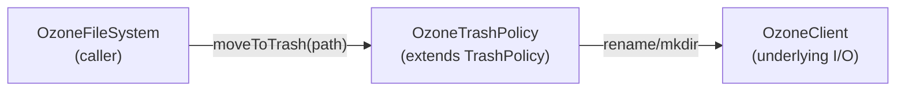

# ozonecommon / ozone-fs-common

_This feature page was generated from `study/atlas/components/ozonecommon/ozone-fs-common.md`. Author prose belongs above or below the BEGIN/END markers._

{/* BEGIN atlas-generated */}

**Classes:** 1    **Kinds:** service:1

## Overview

The `ozone-fs-common` feature group contains a single class: `OzoneTrashPolicy`. This is Ozone's implementation of the Hadoop `TrashPolicy` SPI that moves deleted files to a per-user `.Trash` directory instead of immediately removing them. It overrides `moveToTrash` to handle Ozone-specific path resolution: it creates the trash directory inside the appropriate bucket via the Ozone client rather than via a generic HDFS rename, and takes care of key-path normalization for both the legacy OBS and the FSO bucket layouts. The class was extracted from `OzoneFileSystem` in [HDDS-11749](https://issues.apache.org/jira/browse/HDDS-11749) to share the implementation with the S3 Gateway trash path.

## Diagram

## Class table

### Sub-feature: `fs.ozone`

| reading_order | fqcn | kind | logic | loc | study (min) | role |
|--:|---|---|---|--:|--:|---|
| 2199 | <Fqcn>org.apache.hadoop.fs.ozone.OzoneTrashPolicy</Fqcn> | service | mixed | 125~ | 30 | TrashPolicy for Ozone Specific Trash Operations. |

## Anchor details

_No logic-heavy anchors in this feature; the classes are primarily data / dto / config / cli._

## Design docs

- `hadoop-hdds/docs/content/design/trash.md` — describes the Ozone trash design that `OzoneTrashPolicy` implements

## Seminal JIRAs / PRs

- [HDDS-11749](https://issues.apache.org/jira/browse/HDDS-11749). Extract moveToTrash implementation to client code (created `OzoneTrashPolicy`)
- [HDDS-12789](https://issues.apache.org/jira/browse/HDDS-12789). Support move expired key to trash if trash is enabled
- [HDDS-12270](https://issues.apache.org/jira/browse/HDDS-12270). Fix license headers and imports for ozone-common

## Sharp edges

- `OzoneTrashPolicy` constructs the trash path using the current UGI username, but [HDDS-14177](https://issues.apache.org/jira/browse/HDDS-14177) noted that OFS should use the internal FS username instead. Callers in the S3 Gateway may have a different UGI than expected, leading to trash files in an unexpected location.

## Related features

- `components/ozonecommon/ozone-common-primitives.md` — `OFSPath` used for trash path resolution
- `components/OzoneFileSystem/ofs-core.md` — `OzoneFileSystem` delegates to `OzoneTrashPolicy`

## Self-quiz

1. What base class does `OzoneTrashPolicy` extend and what method does it override for Ozone-specific behavior?
2. Why was `OzoneTrashPolicy` extracted from `OzoneFileSystem` in [HDDS-11749](https://issues.apache.org/jira/browse/HDDS-11749)?
3. Where does the trash directory get created (which volume/bucket) when a user deletes a file via OFS?
4. How does `OzoneTrashPolicy` handle the case where the trash directory does not yet exist?
5. What is the relationship between `OzoneTrashPolicy` and the lifecycle management classes in `om-helpers-common`?

Answers

Answer 1: `OzoneTrashPolicy` extends Hadoop's `TrashPolicy` abstract class and overrides `moveToTrash(Path)` to use Ozone rename semantics instead of generic HDFS operations.
Answer 2: Extraction allowed the S3 Gateway and other clients to share the same trash logic without depending on `OzoneFileSystem` directly, reducing duplication.
Answer 3: The trash directory is created inside the user's home bucket under `/.Trash/<username>/` using the resolved OFS path. The exact bucket depends on whether OFS is using per-user or shared `/tmp` semantics.
Answer 4: `OzoneTrashPolicy.moveToTrash` calls `fs.mkdirs(trashDir)` before the rename; if the directory already exists, the call is a no-op.
Answer 5: `OzoneTrashPolicy` handles the operational lifecycle of moving files to trash at delete time. The `OmLCRule` expiration actions handle the second phase — actually deleting trash files after their retention period — as a background lifecycle event. The two interact via the key namespace but have no direct code dependency.

{/* END atlas-generated */}
