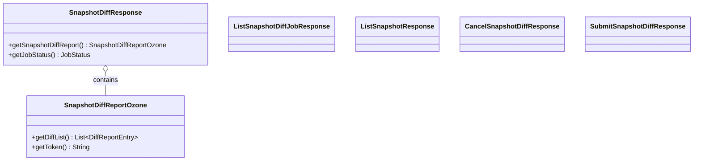

# ozonecommon / snapshot-common

_This feature page was generated from `study/atlas/components/ozonecommon/snapshot-common.md`. Author prose belongs above or below the BEGIN/END markers._

{/* BEGIN atlas-generated */}

**Classes:** 6    **Kinds:** dto:3, data:2, service:1

## Overview

The `snapshot-common` feature group contains the client-visible response types for the snapshot diff API. `SnapshotDiffReportOzone` is the top-level response for a completed diff report: it holds a list of `DiffReportEntry` objects (each carrying a change type — `CREATE`, `DELETE`, `MODIFY`, `RENAME` — and the affected key path), a continuation token for paginating large diffs, and the from/to snapshot names. `SnapshotDiffResponse` wraps the diff report alongside a `JobStatus` value to indicate whether the async job is still running, queued, or complete. The list response types (`ListSnapshotDiffJobResponse`, `ListSnapshotResponse`) are thin POJOs returned by the corresponding list APIs. `CancelSnapshotDiffResponse` and `SubmitSnapshotDiffResponse` carry job IDs and status codes for the submit/cancel operations introduced when the diff API was split into separate RPC calls ([HDDS-14829](https://issues.apache.org/jira/browse/HDDS-14829)).

## Diagram

## Class table

### Sub-feature: `ozone.snapshot`

| reading_order | fqcn | kind | logic | loc | study (min) | role |
|--:|---|---|---|--:|--:|---|
| 898 | <Fqcn>org.apache.hadoop.ozone.snapshot.SnapshotDiffReportOzone</Fqcn> | service | mixed | 125~ | 30 | Snapshot diff report. |
| 899 | <Fqcn>org.apache.hadoop.ozone.snapshot.SnapshotDiffResponse</Fqcn> | dto | data-only | 150~ | 10 | POJO for Snapshot Diff Response. |
| 900 | <Fqcn>org.apache.hadoop.ozone.snapshot.ListSnapshotDiffJobResponse</Fqcn> | dto | data-only | 25~ | 10 | POJO for list snapshot diff job API. |
| 901 | <Fqcn>org.apache.hadoop.ozone.snapshot.ListSnapshotResponse</Fqcn> | dto | data-only | 25~ | 10 | POJO for list snapshot info API. |
| 902 | <Fqcn>org.apache.hadoop.ozone.snapshot.CancelSnapshotDiffResponse</Fqcn> | dto | data-only | 25~ | 10 | POJO for Cancel Snapshot Diff Response. |
| 903 | <Fqcn>org.apache.hadoop.ozone.snapshot.SubmitSnapshotDiffResponse</Fqcn> | dto | data-only | 25~ | 10 | POJO for Submit Snapshot Diff Response. |

## Anchor details

_No logic-heavy anchors in this feature; the classes are primarily data / dto / config / cli._

## Design docs

- `hadoop-hdds/docs/content/design/efficient-snapdiff.md` — design for the snapshot diff algorithm; these POJOs carry its results

## Seminal JIRAs / PRs

- [HDDS-14829](https://issues.apache.org/jira/browse/HDDS-14829). Split snapshot diff job into separate RPC calls (introduced `SubmitSnapshotDiffResponse`, `CancelSnapshotDiffResponse`)
- [HDDS-12823](https://issues.apache.org/jira/browse/HDDS-12823). SnapshotDiffReportOzone#fromProtobuf empty token handling
- [HDDS-8802](https://issues.apache.org/jira/browse/HDDS-8802). Added pagination support for ListSnapshotDiff jobs (shaped `ListSnapshotDiffJobResponse`)
- [HDDS-8007](https://issues.apache.org/jira/browse/HDDS-8007). Add more detailed stages for SnapDiff job progress tracking
- [HDDS-9317](https://issues.apache.org/jira/browse/HDDS-9317). Provide an option for displaying Ozone snapshot diff output as JSON
- [HDDS-9983](https://issues.apache.org/jira/browse/HDDS-9983). Changed snapshot list API to return continuation token

## Sharp edges

- `SnapshotDiffReportOzone.fromProtobuf` has a guard for empty continuation tokens ([HDDS-12823](https://issues.apache.org/jira/browse/HDDS-12823)); callers that construct the object directly and pass an empty string rather than null as the token will produce a response that looks like there are no more pages when there may be. Use the proto-deserialization path rather than constructing `SnapshotDiffReportOzone` directly.

## Related features

- `components/ozonecommon/om-helpers-common.md` — `SnapshotDiffJob` tracks the server-side async job state corresponding to these client-side responses
- `components/ozonecommon/protocol-common.md` — `OzoneManagerProtocol` defines the snapshot diff RPC methods that return these types
- `components/OzoneManager/snapshot-manager.md` — OM server-side snapshot diff service populates these response objects

## Self-quiz

1. Why was the snapshot diff API split into submit/get RPCs ([HDDS-14829](https://issues.apache.org/jira/browse/HDDS-14829)), and which response classes correspond to each operation?
2. What does `SnapshotDiffReportOzone.getToken()` return when there are no more pages, and what bug was fixed by [HDDS-12823](https://issues.apache.org/jira/browse/HDDS-12823)?
3. Which change-type values can appear in a `DiffReportEntry` and what does each mean?
4. How does the async job flow work from the client's perspective — what sequence of calls does a client make to get a complete diff?
5. Where is the `JobStatus` enum defined and what are the valid state transitions?

Answers

Answer 1: The original single-call diff API would block indefinitely for large diffs. [HDDS-14829](https://issues.apache.org/jira/browse/HDDS-14829) split it into `submitSnapshotDiff` (returns `SubmitSnapshotDiffResponse` with a job ID) and `getSnapshotDiffReport` (returns `SnapshotDiffResponse` with status and paginated results). `CancelSnapshotDiffResponse` corresponds to the cancel operation.
Answer 2: `getToken()` returns null or empty string when there are no more pages. [HDDS-12823](https://issues.apache.org/jira/browse/HDDS-12823) fixed a bug in `fromProtobuf` where an empty proto `bytes` field was deserialized as an empty `ByteString` and then converted to an empty string rather than null, causing callers to think there was a non-null pagination token and make an extra (empty) page request.
Answer 3: `CREATE`, `DELETE`, `MODIFY`, and `RENAME`. `CREATE` means the key exists in `toSnapshot` but not `fromSnapshot`; `DELETE` is the reverse; `MODIFY` means the key exists in both but content differs; `RENAME` means the same key object moved to a different path.
Answer 4: (1) `submitSnapshotDiff(from, to)` → get job ID; (2) poll `getSnapshotDiffReport(jobId, token=null)` until `JobStatus == DONE`; (3) paginate by re-calling with the returned continuation token until token is null/empty.
Answer 5: `JobStatus` is defined inside `SnapshotDiffResponse` (or its companion `SnapshotDiffJob` on the server side). Valid transitions: `QUEUED` → `IN_PROGRESS` → `DONE`; `QUEUED`/`IN_PROGRESS` → `CANCELLED`; `IN_PROGRESS` → `FAILED`.

{/* END atlas-generated */}
