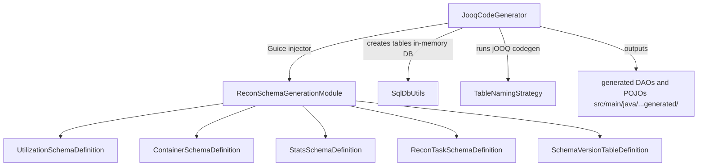

# recon / recon-codegen

_This feature page was generated from `study/atlas/components/recon/recon-codegen.md`. Author prose belongs above or below the BEGIN/END markers._

{/* BEGIN atlas-generated */}

**Classes:** 10    **Kinds:** service:8, interface:1, data:1

## Overview

The `recon-codegen` feature group is a build-time code-generation module. It is not deployed at runtime; instead, `JooqCodeGenerator` is invoked during the Maven build to generate jOOQ POJO and DAO classes from the SQL schema definitions. Each `ReconSchemaDefinition` implementation (`UtilizationSchemaDefinition`, `ContainerSchemaDefinition`, `StatsSchemaDefinition`, `ReconTaskSchemaDefinition`, `SchemaVersionTableDefinition`) defines the DDL for one group of Recon SQL tables using jOOQ's fluent DDL API. `ReconSchemaGenerationModule` binds all schema definitions into a Guice injector used by `JooqCodeGenerator` to create the tables in an in-memory H2 or Derby database, then run jOOQ code generation against the live schema. The generated sources under `src/main/java/org/apache/ozone/recon/schema/generated/` must not be hand-edited.

## Diagram

## Class table

### Sub-feature: `recon.codegen`

| reading_order | fqcn | kind | logic | loc | study (min) | role |
|--:|---|---|---|--:|--:|---|
| 2341 | <Fqcn>org.apache.ozone.recon.codegen.JooqCodeGenerator</Fqcn> | service | mixed | 100~ | 30 | Utility class that generates the Dao and Pojos for Recon schema. |
| 2342 | <Fqcn>org.apache.ozone.recon.codegen.TableNamingStrategy</Fqcn> | service | mixed | 25~ | 30 | Generate Table classes with a different name from POJOS to improve readability, loaded at runtime. |

### Sub-feature: `recon.schema`

| reading_order | fqcn | kind | logic | loc | study (min) | role |
|--:|---|---|---|--:|--:|---|
| 2343 | <Fqcn>org.apache.ozone.recon.schema.ReconSchemaDefinition</Fqcn> | interface | mixed | 25~ | 20 | Classes meant to initialize the SQL schema for Recon. |
| 2344 | <Fqcn>org.apache.ozone.recon.schema.UtilizationSchemaDefinition</Fqcn> | service | mixed | 75~ | 30 | Programmatic definition of Recon DDL. |
| 2345 | <Fqcn>org.apache.ozone.recon.schema.SchemaVersionTableDefinition</Fqcn> | service | mixed | 50~ | 30 | Class for managing the schema of the SchemaVersion table. |
| 2346 | <Fqcn>org.apache.ozone.recon.schema.SqlDbUtils</Fqcn> | service | mixed | 50~ | 30 | Constants and Helper functions for Recon SQL related stuff. |
| 2347 | <Fqcn>org.apache.ozone.recon.schema.ReconTaskSchemaDefinition</Fqcn> | service | mixed | 25~ | 30 | Class used to create tables that are required for Recon's task management. |
| 2348 | <Fqcn>org.apache.ozone.recon.schema.ReconSchemaGenerationModule</Fqcn> | service | mixed | 25~ | 30 | Bindings for DDL generation and used by JooqCodeGenerator. |
| 2349 | <Fqcn>org.apache.ozone.recon.schema.StatsSchemaDefinition</Fqcn> | service | mixed | 25~ | 30 | Class used to create tables that are required for storing Ozone statistics. |
| 2350 | <Fqcn>org.apache.ozone.recon.schema.ContainerSchemaDefinition</Fqcn> | service | mixed | 50~ | 10 | Class used to create tables that are required for tracking containers. |

## Anchor details

_No logic-heavy anchors in this feature; the classes are primarily data / dto / config / cli._

## Design docs

- No dedicated design doc under `hadoop-hdds/docs/content/` on this branch for the codegen module.
- The generated sources it produces are used by `recon-persistence` and `recon-upgrade`; their schema is documented implicitly in the DDL definitions in this feature.

## Seminal JIRAs / PRs

- [HDDS-12198](https://issues.apache.org/jira/browse/HDDS-12198). Exclude Recon generated code in coverage (confirms generated-source convention)
- TODO(verify) — no other HDDS JIRAs found that target the codegen module paths directly; the module is stable and changed rarely.

## Sharp edges

- `JooqCodeGenerator` must be run after any schema change to regenerate POJOs and DAOs. Failing to regenerate after a `ContainerSchemaDefinition` or `UtilizationSchemaDefinition` change will leave the generated classes out of sync with the live schema, causing jOOQ type mismatches at runtime that manifest as `ClassCastException` or SQL bind-parameter errors.
- `TableNamingStrategy` generates table class names that differ from the POJO names for readability. If a developer adds a new table and the naming strategy produces a conflict with an existing class name, code generation will silently overwrite the conflicting file.

## Related features

- `components/recon/recon-persistence.md` — `ContainerHealthSchemaManager` uses the generated `UnhealthyContainersTable` and `UnhealthyContainersRecord` POJOs produced by this module.
- `components/recon/recon-upgrade.md` — upgrade actions modify the tables defined here; changes must be reflected in new `ReconSchemaDefinition` implementations.
- `components/recon/recon-server.md` — `ReconSchemaManager` (in recon-server) calls the `ReconSchemaDefinition.initializeSchema()` methods at runtime to create tables that are not yet present.

## Self-quiz

1. `JooqCodeGenerator` is a build-time tool, not a runtime class. Where in the Maven build lifecycle does it run, and what is the output directory for generated sources?
2. `ReconSchemaGenerationModule` binds multiple `ReconSchemaDefinition` implementations. What Guice binding mechanism is used to collect all implementations into a single set for the generator?
3. `TableNamingStrategy` gives table classes different names from POJO classes. What problem does this solve in terms of Java class naming conflicts?
4. `ContainerSchemaDefinition` defines the `UNHEALTHY_CONTAINERS` table DDL. What column was added by [HDDS-11309](https://issues.apache.org/jira/browse/HDDS-11309) or [HDDS-13891](https://issues.apache.org/jira/browse/HDDS-13891) that required widening the `CONTAINER_STATE` column?
5. `UtilizationSchemaDefinition` defines the file-size distribution tables. What tables does it create and how are they used by the utilization endpoint?

Answers

Answer 1: `JooqCodeGenerator` runs during the `generate-sources` Maven lifecycle phase via a custom Maven plugin or exec-plugin invocation. The output directory is typically `src/main/java` under the `ozone-recon-schema` module (or equivalent generated-sources directory configured in the POM).
Answer 2: Guice's `Multibinder` (or `@IntoSet`) is used: each `ReconSchemaDefinition` implementation is bound into a `Set<ReconSchemaDefinition>` multibinding, which `JooqCodeGenerator` and `ReconSchemaManager` inject as a `Set` to iterate over all definitions.
Answer 3: jOOQ by default names both the table class and the POJO class after the SQL table name. `TableNamingStrategy` appends `Table` to the table class name, so `UNHEALTHY_CONTAINERS` generates `UnhealthyContainersTable` (for DSL) and `UnhealthyContainers` (for POJO), avoiding a Java class name collision.
Answer 4: The `CONTAINER_STATE` column was widened from 64 to 256 characters ([HDDS-11309](https://issues.apache.org/jira/browse/HDDS-11309)) to accommodate the new `QUASI_CLOSED_STUCK_REPLICA_DUE_TO_MISMATCH` state value introduced in [HDDS-13891](https://issues.apache.org/jira/browse/HDDS-13891).
Answer 5: `UtilizationSchemaDefinition` creates the `FILE_COUNT_BY_SIZE` table (file size range → count) and the `CONTAINER_COUNT_BY_SIZE` table (container size range → count). These are populated by `ContainerSizeCountTask` and queried by `UtilizationEndpoint` to serve the file-size distribution histogram on the Recon UI.

{/* END atlas-generated */}
