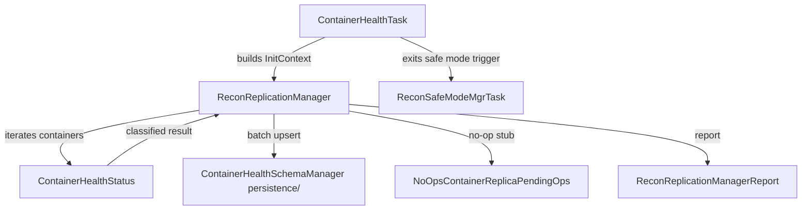

# recon / recon-fsck

_This feature page was generated from `study/atlas/components/recon/recon-fsck.md`. Author prose belongs above or below the BEGIN/END markers._

{/* BEGIN atlas-generated */}

**Classes:** 7    **Kinds:** service:6, dto:1

## Overview

The `recon-fsck` feature group implements Recon's read-only container health scan. `ReconReplicationManager` extends SCM's `ReplicationManager` and overrides `processAll()` to iterate every container, classify its health state using SCM's placement-policy logic, and write results into Recon's `UNHEALTHY_CONTAINERS` SQL table via `ContainerHealthSchemaManager`. Unlike SCM's version, it uses `NoOpsContainerReplicaPendingOps` so no replication commands are ever issued. `ContainerHealthTask` is the background scheduled task that drives one scan cycle: it initializes `ReconReplicationManager` via the `InitContext` builder, calls `processAll()`, and records metrics in `ContainerHealthTaskMetrics`. `ReconSafeModeMgrTask` tracks whether Recon has warmed up its container metadata enough to exit safe mode, gating API availability. `ContainerHealthStatus` is a value object that captures all health-relevant facts about one container for a single scan cycle.

## Diagram

## Class table

### Sub-feature: `recon.fsck`

| reading_order | fqcn | kind | logic | loc | study (min) | role |
|--:|---|---|---|--:|--:|---|
| 2351 | <Fqcn>org.apache.hadoop.ozone.recon.fsck.ReconReplicationManager</Fqcn> | service | logic-heavy | 425~ | 60 | Recon-specific extension of SCM's ReplicationManager. |
| 2352 | <Fqcn>org.apache.hadoop.ozone.recon.fsck.ContainerHealthStatus</Fqcn> | service | mixed | 125~ | 30 | Class which encapsulates all the information required to determine if a container and its replicas are correctly repl... |
| 2353 | <Fqcn>org.apache.hadoop.ozone.recon.fsck.ContainerHealthTask</Fqcn> | service | mixed | 75~ | 30 | New implementation of Container Health Task using Local ReplicationManager. |
| 2354 | <Fqcn>org.apache.hadoop.ozone.recon.fsck.ReconSafeModeMgrTask</Fqcn> | service | mixed | 75~ | 30 | Class that scans the list of containers and keeps track if recon warm up completed, and it exits safe mode. |
| 2355 | <Fqcn>org.apache.hadoop.ozone.recon.fsck.ReconReplicationManagerReport</Fqcn> | service | mixed | 25~ | 30 | Recon-specific report extension. |
| 2356 | <Fqcn>org.apache.hadoop.ozone.recon.fsck.NoOpsContainerReplicaPendingOps</Fqcn> | service | mixed | 25~ | 30 | No-op implementation of ContainerReplicaPendingOps for Recon's local ReplicationManager. |
| 2357 | <Fqcn>org.apache.hadoop.ozone.recon.fsck.MissingContainerInfo</Fqcn> | dto | data-only | 25~ | 10 | Class to encapsulate the information of a single missing Container. |

## Anchor details

### `ReconReplicationManager`

- **path:** `hadoop-ozone/recon/src/main/java/org/apache/hadoop/ozone/recon/fsck/ReconReplicationManager.java`
- **loc:** 425~    **difficulty:** 5    **study:** 60 min    **concurrency:** single-threaded    **persistence:** in-memory
- **entry points:** `build`, `start`
- **key collaborators:** `org.apache.hadoop.hdds.conf.ConfigurationSource`, `org.apache.hadoop.hdds.scm.PlacementPolicy`, `org.apache.hadoop.hdds.scm.container.ContainerHealthState`, `org.apache.hadoop.hdds.scm.container.ContainerID`, `org.apache.hadoop.hdds.scm.container.ContainerInfo`, `org.apache.hadoop.hdds.scm.container.ContainerManager`
- **test exemplar:** `hadoop-ozone/recon/src/test/java/org/apache/hadoop/ozone/recon/fsck/TestReconReplicationManager.java`
- **role:** Recon-specific extension of SCM's ReplicationManager.

The key override is `processAll()`: SCM's implementation caps the scan at a fixed sample size, but Recon's override removes that cap and scans every container. Results are batched in chunks of `PERSIST_CHUNK_SIZE` (50,000) before the SQL upsert to avoid holding enormous in-memory lists. The class javadoc explains why `NoOpsContainerReplicaPendingOps` does not cause false positives: health-state classification uses `isSufficientlyReplicated(false)` which ignores pending ops, so the stub is safe for read-only monitoring.

## Design docs

- `hadoop-hdds/docs/content/design/container-reconciliation.md` — design for container checksum reconciliation between SCM and Recon, directly related to the health-check and replica-mismatch detection work.
- `hadoop-hdds/docs/content/design/recon1.md` — original Recon design covering the container health monitoring goal.
- No dedicated design doc for the fsck scan itself under `hadoop-hdds/docs/content/` on this branch.

## Seminal JIRAs / PRs

- [HDDS-5965](https://issues.apache.org/jira/browse/HDDS-5965). Recon should be able to distinguish between containers with no replicas and those with all replicas as UNHEALTHY
- [HDDS-10370](https://issues.apache.org/jira/browse/HDDS-10370). Recon - Handle the pre-existing missing empty containers in clusters
- [HDDS-11887](https://issues.apache.org/jira/browse/HDDS-11887). Recon - Identify container replicas difference based on content checksums
- [HDDS-12156](https://issues.apache.org/jira/browse/HDDS-12156). Add container health task metrics in Recon
- [HDDS-13891](https://issues.apache.org/jira/browse/HDDS-13891). SCM-based health monitoring and batch processing in Recon
- [HDDS-15308](https://issues.apache.org/jira/browse/HDDS-15308). Improve ICR/FCR-driven container state recovery by plugging DN report processing gaps in Recon

## Sharp edges

- `ReconReplicationManager.processAll()` holds an in-memory batch of up to `PERSIST_CHUNK_SIZE` (50,000) `UnhealthyContainerRecord` objects before flushing to SQL. On clusters with millions of containers this can produce significant heap pressure per scan cycle. (`hadoop-ozone/recon/src/main/java/org/apache/hadoop/ozone/recon/fsck/ReconReplicationManager.java`, `PERSIST_CHUNK_SIZE = 50_000`)
- `NoOpsContainerReplicaPendingOps` stubs out pending-operations tracking. If SCM adds new health-check logic that relies on Phase 2 (pending-ops-aware) checks, Recon's classification will silently diverge from SCM's without a compile error. ([HDDS-13891](https://issues.apache.org/jira/browse/HDDS-13891) introduced this design.)
- `ReconSafeModeMgrTask` exits safe mode based on a warm-up threshold; if Recon's container replica table is populated slowly (e.g., after a restart with many ICR reports backlogged), health-check results will be absent from API responses until warm-up completes, with no visible error to the UI.

## Related features

- `components/recon/recon-persistence.md` — `ContainerHealthSchemaManager` stores the health scan results in the SQL `UNHEALTHY_CONTAINERS` table.
- `components/recon/recon-scm.md` — `ReconContainerManager` and `ReconNodeManager` provide the container and replica data the health scan reads.
- `components/recon/recon-tasks.md` — `ContainerHealthTask` is registered and scheduled by `ReconTaskControllerImpl`.
- `components/recon/recon-metrics.md` — `ContainerHealthTaskMetrics` records per-cycle timing for this feature.
- `components/recon/recon-api.md` — `ContainerEndpoint` exposes the `UNHEALTHY_CONTAINERS` table results populated here.

## Self-quiz

1. `ReconReplicationManager.processAll()` removes a limitation present in SCM's version. What is that limitation, and why is removing it safe for Recon's read-only use case?
2. Why does `ReconReplicationManager` use `NoOpsContainerReplicaPendingOps` instead of a real `ContainerReplicaPendingOps`, and what would break if a real implementation were used?
3. What is `PERSIST_CHUNK_SIZE` and why does `processAll()` flush results in chunks rather than one large batch?
4. `ReconSafeModeMgrTask` gates API availability. What event causes it to exit safe mode, and where is the warm-up threshold configured?
5. `ContainerHealthStatus` is a value object created per container per scan. What fields does it capture, and which placement policy is used to classify a Ratis container as under-replicated?

Answers

Answer 1: SCM's `ReplicationManager` caps the number of containers processed per cycle to avoid overloading a live cluster. Recon removes this cap in its `processAll()` override because Recon never issues replication commands — it only reads and classifies state — so scanning all containers is safe.
Answer 2: The real implementation tracks in-flight replication commands and feeds them into `isSufficientlyReplicated(true)` (Phase 2). Recon only needs Phase 1 (health determination without pending ops). Using a real implementation would require Recon to also maintain pending-ops state, which it does not, causing incorrect health classifications.
Answer 3: `PERSIST_CHUNK_SIZE = 50_000` limits memory usage per flush. Writing all results at once on a cluster with millions of containers would require holding a proportionally large list in memory before committing to SQL.
Answer 4: `ReconSafeModeMgrTask` exits safe mode when the ratio of containers with known replicas to total containers exceeds the warm-up threshold (configured via `ReconServerConfigKeys`). This is triggered after enough ICR/FCR reports have been processed by `ReconIncrementalContainerReportHandler`.
Answer 5: `ContainerHealthStatus` captures container info, replica set, expected replica count, and placement-policy evaluation results. For Ratis containers the `ratisContainerPlacement` policy (from `ContainerPlacementPolicyFactory`) is used; for EC containers the `ecContainerPlacement` policy is used.

{/* END atlas-generated */}
