# recon / recon-metrics

_This feature page was generated from `study/atlas/components/recon/recon-metrics.md`. Author prose belongs above or below the BEGIN/END markers._

{/* BEGIN atlas-generated */}

**Classes:** 8    **Kinds:** metrics:7, service:1

## Overview

The `recon-metrics` feature group collects and exposes Hadoop metrics for the major Recon subsystems. Each class follows the standard `@Metric`-annotated MutableCounterLong/MutableRate pattern and is registered with the Hadoop metrics framework at subsystem startup. `OzoneManagerSyncMetrics` tracks OM delta sync operations (applied deltas, failed deltas, lag). `ReconSyncMetrics` covers the full OM DB snapshot sync lifecycle. `ReconTaskControllerMetrics` records task-queue depth, execution times, and reprocess counts for the `ReconTaskControllerImpl` dispatcher. `ReconTaskMetrics` is per-task: each `ReconOmTask` implementation gets its own instance to track individual `process` and `reprocess` timing. `ReconScmContainerSyncMetrics` covers the SCM-to-Recon container sync cycle added in [HDDS-15413](https://issues.apache.org/jira/browse/HDDS-15413). `ContainerHealthTaskMetrics` records per-cycle timing for the fsck scan. `ReconTaskStatusMetrics` exports the SQL `RECON_TASK_STATUS` table as Prometheus metrics.

## Diagram

```mermaid
classDiagram
  class OzoneManagerSyncMetrics {
    +incrNumDeltaRequestsProcessed()
    +incrNumDeltaRequestsFailed()
    +updateSeqNumberLag(lag)
  }
  class ReconSyncMetrics {
    +incrNumSnapshotRequests()
    +incrNumSnapshotRequestsFailed()
  }
  class ReconTaskControllerMetrics {
    +incrTaskQueueWaitTime(ms)
    +incrTaskReprocessCount()
  }
  class ReconTaskMetrics {
    +updateProcessTime(ms)
    +updateReprocessTime(ms)
  }
  class ReconScmContainerSyncMetrics {
    +incrContainerSyncSuccessCount()
    +incrContainerSyncFailureCount()
  }
  class ContainerHealthTaskMetrics {
    +updateContainerHealthTaskTime(ms)
  }
  class ReconTaskStatusMetrics {
    +exportTaskStatusTable()
  }
click OzoneManagerSyncMetrics href "/class/ozonemanagersyncmetrics" "Open OzoneManagerSyncMetrics"
click ReconSyncMetrics href "/class/reconsyncmetrics" "Open ReconSyncMetrics"
click ReconTaskControllerMetrics href "/class/recontaskcontrollermetrics" "Open ReconTaskControllerMetrics"
click ReconTaskMetrics href "/class/recontaskmetrics" "Open ReconTaskMetrics"
click ReconScmContainerSyncMetrics href "/class/reconscmcontainersyncmetrics" "Open ReconScmContainerSyncMetrics"
click ContainerHealthTaskMetrics href "/class/containerhealthtaskmetrics" "Open ContainerHealthTaskMetrics"
click ReconTaskStatusMetrics href "/class/recontaskstatusmetrics" "Open ReconTaskStatusMetrics"
```

## Class table

### Sub-feature: `recon.metrics`

| reading_order | fqcn | kind | logic | loc | study (min) | role |
|--:|---|---|---|--:|--:|---|
| 2362 | <Fqcn>org.apache.hadoop.ozone.recon.metrics.Metric</Fqcn> | service | mixed | 25~ | 30 | Class for wrapping a metric response from org.apache.hadoop.ozone.recon.spi.MetricsServiceProvider. |
| 2363 | <Fqcn>org.apache.hadoop.ozone.recon.metrics.ReconScmContainerSyncMetrics</Fqcn> | metrics | mixed | 150~ | 20 | Metrics for Recon SCM container sync execution. |
| 2364 | <Fqcn>org.apache.hadoop.ozone.recon.metrics.ReconTaskControllerMetrics</Fqcn> | metrics | mixed | 100~ | 20 | Metrics for Recon Task Controller operations. |
| 2365 | <Fqcn>org.apache.hadoop.ozone.recon.metrics.ReconSyncMetrics</Fqcn> | metrics | mixed | 100~ | 20 | Metrics for Recon OM synchronization operations. |
| 2366 | <Fqcn>org.apache.hadoop.ozone.recon.metrics.ReconTaskMetrics</Fqcn> | metrics | mixed | 100~ | 20 | Per-task metrics for Recon task delta processing and reprocess operations. |
| 2367 | <Fqcn>org.apache.hadoop.ozone.recon.metrics.OzoneManagerSyncMetrics</Fqcn> | metrics | mixed | 75~ | 20 | Class for tracking metrics related to Ozone manager sync operations. |
| 2368 | <Fqcn>org.apache.hadoop.ozone.recon.metrics.ReconTaskStatusMetrics</Fqcn> | metrics | mixed | 50~ | 20 | Ship ReconTaskStatus table on persistent DB as a metrics. |
| 2369 | <Fqcn>org.apache.hadoop.ozone.recon.metrics.ContainerHealthTaskMetrics</Fqcn> | metrics | mixed | 25~ | 20 | Runtime metrics for ContainerHealthTask execution. |

## Anchor details

_No logic-heavy anchors in this feature; the classes are primarily data / dto / config / cli._

## Design docs

- No dedicated design doc under `hadoop-hdds/docs/content/` on this branch for Recon metrics specifically.
- `hadoop-hdds/docs/content/design/recon2.md` — covers the broader Recon observability enhancements, of which metrics are a part.

## Seminal JIRAs / PRs

- [HDDS-4196](https://issues.apache.org/jira/browse/HDDS-4196). Add an endpoint in Recon to query Prometheus (initial metrics proxy)
- [HDDS-6317](https://issues.apache.org/jira/browse/HDDS-6317). Export ReconTaskStatus as Prometheus metrics
- [HDDS-6333](https://issues.apache.org/jira/browse/HDDS-6333). Add a metric to record sequence number lag between Recon and OM
- [HDDS-11680](https://issues.apache.org/jira/browse/HDDS-11680). Enhance Recon Metrics For Improved Observability
- [HDDS-12156](https://issues.apache.org/jira/browse/HDDS-12156). Add container health task metrics in Recon
- [HDDS-13637](https://issues.apache.org/jira/browse/HDDS-13637). Add metrics in Recon OM sync for staging and queue-based implementation
- [HDDS-15413](https://issues.apache.org/jira/browse/HDDS-15413). Recon and SCM Container Sync Metrics addition

## Sharp edges

- `OzoneManagerSyncMetrics.incrNumDeltaRequestsFailed()` was found to increment the wrong counter in [HDDS-14848](https://issues.apache.org/jira/browse/HDDS-14848); callers should verify which counter maps to which failure mode.
- `ReconTaskStatusMetrics` exports the `RECON_TASK_STATUS` SQL table as metrics, but this table is written by `ReconTaskStatusUpdater` in a separate transaction. If the updater fails silently, the exported metrics will be stale without any alert.

## Related features

- `components/recon/recon-tasks.md` — `ReconTaskControllerImpl` and `ReconOmTask` implementations consume `ReconTaskControllerMetrics` and `ReconTaskMetrics`.
- `components/recon/recon-scm.md` — `ReconStorageContainerManagerFacade` uses `ReconScmContainerSyncMetrics`.
- `components/recon/recon-fsck.md` — `ContainerHealthTask` uses `ContainerHealthTaskMetrics`.
- `components/recon/recon-spi.md` — `OzoneManagerServiceProviderImpl` drives OM sync and updates `OzoneManagerSyncMetrics` and `ReconSyncMetrics`.

## Self-quiz

1. `OzoneManagerSyncMetrics` tracks sequence-number lag. Which method updates this metric, and what does the lag value represent in terms of OM operations?
2. `ReconTaskMetrics` is per-task rather than global. How does `ReconTaskControllerImpl` obtain one instance per registered `ReconOmTask`, and where is each instance registered with the Hadoop metrics framework?
3. `ReconTaskStatusMetrics` exports the SQL `RECON_TASK_STATUS` table. What is the relationship between this class and `ReconTaskStatusUpdater`?
4. [HDDS-14848](https://issues.apache.org/jira/browse/HDDS-14848) reports that `OzoneManagerSyncMetrics.incrNumDeltaRequestsFailed()` incremented the wrong value. What was the actual bug described in that JIRA?
5. `Metric` (the single non-metrics-annotated class in this group) wraps a Prometheus metric response. What does it encapsulate and how is it used by `MetricsProxyEndpoint`?

Answers

Answer 1: `OzoneManagerSyncMetrics.updateSeqNumberLag(lag)` updates the lag. The lag represents the difference between OM's current sequence number and the last sequence number Recon successfully applied; a large lag means Recon's snapshot is far behind OM.
Answer 2: `ReconTaskControllerImpl` creates a `ReconTaskMetrics` instance for each registered task using the task name as the metrics-source name. Each instance is registered via `DefaultMetricsSystem.instance().register(taskName, ...)`.
Answer 3: `ReconTaskStatusMetrics` reads from the `RECON_TASK_STATUS` SQL table (written by `ReconTaskStatusUpdater`) and exports the data as Hadoop MutableGaugeLong metrics, making it visible to Prometheus scrapers. It is not a live listener; it reads the table on each metrics collection cycle.
Answer 4: The bug was that `incrNumDeltaRequestsFailed()` called `incrNumSnapshotRequestsFailed()` (or vice-versa) instead of the correct counter, causing the failure count for delta requests to be attributed to snapshot requests.
Answer 5: `Metric` wraps a single Prometheus metric response JSON object (name, help, type, value). `MetricsProxyEndpoint` fetches the raw Prometheus text from the configured HTTP endpoint, parses individual lines, and wraps each parsed metric in a `Metric` instance for JSON serialization.

{/* END atlas-generated */}
