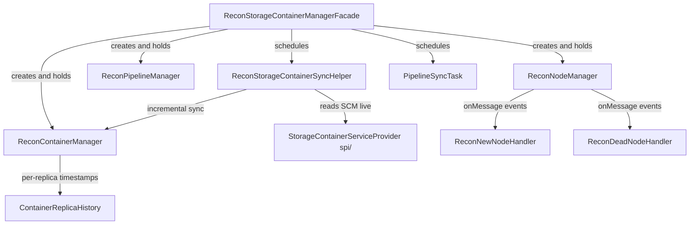

# recon / recon-scm

_This feature page was generated from `study/atlas/components/recon/recon-scm.md`. Author prose belongs above or below the BEGIN/END markers._

{/* BEGIN atlas-generated */}

**Classes:** 22    **Kinds:** service:19, abstract:1, config:1, factory:1

## Overview

The `recon-scm` feature group implements Recon's read-only shadow of the SCM service. `ReconStorageContainerManagerFacade` is the top-level entry point: it wires up a stripped-down SCM using Guice-injected real SCM components (container manager, pipeline manager, node manager) alongside Recon-specific stubs (no Raft, no command dispatch). `ReconStorageContainerSyncHelper` runs a scheduled sync cycle that fetches container metadata from a live SCM and applies incremental updates (new OPEN containers, state transitions, DELETED cleanup) to Recon's local store using `ReconContainerManager`. `ReconContainerManager` extends `ContainerManagerImpl` and adds Recon-specific per-replica timestamp tracking via `ContainerReplicaHistory`. `ReconNodeManager` persists datanode registrations by extending SCM's node manager and storing node info in a local RocksDB. Event handlers (`ReconNewNodeHandler`, `ReconDeadNodeHandler`, `ReconStaleNodeHandler`, `ReconContainerReportHandler`, `ReconIncrementalContainerReportHandler`) process DN heartbeat events from the embedded datanode RPC server.

## Diagram

## Class table

### Sub-feature: `recon.scm`

| reading_order | fqcn | kind | logic | loc | study (min) | role |
|--:|---|---|---|--:|--:|---|
| 2380 | <Fqcn>org.apache.hadoop.ozone.recon.scm.ReconScmTask</Fqcn> | abstract | mixed | 50~ | 30 | Any background task that keeps SCM's metadata up to date. |
| 2381 | <Fqcn>org.apache.hadoop.ozone.recon.scm.ReconStorageContainerManagerFacade</Fqcn> | service | logic-heavy | 825~ | 60 | Recon's 'lite' version of SCM. |
| 2382 | <Fqcn>org.apache.hadoop.ozone.recon.scm.ReconStorageContainerSyncHelper</Fqcn> | service | logic-heavy | 375~ | 45 | Helper class that performs targeted incremental sync between SCM and Recon container metadata. |
| 2383 | <Fqcn>org.apache.hadoop.ozone.recon.scm.ReconContainerManager</Fqcn> | service | logic-heavy | 325~ | 45 | Recon's overriding implementation of SCM's Container Manager. |
| 2384 | <Fqcn>org.apache.hadoop.ozone.recon.scm.ReconNodeManager</Fqcn> | service | logic-heavy | 200~ | 45 | Recon SCM's Node manager that includes persistence. |
| 2385 | <Fqcn>org.apache.hadoop.ozone.recon.scm.ReconPipelineManager</Fqcn> | service | mixed | 100~ | 30 | Recon's overriding implementation of SCM's Pipeline Manager. |
| 2386 | <Fqcn>org.apache.hadoop.ozone.recon.scm.PipelineSyncTask</Fqcn> | service | mixed | 75~ | 30 | Background pipeline sync task that queries pipelines in SCM, and removes any obsolete pipeline. |
| 2387 | <Fqcn>org.apache.hadoop.ozone.recon.scm.ContainerReplicaHistory</Fqcn> | service | mixed | 75~ | 30 | A ContainerReplica timestamp class that tracks first and last seen time. |
| 2388 | <Fqcn>org.apache.hadoop.ozone.recon.scm.ReconPipelineReportHandler</Fqcn> | service | mixed | 50~ | 30 | Recon's implementation of Pipeline Report handler. |
| 2389 | <Fqcn>org.apache.hadoop.ozone.recon.scm.ReconDeadNodeHandler</Fqcn> | service | mixed | 50~ | 30 | Recon's handling of Dead node. |
| 2390 | <Fqcn>org.apache.hadoop.ozone.recon.scm.ReconPolicyProvider</Fqcn> | service | mixed | 25~ | 30 | PolicyProvider for Recon protocols. |
| 2391 | <Fqcn>org.apache.hadoop.ozone.recon.scm.ContainerReplicaHistoryList</Fqcn> | service | mixed | 25~ | 30 | A list of ContainerReplicaHistory. |
| 2392 | <Fqcn>org.apache.hadoop.ozone.recon.scm.ReconContainerReportQueue</Fqcn> | service | mixed | 25~ | 30 | Customized queue to handle multiple ICR report together. |
| 2393 | <Fqcn>org.apache.hadoop.ozone.recon.scm.ReconSCMDBDefinition</Fqcn> | service | mixed | 25~ | 30 | Recon SCM db file for ozone. |
| 2394 | <Fqcn>org.apache.hadoop.ozone.recon.scm.ReconContainerReportHandler</Fqcn> | service | mixed | 25~ | 30 | Recon's container report handler. |
| 2395 | <Fqcn>org.apache.hadoop.ozone.recon.scm.ReconDatanodeProtocolServer</Fqcn> | service | mixed | 25~ | 30 | Recon's Datanode protocol server extended from SCM. |
| 2396 | <Fqcn>org.apache.hadoop.ozone.recon.scm.ReconSafeModeManager</Fqcn> | service | mixed | 25~ | 30 | Recon's stub implementation of SCM's SafeMode manager. |
| 2397 | <Fqcn>org.apache.hadoop.ozone.recon.scm.ReconNewNodeHandler</Fqcn> | service | mixed | 25~ | 30 | Adds the new node to Recon Node DB. |
| 2398 | <Fqcn>org.apache.hadoop.ozone.recon.scm.ReconStaleNodeHandler</Fqcn> | service | mixed | 25~ | 30 | Recon's handling of Stale node. |
| 2399 | <Fqcn>org.apache.hadoop.ozone.recon.scm.ReconIncrementalContainerReportHandler</Fqcn> | service | mixed | 25~ | 30 | Recon ICR handler. |
| 2400 | <Fqcn>org.apache.hadoop.ozone.recon.scm.ReconStorageConfig</Fqcn> | config | data-only | 50~ | 20 | Recon's extension of SCMStorageConfig. |
| 2401 | <Fqcn>org.apache.hadoop.ozone.recon.scm.ReconPipelineFactory</Fqcn> | factory | mixed | 25~ | 20 | Class to stub out SCM's pipeline providers. |

## Anchor details

### `ReconStorageContainerManagerFacade`

- **path:** `hadoop-ozone/recon/src/main/java/org/apache/hadoop/ozone/recon/scm/ReconStorageContainerManagerFacade.java`
- **loc:** 825~    **difficulty:** 5    **study:** 60 min    **concurrency:** thread-safe    **persistence:** in-memory
- **entry points:** `start`
- **key collaborators:** `org.apache.hadoop.hdds.conf.OzoneConfiguration`, `org.apache.hadoop.hdds.conf.ReconfigurationHandler`, `org.apache.hadoop.hdds.protocol.DatanodeDetails`, `org.apache.hadoop.hdds.protocol.DatanodeID`, `org.apache.hadoop.hdds.scm.PlacementPolicy`, `org.apache.hadoop.hdds.scm.ScmUtils`
- **test exemplar:** `hadoop-ozone/recon/src/test/java/org/apache/hadoop/ozone/recon/scm/TestReconStorageContainerManagerFacade.java`
- **role:** Recon's 'lite' version of SCM.

The facade starts a real `ReconDatanodeProtocolServer` so datanodes can register and send heartbeats directly to Recon. It wires the event queue with Recon-specific handlers (`ReconContainerReportHandler`, `ReconIncrementalContainerReportHandler`) so all ICR/FCR report processing flows through the standard SCM event-dispatch machinery. Notably, it supplies `ReconSafeModeManager` (a stub) and `ReconPipelineFactory` (no-op providers) so pipeline creation is suppressed; Recon's pipeline state is populated only through the `PipelineSyncTask` pull from SCM.

### `ReconStorageContainerSyncHelper`

- **path:** `hadoop-ozone/recon/src/main/java/org/apache/hadoop/ozone/recon/scm/ReconStorageContainerSyncHelper.java`
- **loc:** 375~    **difficulty:** 4    **study:** 45 min    **concurrency:** single-threaded    **persistence:** in-memory
- **key collaborators:** `org.apache.hadoop.hdds.conf.OzoneConfiguration`, `org.apache.hadoop.hdds.scm.container.ContainerID`, `org.apache.hadoop.hdds.scm.container.ContainerInfo`, `org.apache.hadoop.hdds.scm.container.ContainerNotFoundException`, `org.apache.hadoop.hdds.scm.container.common.helpers.ContainerWithPipeline`, `org.apache.hadoop.ozone.common.statemachine.InvalidStateTransitionException`
- **test exemplar:** `hadoop-ozone/recon/src/test/java/org/apache/hadoop/ozone/recon/scm/TestReconStorageContainerSyncHelper.java`
- **role:** Helper class that performs targeted incremental sync between SCM and Recon container metadata.

The sync class deliberately skips `CLOSING` and `DELETING` intermediate states; only `OPEN`, `QUASI_CLOSED`, `CLOSED`, and `DELETED` are reconciled each cycle. For OPEN containers it uses a high-watermark (last known max container ID) so only newly created containers are fetched. For DELETED it scans Recon's known set against SCM's reply and removes entries that SCM no longer reports. Invalid state transitions (e.g., SCM reports OPEN but Recon already has CLOSED) are silently skipped with a log warning.

### `ReconContainerManager`

- **path:** `hadoop-ozone/recon/src/main/java/org/apache/hadoop/ozone/recon/scm/ReconContainerManager.java`
- **loc:** 325~    **difficulty:** 4    **study:** 45 min    **concurrency:** thread-safe    **persistence:** in-memory
- **key collaborators:** `org.apache.hadoop.hdds.protocol.DatanodeDetails`, `org.apache.hadoop.hdds.protocol.DatanodeID`, `org.apache.hadoop.hdds.scm.container.ContainerChecksums`, `org.apache.hadoop.hdds.scm.container.ContainerID`, `org.apache.hadoop.hdds.scm.container.ContainerInfo`, `org.apache.hadoop.hdds.scm.container.ContainerManagerImpl`
- **test exemplar:** `hadoop-ozone/recon/src/test/java/org/apache/hadoop/ozone/recon/scm/TestReconContainerManager.java`
- **role:** Recon's overriding implementation of SCM's Container Manager.

Overrides `updateContainerReplica()` to also update `ContainerReplicaHistory` (first-seen and last-seen timestamps) in `ReconContainerMetadataManagerImpl`. It also stores `ContainerChecksums` per replica to support the checksum-based replica-mismatch detection introduced in [HDDS-11887](https://issues.apache.org/jira/browse/HDDS-11887). The `ConcurrentHashMap` for replica checksums is the thread-safety mechanism for concurrent ICR report processing.

### `ReconNodeManager`

- **path:** `hadoop-ozone/recon/src/main/java/org/apache/hadoop/ozone/recon/scm/ReconNodeManager.java`
- **loc:** 200~    **difficulty:** 4    **study:** 45 min    **concurrency:** single-threaded    **persistence:** in-memory
- **entry points:** `onMessage`
- **key collaborators:** `org.apache.hadoop.hdds.conf.OzoneConfiguration`, `org.apache.hadoop.hdds.protocol.DatanodeDetails`, `org.apache.hadoop.hdds.protocol.DatanodeID`, `org.apache.hadoop.hdds.scm.ha.SCMContext`, `org.apache.hadoop.hdds.scm.net.NetworkTopology`, `org.apache.hadoop.hdds.scm.node.NodeStatus`
- **test exemplar:** `hadoop-ozone/recon/src/test/java/org/apache/hadoop/ozone/recon/scm/TestReconNodeManager.java`
- **role:** Recon SCM's Node manager that includes persistence.

Extends SCM's `NodeStateManager` and adds persistence: node registrations are written to `ReconSCMDBDefinition`'s node table in RocksDB so they survive Recon restarts. On `onMessage(RegisteredNode)` it calls `addNode()` to persist the registration. The `NodeStatus` is maintained in-memory as in SCM, but on restart the node table is reloaded into the in-memory state map before the heartbeat dispatcher starts.

## Design docs

- `hadoop-hdds/docs/content/design/recon1.md` — original Recon design covering the SCM shadow approach and its limitations.
- `hadoop-hdds/docs/content/design/container-reconciliation.md` — design for the checksum-based container reconciliation feature implemented by `ReconContainerManager`.
- `hadoop-hdds/docs/content/design/decommissioning.md` — decommissioning flow that involves `ReconNodeManager` and `NodeEndpoint`.

## Seminal JIRAs / PRs

- [HDDS-13891](https://issues.apache.org/jira/browse/HDDS-13891). SCM-based health monitoring and batch processing in Recon
- [HDDS-14730](https://issues.apache.org/jira/browse/HDDS-14730). Update Recon container sync to use container IDs
- [HDDS-14758](https://issues.apache.org/jira/browse/HDDS-14758). Mismatch in Recon container count between Cluster State and Container Summary
- [HDDS-15165](https://issues.apache.org/jira/browse/HDDS-15165). Recon: Add admin REST APIs to trigger, monitor, and cancel SCM DB snapshot sync
- [HDDS-15308](https://issues.apache.org/jira/browse/HDDS-15308). Improve ICR/FCR-driven container state recovery by plugging DN report processing gaps in Recon
- [HDDS-15413](https://issues.apache.org/jira/browse/HDDS-15413). Recon and SCM Container Sync Metrics addition

## Sharp edges

- `ReconStorageContainerSyncHelper` skips `CLOSING` and `DELETING` intermediate states by design. If a container transitions through these states and back to `OPEN` between sync cycles, Recon may miss the intermediate states and end up with an inconsistent view. ([HDDS-14758](https://issues.apache.org/jira/browse/HDDS-14758) fixed a related count mismatch.)
- `ReconContainerManager` stores replica checksums in a `ConcurrentHashMap` that is not persisted; on Recon restart the checksum map is empty until ICR reports repopulate it. Any checksum-mismatch API call immediately after restart will return no mismatches. ([HDDS-11887](https://issues.apache.org/jira/browse/HDDS-11887))
- `ReconNodeManager` persists node registrations but node status is in-memory only. After a Recon restart, all nodes start in `HEALTHY` state regardless of their actual operational state until the next heartbeat cycle updates them. This can cause `NodeEndpoint` to return stale state for a brief window.

## Related features

- `components/recon/recon-fsck.md` — `ReconReplicationManager` reads container and replica data managed by this feature group.
- `components/recon/recon-api.md` — `NodeEndpoint`, `PipelineEndpoint`, and `ContainerEndpoint` serve data from `ReconNodeManager`, `ReconPipelineManager`, and `ReconContainerManager`.
- `components/recon/recon-metrics.md` — `ReconScmContainerSyncMetrics` records `ReconStorageContainerSyncHelper` sync-cycle statistics.
- `components/recon/recon-spi.md` — `StorageContainerServiceProviderImpl` is the SCM client used by `ReconStorageContainerSyncHelper` to fetch live container lists.

## Self-quiz

1. `ReconStorageContainerSyncHelper` skips two container lifecycle states. Which are they and what is the documented reason?
2. `ReconStorageContainerManagerFacade.start()` starts a `ReconDatanodeProtocolServer`. What does this server do and why does Recon need its own RPC server for datanode heartbeats?
3. `ReconContainerManager.updateContainerReplica()` does something extra compared to `ContainerManagerImpl`. What is it and what table does it write to?
4. `ReconNodeManager` inherits from SCM's node manager. What specific capability does it add that the parent class does not provide?
5. `PipelineSyncTask` pulls pipeline state from SCM rather than building it from datanode reports. What is the interval configured by and how is it different from `ReconStorageContainerSyncHelper`'s sync?

Answers

Answer 1: `CLOSING` and `DELETING` are skipped because they are transient intermediate states; by the time a sync cycle runs the container is likely already in `CLOSED` or `DELETED` state. Tracking them would require more frequent syncs to be accurate.
Answer 2: `ReconDatanodeProtocolServer` accepts heartbeat and registration RPCs directly from datanodes. Recon needs its own RPC server so datanodes can report their container replica state (FCR/ICR) to Recon independently of SCM, enabling Recon to maintain a live replica picture without polling SCM.
Answer 3: `ReconContainerManager.updateContainerReplica()` additionally updates `ContainerReplicaHistory` in `ReconContainerMetadataManagerImpl`'s `REPLICA_HISTORY_V2` RocksDB column family, recording first-seen and last-seen timestamps per (container, datanode) pair.
Answer 4: `ReconNodeManager` adds RocksDB persistence of node registrations so that nodes registered before a Recon restart are not lost. The SCM parent class stores nodes only in memory.
Answer 5: `PipelineSyncTask` interval is configured via `OZONE_RECON_SCM_PIPELINE_SYNC_INTERVAL` (default 10 minutes). It is a pull from the SCM `StorageContainerLocationProtocol`, whereas `ReconStorageContainerSyncHelper` syncs container metadata on a shorter cycle configured by `OZONE_RECON_SCM_CONTAINER_SYNC_TASK_INTERVAL_DELAY`.

{/* END atlas-generated */}
