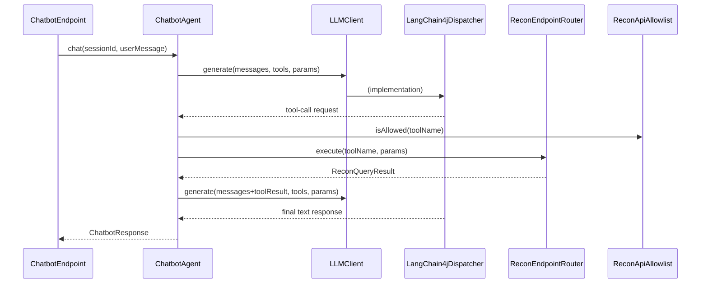

# recon / recon-server

_This feature page was generated from `study/atlas/components/recon/recon-server.md`. Author prose belongs above or below the BEGIN/END markers._

{/* BEGIN atlas-generated */}

**Classes:** 32    **Kinds:** service:23, config:3, interface:1, factory:1, util:1, data:1, metrics:1, exception:1

## Overview

The `recon-server` feature group contains the top-level process bootstrap, the Guice DI wiring, and the chatbot LLM integration. `ReconServer` implements `Callable<Void>` and orchestrates the entire startup sequence: certificate init, Guice injector construction via `ReconControllerModule`, HTTP server launch, SCM facade start, and OM sync start. `ReconUtils` is a large utility class providing HTTP download helpers (used to fetch OM/SCM snapshots), key-iteration utilities, and CSV-streaming output used by export endpoints. The chatbot subsystem has three layers: `ChatbotAgent` drives the multi-turn tool-use loop using `LLMClient`; `LangChain4jDispatcher` implements `LLMClient` using the LangChain4j library to call a configured LLM backend (OpenAI, Gemini, or a gateway); `ReconEndpointRouter` maps chatbot tool names to real Recon JAX-RS bean calls without HTTP loopback; and `LlmToolSpecFactory` builds the JSON schema for each tool from JAX-RS endpoint annotations.

## Diagram

## Class table

### Sub-feature: `chatbot.agent`

| reading_order | fqcn | kind | logic | loc | study (min) | role |
|--:|---|---|---|--:|--:|---|
| 1175 | <Fqcn>org.apache.hadoop.ozone.recon.chatbot.agent.ChatbotAgent</Fqcn> | service | logic-heavy | 375~ | 45 | Main chatbot agent that orchestrates the conversation flow. |
| 1176 | <Fqcn>org.apache.hadoop.ozone.recon.chatbot.agent.ChatbotUtils</Fqcn> | service | mixed | 75~ | 30 | Utility methods for the Chatbot Agent. |
| 1177 | <Fqcn>org.apache.hadoop.ozone.recon.chatbot.agent.LlmToolSpecFactory</Fqcn> | factory | logic-heavy | 200~ | 20 | Builds native LLM tool specifications (names, descriptions, parameters). |

### Sub-feature: `chatbot.llm`

| reading_order | fqcn | kind | logic | loc | study (min) | role |
|--:|---|---|---|--:|--:|---|
| 1178 | <Fqcn>org.apache.hadoop.ozone.recon.chatbot.llm.LLMClient</Fqcn> | interface | mixed | 100~ | 20 | LLMClient is the "Master Contract" for the whole Chatbot system. |
| 1179 | <Fqcn>org.apache.hadoop.ozone.recon.chatbot.llm.LangChain4jDispatcher</Fqcn> | service | logic-heavy | 325~ | 45 | LLMClient implementation backed by &lt;a href="https://github.com/langchain4j/langchain4j"&gt;LangChain4j&lt;/a&gt;. |
| 1180 | <Fqcn>org.apache.hadoop.ozone.recon.chatbot.llm.LlmRouting</Fqcn> | service | mixed | 75~ | 30 | Resolves user-requested provider/model into an effective pair using configured defaults. |
| 1181 | <Fqcn>org.apache.hadoop.ozone.recon.chatbot.llm.GenParams</Fqcn> | service | mixed | 25~ | 30 | Immutable generation settings for a single LLM call. |

### Sub-feature: `chatbot.recon`

| reading_order | fqcn | kind | logic | loc | study (min) | role |
|--:|---|---|---|--:|--:|---|
| 1182 | <Fqcn>org.apache.hadoop.ozone.recon.chatbot.recon.ReconEndpointRouter</Fqcn> | service | logic-heavy | 200~ | 45 | Dispatches chatbot tool names to in-process Recon JAX-RS endpoint beans (no HTTP loopback). |
| 1183 | <Fqcn>org.apache.hadoop.ozone.recon.chatbot.recon.ReconApiAllowlist</Fqcn> | service | mixed | 50~ | 30 | Security allowlist of Recon API tools the chatbot may query. |
| 1184 | <Fqcn>org.apache.hadoop.ozone.recon.chatbot.recon.ReconQueryExecutor</Fqcn> | service | mixed | 25~ | 30 | Single chokepoint that executes authorized Recon data queries on behalf of the chatbot. |
| 1185 | <Fqcn>org.apache.hadoop.ozone.recon.chatbot.recon.ReconQueryResult</Fqcn> | service | mixed | 25~ | 30 | JSON payload and execution metadata returned by ReconQueryExecutor. |
| 1186 | <Fqcn>org.apache.hadoop.ozone.recon.chatbot.recon.ReconResponseUnwrapper</Fqcn> | service | mixed | 25~ | 30 | Converts a JAX-RS Response entity to JsonNode for the chatbot pipeline. |

### Sub-feature: `ozone.recon`

| reading_order | fqcn | kind | logic | loc | study (min) | role |
|--:|---|---|---|--:|--:|---|
| 1187 | <Fqcn>org.apache.hadoop.ozone.recon.ReconUtils</Fqcn> | service | logic-heavy | 475~ | 60 | Recon Utility class. |
| 1188 | <Fqcn>org.apache.hadoop.ozone.recon.ReconServer</Fqcn> | service | logic-heavy | 300~ | 45 | Recon server main class that stops and starts recon services. |
| 1189 | <Fqcn>org.apache.hadoop.ozone.recon.ReconControllerModule</Fqcn> | service | mixed | 175~ | 45 | Guice controller that defines concrete bindings. |
| 1190 | <Fqcn>org.apache.hadoop.ozone.recon.TarExtractor</Fqcn> | service | mixed | 100~ | 30 | Utility class for extracting files from a TAR archive using a multi-threaded approach. |
| 1191 | <Fqcn>org.apache.hadoop.ozone.recon.ReconConstants</Fqcn> | service | mixed | 75~ | 30 | Recon Server constants file. |
| 1192 | <Fqcn>org.apache.hadoop.ozone.recon.ReconRestServletModule</Fqcn> | service | mixed | 75~ | 30 | Class to scan API Service classes and bind them to the injector. |
| 1193 | <Fqcn>org.apache.hadoop.ozone.recon.ReconHttpServer</Fqcn> | service | mixed | 50~ | 30 | Recon http server with recon supplied config defaults. |
| 1194 | <Fqcn>org.apache.hadoop.ozone.recon.ReconSchemaManager</Fqcn> | service | mixed | 50~ | 30 | Class used to create Recon SQL tables. |
| 1195 | <Fqcn>org.apache.hadoop.ozone.recon.ReconSchemaVersionTableManager</Fqcn> | service | mixed | 50~ | 30 | Manager for handling the Recon Schema Version table. |
| 1196 | <Fqcn>org.apache.hadoop.ozone.recon.ReconGuiceServletContextListener</Fqcn> | service | mixed | 25~ | 30 | Servlet Context Listener that provides the Guice injector. |
| 1197 | <Fqcn>org.apache.hadoop.ozone.recon.ConfigurationProvider</Fqcn> | service | mixed | 25~ | 30 | Ozone Configuration Provider. |
| 1198 | <Fqcn>org.apache.hadoop.ozone.recon.ReconResponseUtils</Fqcn> | service | mixed | 25~ | 30 | Recon API Response Utility class. |
| 1199 | <Fqcn>org.apache.hadoop.ozone.recon.ReconServerConfigKeys</Fqcn> | config | data-only | 175~ | 20 | This class contains constants for Recon configuration keys. |
| 1200 | <Fqcn>org.apache.hadoop.ozone.recon.ReconSqlDbConfig</Fqcn> | config | data-only | 175~ | 20 | The configuration class for the Recon SQL DB. |
| 1201 | <Fqcn>org.apache.hadoop.ozone.recon.ReconContext</Fqcn> | service | mixed | 75~ | 10 | ngle source of truth for some key information shared across multiple modules within Recon, including: 1) ReconNodeMan... |
| 1202 | <Fqcn>org.apache.hadoop.ozone.recon.MetricsServiceProviderFactory</Fqcn> | metrics | mixed | 50~ | 20 | Factory class that is used to get the instance of configured Metrics Service Provider. |

### Sub-feature: `recon.chatbot`

| reading_order | fqcn | kind | logic | loc | study (min) | role |
|--:|---|---|---|--:|--:|---|
| 1203 | <Fqcn>org.apache.hadoop.ozone.recon.chatbot.ChatbotModule</Fqcn> | service | mixed | 25~ | 30 | Guice module for Chatbot dependency injection. |
| 1204 | <Fqcn>org.apache.hadoop.ozone.recon.chatbot.ChatbotConfigKeys</Fqcn> | config | data-only | 75~ | 20 | Configuration keys for Recon Chatbot service. |
| 1205 | <Fqcn>org.apache.hadoop.ozone.recon.chatbot.ChatbotException</Fqcn> | exception | data-only | 25~ | 10 | Checked exception thrown by <Fqcn>org.apache.hadoop.ozone.recon.chatbot.agent.ChatbotAgent</Fqcn> when query processing fails. |

### Sub-feature: `recon.codec`

| reading_order | fqcn | kind | logic | loc | study (min) | role |
|--:|---|---|---|--:|--:|---|
| 1206 | <Fqcn>org.apache.hadoop.ozone.recon.codec.NSSummaryCodec</Fqcn> | util | mixed | 100~ | 20 | Codec to serialize/deserialize NSSummary. |

## Anchor details

### `ReconUtils`

- **path:** `hadoop-ozone/recon/src/main/java/org/apache/hadoop/ozone/recon/ReconUtils.java`
- **loc:** 475~    **difficulty:** 5    **study:** 60 min    **concurrency:** actor/queue    **persistence:** in-memory
- **key collaborators:** `org.apache.hadoop.hdds.HddsConfigKeys`, `org.apache.hadoop.hdds.conf.ConfigurationSource`, `org.apache.hadoop.hdds.conf.OzoneConfiguration`, `org.apache.hadoop.hdds.scm.ScmUtils`, `org.apache.hadoop.hdds.scm.ha.SCMNodeDetails`, `org.apache.hadoop.hdds.scm.server.OzoneStorageContainerManager`
- **test exemplar:** `hadoop-ozone/recon/src/test/java/org/apache/hadoop/ozone/recon/TestReconUtils.java`
- **role:** Recon Utility class.

`ReconUtils.getReconDbDir()` computes the Recon metadata directory from config, used by multiple subsystems. `makeHttpCall()` performs the HTTP GET used to download OM/SCM snapshots, with a configurable connection/read timeout and support for Kerberos-authenticated connections via `URLConnectionFactory`. `writeStreamingOutput()` uses Apache Commons CSV `CSVPrinter` to stream a jOOQ `Cursor` into an HTTP response body, forming the core of the CSV export feature.

### `ChatbotAgent`

- **path:** `hadoop-ozone/recon/src/main/java/org/apache/hadoop/ozone/recon/chatbot/agent/ChatbotAgent.java`
- **loc:** 375~    **difficulty:** 4    **study:** 45 min    **concurrency:** single-threaded    **persistence:** in-memory
- **key collaborators:** `org.apache.hadoop.ozone.recon.chatbot.ChatbotConfigKeys`, `org.apache.hadoop.ozone.recon.chatbot.ChatbotException`, `org.apache.hadoop.ozone.recon.chatbot.llm.GenParams`, `org.apache.hadoop.ozone.recon.chatbot.llm.LLMClient`, `org.apache.hadoop.ozone.recon.chatbot.recon.ReconApiAllowlist`, `org.apache.hadoop.ozone.recon.chatbot.recon.ReconQueryExecutor`
- **role:** Main chatbot agent that orchestrates the conversation flow.

Implements the tool-use agentic loop: it calls `LLMClient.generate()` with a list of tool specs built by `LlmToolSpecFactory`, inspects the response for tool-call requests, executes them via `ReconQueryExecutor` (gated by `ReconApiAllowlist`), appends tool results to the conversation history, and continues until the LLM produces a final text response or a max-turns limit is reached. The agent itself is stateless between HTTP requests; all conversation history is passed in by the caller as a list of messages.

### `LangChain4jDispatcher`

- **path:** `hadoop-ozone/recon/src/main/java/org/apache/hadoop/ozone/recon/chatbot/llm/LangChain4jDispatcher.java`
- **loc:** 325~    **difficulty:** 4    **study:** 45 min    **concurrency:** thread-safe    **persistence:** in-memory
- **key collaborators:** `org.apache.hadoop.ozone.recon.chatbot.ChatbotConfigKeys`, `org.apache.hadoop.hdds.conf.OzoneConfiguration`, `org.apache.hadoop.ozone.recon.chatbot.security.CredentialHelper`
- **test exemplar:** `hadoop-ozone/recon/src/test/java/org/apache/hadoop/ozone/recon/chatbot/llm/TestLangChain4jDispatcher.java`
- **role:** LLMClient implementation backed by the LangChain4j library.

`LlmRouting` resolves the requested provider/model pair against configured defaults, and `LangChain4jDispatcher` constructs the appropriate LangChain4j `ChatLanguageModel` (OpenAI, Gemini, or a gateway) using API keys retrieved via `CredentialHelper`. The provider selection is lazy: the LangChain4j model object is built per-request (or cached per resolved routing tuple) so that API key changes take effect without a Recon restart. [HDDS-15906](https://issues.apache.org/jira/browse/HDDS-15906) added a gateway provider variant for OpenAI-compatible endpoints.

### `ReconServer`

- **path:** `hadoop-ozone/recon/src/main/java/org/apache/hadoop/ozone/recon/ReconServer.java`
- **loc:** 300~    **difficulty:** 4    **study:** 45 min    **concurrency:** single-threaded    **persistence:** in-memory
- **entry points:** `call`, `start`
- **key collaborators:** `org.apache.hadoop.hdds.cli.GenericCli`, `org.apache.hadoop.hdds.conf.OzoneConfiguration`, `org.apache.hadoop.hdds.protocolPB.SCMSecurityProtocolClientSideTranslatorPB`, `org.apache.hadoop.hdds.recon.ReconConfig`, `org.apache.hadoop.hdds.recon.ReconConfigKeys`, `org.apache.hadoop.hdds.scm.net.HostAndPort`
- **role:** Recon server main class that stops and starts recon services.

`call()` is the Picocli entry point. `start()` sequences: (1) obtain SCM security client if secure mode, (2) init `ReconCertificateClient`, (3) build Guice injector via `ReconControllerModule`, (4) start `ReconHttpServer`, (5) start `ReconStorageContainerManagerFacade`, (6) start `OzoneManagerServiceProvider` (OM sync). The shutdown hook registered by `addShutdownHook` reverses this order. `ReconContext` is a shared state object injected into multiple subsystems so they can observe Recon's overall health and context (e.g., whether the OM DB is initialized).

### `ReconEndpointRouter`

- **path:** `hadoop-ozone/recon/src/main/java/org/apache/hadoop/ozone/recon/chatbot/recon/ReconEndpointRouter.java`
- **loc:** 200~    **difficulty:** 4    **study:** 45 min    **concurrency:** single-threaded    **persistence:** in-memory
- **key collaborators:** `org.apache.hadoop.ozone.recon.ReconConstants`, `org.apache.hadoop.ozone.recon.api.BucketEndpoint`, `org.apache.hadoop.ozone.recon.api.ClusterStateEndpoint`, `org.apache.hadoop.ozone.recon.api.ContainerEndpoint`, `org.apache.hadoop.ozone.recon.api.NSSummaryEndpoint`, `org.apache.hadoop.ozone.recon.api.NodeEndpoint`
- **test exemplar:** `hadoop-ozone/recon/src/test/java/org/apache/hadoop/ozone/recon/chatbot/recon/TestReconEndpointRouter.java`
- **role:** Dispatches chatbot tool names to in-process Recon JAX-RS endpoint beans (no HTTP loopback).

Holds a map from tool-name string to a Java method reference on a Guice-injected endpoint bean. Calling `route(toolName, params)` invokes the method directly in-process, avoiding the overhead and auth complexity of a real HTTP call. The set of routable tools is a strict subset of Recon's read-only endpoints; [HDDS-15570](https://issues.apache.org/jira/browse/HDDS-15570) replaced the original HTTP-loopback approach with this in-process routing.

### `LlmToolSpecFactory`

- **path:** `hadoop-ozone/recon/src/main/java/org/apache/hadoop/ozone/recon/chatbot/agent/LlmToolSpecFactory.java`
- **loc:** 200~    **difficulty:** 2    **study:** 20 min    **concurrency:** single-threaded    **persistence:** in-memory
- **role:** Builds native LLM tool specifications (names, descriptions, parameters).

Inspects JAX-RS `@Path`, `@QueryParam`, and `@ApiOperation` annotations on the endpoint classes registered in `ReconApiAllowlist` to construct tool descriptions and parameter schemas. The output is a list of `ToolSpecification` objects (LangChain4j model objects) passed to the LLM on every `generate()` call. If an endpoint lacks an `@ApiOperation` annotation the factory falls back to the method name as the description.

## Design docs

- `hadoop-hdds/docs/content/design/recon1.md` — covers `ReconServer` startup and the overall service architecture.
- `hadoop-hdds/docs/content/design/recon2.md` — describes enhancements to the server including task parallelization and schema upgrades.
- No dedicated design doc for the chatbot subsystem under `hadoop-hdds/docs/content/` on this branch.

## Seminal JIRAs / PRs

- [HDDS-13648](https://issues.apache.org/jira/browse/HDDS-13648). Update NSSummary rebuilding implementation to queue-based approach
- [HDDS-13669](https://issues.apache.org/jira/browse/HDDS-13669). Move OM-related metadata of OM tasks from SQL Derby to RocksDB
- [HDDS-14046](https://issues.apache.org/jira/browse/HDDS-14046). ReconStorageContainerManagerFacade is not initialized properly after upgrade
- [HDDS-14079](https://issues.apache.org/jira/browse/HDDS-14079). Fix Recon startup failures during schema upgrades due to race conditions
- [HDDS-14816](https://issues.apache.org/jira/browse/HDDS-14816). Add Recon AI Assistant backend foundation with Multi LLM integration
- [HDDS-15570](https://issues.apache.org/jira/browse/HDDS-15570). Recon-Chatbot: Call Recon methods directly instead of using HTTP-calls
- [HDDS-15906](https://issues.apache.org/jira/browse/HDDS-15906). Add gateway LLM provider for Recon chatbot

## Sharp edges

- `ReconServer.start()` has a specific initialization order that must not be violated: the Guice injector must be built before any subsystem that depends on injected beans. [HDDS-14046](https://issues.apache.org/jira/browse/HDDS-14046) and [HDDS-14079](https://issues.apache.org/jira/browse/HDDS-14079) document startup failures caused by out-of-order initialization in prior versions.
- `ReconControllerModule` binds `OzoneManagerServiceProviderImpl` as a `data-only` singleton but the class is 675 lines and drives the entire OM sync lifecycle. Its `logic_weight` in atlas.json is `data-only`, which is misleading; the class is logic-heavy despite its DTO-like classification.
- `ReconEndpointRouter` holds direct Java method references to endpoint beans. Adding a new chatbot-accessible endpoint requires updating this router and `ReconApiAllowlist`; there is no automatic discovery. Missing this step will cause `ChatbotAgent` to return "unknown tool" errors at runtime. ([HDDS-15570](https://issues.apache.org/jira/browse/HDDS-15570))

## Related features

- `components/recon/recon-api.md` — all JAX-RS endpoints wired by `ReconRestServletModule` and `ReconControllerModule`.
- `components/recon/recon-scm.md` — `ReconStorageContainerManagerFacade` started by `ReconServer`.
- `components/recon/recon-spi.md` — `OzoneManagerServiceProviderImpl` started by `ReconServer` for OM sync.
- `components/recon/recon-security.md` — `ReconCertificateClient` initialized by `ReconServer` in secure mode; `CredentialHelper` used by `LangChain4jDispatcher`.
- `components/recon/recon-tasks.md` — `ReconTaskControllerImpl` wired and started as part of OM sync.

## Self-quiz

1. `ReconServer.start()` initializes services in a specific order. What are the five major steps in that sequence and why must `ReconHttpServer` start before `ReconStorageContainerManagerFacade`?
2. `ChatbotAgent` implements a tool-use agentic loop. What terminates the loop, and what happens if the LLM continues requesting tool calls indefinitely?
3. `ReconEndpointRouter` calls Recon endpoint methods directly in-process (no HTTP). What was the motivation for [HDDS-15570](https://issues.apache.org/jira/browse/HDDS-15570) to change from the original HTTP-loopback approach?
4. `LlmToolSpecFactory` generates tool descriptions from JAX-RS annotations. What fallback does it use when an endpoint method lacks an `@ApiOperation` annotation?
5. `ReconUtils.makeHttpCall()` is used for snapshot downloads. How does it authenticate with OM/SCM when Kerberos is enabled?

Answers

Answer 1: (1) Certificate init, (2) Guice injector construction, (3) HTTP server start, (4) SCM facade start, (5) OM sync start. `ReconHttpServer` starts before `ReconStorageContainerManagerFacade` because the SCM facade registers event handlers that may use the HTTP context, and starting HTTP early allows health-check probes to report readiness before full initialization.
Answer 2: The loop terminates when the LLM returns a response with no tool-call requests (a final text response) or when the max-turns counter (configured via `ChatbotConfigKeys.OZONE_RECON_CHATBOT_MAX_TURNS`) is reached. If the limit is hit, `ChatbotAgent` throws `ChatbotException` with a "max turns exceeded" message.
Answer 3: HTTP-loopback required extra auth handling (passing the caller's Kerberos token to Recon's own HTTP server) and added unnecessary latency for every tool call. In-process routing eliminates both issues and simplifies the security model.
Answer 4: When `@ApiOperation` is absent, `LlmToolSpecFactory` uses the Java method name (e.g., `getNodes`) as the tool description, which is less informative for the LLM but does not cause a failure.
Answer 5: `ReconUtils.makeHttpCall()` uses `URLConnectionFactory.newDefaultURLConnectionFactory(conf)` which picks up the Kerberos ticket cache from the JVM's JAAS configuration. On each request it performs SPNEGO negotiation with the target server's principal.

{/* END atlas-generated */}
