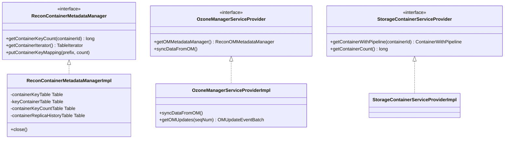

# recon / recon-spi

_This feature page was generated from `study/atlas/components/recon/recon-spi.md`. Author prose belongs above or below the BEGIN/END markers._

{/* BEGIN atlas-generated */}

**Classes:** 21    **Kinds:** service:10, interface:7, util:2, data:1, metrics:1

## Overview

The `recon-spi` feature group defines and implements the core data-access interfaces that decouple Recon's endpoints and tasks from the underlying storage. `ReconContainerMetadataManagerImpl` owns Recon's primary RocksDB store (`CONTAINER_KEY`, `KEY_CONTAINER`, `CONTAINER_KEY_COUNT`, `REPLICA_HISTORY_V2` column families) and is the single point of persistence for container-key mapping and container replica history. `OzoneManagerServiceProviderImpl` drives the OM snapshot sync lifecycle: it downloads a full OM DB tarball on first start, then polls for and applies incremental RocksDB WAL deltas to Recon's local OM snapshot. `StorageContainerServiceProviderImpl` wraps the SCM `StorageContainerLocationProtocol` RPC client. `ReconDBProvider` and `ReconRDBSnapshotProvider` handle the RocksDB lifecycle for Recon's own database and the OM snapshot download/resume respectively. `KeyPrefixContainerCodec` and `ContainerKeyPrefixCodec` handle binary serialization for the two composite-key tables.

## Diagram

## Class table

### Sub-feature: `recon.spi`

| reading_order | fqcn | kind | logic | loc | study (min) | role |
|--:|---|---|---|--:|--:|---|
| 2404 | <Fqcn>org.apache.hadoop.ozone.recon.spi.ReconContainerMetadataManager</Fqcn> | interface | mixed | 50~ | 20 | The Recon Container DB Service interface. |
| 2405 | <Fqcn>org.apache.hadoop.ozone.recon.spi.ReconGlobalStatsManager</Fqcn> | interface | mixed | 25~ | 20 | The Recon Global Stats DB Service interface. |
| 2406 | <Fqcn>org.apache.hadoop.ozone.recon.spi.StorageContainerServiceProvider</Fqcn> | interface | mixed | 25~ | 20 | Interface to access SCM endpoints. |
| 2407 | <Fqcn>org.apache.hadoop.ozone.recon.spi.OzoneManagerServiceProvider</Fqcn> | interface | mixed | 25~ | 20 | Interface to access OM endpoints. |
| 2408 | <Fqcn>org.apache.hadoop.ozone.recon.spi.ReconNamespaceSummaryManager</Fqcn> | interface | mixed | 25~ | 20 | Interface for DB operations on NSSummary. |
| 2409 | <Fqcn>org.apache.hadoop.ozone.recon.spi.HddsDatanodeServiceProvider</Fqcn> | interface | mixed | 25~ | 20 | Interface to access datanode endpoints. |
| 2410 | <Fqcn>org.apache.hadoop.ozone.recon.spi.ReconFileMetadataManager</Fqcn> | interface | mixed | 25~ | 20 | The Recon File Metadata DB Service interface for file size counts. |
| 2411 | <Fqcn>org.apache.hadoop.ozone.recon.spi.MetricsServiceProvider</Fqcn> | metrics | mixed | 25~ | 20 | Interface to access Ozone metrics. |

### Sub-feature: `spi.impl`

| reading_order | fqcn | kind | logic | loc | study (min) | role |
|--:|---|---|---|--:|--:|---|
| 2412 | <Fqcn>org.apache.hadoop.ozone.recon.spi.impl.ReconContainerMetadataManagerImpl</Fqcn> | service | logic-heavy | 400~ | 60 | Implementation of the Recon Container DB Service. |
| 2413 | <Fqcn>org.apache.hadoop.ozone.recon.spi.impl.StorageContainerServiceProviderImpl</Fqcn> | service | mixed | 125~ | 30 | Implementation for StorageContainerServiceProvider that talks with actual cluster SCM. |
| 2414 | <Fqcn>org.apache.hadoop.ozone.recon.spi.impl.ReconRDBSnapshotProvider</Fqcn> | service | mixed | 125~ | 30 | n OM follower uses: a chunked POST /v2/dbCheckpoint request that carries a toExcludeList[] of the parts already recei... |
| 2415 | <Fqcn>org.apache.hadoop.ozone.recon.spi.impl.ReconDBProvider</Fqcn> | service | mixed | 100~ | 30 | Provider for Recon's RDB. |
| 2416 | <Fqcn>org.apache.hadoop.ozone.recon.spi.impl.PrometheusServiceProviderImpl</Fqcn> | service | mixed | 100~ | 30 | Implementation of the Prometheus Metrics Service provider. |
| 2417 | <Fqcn>org.apache.hadoop.ozone.recon.spi.impl.ReconFileMetadataManagerImpl</Fqcn> | service | mixed | 75~ | 30 | Implementation of the Recon File Metadata DB Service. |
| 2418 | <Fqcn>org.apache.hadoop.ozone.recon.spi.impl.ReconDBDefinition</Fqcn> | service | mixed | 75~ | 30 | RocksDB definition for the DB internal to Recon. |
| 2419 | <Fqcn>org.apache.hadoop.ozone.recon.spi.impl.JmxServiceProviderImpl</Fqcn> | service | mixed | 50~ | 30 | Implementation of the Jmx Metrics Service provider. |
| 2420 | <Fqcn>org.apache.hadoop.ozone.recon.spi.impl.ReconNamespaceSummaryManagerImpl</Fqcn> | service | mixed | 50~ | 30 | Wrapper functions for DB operations on recon namespace summary metadata. |
| 2421 | <Fqcn>org.apache.hadoop.ozone.recon.spi.impl.ReconGlobalStatsManagerImpl</Fqcn> | service | mixed | 50~ | 30 | Implementation of the Recon Global Stats DB Service. |
| 2422 | <Fqcn>org.apache.hadoop.ozone.recon.spi.impl.KeyPrefixContainerCodec</Fqcn> | util | mixed | 125~ | 20 | Codec to serialize/deserialize KeyPrefixContainer. |
| 2423 | <Fqcn>org.apache.hadoop.ozone.recon.spi.impl.ContainerKeyPrefixCodec</Fqcn> | util | mixed | 50~ | 20 | Codec to serialize/deserialize ContainerKeyPrefix. |
| 2424 | <Fqcn>org.apache.hadoop.ozone.recon.spi.impl.OzoneManagerServiceProviderImpl</Fqcn> | service | logic-heavy | 675~ | 10 | Implementation of the OzoneManager Service provider. |

## Anchor details

### `ReconContainerMetadataManagerImpl`

- **path:** `hadoop-ozone/recon/src/main/java/org/apache/hadoop/ozone/recon/spi/impl/ReconContainerMetadataManagerImpl.java`
- **loc:** 400~    **difficulty:** 5    **study:** 60 min    **concurrency:** single-threaded    **persistence:** RocksDB
- **entry points:** `close`
- **key collaborators:** `org.apache.hadoop.ozone.recon.spi.ReconContainerMetadataManager`, `org.apache.hadoop.hdds.protocol.DatanodeID`, `org.apache.hadoop.hdds.scm.pipeline.Pipeline`, `org.apache.hadoop.hdds.scm.pipeline.PipelineID`, `org.apache.hadoop.hdds.utils.db.BatchOperation`, `org.apache.hadoop.hdds.utils.db.DBStore`
- **test exemplar:** `hadoop-ozone/recon/src/test/java/org/apache/hadoop/ozone/recon/spi/impl/TestReconContainerMetadataManagerImpl.java`
- **role:** Implementation of the Recon Container DB Service.

Manages four RocksDB column families defined in `ReconDBDefinition`: `CONTAINER_KEY` (ContainerKeyPrefix → count), `KEY_CONTAINER` (KeyPrefixContainer → count), `CONTAINER_KEY_COUNT` (containerId → key count), and `REPLICA_HISTORY_V2` (containerId → ContainerReplicaHistoryList). The dual `CONTAINER_KEY` and `KEY_CONTAINER` tables are maintained in sync to support both lookup directions. The `CONTAINER_COUNT_KEY` entry in `GlobalStats` (a jOOQ table) is also updated here via a Jooq `DSLContext` for the container-count metric exposed on the cluster-state API. All writes use `BatchOperation` for atomicity.

## Design docs

- `hadoop-hdds/docs/content/design/recon1.md` — covers the SPI design for decoupling Recon endpoints from storage implementations.
- `hadoop-hdds/docs/content/design/recon2.md` — describes the OM delta-sync SPI and the NSSummary manager additions.

## Seminal JIRAs / PRs

- [HDDS-13792](https://issues.apache.org/jira/browse/HDDS-13792). Move container related metadata from Derby to OM DB (reverted in [HDDS-13808](https://issues.apache.org/jira/browse/HDDS-13808))
- [HDDS-13956](https://issues.apache.org/jira/browse/HDDS-13956). Code reliability and data integrity improvements in Recon
- [HDDS-14079](https://issues.apache.org/jira/browse/HDDS-14079). Fix Recon startup failures during schema upgrades due to race conditions
- [HDDS-14730](https://issues.apache.org/jira/browse/HDDS-14730). Update Recon container sync to use container IDs
- [HDDS-15766](https://issues.apache.org/jira/browse/HDDS-15766). Make Recon OM DB large tarball transfer reliable
- [HDDS-15863](https://issues.apache.org/jira/browse/HDDS-15863). Add Manual OM DB Rebuild Support for Recon Bootstrapping
- [HDDS-15894](https://issues.apache.org/jira/browse/HDDS-15894). Add Table.clear for reusable table clearing

## Sharp edges

- `OzoneManagerServiceProviderImpl` has 675 LOC but is classified as `data-only` in atlas.json. This is incorrect; it drives the entire OM snapshot and delta-sync lifecycle and is logic-heavy. (role_one_liner flag for correction: `OzoneManagerServiceProviderImpl`)
- `ReconContainerMetadataManagerImpl` maintains `CONTAINER_KEY` and `KEY_CONTAINER` as two independent tables that must stay in sync. Any failure mid-batch-write that leaves one table updated and the other not will corrupt the bidirectional index. There is no compensating read-repair. ([HDDS-13956](https://issues.apache.org/jira/browse/HDDS-13956) hardened some of these paths.)
- `ReconRDBSnapshotProvider` supports resumable tarball downloads via a `toExcludeList` of already-received parts. If Recon crashes mid-download and the partial state is not cleaned up, the next download attempt may incorrectly skip parts. [HDDS-15766](https://issues.apache.org/jira/browse/HDDS-15766) improved reliability here.

## Related features

- `components/recon/recon-tasks.md` — `ReconTaskControllerImpl` calls `OzoneManagerServiceProviderImpl.syncDataFromOM()` to drive delta processing.
- `components/recon/recon-recovery.md` — `ReconOmMetadataManagerImpl` is managed by `OzoneManagerServiceProviderImpl` via `updateOmDB()`.
- `components/recon/recon-scm.md` — `StorageContainerServiceProviderImpl` is used by `ReconStorageContainerSyncHelper`.
- `components/recon/recon-codegen.md` — `ReconDBDefinition` and `ContainerSchemaDefinition` define the column families used by `ReconContainerMetadataManagerImpl`.

## Self-quiz

1. `ReconContainerMetadataManagerImpl` maintains two tables for the same data in opposite key orders. What are the two tables, what are their key types, and why are both needed?
2. `OzoneManagerServiceProviderImpl` starts with a full snapshot download. After the first download, how does it determine where to resume delta sync from?
3. `ReconRDBSnapshotProvider` supports interrupted download resumption. What data structure tracks which parts of the tarball have already been received?
4. `ReconContainerMetadataManagerImpl.close()` is listed as an `entry_point`. What resource does it release and why is it important to call it in the right order during Recon shutdown?
5. `ContainerKeyPrefixCodec` and `KeyPrefixContainerCodec` exist as separate codecs. What byte-level format does `ContainerKeyPrefixCodec` use for the composite key, and how does it ensure the container ID is sortable?

Answers

Answer 1: `CONTAINER_KEY` maps `ContainerKeyPrefix` (containerId + keyPrefix + keyVersion) → count, supporting "which keys are in this container?" lookups. `KEY_CONTAINER` maps `KeyPrefixContainer` (keyPrefix + containerId) → count, supporting "which containers hold this key prefix?" lookups. Both are needed because the two query patterns have different access patterns and neither direction can be efficiently derived from the other via a table scan.
Answer 2: After the first download, `OzoneManagerServiceProviderImpl` persists the last successfully applied OM sequence number (via `ReconOmMetadataManagerImpl.getLastSequenceNumberFromDB()`). On restart it reads this number and calls `OMAdminProtocol.getOMRocksDBUpdates(seqNum)` to fetch only the deltas since that point.
Answer 3: `ReconRDBSnapshotProvider` passes a `toExcludeList[]` of already-received SST file names/paths in the snapshot request. The server skips those files in its tarball response, allowing the client to resume without re-downloading parts it already has.
Answer 4: `close()` releases the underlying `DBStore` (RocksDB handle) for Recon's own database. It must be called after all tasks and endpoints have stopped reading from the store; calling it while tasks are mid-read will cause RocksDB access-after-close errors.
Answer 5: `ContainerKeyPrefixCodec` encodes the container ID as a fixed 8-byte big-endian long followed by the key prefix string bytes. The big-endian encoding ensures lexicographic byte order matches numeric order, so all keys for a given container are contiguous in the RocksDB range scan without a comparator override.

{/* END atlas-generated */}
