# rocksdb / managed-rocksdb

_This feature page was generated from `study/atlas/components/rocksdb/managed-rocksdb.md`. Author prose belongs above or below the BEGIN/END markers._

{/* BEGIN atlas-generated */}

**Classes:** 30    **Kinds:** service:27, config:1, metrics:1, exception:1

## Overview

The `managed-rocksdb` feature is a thin wrapper layer that gives every RocksDB native object a deterministic `close()` contract and automatic leak detection. The pattern is: `ManagedObject<T>` is the base class for all wrappers; its constructor calls `ManagedRocksObjectUtils.track(this)`, which registers the object with a shared `LeakDetector` and increments a live-object counter in `ManagedRocksObjectMetrics`. When `close()` is called, the tracker is cleared; if the object is GC'd without being closed, a warning is logged and the leak counter incremented. Each concrete wrapper (`ManagedRocksDB`, `ManagedColumnFamilyOptions`, `ManagedReadOptions`, etc.) delegates all operations to the underlying RocksDB Java binding via `get()`, adding no behavioral logic beyond lifecycle safety. `ManagedRocksDB` is the central entry point: it provides static factory methods (`open`, `openReadOnly`, `openAsSecondary`, `openWithLatestOptions`) and a `deleteSstFileRange()` helper that verifies the delete actually took effect against live metadata. `JniLibNamePropertyWriter` writes the resolved native library filename to a properties file, letting operators inspect which native build was loaded. The `ManagedSstFileWriter` enforces that the native library is loaded before any SST file is constructed, using `ManagedRocksObjectUtils.loadRocksDBLibrary()`.

## Diagram

```mermaid
classDiagram
  class ManagedObject {
    -T original
    -UncheckedAutoCloseable leakTracker
    +get() T
    +close()
  }
  class ManagedRocksDB {
    +open(...)$
    +openReadOnly(...)$
    +openAsSecondary(...)$
    +openWithLatestOptions(...)$
    +deleteSstFileRange(...)
    +isNoSpaceFailure(Throwable)$
  }
  class ManagedRocksObjectUtils {
    +track(AutoCloseable)$
    +loadRocksDBLibrary()$
    +waitForFileDelete(File, Duration)$
  }
  class ManagedRocksObjectMetrics {
    +increaseManagedObject()
    +increaseLeakObject()
  }
  class ManagedColumnFamilyOptions
  class ManagedReadOptions
  class ManagedWriteOptions
  class ManagedDBOptions
  class ManagedOptions
  class ManagedRocksIterator
  class ManagedCheckpoint
  class ManagedDirectSlice
  class ManagedWriteBatch
  class ManagedSstFileWriter
  class ManagedSstFileReader
  class ManagedSstFileReaderIterator
  class RocksDatabaseException

  ManagedObject <|-- ManagedRocksDB
  ManagedObject <|-- ManagedColumnFamilyOptions
  ManagedObject <|-- ManagedReadOptions
  ManagedObject <|-- ManagedWriteOptions
  ManagedObject <|-- ManagedDBOptions
  ManagedObject <|-- ManagedOptions
  ManagedObject <|-- ManagedRocksIterator
  ManagedObject <|-- ManagedCheckpoint
  ManagedObject <|-- ManagedDirectSlice
  ManagedObject <|-- ManagedWriteBatch
  ManagedObject <|-- ManagedSstFileWriter
  ManagedObject <|-- ManagedSstFileReader
  ManagedObject <|-- ManagedSstFileReaderIterator
  ManagedObject ..> ManagedRocksObjectUtils : track()
  ManagedRocksObjectUtils ..> ManagedRocksObjectMetrics : counters
click ManagedObject href "/class/managedobject" "Open ManagedObject"
click ManagedRocksDB href "/class/managedrocksdb" "Open ManagedRocksDB"
click ManagedRocksObjectUtils href "/class/managedrocksobjectutils" "Open ManagedRocksObjectUtils"
click ManagedRocksObjectMetrics href "/class/managedrocksobjectmetrics" "Open ManagedRocksObjectMetrics"
click ManagedColumnFamilyOptions href "/class/managedcolumnfamilyoptions" "Open ManagedColumnFamilyOptions"
click ManagedReadOptions href "/class/managedreadoptions" "Open ManagedReadOptions"
click ManagedWriteOptions href "/class/managedwriteoptions" "Open ManagedWriteOptions"
click ManagedDBOptions href "/class/manageddboptions" "Open ManagedDBOptions"
click ManagedOptions href "/class/managedoptions" "Open ManagedOptions"
click ManagedRocksIterator href "/class/managedrocksiterator" "Open ManagedRocksIterator"
click ManagedCheckpoint href "/class/managedcheckpoint" "Open ManagedCheckpoint"
click ManagedDirectSlice href "/class/manageddirectslice" "Open ManagedDirectSlice"
click ManagedWriteBatch href "/class/managedwritebatch" "Open ManagedWriteBatch"
click ManagedSstFileWriter href "/class/managedsstfilewriter" "Open ManagedSstFileWriter"
click ManagedSstFileReader href "/class/managedsstfilereader" "Open ManagedSstFileReader"
click ManagedSstFileReaderIterator href "/class/managedsstfilereaderiterator" "Open ManagedSstFileReaderIterator"
click RocksDatabaseException href "/class/rocksdatabaseexception" "Open RocksDatabaseException"
```

## Class table

### Sub-feature: `db.managed`

| reading_order | fqcn | kind | logic | loc | study (min) | role |
|--:|---|---|---|--:|--:|---|
| 777 | <Fqcn>org.apache.hadoop.hdds.utils.db.managed.ManagedRocksDB</Fqcn> | service | mixed | 100~ | 30 | Managed RocksDB. |
| 778 | <Fqcn>org.apache.hadoop.hdds.utils.db.managed.ManagedRocksObjectUtils</Fqcn> | service | mixed | 50~ | 30 | Utilities to help assert RocksObject closures. |
| 779 | <Fqcn>org.apache.hadoop.hdds.utils.db.managed.ManagedColumnFamilyOptions</Fqcn> | service | mixed | 50~ | 30 | Managed ColumnFamilyOptions. |
| 780 | <Fqcn>org.apache.hadoop.hdds.utils.db.managed.ManagedSstFileReaderIterator</Fqcn> | service | mixed | 25~ | 30 | Managed SstFileReaderIterator. |
| 781 | <Fqcn>org.apache.hadoop.hdds.utils.db.managed.ManagedCompactRangeOptions</Fqcn> | service | mixed | 25~ | 30 | Managed CompactRangeOptions. |
| 782 | <Fqcn>org.apache.hadoop.hdds.utils.db.managed.ManagedReadOptions</Fqcn> | service | mixed | 25~ | 30 | Managed ReadOptions. |
| 783 | <Fqcn>org.apache.hadoop.hdds.utils.db.managed.ManagedDBOptions</Fqcn> | service | mixed | 25~ | 30 | Managed DBOptions. |
| 784 | <Fqcn>org.apache.hadoop.hdds.utils.db.managed.ManagedFlushOptions</Fqcn> | service | mixed | 25~ | 30 | Managed FlushOptions. |
| 785 | <Fqcn>org.apache.hadoop.hdds.utils.db.managed.ManagedTransactionLogIterator</Fqcn> | service | mixed | 25~ | 30 | Managed TransactionLogIterator. |
| 786 | <Fqcn>org.apache.hadoop.hdds.utils.db.managed.ManagedRocksIterator</Fqcn> | service | mixed | 25~ | 30 | Managed RocksIterator. |
| 787 | <Fqcn>org.apache.hadoop.hdds.utils.db.managed.ManagedCheckpoint</Fqcn> | service | mixed | 25~ | 30 | Managed Checkpoint. |
| 788 | <Fqcn>org.apache.hadoop.hdds.utils.db.managed.ManagedDirectSlice</Fqcn> | service | mixed | 25~ | 30 | Managed DirectSlice for leak detection. |
| 789 | <Fqcn>org.apache.hadoop.hdds.utils.db.managed.ManagedLogger</Fqcn> | service | mixed | 25~ | 30 | Managed Logger. |
| 790 | <Fqcn>org.apache.hadoop.hdds.utils.db.managed.JniLibNamePropertyWriter</Fqcn> | service | mixed | 25~ | 30 | Class to write the rocksdb lib name to a file. |
| 791 | <Fqcn>org.apache.hadoop.hdds.utils.db.managed.ManagedStatistics</Fqcn> | service | mixed | 25~ | 30 | Managed Statistics. |
| 792 | <Fqcn>org.apache.hadoop.hdds.utils.db.managed.ManagedWriteBatch</Fqcn> | service | mixed | 25~ | 30 | Managed WriteBatch. |
| 793 | <Fqcn>org.apache.hadoop.hdds.utils.db.managed.ManagedIngestExternalFileOptions</Fqcn> | service | mixed | 25~ | 30 | Managed IngestExternalFileOptions. |
| 794 | <Fqcn>org.apache.hadoop.hdds.utils.db.managed.ManagedBloomFilter</Fqcn> | service | mixed | 25~ | 30 | Managed BloomFilter. |
| 795 | <Fqcn>org.apache.hadoop.hdds.utils.db.managed.ManagedObject</Fqcn> | service | mixed | 25~ | 30 | General template for a managed RocksObject. |
| 796 | <Fqcn>org.apache.hadoop.hdds.utils.db.managed.ManagedLRUCache</Fqcn> | service | mixed | 25~ | 30 | Managed LRUCache. |
| 797 | <Fqcn>org.apache.hadoop.hdds.utils.db.managed.ManagedSlice</Fqcn> | service | mixed | 25~ | 30 | Managed Slice. |
| 798 | <Fqcn>org.apache.hadoop.hdds.utils.db.managed.ManagedConfigOptions</Fqcn> | service | mixed | 25~ | 30 | Managed ConfigOptions. |
| 799 | <Fqcn>org.apache.hadoop.hdds.utils.db.managed.ManagedSstFileWriter</Fqcn> | service | mixed | 25~ | 30 | Managed SstFileWriter. |
| 800 | <Fqcn>org.apache.hadoop.hdds.utils.db.managed.ManagedEnvOptions</Fqcn> | service | mixed | 25~ | 30 | Managed EnvOptions. |
| 801 | <Fqcn>org.apache.hadoop.hdds.utils.db.managed.ManagedOptions</Fqcn> | service | mixed | 25~ | 30 | Managed Options. |
| 802 | <Fqcn>org.apache.hadoop.hdds.utils.db.managed.ManagedWriteOptions</Fqcn> | service | mixed | 25~ | 30 | Managed WriteOptions. |
| 803 | <Fqcn>org.apache.hadoop.hdds.utils.db.managed.ManagedSstFileReader</Fqcn> | service | mixed | 25~ | 30 | Managed SstFileReader. |
| 804 | <Fqcn>org.apache.hadoop.hdds.utils.db.managed.ManagedBlockBasedTableConfig</Fqcn> | config | data-only | 25~ | 20 | Managed BlockBasedTableConfig. |
| 805 | <Fqcn>org.apache.hadoop.hdds.utils.db.managed.ManagedRocksObjectMetrics</Fqcn> | metrics | mixed | 50~ | 20 | Metrics about managed RockObjects. |

### Sub-feature: `utils.db`

| reading_order | fqcn | kind | logic | loc | study (min) | role |
|--:|---|---|---|--:|--:|---|
| 806 | <Fqcn>org.apache.hadoop.hdds.utils.db.RocksDatabaseException</Fqcn> | exception | data-only | 25~ | 10 | Exceptions converted from RocksDBException. |

## Anchor details

No `logic-heavy` anchors are present; the feature is primarily a lifecycle-safety and leak-detection wrapper layer. The key insight is in `ManagedObject`: every subclass constructor invokes `ManagedRocksObjectUtils.track(this)` at construction time, capturing the allocation stack trace. This means the allocation site (not the usage site) is what appears in leak warnings, making it actionable. `ManagedRocksDB.deleteSstFileRange()` is worth noting as it goes beyond simple delegation: after calling `deleteFilesInRanges`, it re-queries `getLiveFilesMetaData()` to confirm the file left the LSM — because `deleteFilesInRanges` silently skips files that are still being compacted. `ManagedRocksDB.openAsSecondary()` includes a detailed Javadoc invariant: the secondary's view does not auto-refresh and `tryCatchUpWithPrimary()` must be called explicitly, and the secondary log directory must remain writable or the open will fail.

## Design docs

- `hadoop-hdds/docs/content/concept/RocksDB.md` — covers how RocksDB is used across Ozone services and administrator-relevant configuration.
- `hadoop-hdds/docs/content/design/dn-merge-rocksdb.md` — design for merging per-container RocksDB instances into a single DN-level DB ([HDDS-3630](https://issues.apache.org/jira/browse/HDDS-3630)), which relies on the managed wrappers for safe multi-handle lifecycle management.
- No dedicated design doc for the managed-wrapper pattern itself under `hadoop-hdds/docs/content/` on this branch.

## Seminal JIRAs / PRs

- [HDDS-11543](https://issues.apache.org/jira/browse/HDDS-11543). Track OzoneClient object leaks via LeakDetector framework (established the leak-tracking pattern used here).
- [HDDS-12830](https://issues.apache.org/jira/browse/HDDS-12830). Add RocksDatabaseException.
- [HDDS-12173](https://issues.apache.org/jira/browse/HDDS-12173). Follow RocksDB basic tuning guide (and its revert — shows fragility of bulk option changes).
- [HDDS-13422](https://issues.apache.org/jira/browse/HDDS-13422). Ozone tool should preserve previous RocksDB options (motivated `openWithLatestOptions`).
- [HDDS-14237](https://issues.apache.org/jira/browse/HDDS-14237). Simplify ManagedDirectSlice to use ByteBuffers.
- [HDDS-14225](https://issues.apache.org/jira/browse/HDDS-14225). Upgrade RocksDB from 7.7.3 to 10.10.1.
- [HDDS-15788](https://issues.apache.org/jira/browse/HDDS-15788). Fix SST filtering BOOTSTRAP_LOCK contention introduced by RocksDB 10 upgrade.

## Sharp edges

- `ManagedRocksDB.openReadOnly()` and `openAsSecondary()` are not interchangeable: opening a DB read-only while a primary writer is active has undefined behavior; only the secondary-instance path (`openAsSecondary`) is safe concurrently. The distinction is spelled out in the `openAsSecondary` Javadoc (`ManagedRocksDB.java` lines 82-121; [HDDS-14859](https://issues.apache.org/jira/browse/HDDS-14859) introduced secondary usage for volume validation).
- `deleteSstFileRange()` is not atomic: it calls `deleteFilesInRanges` then checks live metadata. A concurrent compaction that completes between the two calls can cause the post-check to pass even though the file was removed by compaction rather than by the delete call. Callers should treat this as a best-effort hint, not a guarantee. (`ManagedRocksDB.java` `deleteSstFileRange` method, lines 207-225.)

## Related features

- `components/rocksdb/checkpoint-differ.md` — uses `ManagedRocksDB`, `ManagedDBOptions`, and `ManagedRocksIterator` directly for compaction tracking and DAG queries.
- `components/rocksdb/rocks-native.md` — `ManagedOptions` is a collaborator of `LatestVersionedKWayMergeIterator`; `ManagedRawSSTFileReader` uses the same managed lifecycle pattern.
- `components/OzoneManager/rdb-store.md` — `RDBStore` (OM's primary DB facade) opens and holds a `ManagedRocksDB` instance.
- `components/SCM/scm-db.md` — SCM metadata store also uses `ManagedRocksDB` for its pipeline and container tables.

## Self-quiz

1. Every `ManagedObject` subclass registers with `ManagedRocksObjectUtils.track()` at construction time. What two things does this call do, and where does the allocation stack trace appear if the object is never closed?
2. `ManagedRocksDB.deleteSstFileRange()` throws `RocksDatabaseException` in two different situations. What are they, and what does each mean operationally?
3. `ManagedRocksDB.openAsSecondary()` requires a `secondaryDbLogFilePath`. What happens if that directory runs out of disk space, and what should an operator do to prevent log buildup?
4. `ManagedRocksDB.isNoSpaceFailure()` exists specifically to avoid importing `org.rocksdb.Status` outside this module. Why is that import restricted, and what Ozone enforcer rule controls it?
5. `ManagedRocksObjectMetrics` tracks two counters. Name them and explain what a rising `leakObject` counter tells an operator.

Answers

Answer 1: `track()` (a) increments `ManagedRocksObjectMetrics.INSTANCE.managedObject` and (b) registers the object with the `LeakDetector` singleton, capturing the current stack trace. If the object is GC'd without `close()`, the `LeakDetector` fires a callback that logs the captured allocation stack trace and increments `leakObject`.

Answer 2: First, if `deleteFilesInRanges` throws a `RocksDBException`, the exception is wrapped and rethrown. Second, if `deleteFilesInRanges` succeeds (no exception) but the file is still present in `getLiveFilesMetaData()`, it throws with the message "deleteFilesInRanges was a no-op" — meaning the file was skipped because it was being compacted at the time.

Answer 3: Each `openAsSecondary` creates a `LOG` file in `secondaryDbLogFilePath`; each re-open rotates the previous one to `LOG.old.<timestamp>`. If the directory fills up, the open fails with a RocksDB IOError. Operators should periodically purge old `LOG.old.*` files from that directory.

Answer 4: The `banned-rocksdb-imports` Maven enforcer rule (in the Ozone parent POM) prevents code outside the `managed-rocksdb` module from importing `org.rocksdb.*` types directly, ensuring that all RocksDB API usage goes through the managed wrappers and their lifecycle guarantees.

Answer 5: `managedObject` (live count of tracked wrappers) and `leakObject` (count of wrappers closed by GC rather than by explicit `close()`). A rising `leakObject` counter indicates that code using managed RocksDB objects is not closing them properly, which may cause native memory accumulation and eventual JVM crashes on older RocksDB versions.

{/* END atlas-generated */}
