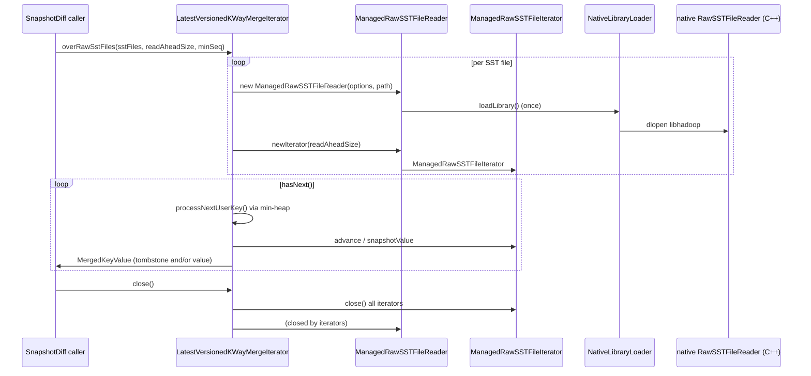

# rocksdb / rocks-native

_This feature page was generated from `study/atlas/components/rocksdb/rocks-native.md`. Author prose belongs above or below the BEGIN/END markers._

{/* BEGIN atlas-generated */}

**Classes:** 6    **Kinds:** service:5, exception:1

## Overview

The `rocks-native` feature provides a JNI-backed path for reading RocksDB SST files directly — including tombstone entries — without opening a live RocksDB instance. `ManagedRawSSTFileReader` wraps a native C++ `RawSSTFileReader` object loaded via `NativeLibraryLoader`; it exposes `newIterator()` that returns a `ManagedRawSSTFileIterator`, which surfaces both value entries and delete markers (tombstones) in sequence-number order. `NativeLibraryLoader` searches the classpath for the platform-specific shared library (`libhadoop.so` / `libhadoop.dylib`) and extracts it to a temp directory on first use. `NativeConstants` holds the library name and version string used for the lookup. `LatestVersionedKWayMergeIterator` is the high-level consumer: it opens one `ManagedRawSSTFileIterator` per SST file and merges them using a min-heap ordered by user key, then by sequence number descending. For each user key, it applies snapshot-diff emit rules — emitting the latest tombstone and/or latest value, including both when a delete is followed by a newer recreate — so the output is directly consumable by the snapshot-diff pipeline. An optional `exclusiveMinSequenceNumber` parameter allows callers to skip entries at or below a base snapshot sequence, reducing output to only the keys that changed after a given snapshot.

## Diagram

## Class table

### Sub-feature: `hdds.utils`

| reading_order | fqcn | kind | logic | loc | study (min) | role |
|--:|---|---|---|--:|--:|---|
| 919 | <Fqcn>org.apache.hadoop.hdds.utils.NativeLibraryLoader</Fqcn> | service | mixed | 150~ | 45 | Class to load Native Libraries. |
| 920 | <Fqcn>org.apache.hadoop.hdds.utils.NativeConstants</Fqcn> | service | mixed | 25~ | 30 | Native Constants. |
| 921 | <Fqcn>org.apache.hadoop.hdds.utils.NativeLibraryNotLoadedException</Fqcn> | exception | data-only | 25~ | 10 | Exception when native library not loaded. |

### Sub-feature: `utils.db`

| reading_order | fqcn | kind | logic | loc | study (min) | role |
|--:|---|---|---|--:|--:|---|
| 922 | <Fqcn>org.apache.hadoop.hdds.utils.db.LatestVersionedKWayMergeIterator</Fqcn> | service | logic-heavy | 375~ | 45 | K-way merge over RocksDB SST files for snapshot diff. |
| 923 | <Fqcn>org.apache.hadoop.hdds.utils.db.ManagedRawSSTFileIterator</Fqcn> | service | mixed | 100~ | 30 | Iterator for SSTFileReader which would read all entries including tombstones. |
| 924 | <Fqcn>org.apache.hadoop.hdds.utils.db.ManagedRawSSTFileReader</Fqcn> | service | mixed | 50~ | 30 | JNI for RocksDB RawSSTFileReader. |

## Anchor details

### `LatestVersionedKWayMergeIterator`

- **path:** `hadoop-hdds/rocks-native/src/main/java/org/apache/hadoop/hdds/utils/db/LatestVersionedKWayMergeIterator.java`
- **loc:** 375~    **difficulty:** 4    **study:** 45 min    **concurrency:** single-threaded    **persistence:** RocksDB
- **entry points:** `close`
- **key collaborators:** `org.apache.hadoop.hdds.utils.IOUtils`, `org.apache.hadoop.hdds.utils.db.managed.ManagedOptions`, `org.apache.hadoop.ozone.util.ClosableIterator`
- **test exemplar:** `hadoop-hdds/rocks-native/src/test/java/org/apache/hadoop/hdds/utils/db/TestLatestVersionedKWayMergeIterator.java`
- **role:** K-way merge over RocksDB SST files for snapshot diff.

The emit logic in `emitForUserKey()` has a three-way branch: (1) if both a value and tombstone exist for the same user key, the tombstone is always emitted; additionally, if the value's sequence is higher than the tombstone's, the value is also emitted (recreate-after-delete case); (2) if only a value exists, emit it; (3) if only a tombstone exists, emit it. The critical subtlety is that when the latest value wins (`latestValue.getSequence() > latestTombstoneSeq`), both the tombstone *and* the value are emitted in that order — the tombstone is not suppressed. This ensures that snapshot diff consumers can correctly classify a key as DELETE+CREATE rather than MODIFY. The `snapshotValue()` call on `RawSstHeapHead` before advancing is necessary because the native buffer backing the value bytes is owned by the iterator position; advancing would overwrite it.

## Design docs

- `hadoop-hdds/docs/content/design/efficient-snapdiff.md` — covers the optimized snapshot diff design that `LatestVersionedKWayMergeIterator` is the core primitive of ([HDDS-9154](https://issues.apache.org/jira/browse/HDDS-9154)).
- `hadoop-hdds/docs/content/feature/Snapshot.md` — user-facing feature page for Ozone Snapshot, the consumer of this feature.
- No dedicated design doc for the native SST reader JNI layer under `hadoop-hdds/docs/content/` on this branch.

## Seminal JIRAs / PRs

- [HDDS-12734](https://issues.apache.org/jira/browse/HDDS-12734). Enable native lib in CI checks (established CI coverage for this module).
- [HDDS-13252](https://issues.apache.org/jira/browse/HDDS-13252). Use deleteRangeWithBatch API to delete keys in snapshot scope from AOS deleted space.
- [HDDS-14159](https://issues.apache.org/jira/browse/HDDS-14159). Have an option to read only Key in ManagedRawSSTFileIterator.
- [HDDS-14162](https://issues.apache.org/jira/browse/HDDS-14162). Fix Native Jni Lib to read SST files using CodecBuffer.
- [HDDS-15388](https://issues.apache.org/jira/browse/HDDS-15388). K-way merge iterator over native SST file reader to emit latest tombstone and latest value of a key.
- [HDDS-15559](https://issues.apache.org/jira/browse/HDDS-15559). Add libhadoop to DYLD_LIBRARY_PATH or LD_LIBRARY_PATH.
- [HDDS-14225](https://issues.apache.org/jira/browse/HDDS-14225). Upgrade RocksDB from 7.7.3 to 10.10.1.

## Sharp edges

- `LatestVersionedKWayMergeIterator` is single-threaded by contract; sharing it across threads without external synchronization produces undefined results because the `PriorityQueue<HeapEntry>` and `emitQueue` list are not thread-safe. The `concurrency: single-threaded` field is authoritative. (`LatestVersionedKWayMergeIterator.java`; no locking present.)
- When `overRawSstFiles()` partially fails during construction (one `RawSstIterator` throws), the `catch (RuntimeException)` block calls `IOUtils.closeQuietly(sources)` and closes `options`. If a caller catches and retries without discarding the partially-built object, it may use already-closed iterators. The factory static method must be the only construction path. (`LatestVersionedKWayMergeIterator.java` lines 83-91.)
- `NativeLibraryLoader` silently falls back to the system library path if the classpath extraction fails; if the wrong version is loaded, JNI method signatures may mismatch and throw `UnsatisfiedLinkError` at runtime rather than at class load time. [HDDS-15559](https://issues.apache.org/jira/browse/HDDS-15559) added `DYLD_LIBRARY_PATH` / `LD_LIBRARY_PATH` to ensure the correct library is found on macOS and Linux.

## Related features

- `components/rocksdb/checkpoint-differ.md` — `RocksDBCheckpointDiffer` calls `ManagedRawSSTFileReader` for the SST value-pruning path and uses `LatestVersionedKWayMergeIterator` indirectly via the snapshot-diff pipeline.
- `components/rocksdb/managed-rocksdb.md` — `ManagedOptions` is a collaborator of `LatestVersionedKWayMergeIterator`; `ManagedRawSSTFileReader` and `ManagedRawSSTFileIterator` follow the same managed lifecycle pattern.
- `components/OzoneManager/snapshot-diff.md` — the high-level snap-diff worker that creates `LatestVersionedKWayMergeIterator` instances over the SST file sets produced by `RocksDBCheckpointDiffer`.

## Self-quiz

1. `LatestVersionedKWayMergeIterator.emitForUserKey()` has a three-way branch. Describe each branch and explain why the tombstone is emitted even when a newer value exists for the same key.
2. Why does `overRawSstFiles()` call `entry.current.snapshotValue()` (via `RawSstHeapHead.snapshotValue()`) before calling `entry.advance()`? What would happen if it did not?
3. `LatestVersionedKWayMergeIterator` uses a `PriorityQueue<HeapEntry>` as its merge heap. The `HeapEntry` comparator sorts by user key first. What is the second sort key and why does it matter for correct merge behavior?
4. `NativeLibraryLoader` extracts the native library to a temp directory. What happens when `ManagedRawSSTFileReader.loadLibrary()` is called a second time from a different classloader in the same JVM? How does the loader guard against double-load?
5. `ManagedRawSSTFileIterator` exposes tombstone entries that a standard RocksDB Java iterator hides. Name one scenario in snapshot diff where failing to surface tombstones would produce an incorrect result.

Answers

Answer 1: Three branches: (a) Both value and tombstone present — tombstone is always emitted; if value sequence &gt; tombstone sequence, the value is also emitted (recreate-after-delete). (b) Value only — emit it. (c) Tombstone only — emit it. The tombstone is emitted even when a newer value exists because the consumer needs to see the intermediate deletion to correctly classify the change as DELETE+CREATE rather than MODIFY.

Answer 2: The value bytes in `RawSstHeapHead` are backed by a native buffer whose lifetime is tied to the iterator's current position. Calling `advance()` moves the iterator and invalidates that buffer, overwriting the bytes. `snapshotValue()` copies the bytes into a heap-allocated array before `advance()` is called, preserving the value for the `toMergedKeyValue()` call that follows.

Answer 3: The second sort key is the source-iterator index (a stable tiebreaker). This ensures deterministic ordering when two SST files contain identical keys at the same sequence number, making the merge output reproducible across runs.

Answer 4: `NativeLibraryLoader` uses a static flag or synchronized block (TODO(verify) exact mechanism) to load only once per JVM process. A second call from a different classloader would attempt `System.load()` on the same temp path, which the JVM allows for the same native library file path — subsequent loads are no-ops because the native library is already mapped into the process.

Answer 5: If tombstones were hidden, a key that was deleted between two snapshots and never recreated would appear as "no change" (absent from both snapshots' live data). The diff would miss the DELETE entirely, causing the consumer to not report that key as deleted.

{/* END atlas-generated */}
