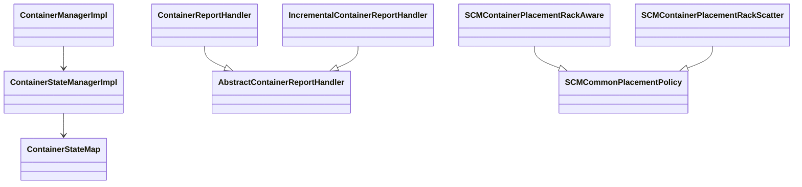

# scm / container-manager

_This feature page was generated from `study/atlas/components/scm/container-manager.md`. Author prose belongs above or below the BEGIN/END markers._

{/* BEGIN atlas-generated */}

**Classes:** 31    **Kinds:** service:17, interface:8, metrics:4, abstract:1, factory:1

## Overview

Container-manager encompasses container lifecycle management and the placement policies used to choose datanodes for new containers. `ContainerManagerImpl` is the top-level service: it allocates container IDs via `SequenceIdGenerator`, persists container metadata, and delegates lifecycle transitions to `ContainerStateManagerImpl`. `ContainerStateManagerImpl` wraps `ContainerStateMap` (an in-memory index of container state and attributes) and applies mutations through `SCMStateMachine` when HA is enabled. Container health reports from datanodes flow through `AbstractContainerReportHandler` subclasses (`ContainerReportHandler` for full reports, `IncrementalContainerReportHandler` for incremental ones); these handlers update replica state and fire `CLOSE_CONTAINER` events. Placement is handled by `SCMCommonPlacementPolicy` subclasses: `SCMContainerPlacementRackAware` picks nodes one rack at a time to spread replicas across failure domains, while `SCMContainerPlacementRackScatter` enforces that each replica goes to a distinct rack. Placement algorithms consult `SCMNodeMetric` and `SCMNodeStat` for per-node capacity data.

## Diagram

## Class table

### Sub-feature: `container.metrics`

| reading_order | fqcn | kind | logic | loc | study (min) | role |
|--:|---|---|---|--:|--:|---|
| 516 | <Fqcn>org.apache.hadoop.hdds.scm.container.metrics.SCMContainerManagerMetrics</Fqcn> | metrics | mixed | 75~ | 20 | Class contains metrics related to ContainerManager. |

### Sub-feature: `container.report`

| reading_order | fqcn | kind | logic | loc | study (min) | role |
|--:|---|---|---|--:|--:|---|
| 517 | <Fqcn>org.apache.hadoop.hdds.scm.container.report.ContainerReportValidator</Fqcn> | service | mixed | 50~ | 20 | Class for Validating Container Report. |

### Sub-feature: `container.states`

| reading_order | fqcn | kind | logic | loc | study (min) | role |
|--:|---|---|---|--:|--:|---|
| 518 | <Fqcn>org.apache.hadoop.hdds.scm.container.states.ContainerStateMap</Fqcn> | service | mixed | 150~ | 45 | Container State Map acts like a unified map for various attributes that are used to select containers when we need al... |
| 519 | <Fqcn>org.apache.hadoop.hdds.scm.container.states.ContainerState</Fqcn> | service | mixed | 50~ | 30 | Class that acts as the container state. |
| 520 | <Fqcn>org.apache.hadoop.hdds.scm.container.states.ContainerAttribute</Fqcn> | service | mixed | 50~ | 30 | Each Attribute that we manage for a container is maintained as a map. |
| 521 | <Fqcn>org.apache.hadoop.hdds.scm.container.states.ContainerEntry</Fqcn> | service | mixed | 25~ | 30 | The entry (ContainerInfo and ContainerReplicas) for a container in ContainerStateMap. |

### Sub-feature: `placement.algorithms`

| reading_order | fqcn | kind | logic | loc | study (min) | role |
|--:|---|---|---|--:|--:|---|
| 522 | <Fqcn>org.apache.hadoop.hdds.scm.container.placement.algorithms.SCMContainerPlacementRackAware</Fqcn> | service | logic-heavy | 425~ | 20 | Container placement policy that choose datanodes with network topology awareness, together with the space to satisfy... |
| 523 | <Fqcn>org.apache.hadoop.hdds.scm.container.placement.algorithms.SCMContainerPlacementRackScatter</Fqcn> | service | logic-heavy | 400~ | 60 | Container placement policy that scatter datanodes on different racks , together with the space to satisfy the size co... |
| 524 | <Fqcn>org.apache.hadoop.hdds.scm.container.placement.algorithms.SCMContainerPlacementCapacity</Fqcn> | service | mixed | 50~ | 30 | Container placement policy that randomly choose datanodes with remaining space to satisfy the size constraints. |
| 525 | <Fqcn>org.apache.hadoop.hdds.scm.container.placement.algorithms.SCMContainerPlacementRandom</Fqcn> | service | mixed | 50~ | 30 | Container placement policy that randomly chooses healthy datanodes. |
| 526 | <Fqcn>org.apache.hadoop.hdds.scm.container.placement.algorithms.ContainerPlacementStatusDefault</Fqcn> | service | mixed | 50~ | 30 | Simple Status object to check if a container is replicated across enough racks. |
| 527 | <Fqcn>org.apache.hadoop.hdds.scm.container.placement.algorithms.ContainerPlacementPolicyFactory</Fqcn> | factory | mixed | 50~ | 20 | A factory to create container placement instance based on configuration property ScmConfigKeys#OZONE_SCM_CONTAINER_PL... |
| 528 | <Fqcn>org.apache.hadoop.hdds.scm.container.placement.algorithms.SCMContainerPlacementMetrics</Fqcn> | metrics | mixed | 50~ | 20 | This class is for maintaining Topology aware container placement statistics. |

### Sub-feature: `placement.metrics`

| reading_order | fqcn | kind | logic | loc | study (min) | role |
|--:|---|---|---|--:|--:|---|
| 529 | <Fqcn>org.apache.hadoop.hdds.scm.container.placement.metrics.SCMNodeMetric</Fqcn> | service | mixed | 100~ | 20 | SCM Node Metric that is used in the placement classes. |
| 530 | <Fqcn>org.apache.hadoop.hdds.scm.container.placement.metrics.LongMetric</Fqcn> | service | mixed | 50~ | 20 | An helper class for all metrics based on Longs. |
| 531 | <Fqcn>org.apache.hadoop.hdds.scm.container.placement.metrics.DatanodeMetric</Fqcn> | interface | mixed | 25~ | 20 | DatanodeMetric acts as the basis for all the metric that is used in comparing 2 datanodes. |
| 532 | <Fqcn>org.apache.hadoop.hdds.scm.container.placement.metrics.NodeStat</Fqcn> | interface | mixed | 25~ | 20 | Interface that defines Node Stats. |
| 533 | <Fqcn>org.apache.hadoop.hdds.scm.container.placement.metrics.SCMNodeStat</Fqcn> | service | mixed | 125~ | 30 | This class represents the SCM node stat. |
| 534 | <Fqcn>org.apache.hadoop.hdds.scm.container.placement.metrics.ContainerStat</Fqcn> | service | mixed | 100~ | 30 | This class represents the SCM container stat. |
| 535 | <Fqcn>org.apache.hadoop.hdds.scm.container.placement.metrics.SCMMetrics</Fqcn> | metrics | mixed | 125~ | 20 | This class is for maintaining StorageContainerManager statistics. |
| 536 | <Fqcn>org.apache.hadoop.hdds.scm.container.placement.metrics.SCMPerformanceMetrics</Fqcn> | metrics | mixed | 75~ | 20 | Including SCM performance related metrics. |

### Sub-feature: `scm.container`

| reading_order | fqcn | kind | logic | loc | study (min) | role |
|--:|---|---|---|--:|--:|---|
| 537 | <Fqcn>org.apache.hadoop.hdds.scm.container.ContainerStateManager</Fqcn> | interface | mixed | 50~ | 20 | A ContainerStateManager is responsible for keeping track of all the container and its state inside SCM, it also expos... |
| 538 | <Fqcn>org.apache.hadoop.hdds.scm.container.ContainerManager</Fqcn> | interface | mixed | 50~ | 20 | ContainerManager is responsible for keeping track of all Containers and managing all containers operations like creat... |
| 539 | <Fqcn>org.apache.hadoop.hdds.scm.container.AbstractContainerReportHandler</Fqcn> | abstract | logic-heavy | 300~ | 45 | Base class for all the container report handlers. |
| 540 | <Fqcn>org.apache.hadoop.hdds.scm.container.ContainerStateManagerImpl</Fqcn> | service | logic-heavy | 400~ | 60 | Default implementation of ContainerStateManager. |
| 541 | <Fqcn>org.apache.hadoop.hdds.scm.container.ContainerManagerImpl</Fqcn> | service | logic-heavy | 350~ | 45 | ContainerManager implementation in SCM server. |
| 542 | <Fqcn>org.apache.hadoop.hdds.scm.container.ContainerReplica</Fqcn> | service | mixed | 175~ | 45 | In-memory state of a container replica. |
| 543 | <Fqcn>org.apache.hadoop.hdds.scm.container.ContainerReportHandler</Fqcn> | service | mixed | 125~ | 30 | Handles container reports from datanode. |
| 544 | <Fqcn>org.apache.hadoop.hdds.scm.container.CloseContainerEventHandler</Fqcn> | service | mixed | 100~ | 30 | In case of a node failure, volume failure, volume out of spapce, node out of space etc, CLOSE_CONTAINER will be trigg... |
| 545 | <Fqcn>org.apache.hadoop.hdds.scm.container.IncrementalContainerReportHandler</Fqcn> | service | mixed | 75~ | 30 | Handles incremental container reports from datanode. |
| 546 | <Fqcn>org.apache.hadoop.hdds.scm.container.ContainerActionsHandler</Fqcn> | service | mixed | 25~ | 30 | Handles container reports from datanode. |

## Anchor details

### `SCMContainerPlacementRackAware`

- **path:** `hadoop-hdds/server-scm/src/main/java/org/apache/hadoop/hdds/scm/container/placement/algorithms/SCMContainerPlacementRackAware.java`
- **loc:** 425~    **difficulty:** 2    **study:** 20 min    **concurrency:** single-threaded    **persistence:** in-memory
- **key collaborators:** `org.apache.hadoop.hdds.conf.ConfigurationSource`, `org.apache.hadoop.hdds.protocol.DatanodeDetails`, `org.apache.hadoop.hdds.scm.SCMCommonPlacementPolicy`, `org.apache.hadoop.hdds.scm.exceptions.SCMException`, `org.apache.hadoop.hdds.scm.net.NetConstants`, `org.apache.hadoop.hdds.scm.net.NetworkTopology`
- **test exemplar:** `hadoop-hdds/server-scm/src/test/java/org/apache/hadoop/hdds/scm/container/placement/algorithms/TestSCMContainerPlacementRackAware.java`
- **role:** Container placement policy that choose datanodes with network topology awareness, together with the space to satisfy...

### `AbstractContainerReportHandler`

- **path:** `hadoop-hdds/server-scm/src/main/java/org/apache/hadoop/hdds/scm/container/AbstractContainerReportHandler.java`
- **loc:** 300~    **difficulty:** 4    **study:** 45 min    **concurrency:** thread-safe    **persistence:** in-memory
- **key collaborators:** `org.apache.hadoop.hdds.client.ECReplicationConfig`, `org.apache.hadoop.hdds.protocol.DatanodeDetails`, `org.apache.hadoop.hdds.protocol.DatanodeID`, `org.apache.hadoop.hdds.scm.events.SCMEvents`, `org.apache.hadoop.hdds.scm.ha.SCMContext`, `org.apache.hadoop.hdds.scm.node.NodeManager`
- **role:** Base class for all the container report handlers.

### `ContainerStateManagerImpl`

- **path:** `hadoop-hdds/server-scm/src/main/java/org/apache/hadoop/hdds/scm/container/ContainerStateManagerImpl.java`
- **loc:** 400~    **difficulty:** 5    **study:** 60 min    **concurrency:** thread-safe    **persistence:** in-memory
- **entry points:** `build`
- **key collaborators:** `org.apache.hadoop.hdds.scm.container.states.ContainerState`, `org.apache.hadoop.hdds.scm.container.states.ContainerStateMap`, `org.apache.hadoop.hdds.scm.ScmConfigKeys`, `org.apache.hadoop.hdds.scm.container.common.helpers.InvalidContainerStateException`, `org.apache.hadoop.hdds.scm.container.replication.ContainerReplicaPendingOps`, `org.apache.hadoop.hdds.scm.ha.ExecutionUtil`
- **role:** Default implementation of ContainerStateManager.

### `SCMContainerPlacementRackScatter`

- **path:** `hadoop-hdds/server-scm/src/main/java/org/apache/hadoop/hdds/scm/container/placement/algorithms/SCMContainerPlacementRackScatter.java`
- **loc:** 400~    **difficulty:** 5    **study:** 60 min    **concurrency:** single-threaded    **persistence:** in-memory
- **key collaborators:** `org.apache.hadoop.hdds.scm.container.placement.metrics.SCMNodeMetric`, `org.apache.hadoop.hdds.conf.ConfigurationSource`, `org.apache.hadoop.hdds.protocol.DatanodeDetails`, `org.apache.hadoop.hdds.scm.ContainerPlacementStatus`, `org.apache.hadoop.hdds.scm.SCMCommonPlacementPolicy`, `org.apache.hadoop.hdds.scm.ScmConfigKeys`
- **test exemplar:** `hadoop-hdds/server-scm/src/test/java/org/apache/hadoop/hdds/scm/container/placement/algorithms/TestSCMContainerPlacementRackScatter.java`
- **role:** Container placement policy that scatter datanodes on different racks , together with the space to satisfy the size co...

### `ContainerManagerImpl`

- **path:** `hadoop-hdds/server-scm/src/main/java/org/apache/hadoop/hdds/scm/container/ContainerManagerImpl.java`
- **loc:** 350~    **difficulty:** 4    **study:** 45 min    **concurrency:** thread-safe    **persistence:** in-memory
- **key collaborators:** `org.apache.hadoop.hdds.scm.container.metrics.SCMContainerManagerMetrics`, `org.apache.hadoop.hdds.client.ECReplicationConfig`, `org.apache.hadoop.hdds.client.ReplicationConfig`, `org.apache.hadoop.hdds.scm.container.replication.ContainerReplicaPendingOps`, `org.apache.hadoop.hdds.scm.ha.SCMHAManager`, `org.apache.hadoop.hdds.scm.ha.SequenceIdGenerator`
- **test exemplar:** `hadoop-hdds/server-scm/src/test/java/org/apache/hadoop/hdds/scm/container/TestContainerManagerImpl.java`
- **role:** ContainerManager implementation in SCM server.

## Design docs

- `hadoop-hdds/docs/content/design/topology.md` — describes the rack-aware network topology model that `SCMContainerPlacementRackAware` and `SCMContainerPlacementRackScatter` rely on

## Seminal JIRAs / PRs

- [HDDS-737](https://issues.apache.org/jira/browse/HDDS-737). Introduce Incremental Container Report.
- [HDDS-896](https://issues.apache.org/jira/browse/HDDS-896). Handle over replicated containers in SCM.
- [HDDS-14103](https://issues.apache.org/jira/browse/HDDS-14103). Create an option to suppress/unsuppress containers from report.
- [HDDS-14416](https://issues.apache.org/jira/browse/HDDS-14416). Handle delete ratis replica in DELETED/DELETING container scenario.
- [HDDS-14921](https://issues.apache.org/jira/browse/HDDS-14921). Improve space accounting in SCM with In-Flight container allocation tracking.
- [HDDS-15093](https://issues.apache.org/jira/browse/HDDS-15093). Make RackScatter intra-rack placement capacity-aware.
- [HDDS-15578](https://issues.apache.org/jira/browse/HDDS-15578). Prevent throwing InvalidStateTransitionException from updateContainerStateWithSequenceId.

## Sharp edges

- `ContainerStateManagerImpl` mutations are routed through a `SCMStateMachine` Ratis invocation when HA is active. Any state-changing method annotated with `@Replicate` will fail on a follower SCM because the write is forwarded to the leader. Callers that catch only `IOException` may silently swallow `NotLeaderException` subclasses if not handled explicitly. (`ContainerStateManagerImpl.java`, methods annotated with `@Replicate`.)
- `SCMContainerPlacementRackAware` falls back to rack-unaware placement if network topology is not configured. This fallback is silent: no warning is logged and callers see a successful placement that does not satisfy rack-diversity requirements. ([HDDS-14088](https://issues.apache.org/jira/browse/HDDS-14088) area; `SCMContainerPlacementRackAware.java` `chooseDatanodes` method.)

## Related features

- `components/scm/container-replication.md` — `ReplicationManager` reads container replica state managed here
- `components/scm/scm-ha.md` — `ContainerStateManagerImpl` mutations are replicated through `SCMStateMachine`
- `components/scm/pipeline-manager.md` — containers are assigned to pipelines managed by `PipelineManagerImpl`
- `components/scm/node-manager.md` — placement policies query `NodeManager` for rack topology and node capacity

## Self-quiz

1. `ContainerStateManagerImpl.build()` is the entry point. What does the `build` pattern accomplish that a plain constructor would not?
2. `AbstractContainerReportHandler` is `thread-safe`. What does it lock, and what happens if two full container reports from the same datanode arrive concurrently?
3. `SCMContainerPlacementRackAware` and `SCMContainerPlacementRackScatter` both extend `SCMCommonPlacementPolicy`. What is the key behavioral difference between them when placing three replicas on a cluster with exactly two racks?
4. When `ContainerManagerImpl.allocateContainer()` allocates a new container ID, which class provides the ID and how does that class ensure monotonicity under Ratis leader failover?
5. What does `CloseContainerEventHandler` do when it receives a `CLOSE_CONTAINER` event, and which upstream component fires that event?

Answers

Answer 1: The `build()` factory method allows `ContainerStateManagerImpl` to load all existing containers from the RocksDB `containerTable` into the in-memory `ContainerStateMap` before the object is returned to callers. A constructor would expose a half-initialized object while the load is still in progress.
Answer 2: `AbstractContainerReportHandler` acquires a per-container lock from `ContainerManager` before updating replica state. Concurrent full reports from the same datanode will serialize on that lock, so the second report simply overwrites the first with no data loss.
Answer 3: `SCMContainerPlacementRackAware` allows two replicas to share a rack as long as they are on different nodes; it requires only one inter-rack separation. `SCMContainerPlacementRackScatter` ([HDDS-15093](https://issues.apache.org/jira/browse/HDDS-15093)) enforces that every replica is on a distinct rack, which is impossible with only two racks for three replicas — it falls back gracefully to the best achievable scatter.
Answer 4: `SequenceIdGenerator` in the `scm-ha` feature provides the ID. On leader election it invalidates any un-exhausted in-memory batch by setting `nextId = lastId + 1`, forcing the new leader to load `lastId` from RocksDB and allocate a fresh batch before issuing the first ID.
Answer 5: `CloseContainerEventHandler.onMessage()` calls `ContainerManagerImpl.updateContainerState()` to transition the container to `CLOSING`. The event is fired by `SCMDatanodeHeartbeatDispatcher` when it processes a `ContainerActionsProto.Action.CLOSE` from a datanode heartbeat.

{/* END atlas-generated */}
