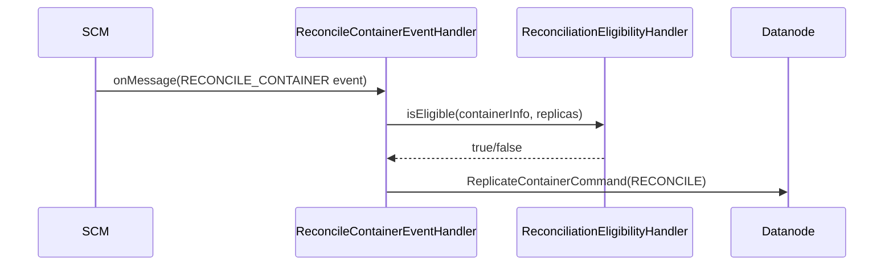

# scm / container-reconciliation

_This feature page was generated from `study/atlas/components/scm/container-reconciliation.md`. Author prose belongs above or below the BEGIN/END markers._

{/* BEGIN atlas-generated */}

**Classes:** 2    **Kinds:** service:1, data:1

## Overview

Container reconciliation is a targeted repair mechanism for containers whose replicas hold divergent data (e.g., after a partial write or a split-brain event). When SCM determines a container needs reconciliation it fires a `RECONCILE_CONTAINER` event. `ReconcileContainerEventHandler` receives the event and consults `ReconciliationEligibilityHandler` to determine whether the container is currently safe to reconcile: the handler checks container state, replication type, and replica states. If eligible, the handler emits a `ReplicateContainerCommand` with `RECONCILE` as the operation type, which is sent to datanodes to compare and repair mismatched replica checksums. The feature is small (2 classes) and leans on the existing replication command infrastructure for actual data transfer.

## Diagram

## Class table

### Sub-feature: `container.reconciliation`

| reading_order | fqcn | kind | logic | loc | study (min) | role |
|--:|---|---|---|--:|--:|---|
| 1472 | <Fqcn>org.apache.hadoop.hdds.scm.container.reconciliation.ReconcileContainerEventHandler</Fqcn> | service | mixed | 50~ | 30 | When a reconcile container event is fired, this class will check if the container is eligible for reconciliation, and... |
| 1473 | <Fqcn>org.apache.hadoop.hdds.scm.container.reconciliation.ReconciliationEligibilityHandler</Fqcn> | service | mixed | 75~ | 10 | Determines whether a container is eligible for reconciliation based on its state, replica states, replication type, a... |

## Anchor details

_No logic-heavy anchors in this feature; the classes are primarily data / dto / config / cli._

## Design docs

- `hadoop-hdds/docs/content/design/container-reconciliation.md` — design document for the container reconciliation protocol

## Seminal JIRAs / PRs

- [HDDS-10372](https://issues.apache.org/jira/browse/HDDS-10372). SCM and Datanode communication for reconciliation.
- [HDDS-11254](https://issues.apache.org/jira/browse/HDDS-11254). Reconcile commands should be handled by datanode ReplicationSupervisor.

## Sharp edges

- Neither class in this feature has logic-heavy code; reconciliation eligibility is evaluated at the moment the event fires with a point-in-time view of replicas. If replica state changes between event firing and command delivery (e.g., a replica goes offline), the datanode may receive an obsolete reconcile command that has no effect.

## Related features

- `components/scm/container-replication.md` — reconciliation commands share the replication command infrastructure
- `components/scm/container-manager.md` — `ReconciliationEligibilityHandler` queries container state from `ContainerManager`
- `components/scm/scm-events.md` — `SCMEvents` defines the `RECONCILE_CONTAINER` event type

## Self-quiz

1. `ReconcileContainerEventHandler.onMessage()` is the event handler entry point. What two conditions does `ReconciliationEligibilityHandler` check before deciding eligibility?
2. Which container states make a container ineligible for reconciliation, and why would reconciling a container in OPEN state be problematic?
3. The feature has no metrics class. How would you add observability without introducing a new class?
4. Reconciliation is triggered by an event. What component fires that event, and under what circumstances?
5. How does the actual data comparison/repair happen once the `ReplicateContainerCommand` with RECONCILE type is delivered to a datanode?

Answers

Answer 1: `ReconciliationEligibilityHandler` checks (a) the container's lifecycle state (it must be CLOSED or QUASI_CLOSED) and (b) the replication type (Ratis-only reconciliation is the initial supported case). EC container reconciliation requires additional checks on stripe completeness.
Answer 2: OPEN and CLOSING containers are ineligible because their data is still being written. Reconciling an OPEN container could cause reads from the partially-written replica and produce data corruption.
Answer 3: The existing `SCMContainerManagerMetrics` or `ReplicationManagerMetrics` could add a counter for reconcile commands issued; no new class is needed.
Answer 4: inferred: the `ReplicationManager` or an admin-triggered command fires the event when it detects replica checksum mismatches during a health check pass.
Answer 5: The datanode's `ReplicationSupervisor` ([HDDS-11254](https://issues.apache.org/jira/browse/HDDS-11254)) handles the command, contacts the other replicas, compares block checksums, and overwrites divergent blocks from the authoritative replica.

{/* END atlas-generated */}
