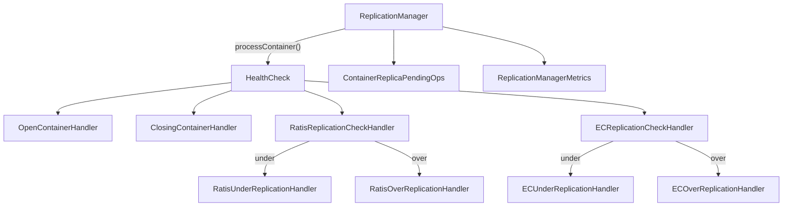

# scm / container-replication

_This feature page was generated from `study/atlas/components/scm/container-replication.md`. Author prose belongs above or below the BEGIN/END markers._

{/* BEGIN atlas-generated */}

**Classes:** 48    **Kinds:** service:36, interface:4, abstract:4, dto:1, data:1, metrics:1, exception:1

## Overview

Replication Manager (RM) is the heart of SCM's self-healing: it periodically scans every container, computes its health, and enqueues repair or delete commands as needed. `ReplicationManager` drives a health-check pipeline composed of `HealthCheck` handler implementations chained in a fixed order (open, closing, deleting, mismatched-replicas, quasi-closed, EC/Ratis replication checks). Each check produces a `ContainerHealthResult` that describes the problem category. Under-replicated containers are handed to `ECUnderReplicationHandler` or `RatisUnderReplicationHandler`; over-replicated ones go to corresponding over-replication handlers. `ContainerReplicaPendingOps` tracks in-flight add/delete ops so that handlers can account for pending work before issuing duplicate commands. `RatisContainerReplicaCount` and `ECContainerReplicaCount` compute the exact count of usable replicas taking decommission/maintenance state into account. `ReplicationManagerMetrics` exposes per-state container counts and command counts through Hadoop Metrics2.

## Diagram

## Class table

### Sub-feature: `under-replication`

| reading_order | fqcn | kind | logic | loc | study (min) | role |
|--:|---|---|---|--:|--:|---|
| 578 | <Fqcn>org.apache.hadoop.hdds.scm.container.replication.RatisUnderReplicationHandler</Fqcn> | service | logic-heavy | 300~ | 45 | This class handles Ratis containers that are under replicated. |
| 579 | <Fqcn>org.apache.hadoop.hdds.scm.container.replication.QuasiClosedStuckUnderReplicationHandler</Fqcn> | service | mixed | 100~ | 30 | Class to correct under replicated QuasiClosed Stuck Ratis containers. |
| 580 | <Fqcn>org.apache.hadoop.hdds.scm.container.replication.UnderReplicatedProcessor</Fqcn> | service | mixed | 25~ | 30 | Class used to pick messages from the ReplicationManager under replicated queue, calculate the reconstruction commands... |

### Sub-feature: `over-replication`

| reading_order | fqcn | kind | logic | loc | study (min) | role |
|--:|---|---|---|--:|--:|---|
| 581 | <Fqcn>org.apache.hadoop.hdds.scm.container.replication.AbstractOverReplicationHandler</Fqcn> | abstract | mixed | 50~ | 30 | This class holds some common methods that will be shared among different kinds of implementation of OverReplicationHa... |
| 582 | <Fqcn>org.apache.hadoop.hdds.scm.container.replication.RatisOverReplicationHandler</Fqcn> | service | mixed | 175~ | 45 | This class handles Ratis containers that are over replicated. |
| 583 | <Fqcn>org.apache.hadoop.hdds.scm.container.replication.QuasiClosedStuckOverReplicationHandler</Fqcn> | service | mixed | 75~ | 30 | Class to correct over replicated QuasiClosed Stuck Ratis containers. |
| 584 | <Fqcn>org.apache.hadoop.hdds.scm.container.replication.OverReplicatedProcessor</Fqcn> | service | mixed | 25~ | 30 | Class used to pick messages from the ReplicationManager over replicated queue, calculate the delete commands and assi... |
| 585 | <Fqcn>org.apache.hadoop.hdds.scm.container.replication.CommandTargetOverloadedException</Fqcn> | exception | data-only | 25~ | 10 | Exception class used to indicate that all sources are overloaded. |

### Sub-feature: `mis-replication`

| reading_order | fqcn | kind | logic | loc | study (min) | role |
|--:|---|---|---|--:|--:|---|
| 586 | <Fqcn>org.apache.hadoop.hdds.scm.container.replication.MisReplicationHandler</Fqcn> | abstract | mixed | 125~ | 30 | Handles the Mis replication processing and forming the respective SCM commands. |
| 587 | <Fqcn>org.apache.hadoop.hdds.scm.container.replication.RatisMisReplicationHandler</Fqcn> | service | mixed | 25~ | 30 | Handles the Ratis mis replication processing and forming the respective SCM commands. |

### Sub-feature: `lifecycle-transitions`

| reading_order | fqcn | kind | logic | loc | study (min) | role |
|--:|---|---|---|--:|--:|---|
| 588 | <Fqcn>org.apache.hadoop.hdds.scm.container.replication.UnhealthyReplicationHandler</Fqcn> | interface | mixed | 25~ | 20 | This interface to create respective commands after processing the replicas with pending ops and health check results. |
| 589 | <Fqcn>org.apache.hadoop.hdds.scm.container.replication.UnhealthyReplicationProcessor</Fqcn> | abstract | mixed | 100~ | 30 | Class used to pick messages from the respective ReplicationManager unhealthy replicated queue, calculate the delete c... |
| 590 | <Fqcn>org.apache.hadoop.hdds.scm.container.replication.QuasiClosedStuckReplicaCount</Fqcn> | service | mixed | 150~ | 45 | Class to count the replicas in a quasi-closed stuck container. |

### Sub-feature: `ec-replication`

| reading_order | fqcn | kind | logic | loc | study (min) | role |
|--:|---|---|---|--:|--:|---|
| 591 | <Fqcn>org.apache.hadoop.hdds.scm.container.replication.ECUnderReplicationHandler</Fqcn> | service | logic-heavy | 525~ | 60 | Handles the EC Under replication processing and forming the respective SCM commands. |
| 592 | <Fqcn>org.apache.hadoop.hdds.scm.container.replication.ECContainerReplicaCount</Fqcn> | service | logic-heavy | 300~ | 45 | This class provides a set of methods to test for over / under replication of EC containers, taking into account decom... |
| 593 | <Fqcn>org.apache.hadoop.hdds.scm.container.replication.ECOverReplicationHandler</Fqcn> | service | mixed | 100~ | 30 | Handles the EC Over replication processing and forming the respective SCM commands. |
| 594 | <Fqcn>org.apache.hadoop.hdds.scm.container.replication.ECMisReplicationHandler</Fqcn> | service | mixed | 50~ | 30 | Handles the EC Mis replication processing and forming the respective SCM commands. |

### Sub-feature: `health-checks`

| reading_order | fqcn | kind | logic | loc | study (min) | role |
|--:|---|---|---|--:|--:|---|
| 595 | <Fqcn>org.apache.hadoop.hdds.scm.container.replication.health.HealthCheck</Fqcn> | interface | mixed | 25~ | 20 | Interface used by Container Health Check Handlers. |
| 596 | <Fqcn>org.apache.hadoop.hdds.scm.container.replication.health.AbstractCheck</Fqcn> | abstract | mixed | 25~ | 30 | Abstract base class for Container Health Checks to extend. |
| 597 | <Fqcn>org.apache.hadoop.hdds.scm.container.replication.health.RatisReplicationCheckHandler</Fqcn> | service | mixed | 175~ | 45 | Class to determine the health state of a Ratis Container. |
| 598 | <Fqcn>org.apache.hadoop.hdds.scm.container.replication.health.EmptyContainerHandler</Fqcn> | service | mixed | 100~ | 30 | This handler deletes a container if it's closed or quasi-closed and empty (0 key count) and all its replicas are empty. |
| 599 | <Fqcn>org.apache.hadoop.hdds.scm.container.replication.health.ECReplicationCheckHandler</Fqcn> | service | mixed | 100~ | 30 | Container Check handler to check the under / over replication state for EC containers. |
| 600 | <Fqcn>org.apache.hadoop.hdds.scm.container.replication.health.ECMisReplicationCheckHandler</Fqcn> | service | mixed | 75~ | 30 | This class checks if an EC container is mis replicated. |
| 601 | <Fqcn>org.apache.hadoop.hdds.scm.container.replication.health.RatisUnhealthyReplicationCheckHandler</Fqcn> | service | mixed | 75~ | 30 | This class handles RATIS containers which only have replicas in UNHEALTHY state, or CLOSED containers with replicas i... |
| 602 | <Fqcn>org.apache.hadoop.hdds.scm.container.replication.health.QuasiClosedContainerHandler</Fqcn> | service | mixed | 75~ | 30 | Class for handling containers that are in QUASI_CLOSED state. |
| 603 | <Fqcn>org.apache.hadoop.hdds.scm.container.replication.health.QuasiClosedStuckReplicationCheck</Fqcn> | service | mixed | 75~ | 30 | Class to check for the replication of the replicas in quasi-closed stuck containers. |
| 604 | <Fqcn>org.apache.hadoop.hdds.scm.container.replication.health.MismatchedReplicasHandler</Fqcn> | service | mixed | 50~ | 30 | Handler to process containers which are closed or quasi-closed, but some replicas are still open or closing. |
| 605 | <Fqcn>org.apache.hadoop.hdds.scm.container.replication.health.VulnerableUnhealthyReplicasHandler</Fqcn> | service | mixed | 50~ | 30 | A QUASI_CLOSED container may have some UNHEALTHY replicas with the same Sequence ID as the container and on unique or... |
| 606 | <Fqcn>org.apache.hadoop.hdds.scm.container.replication.health.ClosedWithUnhealthyReplicasHandler</Fqcn> | service | mixed | 50~ | 30 | Handler to process containers EC which are closed but have some replicas that are unhealthy. |
| 607 | <Fqcn>org.apache.hadoop.hdds.scm.container.replication.health.OpenContainerHandler</Fqcn> | service | mixed | 50~ | 30 | Class used in Replication Manager to check open container health for both EC and Ratis containers. |
| 608 | <Fqcn>org.apache.hadoop.hdds.scm.container.replication.health.ClosingContainerHandler</Fqcn> | service | mixed | 50~ | 30 | Class used in Replication Manager to close replicas of CLOSING containers. |
| 609 | <Fqcn>org.apache.hadoop.hdds.scm.container.replication.health.DeletingContainerHandler</Fqcn> | service | mixed | 50~ | 30 | Class used in Replication Manager to handle the replicas of containers in DELETING State. |

### Sub-feature: `container.replication`

| reading_order | fqcn | kind | logic | loc | study (min) | role |
|--:|---|---|---|--:|--:|---|
| 610 | <Fqcn>org.apache.hadoop.hdds.scm.container.replication.ContainerReplicaPendingOpsSubscriber</Fqcn> | interface | mixed | 25~ | 20 | A subscriber can register with ContainerReplicaPendingOps to receive updates on pending ops. |
| 611 | <Fqcn>org.apache.hadoop.hdds.scm.container.replication.ContainerReplicaCount</Fqcn> | interface | mixed | 25~ | 20 | Common interface for EC and non-EC container replica counts. |
| 612 | <Fqcn>org.apache.hadoop.hdds.scm.container.replication.ReplicationManager</Fqcn> | service | logic-heavy | 1025~ | 60 | Replication Manager (RM) is the one which is responsible for making sure that the containers are properly replicated. |
| 613 | <Fqcn>org.apache.hadoop.hdds.scm.container.replication.RatisContainerReplicaCount</Fqcn> | service | logic-heavy | 325~ | 45 | Immutable object that is created with a set of ContainerReplica objects and the number of in flight replica add and d... |
| 614 | <Fqcn>org.apache.hadoop.hdds.scm.container.replication.ContainerReplicaPendingOps</Fqcn> | service | logic-heavy | 325~ | 45 | Class to track pending replication operations across the cluster. |
| 615 | <Fqcn>org.apache.hadoop.hdds.scm.container.replication.ReplicationManagerUtil</Fqcn> | service | logic-heavy | 250~ | 45 | Utility class for ReplicationManager. |
| 616 | <Fqcn>org.apache.hadoop.hdds.scm.container.replication.ContainerHealthResult</Fqcn> | service | logic-heavy | 200~ | 45 | Class used to represent the Health States of containers. |
| 617 | <Fqcn>org.apache.hadoop.hdds.scm.container.replication.ReplicationQueue</Fqcn> | service | mixed | 50~ | 30 | Object to encapsulate the under and over replication queues used by replicationManager. |
| 618 | <Fqcn>org.apache.hadoop.hdds.scm.container.replication.InflightType</Fqcn> | data | data-only | 25~ | 30 | inferred: InflightType — role not documented. |
| 619 | <Fqcn>org.apache.hadoop.hdds.scm.container.replication.ReplicationManagerEventHandler</Fqcn> | service | mixed | 25~ | 30 | Handles events related to the ReplicationManager. |
| 620 | <Fqcn>org.apache.hadoop.hdds.scm.container.replication.DatanodeCommandCountUpdatedHandler</Fqcn> | service | mixed | 25~ | 30 | Event handler for the DATANODE_COMMAND_COUNT_UPDATED event. |
| 621 | <Fqcn>org.apache.hadoop.hdds.scm.container.replication.MonitoringReplicationQueue</Fqcn> | service | mixed | 25~ | 30 | A class which extends ReplicationQueue and does nothing. |
| 622 | <Fqcn>org.apache.hadoop.hdds.scm.container.replication.InflightAction</Fqcn> | service | mixed | 25~ | 30 | InflightAction is a Wrapper class to hold the InflightAction with its start time and the target datanode. |
| 623 | <Fqcn>org.apache.hadoop.hdds.scm.container.replication.ContainerCheckRequest</Fqcn> | dto | data-only | 75~ | 10 | Simple class to wrap the parameters needed to check a container's health in ReplicationManager. |
| 624 | <Fqcn>org.apache.hadoop.hdds.scm.container.replication.ContainerReplicaOp</Fqcn> | service | mixed | 50~ | 10 | ContainerReplicaOp wraps the information needed to track a pending replication operation (ADD or DELETE) against a sp... |
| 625 | <Fqcn>org.apache.hadoop.hdds.scm.container.replication.ReplicationManagerMetrics</Fqcn> | metrics | logic-heavy | 400~ | 20 | Class contains metrics related to ReplicationManager. |

## Anchor details

### `ReplicationManager`

- **path:** `hadoop-hdds/server-scm/src/main/java/org/apache/hadoop/hdds/scm/container/replication/ReplicationManager.java`
- **loc:** 1025~    **difficulty:** 5    **study:** 60 min    **concurrency:** thread-safe    **persistence:** in-memory
- **entry points:** `start`
- **key collaborators:** `org.apache.hadoop.hdds.scm.container.replication.health.ClosedWithUnhealthyReplicasHandler`, `org.apache.hadoop.hdds.scm.container.replication.health.ClosingContainerHandler`, `org.apache.hadoop.hdds.scm.container.replication.health.DeletingContainerHandler`, `org.apache.hadoop.hdds.scm.container.replication.health.ECMisReplicationCheckHandler`, `org.apache.hadoop.hdds.scm.container.replication.health.ECReplicationCheckHandler`, `org.apache.hadoop.hdds.scm.container.replication.health.EmptyContainerHandler`
- **test exemplar:** `hadoop-hdds/server-scm/src/test/java/org/apache/hadoop/hdds/scm/container/replication/TestReplicationManager.java`
- **role:** Replication Manager (RM) is the one which is responsible for making sure that the containers are properly replicated.

### `ECUnderReplicationHandler`

- **path:** `hadoop-hdds/server-scm/src/main/java/org/apache/hadoop/hdds/scm/container/replication/ECUnderReplicationHandler.java`
- **loc:** 525~    **difficulty:** 5    **study:** 60 min    **concurrency:** single-threaded    **persistence:** in-memory
- **key collaborators:** `org.apache.hadoop.hdds.client.ECReplicationConfig`, `org.apache.hadoop.hdds.conf.ConfigurationSource`, `org.apache.hadoop.hdds.conf.StorageUnit`, `org.apache.hadoop.hdds.protocol.DatanodeDetails`, `org.apache.hadoop.hdds.scm.ContainerPlacementStatus`, `org.apache.hadoop.hdds.scm.PlacementPolicy`
- **test exemplar:** `hadoop-hdds/server-scm/src/test/java/org/apache/hadoop/hdds/scm/container/replication/TestECUnderReplicationHandler.java`
- **role:** Handles the EC Under replication processing and forming the respective SCM commands.

### `RatisContainerReplicaCount`

- **path:** `hadoop-hdds/server-scm/src/main/java/org/apache/hadoop/hdds/scm/container/replication/RatisContainerReplicaCount.java`
- **loc:** 325~    **difficulty:** 4    **study:** 45 min    **concurrency:** single-threaded    **persistence:** in-memory
- **key collaborators:** `org.apache.hadoop.hdds.protocol.DatanodeDetails`, `org.apache.hadoop.hdds.protocol.DatanodeID`, `org.apache.hadoop.hdds.scm.container.ContainerInfo`, `org.apache.hadoop.hdds.scm.container.ContainerReplica`, `org.apache.hadoop.hdds.scm.node.NodeManager`, `org.apache.hadoop.hdds.scm.node.NodeStatus`
- **test exemplar:** `hadoop-hdds/server-scm/src/test/java/org/apache/hadoop/hdds/scm/container/replication/TestRatisContainerReplicaCount.java`
- **role:** t that is created with a set of ContainerReplica objects and the number of in flight replica add and deletes, the con...

### `ContainerReplicaPendingOps`

- **path:** `hadoop-hdds/server-scm/src/main/java/org/apache/hadoop/hdds/scm/container/replication/ContainerReplicaPendingOps.java`
- **loc:** 325~    **difficulty:** 4    **study:** 45 min    **concurrency:** thread-safe    **persistence:** in-memory
- **key collaborators:** `org.apache.hadoop.hdds.client.ReplicationType`, `org.apache.hadoop.hdds.protocol.DatanodeDetails`, `org.apache.hadoop.hdds.protocol.DatanodeID`, `org.apache.hadoop.hdds.scm.container.ContainerID`, `org.apache.hadoop.ozone.protocol.commands.SCMCommand`
- **test exemplar:** `hadoop-hdds/server-scm/src/test/java/org/apache/hadoop/hdds/scm/container/replication/TestContainerReplicaPendingOps.java`
- **role:** Class to track pending replication operations across the cluster.

### `ECContainerReplicaCount`

- **path:** `hadoop-hdds/server-scm/src/main/java/org/apache/hadoop/hdds/scm/container/replication/ECContainerReplicaCount.java`
- **loc:** 300~    **difficulty:** 4    **study:** 45 min    **concurrency:** single-threaded    **persistence:** in-memory
- **key collaborators:** `org.apache.hadoop.hdds.client.ECReplicationConfig`, `org.apache.hadoop.hdds.protocol.DatanodeDetails`, `org.apache.hadoop.hdds.scm.container.ContainerInfo`, `org.apache.hadoop.hdds.scm.container.ContainerReplica`, `org.apache.hadoop.hdds.scm.node.NodeManager`
- **test exemplar:** `hadoop-hdds/server-scm/src/test/java/org/apache/hadoop/hdds/scm/container/replication/TestECContainerReplicaCount.java`
- **role:** s provides a set of methods to test for over / under replication of EC containers, taking into account decommission /...

### `RatisUnderReplicationHandler`

- **path:** `hadoop-hdds/server-scm/src/main/java/org/apache/hadoop/hdds/scm/container/replication/RatisUnderReplicationHandler.java`
- **loc:** 300~    **difficulty:** 4    **study:** 45 min    **concurrency:** single-threaded    **persistence:** in-memory
- **key collaborators:** `org.apache.hadoop.hdds.conf.ConfigurationSource`, `org.apache.hadoop.hdds.conf.StorageUnit`, `org.apache.hadoop.hdds.protocol.DatanodeDetails`, `org.apache.hadoop.hdds.scm.PlacementPolicy`, `org.apache.hadoop.hdds.scm.ScmConfigKeys`, `org.apache.hadoop.hdds.scm.container.ContainerInfo`
- **test exemplar:** `hadoop-hdds/server-scm/src/test/java/org/apache/hadoop/hdds/scm/container/replication/TestRatisUnderReplicationHandler.java`
- **role:** This class handles Ratis containers that are under replicated.

### `ReplicationManagerUtil`

- **path:** `hadoop-hdds/server-scm/src/main/java/org/apache/hadoop/hdds/scm/container/replication/ReplicationManagerUtil.java`
- **loc:** 250~    **difficulty:** 4    **study:** 45 min    **concurrency:** single-threaded    **persistence:** in-memory
- **key collaborators:** `org.apache.hadoop.hdds.protocol.DatanodeDetails`, `org.apache.hadoop.hdds.protocol.DatanodeID`, `org.apache.hadoop.hdds.scm.PlacementPolicy`, `org.apache.hadoop.hdds.scm.container.ContainerInfo`, `org.apache.hadoop.hdds.scm.container.ContainerReplica`, `org.apache.hadoop.hdds.scm.container.placement.metrics.SCMNodeMetric`
- **test exemplar:** `hadoop-hdds/server-scm/src/test/java/org/apache/hadoop/hdds/scm/container/replication/TestReplicationManagerUtil.java`
- **role:** Utility class for ReplicationManager.

### `ContainerHealthResult`

- **path:** `hadoop-hdds/server-scm/src/main/java/org/apache/hadoop/hdds/scm/container/replication/ContainerHealthResult.java`
- **loc:** 200~    **difficulty:** 4    **study:** 45 min    **concurrency:** single-threaded    **persistence:** in-memory
- **key collaborators:** `org.apache.hadoop.hdds.scm.container.ContainerInfo`, `org.apache.hadoop.ozone.protocol.commands.SCMCommand`
- **role:** Class used to represent the Health States of containers.

### `ReplicationManagerMetrics`

- **path:** `hadoop-hdds/server-scm/src/main/java/org/apache/hadoop/hdds/scm/container/replication/ReplicationManagerMetrics.java`
- **loc:** 400~    **difficulty:** 2    **study:** 20 min    **concurrency:** single-threaded    **persistence:** in-memory
- **entry points:** `create`
- **key collaborators:** `org.apache.hadoop.hdds.client.ReplicationType`, `org.apache.hadoop.hdds.scm.container.ContainerHealthState`, `org.apache.hadoop.hdds.scm.container.ReplicationManagerReport`, `org.apache.hadoop.ozone.OzoneConsts`
- **test exemplar:** `hadoop-hdds/server-scm/src/test/java/org/apache/hadoop/hdds/scm/container/replication/TestReplicationManagerMetrics.java`
- **role:** Class contains metrics related to ReplicationManager.

## Design docs

- `hadoop-hdds/docs/content/design/ec.md` — design doc for Erasure Coding, including the EC under/over-replication model used by `ECUnderReplicationHandler` and `ECContainerReplicaCount`

## Seminal JIRAs / PRs

- [HDDS-1368](https://issues.apache.org/jira/browse/HDDS-1368). Cleanup old ReplicationManager code from SCM.
- [HDDS-13437](https://issues.apache.org/jira/browse/HDDS-13437). Avoid scheduling replications on full datanodes by tracking pending op size in SCM.
- [HDDS-13544](https://issues.apache.org/jira/browse/HDDS-13544). DN Decommission Fails When Other Datanodes Are Offline Due to Invalid Affinity Node in Ratis Replication.
- [HDDS-14119](https://issues.apache.org/jira/browse/HDDS-14119). Capture all container replication status in SCM container info.
- [HDDS-14714](https://issues.apache.org/jira/browse/HDDS-14714). Support keeping a configurable number of extra copies of quasi-closed containers.
- [HDDS-15261](https://issues.apache.org/jira/browse/HDDS-15261). Increment UNHEALTHY count when a container reaches sufficient unhealthy replicas.
- [HDDS-15614](https://issues.apache.org/jira/browse/HDDS-15614). Remove Datanode download/pull container replication.

## Sharp edges

- `ContainerReplicaPendingOps` tracks in-flight ops in memory only. After an SCM restart all pending ops are forgotten, so RM's first scan after restart sees every previously-scheduled-but-not-yet-completed replication as missing and re-schedules it. The duplicate commands are harmless but increase datanode load immediately after SCM restarts. (`ContainerReplicaPendingOps.java`, no persistent backing.)
- `RatisContainerReplicaCount` and `ECContainerReplicaCount` count replicas on nodes in `DECOMMISSIONING` or `IN_MAINTENANCE` state as ineligible. A misconfigured `NodeOperationalState` (e.g., a node left in `DECOMMISSIONING` after a failed decommission) permanently reduces the effective replica count, causing RM to keep scheduling additional replicas indefinitely. ([HDDS-13544](https://issues.apache.org/jira/browse/HDDS-13544); `RatisContainerReplicaCount.java`.)

## Related features

- `components/scm/container-manager.md` — `ContainerManagerImpl` is the source of container and replica data for RM
- `components/scm/container-balancer.md` — `MoveManager` uses `ReplicationManager` to dispatch move commands
- `components/scm/node-manager.md` — `NodeManager` provides node health and operational state used in replica count calculations
- `components/scm/scm-ha.md` — RM is an `SCMService` that pauses when the local node is not the Ratis leader

## Self-quiz

1. `ReplicationManager.start()` is the lifecycle entry point. When does RM actually begin processing containers, and what SCMService condition gates that?
2. `ContainerReplicaPendingOps` is thread-safe. What data structure backs the per-container pending op lists, and what happens to those lists on SCM failover?
3. `RatisContainerReplicaCount` is constructed with a set of `ContainerReplica` objects and in-flight counts. What happens if `inFlightAdd` is counted but the corresponding replica never materializes?
4. `ECUnderReplicationHandler` handles both full-stripe loss and individual parity/data index loss differently. What does it do differently for each case?
5. `ReplicationManagerMetrics.create()` is a static factory. What resource leak can occur if SCM registers the same metrics source name twice, and how does the codebase guard against it?

Answers

Answer 1: RM calls `shouldRun()` from `SCMService`, which returns true only when `SCMContext.isLeader()` is true and the cluster is out of safe mode. Even after `start()` the RM timer fires but the task is a no-op until both conditions are met.
Answer 2: A `ConcurrentHashMap<ContainerID, List<ContainerReplicaOp>>` backs the pending ops. On SCM failover the map is lost entirely; the new leader starts with an empty pending ops set and re-discovers needed work from the next RM scan.
Answer 3: RM treats the container as under-replicated for the duration of `pendingReplicationTimeout`. If the timeout passes without the replica appearing, `ContainerReplicaPendingOps` removes the entry and RM re-schedules the replication.
Answer 4: For a missing data/parity index `ECUnderReplicationHandler` schedules a reconstruction from the surviving shards to the specific missing index. For complete stripe loss (all replicas gone) it schedules a full reconstruction using placement policy to pick new target nodes.
Answer 5: Hadoop Metrics2 throws if the same source name is registered twice. `ReplicationManagerMetrics.create()` unregisters the old instance before registering the new one to guard against this during SCM service restarts within a JVM.

{/* END atlas-generated */}
