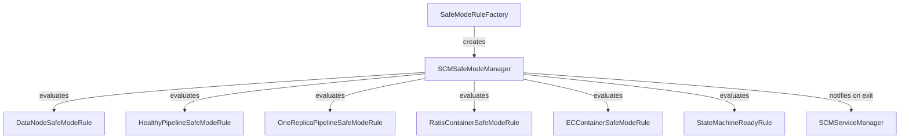

# scm / safemode

_This feature page was generated from `study/atlas/components/scm/safemode.md`. Author prose belongs above or below the BEGIN/END markers._

{/* BEGIN atlas-generated */}

**Classes:** 13    **Kinds:** service:8, abstract:2, interface:1, factory:1, metrics:1

## Overview

Safe mode prevents SCM from serving client requests until the cluster is in a sufficiently stable state after a restart. `SCMSafeModeManager` starts in safe mode and evaluates a set of `SafeModeExitRule` implementations: `DataNodeSafeModeRule` (enough datanodes registered), `HealthyPipelineSafeModeRule` (enough Ratis pipelines are OPEN with a minimum number of healthy reported peers), `OneReplicaPipelineSafeModeRule` (at least one datanode has reported for each open pipeline), `RatisContainerSafeModeRule` and `ECContainerSafeModeRule` (enough containers have at least one reported replica). `SafeModeRuleFactory` instantiates the correct set of rules based on cluster configuration. When all active rules reach their thresholds, `SCMSafeModeManager` exits safe mode and notifies `SCMServiceManager` to resume background services. `SafeModeMetrics` exposes per-rule progress counters.

## Diagram

## Class table

### Sub-feature: `scm.safemode`

| reading_order | fqcn | kind | logic | loc | study (min) | role |
|--:|---|---|---|--:|--:|---|
| 685 | <Fqcn>org.apache.hadoop.hdds.scm.safemode.SafeModeManager</Fqcn> | interface | mixed | 25~ | 20 | Interface for SafeModeManager. |
| 686 | <Fqcn>org.apache.hadoop.hdds.scm.safemode.AbstractContainerSafeModeRule</Fqcn> | abstract | mixed | 150~ | 45 | Abstract class for Container Safe mode exit rule. |
| 687 | <Fqcn>org.apache.hadoop.hdds.scm.safemode.SafeModeExitRule</Fqcn> | abstract | mixed | 50~ | 30 | Abstract class for SafeModeExitRules. |
| 688 | <Fqcn>org.apache.hadoop.hdds.scm.safemode.SCMSafeModeManager</Fqcn> | service | logic-heavy | 275~ | 45 | StorageContainerManager enters safe mode on startup to allow system to reach a stable state before becoming fully fun... |
| 689 | <Fqcn>org.apache.hadoop.hdds.scm.safemode.HealthyPipelineSafeModeRule</Fqcn> | service | logic-heavy | 250~ | 45 | Class defining Safe mode exit criteria for Pipelines. |
| 690 | <Fqcn>org.apache.hadoop.hdds.scm.safemode.OneReplicaPipelineSafeModeRule</Fqcn> | service | mixed | 150~ | 45 | This rule covers whether we have at least one datanode is reported for each open pipeline. |
| 691 | <Fqcn>org.apache.hadoop.hdds.scm.safemode.ECMinDataNodeSafeModeRule</Fqcn> | service | mixed | 100~ | 30 | Safe mode exit rule for EC-default clusters. |
| 692 | <Fqcn>org.apache.hadoop.hdds.scm.safemode.DataNodeSafeModeRule</Fqcn> | service | mixed | 50~ | 30 | Class defining Safe mode exit criteria according to number of DataNodes registered with SCM. |
| 693 | <Fqcn>org.apache.hadoop.hdds.scm.safemode.ECContainerSafeModeRule</Fqcn> | service | mixed | 25~ | 30 | Safe mode rule for EC containers. |
| 694 | <Fqcn>org.apache.hadoop.hdds.scm.safemode.StateMachineReadyRule</Fqcn> | service | mixed | 25~ | 30 | Class defining Safe mode exit when SCM State Machine is ready, ie all transaction is applied. |
| 695 | <Fqcn>org.apache.hadoop.hdds.scm.safemode.RatisContainerSafeModeRule</Fqcn> | service | mixed | 25~ | 30 | Class defining Safe mode exit criteria for Ratis Containers. |
| 696 | <Fqcn>org.apache.hadoop.hdds.scm.safemode.SafeModeRuleFactory</Fqcn> | factory | mixed | 125~ | 20 | Factory to create SafeMode rules. |
| 697 | <Fqcn>org.apache.hadoop.hdds.scm.safemode.SafeModeMetrics</Fqcn> | metrics | mixed | 125~ | 20 | which can be used for monitoring during SCM startup when SCM is still in SafeMode.&lt;p&gt; The metrics from this class are... |

## Anchor details

### `SCMSafeModeManager`

- **path:** `hadoop-hdds/server-scm/src/main/java/org/apache/hadoop/hdds/scm/safemode/SCMSafeModeManager.java`
- **loc:** 275~    **difficulty:** 4    **study:** 45 min    **concurrency:** actor/queue    **persistence:** in-memory
- **entry points:** `start`
- **key collaborators:** `org.apache.hadoop.hdds.HddsConfigKeys`, `org.apache.hadoop.hdds.conf.ConfigurationSource`, `org.apache.hadoop.hdds.scm.container.ContainerManager`, `org.apache.hadoop.hdds.scm.ha.SCMContext`, `org.apache.hadoop.hdds.scm.ha.SCMServiceManager`, `org.apache.hadoop.hdds.scm.node.NodeManager`
- **test exemplar:** `hadoop-hdds/server-scm/src/test/java/org/apache/hadoop/hdds/scm/safemode/TestSCMSafeModeManager.java`
- **role:** StorageContainerManager enters safe mode on startup to allow system to reach a stable state before becoming fully fun...

### `HealthyPipelineSafeModeRule`

- **path:** `hadoop-hdds/server-scm/src/main/java/org/apache/hadoop/hdds/scm/safemode/HealthyPipelineSafeModeRule.java`
- **loc:** 250~    **difficulty:** 4    **study:** 45 min    **concurrency:** single-threaded    **persistence:** in-memory
- **key collaborators:** `org.apache.hadoop.hdds.HddsConfigKeys`, `org.apache.hadoop.hdds.client.RatisReplicationConfig`, `org.apache.hadoop.hdds.conf.ConfigurationSource`, `org.apache.hadoop.hdds.protocol.DatanodeDetails`, `org.apache.hadoop.hdds.scm.events.SCMEvents`, `org.apache.hadoop.hdds.scm.ha.SCMContext`
- **test exemplar:** `hadoop-hdds/server-scm/src/test/java/org/apache/hadoop/hdds/scm/safemode/TestHealthyPipelineSafeModeRule.java`
- **role:** Class defining Safe mode exit criteria for Pipelines.

## Design docs

- no dedicated design doc under hadoop-hdds/docs/content/ on this branch (safe mode is documented as part of the SCM-HA design at `hadoop-hdds/docs/content/design/scmha.md`)

## Seminal JIRAs / PRs

- [HDDS-11243](https://issues.apache.org/jira/browse/HDDS-11243). SCM SafeModeRule Support EC.
- [HDDS-11797](https://issues.apache.org/jira/browse/HDDS-11797). Remove cyclic dependency between SCMSafeModeManager and SafeModeRules.
- [HDDS-13358](https://issues.apache.org/jira/browse/HDDS-13358). Refactor SafeModeStatus to an enum.
- [HDDS-14868](https://issues.apache.org/jira/browse/HDDS-14868). refreshAndValidate ContainerSafemodeRule periodically, not on each applyTransaction.
- [HDDS-15138](https://issues.apache.org/jira/browse/HDDS-15138). Add EC DN safemode rule and control RATIS/THREE background pipelines for EC-default clusters.
- [HDDS-15238](https://issues.apache.org/jira/browse/HDDS-15238). ContainerSafeModeRule containers list refresh with only removing deleted containers.
- [HDDS-15498](https://issues.apache.org/jira/browse/HDDS-15498). Optimize Container Safemode refresh to use DELETED state.

## Sharp edges

- `HealthyPipelineSafeModeRule` counts a pipeline as "healthy" only after at least `hdds.scm.safemode.healthy.pipeline.threshold.count` datanodes have reported for it. If datanodes start slowly, this rule may block safe mode exit even though the cluster has enough capacity for writes. The threshold is configurable but the rule does not log its current satisfied count at INFO level by default, making it hard to diagnose why SCM is stuck in safe mode without checking JMX. ([HDDS-14012](https://issues.apache.org/jira/browse/HDDS-14012) added periodic interval logging.)
- `StateMachineReadyRule` requires that all pending Ratis log entries have been applied before safe mode exits. In SCM-HA deployments this means SCM will stay in safe mode until the Ratis state machine catches up to the committed log index; during heavy write workloads this can add several minutes to startup. There is no configurable timeout for this rule.

## Related features

- `components/scm/pipeline-manager.md` — `HealthyPipelineSafeModeRule` counts open pipelines managed by `PipelineManagerImpl`
- `components/scm/node-manager.md` — `DataNodeSafeModeRule` queries `NodeManager` for registered datanode count
- `components/scm/scm-ha.md` — `StateMachineReadyRule` depends on `SCMContext.isLeaderReady()` which the Ratis state machine sets
- `components/scm/scm-server.md` — `StorageContainerManager` starts `SCMSafeModeManager` during service startup

## Self-quiz

1. `SCMSafeModeManager.start()` initializes rules and enters safe mode. What happens if `start()` is called on an SCM that joins an HA ring as a follower — does it enter safe mode?
2. `HealthyPipelineSafeModeRule` has a separate `refresh()` method from `validate()`. When is `refresh()` called, and why is it separate?
3. `SafeModeRuleFactory` creates different sets of rules depending on configuration. What configuration determines whether EC-specific rules are included?
4. `SCMSafeModeManager` uses an actor/queue concurrency model. What events drive its processing, and how does it avoid missing an event that arrives before safe mode evaluation is wired up?
5. What is `StateMachineReadyRule`, and under what SCM topology is it always immediately satisfied?

Answers

Answer 1: Yes, a follower SCM also enters safe mode on startup. It processes container/pipeline/node reports independently so it has an accurate view of cluster state if it becomes leader. Safe mode exit on followers is also gated by the same rules.
Answer 2: `refresh()` rebuilds the set of containers/pipelines that the rule expects to see reported. It is called periodically ([HDDS-14868](https://issues.apache.org/jira/browse/HDDS-14868)) rather than on every `applyTransaction` because rebuilding is expensive — it requires iterating all containers in `ContainerManager`. `validate()` checks the current reported-count against the threshold set by `refresh()`.
Answer 3: `SafeModeRuleFactory` includes `ECContainerSafeModeRule` and `ECMinDataNodeSafeModeRule` when the cluster's default replication type is EC (controlled by `ozone.scm.default.replication.type`).
Answer 4: Safe mode events are pushed via `SCMEvents.SAFE_MODE_STATUS`. The manager registers its event handlers during `start()` before calling `checkSafeMode()`, so no event can be missed after initialization.
Answer 5: `StateMachineReadyRule` waits until `SCMContext.isLeaderReady()` returns true, which happens once the Ratis state machine has applied all committed log entries. In non-HA (single-SCM) mode it is immediately satisfied because there is no Ratis log to replay.

{/* END atlas-generated */}
