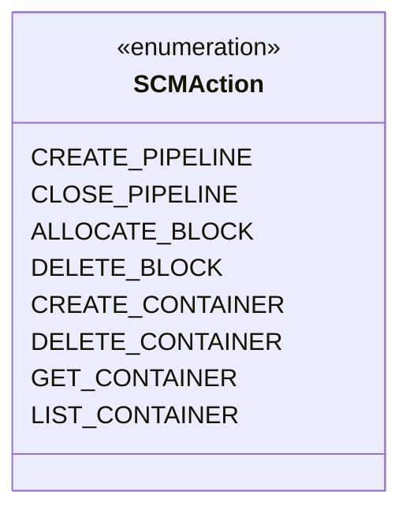

# scm / scm-audit

_This feature page was generated from `study/atlas/components/scm/scm-audit.md`. Author prose belongs above or below the BEGIN/END markers._

{/* BEGIN atlas-generated */}

**Classes:** 1    **Kinds:** data:1

## Overview

The scm-audit feature consists of a single enum, `SCMAction`, which enumerates all auditable operations in SCM (e.g., `CREATE_PIPELINE`, `CLOSE_PIPELINE`, `ALLOCATE_BLOCK`, `DELETE_CONTAINER`). `SCMClientProtocolServer` and related protocol servers pass an `SCMAction` constant to the Hadoop audit logger via `AuditMessage`, producing structured audit log entries. The enum itself contains no logic; its only job is to provide a closed, strongly-typed namespace for action names so that audit consumers can parse and filter SCM audit logs without string matching.

## Diagram

## Class table

### Sub-feature: `ozone.audit`

| reading_order | fqcn | kind | logic | loc | study (min) | role |
|--:|---|---|---|--:|--:|---|
| 1474 | <Fqcn>org.apache.hadoop.ozone.audit.SCMAction</Fqcn> | data | data-only | 50~ | 10 | Enum to define Audit Action types for SCM. |

## Anchor details

_No logic-heavy anchors in this feature; the classes are primarily data / dto / config / cli._

## Design docs

- no dedicated design doc under hadoop-hdds/docs/content/ on this branch

## Seminal JIRAs / PRs

- TODO(verify) — no dedicated HDDS commits in recent git history for this single-class feature; the enum was introduced alongside the audit framework.

## Sharp edges

- `SCMAction` is an enum; adding a new value is a source-compatible but not binary-compatible change for any consumer that exhaustively switches on it. Adding a new auditable operation without updating downstream audit parsers silently produces unrecognised action strings.

## Related features

- `components/scm/scm-server.md` — `SCMClientProtocolServer` and `SCMBlockProtocolServer` emit audit events using `SCMAction` values
- `components/scm/scm-protocol.md` — server-side translators pass through to protocol servers that produce audit log entries

## Self-quiz

1. `SCMAction` is a `data` kind with `data-only` logic. Which interface does it implement that makes it usable with the Hadoop audit framework?
2. Where in `SCMClientProtocolServer` is `SCMAction.CREATE_PIPELINE` emitted — before or after the operation completes, and does this affect audit correctness for failed operations?
3. The enum has no fields beyond the constant names. How does the Hadoop audit logger obtain the string representation used in the audit log?
4. Are SCM audit logs written to a dedicated file or to the main SCM log, and which configuration key controls this?
5. Name one `SCMAction` constant that is emitted by `SCMBlockProtocolServer` rather than `SCMClientProtocolServer`.

Answers

Answer 1: `SCMAction` implements `AuditAction` from the Hadoop audit framework, which requires a `getAction()` method returning the string name.
Answer 2: The audit event is emitted after the operation completes (or fails). For failures, `AuditMessage` includes the exception, so the audit log still records the attempt even if the operation threw.
Answer 3: The audit framework calls `AuditAction.getAction()`, which for enums returns `this.name()` — the Java constant name (e.g., `"CREATE_PIPELINE"`).
Answer 4: SCM audit logs are written to a dedicated log4j appender named `SCMAuditLog`; the appender target is configured in `log4j.properties` (or the equivalent). The configuration key is `log4j.logger.SCMAuditLog`.
Answer 5: `SCMAction.ALLOCATE_BLOCK` is emitted by `SCMBlockProtocolServer.allocateBlock()`.

{/* END atlas-generated */}
