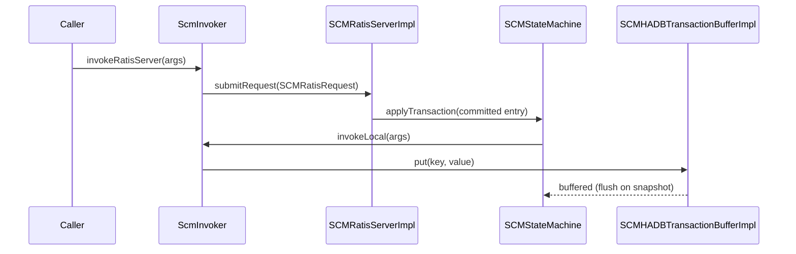

# scm / scm-ha

_This feature page was generated from `study/atlas/components/scm/scm-ha.md`. Author prose belongs above or below the BEGIN/END markers._

{/* BEGIN atlas-generated */}

**Classes:** 59    **Kinds:** service:31, util:13, interface:9, dto:2, abstract:1, factory:1, metrics:1, exception:1

## Overview

SCM HA replicates SCM metadata across a three-node Ratis group so that a new leader can take over without data loss. `SCMRatisServerImpl` wraps a Ratis `RaftServer` that runs `SCMStateMachine`. When a mutating operation is performed (container allocation, pipeline update, block deletion), the caller's thread invokes a `ScmInvoker` subclass which serialises the arguments into a `SCMRatisRequest` and submits it to the Ratis log. Once Ratis commits the entry, `SCMStateMachine.applyTransaction()` dispatches to the appropriate `ScmInvoker.invokeLocal()` to apply the mutation locally. `SCMHADBTransactionBufferImpl` batches RocksDB writes and flushes them only on Ratis snapshot or explicit flush, decoupling write throughput from RocksDB sync latency. `SequenceIdGenerator` allocates monotonically increasing IDs in batches persisted to RocksDB, invalidating the unused batch on leader election to ensure no ID is reused. `ContainerStateManagerInvoker` and `PipelineStateManagerInvoker` are generated invoker classes that proxy state manager mutations through the Ratis path. `SCMHANodeDetails` parses multi-SCM configuration to determine the local node's peer list.

## Diagram

## Class table

### Sub-feature: `ha.invoker`

| reading_order | fqcn | kind | logic | loc | study (min) | role |
|--:|---|---|---|--:|--:|---|
| 626 | <Fqcn>org.apache.hadoop.hdds.scm.ha.invoker.ScmInvoker</Fqcn> | abstract | mixed | 75~ | 20 | Invokes methods without using reflection. |
| 627 | <Fqcn>org.apache.hadoop.hdds.scm.ha.invoker.ContainerStateManagerInvoker</Fqcn> | service | logic-heavy | 250~ | 45 | Code generated for ContainerStateManager. |
| 628 | <Fqcn>org.apache.hadoop.hdds.scm.ha.invoker.PipelineStateManagerInvoker</Fqcn> | service | logic-heavy | 200~ | 45 | Code generated for PipelineStateManager. |
| 629 | <Fqcn>org.apache.hadoop.hdds.scm.ha.invoker.RootCARotationHandlerInvoker</Fqcn> | service | mixed | 125~ | 30 | Code generated for RootCARotationHandler. |
| 630 | <Fqcn>org.apache.hadoop.hdds.scm.ha.invoker.DeletedBlockLogStateManagerInvoker</Fqcn> | service | mixed | 100~ | 30 | Code generated for DeletedBlockLogStateManager. |
| 631 | <Fqcn>org.apache.hadoop.hdds.scm.ha.invoker.FinalizationStateManagerInvoker</Fqcn> | service | mixed | 100~ | 30 | Code generated for FinalizationStateManager. |
| 632 | <Fqcn>org.apache.hadoop.hdds.scm.ha.invoker.CertificateStoreInvoker</Fqcn> | service | mixed | 100~ | 30 | Code generated for CertificateStore. |
| 633 | <Fqcn>org.apache.hadoop.hdds.scm.ha.invoker.SequenceIdGeneratorStateManagerInvoker</Fqcn> | service | mixed | 75~ | 30 | Code generated for StateManager. |
| 634 | <Fqcn>org.apache.hadoop.hdds.scm.ha.invoker.StatefulServiceStateManagerInvoker</Fqcn> | service | mixed | 75~ | 30 | Code generated for StatefulServiceStateManager. |
| 635 | <Fqcn>org.apache.hadoop.hdds.scm.ha.invoker.SecretKeyStateInvoker</Fqcn> | service | mixed | 75~ | 30 | Code generated for SecretKeyState. |

### Sub-feature: `ha.io`

| reading_order | fqcn | kind | logic | loc | study (min) | role |
|--:|---|---|---|--:|--:|---|
| 636 | <Fqcn>org.apache.hadoop.hdds.scm.ha.io.ScmCodecFactory</Fqcn> | factory | mixed | 100~ | 20 | Maps types to the corresponding ScmCodec implementation. |
| 637 | <Fqcn>org.apache.hadoop.hdds.scm.ha.io.ScmListCodec</Fqcn> | util | mixed | 50~ | 20 | ScmCodec for List objects. |
| 638 | <Fqcn>org.apache.hadoop.hdds.scm.ha.io.ScmX509CertificateCodec</Fqcn> | util | mixed | 25~ | 20 | Codec for type X509Certificate. |
| 639 | <Fqcn>org.apache.hadoop.hdds.scm.ha.io.ScmStringCodec</Fqcn> | util | mixed | 25~ | 20 | ScmCodec for String objects. |
| 640 | <Fqcn>org.apache.hadoop.hdds.scm.ha.io.ScmNonShadedGeneratedMessageCodec</Fqcn> | util | mixed | 25~ | 20 | ScmCodec implementation for non-shaded com.google.protobuf.Message objects. |
| 641 | <Fqcn>org.apache.hadoop.hdds.scm.ha.io.ScmIntegerCodec</Fqcn> | util | mixed | 25~ | 20 | Encodes/decodes an integer to a byte string. |
| 642 | <Fqcn>org.apache.hadoop.hdds.scm.ha.io.ScmManagedSecretKeyCodec</Fqcn> | util | mixed | 25~ | 20 | A codec for ManagedSecretKey objects. |
| 643 | <Fqcn>org.apache.hadoop.hdds.scm.ha.io.ScmByteStringCodec</Fqcn> | util | mixed | 25~ | 20 | A dummy codec that serializes a ByteString object to ByteString. |
| 644 | <Fqcn>org.apache.hadoop.hdds.scm.ha.io.ScmCodec</Fqcn> | util | mixed | 25~ | 20 | To serialize/deserialize Java objects to/from protobuf ByteString for SCM HA. |
| 645 | <Fqcn>org.apache.hadoop.hdds.scm.ha.io.ScmEnumCodec</Fqcn> | util | mixed | 25~ | 20 | ScmCodec for protobuf ProtocolMessageEnum objects. |
| 646 | <Fqcn>org.apache.hadoop.hdds.scm.ha.io.ScmBooleanCodec</Fqcn> | util | mixed | 25~ | 20 | ScmCodec for Boolean objects. |
| 647 | <Fqcn>org.apache.hadoop.hdds.scm.ha.io.ScmBigIntegerCodec</Fqcn> | util | mixed | 25~ | 20 | Codec for type BigInteger. |
| 648 | <Fqcn>org.apache.hadoop.hdds.scm.ha.io.ScmNonShadedByteStringCodec</Fqcn> | util | mixed | 25~ | 20 | ScmCodec implementation for non-shaded com.google.protobuf.ByteString objects. |
| 649 | <Fqcn>org.apache.hadoop.hdds.scm.ha.io.ScmLongCodec</Fqcn> | util | mixed | 25~ | 20 | ScmCodec for Long objects. |

### Sub-feature: `scm.ha`

| reading_order | fqcn | kind | logic | loc | study (min) | role |
|--:|---|---|---|--:|--:|---|
| 650 | <Fqcn>org.apache.hadoop.hdds.scm.ha.SequenceIdGenerator</Fqcn> | service | logic-heavy | 250~ | 20 | After SCM starts, set lastId = 0, nextId = lastId + 1. |
| 651 | <Fqcn>org.apache.hadoop.hdds.scm.ha.SCMDBCheckpointProvider</Fqcn> | service | mixed | 50~ | 20 | Checkpoint write stream and exception handling. |
| 652 | <Fqcn>org.apache.hadoop.hdds.scm.ha.SCMRatisServer</Fqcn> | interface | mixed | 25~ | 20 | Ratis server that provides SCM HA by hosting the SCMStateMachine and replicating SCM metadata operations across the S... |
| 653 | <Fqcn>org.apache.hadoop.hdds.scm.ha.SCMService</Fqcn> | interface | mixed | 25~ | 20 | Interface for background services in SCM, including ReplicationManager, SCMBlockDeletingService and BackgroundPipelin... |
| 654 | <Fqcn>org.apache.hadoop.hdds.scm.ha.SCMHADBTransactionBuffer</Fqcn> | interface | mixed | 25~ | 20 | DB transaction that buffers SCM DB transactions. |
| 655 | <Fqcn>org.apache.hadoop.hdds.scm.ha.SCMHAManager</Fqcn> | interface | mixed | 25~ | 20 | SCMHAManager provides HA service for SCM. |
| 656 | <Fqcn>org.apache.hadoop.hdds.scm.ha.SCMSnapshotDownloader</Fqcn> | interface | mixed | 25~ | 20 | Contract to download a SCM Snapshot from remote server.. |
| 657 | <Fqcn>org.apache.hadoop.hdds.scm.ha.StatefulServiceStateManager</Fqcn> | interface | mixed | 25~ | 20 | This interface defines an API for saving and reading configurations of a StatefulService. |
| 658 | <Fqcn>org.apache.hadoop.hdds.scm.ha.StatefulService</Fqcn> | abstract | mixed | 25~ | 30 | A StatefulService is an SCMService that persists configuration to RocksDB. |
| 659 | <Fqcn>org.apache.hadoop.hdds.scm.ha.SCMStateMachine</Fqcn> | service | logic-heavy | 375~ | 45 | The SCMStateMachine is the state machine for SCMRatisServer. |
| 660 | <Fqcn>org.apache.hadoop.hdds.scm.ha.SCMHAManagerImpl</Fqcn> | service | logic-heavy | 300~ | 45 | SCMHAManagerImpl uses Apache Ratis for HA implementation. |
| 661 | <Fqcn>org.apache.hadoop.hdds.scm.ha.SCMRatisServerImpl</Fqcn> | service | logic-heavy | 300~ | 45 | Default SCMRatisServer implementation backed by a Ratis RaftServer running the SCMStateMachine. |
| 662 | <Fqcn>org.apache.hadoop.hdds.scm.ha.SCMHANodeDetails</Fqcn> | service | logic-heavy | 225~ | 45 | SCM HA node details. |
| 663 | <Fqcn>org.apache.hadoop.hdds.scm.ha.SCMHAManagerStub</Fqcn> | service | mixed | 175~ | 45 | SCMHAManagerStub implementation for Recon and testing. |
| 664 | <Fqcn>org.apache.hadoop.hdds.scm.ha.SCMContext</Fqcn> | service | mixed | 175~ | 45 | SCMContext is the single source of truth for some key information shared across all components within SCM, including:... |
| 665 | <Fqcn>org.apache.hadoop.hdds.scm.ha.BackgroundSCMService</Fqcn> | service | mixed | 150~ | 45 | A common implementation for background SCMService. |
| 666 | <Fqcn>org.apache.hadoop.hdds.scm.ha.RatisUtil</Fqcn> | service | mixed | 150~ | 45 | Ratis Util for SCM HA. |
| 667 | <Fqcn>org.apache.hadoop.hdds.scm.ha.SCMHADBTransactionBufferImpl</Fqcn> | service | mixed | 150~ | 45 | This is a transaction buffer that buffers SCM DB operations for Pipeline and Container. |
| 668 | <Fqcn>org.apache.hadoop.hdds.scm.ha.SCMNodeDetails</Fqcn> | service | mixed | 125~ | 30 | Construct SCM node details. |
| 669 | <Fqcn>org.apache.hadoop.hdds.scm.ha.InterSCMGrpcClient</Fqcn> | service | mixed | 125~ | 30 | Grpc client to download a Rocks db checkpoint from leader node in SCM HA ring. |
| 670 | <Fqcn>org.apache.hadoop.hdds.scm.ha.SCMHADBTransactionBufferStub</Fqcn> | service | mixed | 100~ | 30 | SCMHADBTransactionBuffer implementation for Recon and testing. |
| 671 | <Fqcn>org.apache.hadoop.hdds.scm.ha.HASecurityUtils</Fqcn> | service | mixed | 100~ | 30 | Utilities for SCM HA security. |
| 672 | <Fqcn>org.apache.hadoop.hdds.scm.ha.SCMGrpcOutputStream</Fqcn> | service | mixed | 75~ | 30 | Stream to which the tar db checkpoint will be transferred over to the destination over grpc. |
| 673 | <Fqcn>org.apache.hadoop.hdds.scm.ha.InterSCMGrpcProtocolService</Fqcn> | service | mixed | 75~ | 30 | Service to serve SCM DB checkpoints available for SCM HA. |
| 674 | <Fqcn>org.apache.hadoop.hdds.scm.ha.StatefulServiceStateManagerImpl</Fqcn> | service | mixed | 75~ | 30 | This class implements methods to save and read configurations of a stateful service from DB. |
| 675 | <Fqcn>org.apache.hadoop.hdds.scm.ha.SCMSnapshotProvider</Fqcn> | service | mixed | 75~ | 30 | SCMSnapshotProvider downloads the latest checkpoint from the leader SCM and loads the checkpoint into State Machine. |
| 676 | <Fqcn>org.apache.hadoop.hdds.scm.ha.SCMServiceManager</Fqcn> | service | mixed | 50~ | 30 | Manipulate background services in SCM, including ReplicationManager, SCMBlockDeletingService and BackgroundPipelineCr... |
| 677 | <Fqcn>org.apache.hadoop.hdds.scm.ha.ExecutionUtil</Fqcn> | service | mixed | 25~ | 30 | This Utility class is to rethrow the original exception after executing the clean-up code. |
| 678 | <Fqcn>org.apache.hadoop.hdds.scm.ha.StatefulServiceDefinition</Fqcn> | service | mixed | 25~ | 30 | Define static properties of stateful services. |
| 679 | <Fqcn>org.apache.hadoop.hdds.scm.ha.SCMHATransactionBufferMonitorTask</Fqcn> | service | mixed | 25~ | 30 | A background service running in SCM to check and flush the HA Transaction buffer. |
| 680 | <Fqcn>org.apache.hadoop.hdds.scm.ha.InterSCMGrpcService</Fqcn> | service | mixed | 25~ | 30 | Service to handle Rocks db Checkpointing. |
| 681 | <Fqcn>org.apache.hadoop.hdds.scm.ha.SCMRatisRequest</Fqcn> | dto | data-only | 100~ | 10 | Represents the request that is sent to RatisServer. |
| 682 | <Fqcn>org.apache.hadoop.hdds.scm.ha.SCMRatisResponse</Fqcn> | dto | data-only | 50~ | 10 | Represents the response from RatisServer. |
| 683 | <Fqcn>org.apache.hadoop.hdds.scm.ha.SCMHAMetrics</Fqcn> | metrics | mixed | 50~ | 20 | SCM HA metrics. |
| 684 | <Fqcn>org.apache.hadoop.hdds.scm.ha.SCMServiceException</Fqcn> | exception | data-only | 25~ | 10 | Checked exceptions thrown by an SCMService. |

## Anchor details

### `SequenceIdGenerator`

- **path:** `hadoop-hdds/server-scm/src/main/java/org/apache/hadoop/hdds/scm/ha/SequenceIdGenerator.java`
- **loc:** 250~    **difficulty:** 2    **study:** 20 min    **concurrency:** thread-safe    **persistence:** RocksDB
- **entry points:** `build`
- **key collaborators:** `org.apache.hadoop.hdds.scm.ha.invoker.SequenceIdGeneratorStateManagerInvoker`, `org.apache.hadoop.hdds.conf.ConfigurationSource`, `org.apache.hadoop.hdds.scm.container.ContainerID`, `org.apache.hadoop.hdds.scm.container.ContainerInfo`, `org.apache.hadoop.hdds.scm.exceptions.SCMException`, `org.apache.hadoop.hdds.scm.metadata.DBTransactionBuffer`
- **role:** After SCM starts, set lastId = 0, nextId = lastId + 1.

### `SCMStateMachine`

- **path:** `hadoop-hdds/server-scm/src/main/java/org/apache/hadoop/hdds/scm/ha/SCMStateMachine.java`
- **loc:** 375~    **difficulty:** 4    **study:** 45 min    **concurrency:** actor/queue    **persistence:** in-memory
- **entry points:** `applyTransaction`, `notifyLeaderChanged`, `takeSnapshot`, `close`
- **key collaborators:** `org.apache.hadoop.hdds.scm.ha.invoker.ScmInvoker`, `org.apache.hadoop.hdds.scm.block.DeletedBlockLog`, `org.apache.hadoop.hdds.scm.block.DeletedBlockLogImpl`, `org.apache.hadoop.hdds.scm.container.placement.metrics.SCMMetrics`, `org.apache.hadoop.hdds.scm.exceptions.SCMException`, `org.apache.hadoop.hdds.scm.server.StorageContainerManager`
- **test exemplar:** `hadoop-hdds/server-scm/src/test/java/org/apache/hadoop/hdds/scm/ha/TestSCMStateMachine.java`
- **role:** The SCMStateMachine is the state machine for SCMRatisServer.

### `SCMHAManagerImpl`

- **path:** `hadoop-hdds/server-scm/src/main/java/org/apache/hadoop/hdds/scm/ha/SCMHAManagerImpl.java`
- **loc:** 300~    **difficulty:** 4    **study:** 45 min    **concurrency:** single-threaded    **persistence:** in-memory
- **entry points:** `start`, `close`
- **key collaborators:** `org.apache.hadoop.hdds.ExitManager`, `org.apache.hadoop.hdds.conf.ConfigurationSource`, `org.apache.hadoop.hdds.conf.OzoneConfiguration`, `org.apache.hadoop.hdds.protocolPB.SecretKeyProtocolClientSideTranslatorPB`, `org.apache.hadoop.hdds.scm.AddSCMRequest`, `org.apache.hadoop.hdds.scm.RemoveSCMRequest`
- **test exemplar:** `hadoop-hdds/server-scm/src/test/java/org/apache/hadoop/hdds/scm/ha/TestSCMHAManagerImpl.java`
- **role:** SCMHAManagerImpl uses Apache Ratis for HA implementation.

### `SCMRatisServerImpl`

- **path:** `hadoop-hdds/server-scm/src/main/java/org/apache/hadoop/hdds/scm/ha/SCMRatisServerImpl.java`
- **loc:** 300~    **difficulty:** 4    **study:** 45 min    **concurrency:** single-threaded    **persistence:** in-memory
- **entry points:** `start`
- **key collaborators:** `org.apache.hadoop.hdds.scm.ha.invoker.ScmInvoker`, `org.apache.hadoop.hdds.HddsUtils`, `org.apache.hadoop.hdds.conf.ConfigurationSource`, `org.apache.hadoop.hdds.conf.OzoneConfiguration`, `org.apache.hadoop.hdds.ratis.RatisHelper`, `org.apache.hadoop.hdds.scm.AddSCMRequest`
- **test exemplar:** `hadoop-hdds/server-scm/src/test/java/org/apache/hadoop/hdds/scm/ha/TestSCMRatisServerImpl.java`
- **role:** Default SCMRatisServer implementation backed by a Ratis RaftServer running the SCMStateMachine.

### `ContainerStateManagerInvoker`

- **path:** `hadoop-hdds/server-scm/src/main/java/org/apache/hadoop/hdds/scm/ha/invoker/ContainerStateManagerInvoker.java`
- **loc:** 250~    **difficulty:** 4    **study:** 45 min    **concurrency:** single-threaded    **persistence:** in-memory
- **key collaborators:** `org.apache.hadoop.hdds.scm.ha.SCMRatisResponse`, `org.apache.hadoop.hdds.scm.ha.SCMRatisServer`, `org.apache.hadoop.hdds.scm.container.ContainerHealthState`, `org.apache.hadoop.hdds.scm.container.ContainerID`, `org.apache.hadoop.hdds.scm.container.ContainerInfo`, `org.apache.hadoop.hdds.scm.container.ContainerReplica`
- **role:** Code generated for ContainerStateManager.

### `SCMHANodeDetails`

- **path:** `hadoop-hdds/server-scm/src/main/java/org/apache/hadoop/hdds/scm/ha/SCMHANodeDetails.java`
- **loc:** 225~    **difficulty:** 4    **study:** 45 min    **concurrency:** single-threaded    **persistence:** in-memory
- **key collaborators:** `org.apache.hadoop.hdds.HddsUtils`, `org.apache.hadoop.hdds.conf.OzoneConfiguration`, `org.apache.hadoop.hdds.scm.ScmConfigKeys`, `org.apache.hadoop.hdds.scm.ScmUtils`, `org.apache.hadoop.hdds.scm.server.SCMStorageConfig`, `org.apache.hadoop.hdds.utils.HddsServerUtil`
- **role:** SCM HA node details.

### `PipelineStateManagerInvoker`

- **path:** `hadoop-hdds/server-scm/src/main/java/org/apache/hadoop/hdds/scm/ha/invoker/PipelineStateManagerInvoker.java`
- **loc:** 200~    **difficulty:** 4    **study:** 45 min    **concurrency:** single-threaded    **persistence:** in-memory
- **entry points:** `close`
- **key collaborators:** `org.apache.hadoop.hdds.scm.ha.SCMRatisResponse`, `org.apache.hadoop.hdds.scm.ha.SCMRatisServer`, `org.apache.hadoop.hdds.client.ReplicationConfig`, `org.apache.hadoop.hdds.scm.container.ContainerID`, `org.apache.hadoop.hdds.scm.pipeline.DuplicatedPipelineIdException`, `org.apache.hadoop.hdds.scm.pipeline.InvalidPipelineStateException`
- **role:** Code generated for PipelineStateManager.

## Design docs

- `hadoop-hdds/docs/content/design/scmha.md` — SCM HA design document covering the Ratis group topology, snapshot protocol, and state machine design
- `hadoop-hdds/docs/content/feature/SCM-HA.md` — user-facing SCM HA feature documentation

## Seminal JIRAs / PRs

- [HDDS-6761](https://issues.apache.org/jira/browse/HDDS-6761). Handle restarts, crashes, and leader changes in SCM HA finalization.
- [HDDS-8934](https://issues.apache.org/jira/browse/HDDS-8934). SCMHAInvocationHandler throws undeclared exceptions, causes SCM to exit.
- [HDDS-11883](https://issues.apache.org/jira/browse/HDDS-11883). SCM HA: Move proxy object creation code to SCMRatisServer.
- [HDDS-14850](https://issues.apache.org/jira/browse/HDDS-14850). Implement StatefulService without reflection.
- [HDDS-15065](https://issues.apache.org/jira/browse/HDDS-15065). Replace Ratis Snapshot Trigger with DB Flush for Periodic Flush Operations.
- [HDDS-15145](https://issues.apache.org/jira/browse/HDDS-15145). Use enum for the ID type in SequenceIdGenerator.
- [HDDS-15191](https://issues.apache.org/jira/browse/HDDS-15191). Add ScmInvoker subclasses for the remaining SCMHandler(s).
- [HDDS-15192](https://issues.apache.org/jira/browse/HDDS-15192). Remove SCMHAInvocationHandler and the related code.

## Sharp edges

- `SequenceIdGenerator` invalidates its in-memory batch on every leader election by setting `nextId = lastId + 1`. This means the first `getNextId()` call after becoming leader incurs a Ratis round-trip to persist a new batch. Callers that hold a lock and call `getNextId()` synchronously (e.g., `ContainerManagerImpl.allocateContainer()`) are blocked for the duration of that Ratis call on the very first allocation after failover. (`SequenceIdGenerator.java` `invalidateBatchForTesting` / `getNextId`.)
- `SCMHADBTransactionBufferImpl` writes are not immediately durable: they are held in memory until a Ratis snapshot is taken or an explicit flush is triggered. If SCM crashes between a Ratis commit and the subsequent DB flush, the state machine re-applies the committed entries on restart to rebuild the buffer, which is correct but can cause a long replay on a large log. ([HDDS-15065](https://issues.apache.org/jira/browse/HDDS-15065) changed the flush trigger from snapshot to periodic DB flush.)

## Related features

- `components/scm/container-manager.md` — `ContainerStateManagerImpl` uses `ContainerStateManagerInvoker` to route mutations through Ratis
- `components/scm/pipeline-manager.md` — `PipelineStateManagerImpl` uses `PipelineStateManagerInvoker` similarly
- `components/scm/block-manager.md` — `DeletedBlockLogStateManagerImpl` uses `DeletedBlockLogStateManagerInvoker`
- `components/scm/upgrade.md` — `FinalizationStateManagerImpl` uses `FinalizationStateManagerInvoker`
- `components/scm/scm-server.md` — `StorageContainerManager` starts and stops `SCMHAManagerImpl`

## Self-quiz

1. `SCMStateMachine.applyTransaction()` dispatches to a `ScmInvoker` based on `RequestType`. How does the state machine determine which invoker to use, and what happens if an unknown `RequestType` arrives?
2. `SequenceIdGenerator` allocates IDs in batches. What is the default batch size, and where is it configured?
3. `SCMHADBTransactionBufferImpl` buffers RocksDB writes. Under what two conditions is the buffer flushed to disk?
4. `ContainerStateManagerInvoker` is described as "code generated." What does this mean in practice, and what replaced the old reflection-based `SCMHAInvocationHandler`?
5. `SCMHAManagerImpl.start()` is the entry point. In what order does it initialize `SCMRatisServerImpl`, `SequenceIdGenerator`, and the background transaction buffer monitor?

Answers

Answer 1: `SCMStateMachine` holds a `Map<RequestType, ScmInvoker<?>>` called `invokers`. On `applyTransaction()` it reads the `RequestType` from the proto header and looks up the corresponding invoker. An unknown `RequestType` causes a `SCMException` with `FAILED_TO_EXECUTE_COMMAND` result code; the state machine logs the error and does not crash.
Answer 2: The default batch size is 1000, configurable via `ozone.scm.sequence.id.batch.size` (`OZONE_SCM_SEQUENCE_ID_BATCH_SIZE_DEFAULT`).
Answer 3: The buffer is flushed (a) when `SCMStateMachine.takeSnapshot()` is called by Ratis and (b) periodically by `SCMHATransactionBufferMonitorTask` (introduced in [HDDS-15065](https://issues.apache.org/jira/browse/HDDS-15065) to replace the snapshot-triggered flush).
Answer 4: `ContainerStateManagerInvoker` is a hand-written class that implements `ScmInvoker` directly, replacing the reflection-based approach of the old `SCMHAInvocationHandler`. Each invoker method contains explicit serialization and deserialization of arguments into `SCMRatisRequest` protobufs, eliminating the risk of runtime `MethodNotFoundException` and improving testability. ([HDDS-15192](https://issues.apache.org/jira/browse/HDDS-15192).)
Answer 5: `SCMHAManagerImpl.start()` initializes in this order: (1) `SCMRatisServerImpl.start()` to bring up the Ratis group, (2) `SequenceIdGenerator` initialization (reads last persisted ID from RocksDB), (3) `SCMHATransactionBufferMonitorTask` is started as a background service after the Ratis group is healthy.

<UnresolvedNote context="this feature page" items={["com.google.protobuf.Message","com.google.protobuf.ByteString"]} />

{/* END atlas-generated */}
