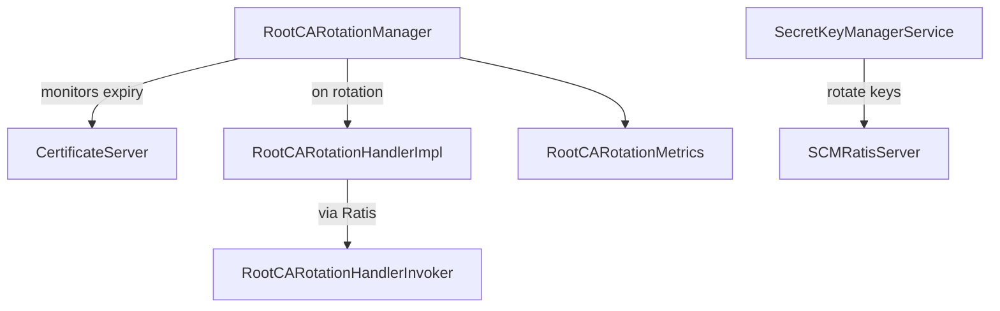

# scm / scm-security

_This feature page was generated from `study/atlas/components/scm/scm-security.md`. Author prose belongs above or below the BEGIN/END markers._

{/* BEGIN atlas-generated */}

**Classes:** 6    **Kinds:** service:3, interface:1, data:1, metrics:1

## Overview

The scm-security feature manages two long-running security lifecycle concerns in SCM: Root CA certificate rotation and symmetric secret key management. `RootCARotationManager` extends `StatefulService` and runs a scheduled loop that monitors the expiry of the root CA certificate. When the certificate approaches expiry it orchestrates a multi-step rotation: generates a new key pair and CSR, signs the new root CA certificate, distributes it to sub-CAs via `RootCARotationHandlerImpl` (which calls through to the Ratis state machine), and finally switches the active root CA. `SecretKeyManagerService` is a background service that manages the lifecycle of symmetric `ManagedSecretKey` objects used for delegation token HMAC signing: it generates a new key when the current one is close to expiry and removes keys that have passed their rotation window. Both services consult `SCMContext.isLeader()` before performing any state-changing work.

## Diagram

## Class table

### Sub-feature: `scm.security`

| reading_order | fqcn | kind | logic | loc | study (min) | role |
|--:|---|---|---|--:|--:|---|
| 1038 | <Fqcn>org.apache.hadoop.hdds.scm.security.RootCARotationHandler</Fqcn> | interface | mixed | 25~ | 20 | This interface defines APIs for sub-ca rotation instructions. |
| 1039 | <Fqcn>org.apache.hadoop.hdds.scm.security.RootCARotationManager</Fqcn> | service | logic-heavy | 575~ | 60 | Root CA Rotation Service is a service in SCM to control the CA rotation. |
| 1040 | <Fqcn>org.apache.hadoop.hdds.scm.security.RootCARotationHandlerImpl</Fqcn> | service | mixed | 150~ | 45 | Root CA Rotation Handler for ratis SCM statemachine. |
| 1041 | <Fqcn>org.apache.hadoop.hdds.scm.security.SecretKeyManagerService</Fqcn> | service | mixed | 100~ | 30 | A background service running in SCM to maintain the SecretKeys lifecycle. |
| 1042 | <Fqcn>org.apache.hadoop.hdds.scm.security.ScmSecretKeyStateBuilder</Fqcn> | data | data-only | 25~ | 10 | Builder for SecretKeyState with a proper proxy to make @Replicate happen. |
| 1043 | <Fqcn>org.apache.hadoop.hdds.scm.security.RootCARotationMetrics</Fqcn> | metrics | mixed | 50~ | 20 | Metrics related to Root CA rotation in SCM. |

## Anchor details

### `RootCARotationManager`

- **path:** `hadoop-hdds/server-scm/src/main/java/org/apache/hadoop/hdds/scm/security/RootCARotationManager.java`
- **loc:** 575~    **difficulty:** 5    **study:** 60 min    **concurrency:** thread-safe    **persistence:** in-memory
- **entry points:** `start`, `run`
- **key collaborators:** `org.apache.hadoop.hdds.conf.OzoneConfiguration`, `org.apache.hadoop.hdds.scm.ha.HASecurityUtils`, `org.apache.hadoop.hdds.scm.ha.SCMContext`, `org.apache.hadoop.hdds.scm.ha.SCMServiceException`, `org.apache.hadoop.hdds.scm.ha.SequenceIdGenerator`, `org.apache.hadoop.hdds.scm.ha.SequenceIdType`
- **test exemplar:** `hadoop-hdds/server-scm/src/test/java/org/apache/hadoop/hdds/scm/security/TestRootCARotationManager.java`
- **role:** Root CA Rotation Service is a service in SCM to control the CA rotation.

## Design docs

- `hadoop-hdds/docs/content/design/token.md` — covers delegation token design, including symmetric secret key management by `SecretKeyManagerService`
- `hadoop-hdds/docs/content/design/tde.md` — transparent data encryption design, related to certificate infrastructure

## Seminal JIRAs / PRs

- [HDDS-8829](https://issues.apache.org/jira/browse/HDDS-8829). Symmetric Keys for Delegation Tokens — introduced `SecretKeyManagerService`.
- [HDDS-11500](https://issues.apache.org/jira/browse/HDDS-11500). RootCARotationManager cancelling wrong task in notifyStatusChanged.
- [HDDS-14850](https://issues.apache.org/jira/browse/HDDS-14850). Implement StatefulService without reflection.
- [HDDS-15190](https://issues.apache.org/jira/browse/HDDS-15190). Add ScmInvoker subclasses for CertificateStore and RootCARotationHandler.
- [HDDS-15730](https://issues.apache.org/jira/browse/HDDS-15730). Support more StatefulService types in DBScanner.

## Sharp edges

- `RootCARotationManager` uses a `ScheduledExecutorService` for its rotation loop but also implements `StatefulService`. On SCM leader failover, `notifyStatusChanged()` cancels the old scheduled task and schedules a new one. [HDDS-11500](https://issues.apache.org/jira/browse/HDDS-11500) fixed a bug where the wrong task was cancelled, causing the rotation to never re-start after a leader change. This class is subtle: verify that the task reference is correctly updated atomically when reviewing changes.
- The root CA rotation involves filesystem operations (writing new key/cert files to `HDDS_X509_DIR_NAME`) that are not covered by Ratis replication. If the file operations succeed but the Ratis state machine update fails, the disk state and the replicated state can diverge. A restart of SCM after this failure mode may use a stale certificate until a re-rotation is forced. (`RootCARotationManager.java` ~L300 area, file copy with `StandardCopyOption.REPLACE_EXISTING`.)

## Related features

- `components/scm/scm-ha.md` — `RootCARotationHandlerImpl` routes mutations through `RootCARotationHandlerInvoker` into the Ratis log
- `components/scm/scm-server.md` — `SCMSecurityProtocolServer` exposes certificate operations to clients; `SCMCertStore` is the backing store
- `components/scm/scm-metadata.md` — certificate tables (`validCerts`, `certs`) defined in `SCMDBDefinition` back `SCMCertStore`

## Self-quiz

1. `RootCARotationManager.start()` and `run()` are both entry points. What is the difference in responsibility between these two methods?
2. `RootCARotationManager` extends `StatefulService<CertInfoProto>`. What does it persist in the stateful service table, and when is that state read back?
3. `SecretKeyManagerService` rotates keys on a schedule. What two time parameters control when a new key is generated vs when an old key is removed?
4. `RootCARotationHandlerImpl` routes through Ratis. Why is this necessary rather than updating the certificate store directly?
5. `RootCARotationMetrics` exposes rotation metrics. Name two specific counters or gauges it tracks.

Answers

Answer 1: `start()` initializes the service and schedules the rotation check task on the executor. `run()` is the actual rotation check method that evaluates certificate expiry and, if close to expiry, initiates the rotation sequence. `run()` is called periodically by the scheduler started in `start()`.
Answer 2: It persists the `CertInfoProto` of the new certificate being rotated in to the stateful service table, keyed by `RootCARotationManager` service name. This state is read back after a leader failover to resume a partially-completed rotation rather than starting over.
Answer 3: `hdds.secret.key.rotate.duration` controls when a new key is generated (before the current key expires by this duration). `hdds.secret.key.expiry.duration` controls the total lifetime of a key; keys older than this duration are removed.
Answer 4: In HA mode, the certificate store is replicated across all SCM nodes via Ratis. If `RootCARotationHandlerImpl` updated the store directly on only the leader, followers would have stale certificate data. Routing through Ratis ensures all nodes apply the update atomically.
Answer 5: `RootCARotationMetrics` tracks counters such as `numRotationStarted` (how many rotations have been initiated) and `numRotationSucceeded` (how many completed successfully). It also tracks `numRotationFailed` for failures.

{/* END atlas-generated */}
