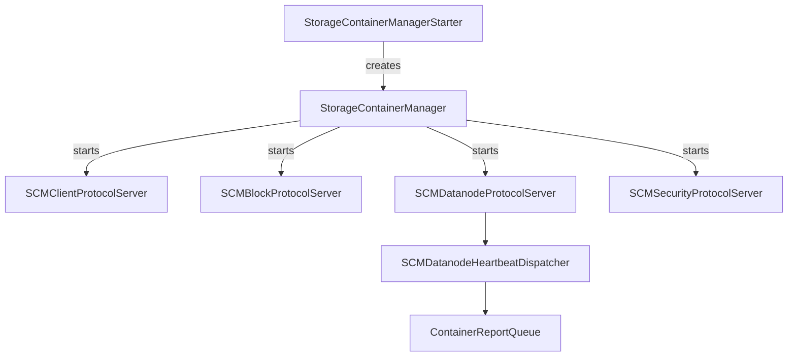

# scm / scm-server

_This feature page was generated from `study/atlas/components/scm/scm-server.md`. Author prose belongs above or below the BEGIN/END markers._

{/* BEGIN atlas-generated */}

**Classes:** 25    **Kinds:** service:14, interface:7, config:2, metrics:2

## Overview

The scm-server feature contains the top-level SCM process entry point and the four protocol servers that accept external connections. `StorageContainerManager` is the central service hub: its `start()` method initialises every subsystem in dependency order (metadata store, HA manager, node manager, pipeline manager, container manager, replication manager, safe mode manager, protocol servers) and wires up event handlers. `SCMClientProtocolServer` handles admin and client queries (pipeline list, container info, balancer control, decommission). `SCMBlockProtocolServer` handles block allocation and deletion from OM. `SCMDatanodeProtocolServer` accepts heartbeats and registers from datanodes, delegating to `SCMDatanodeHeartbeatDispatcher`. `SCMSecurityProtocolServer` handles certificate requests. `ContainerReportQueue` is a specialised blocking queue that deduplicates full container reports per datanode to avoid processing stale full reports that arrive after newer incremental ones. `SCMCommonPlacementPolicy` is the base class for all placement algorithms.

## Diagram

## Class table

### Sub-feature: `hdds.scm`

| reading_order | fqcn | kind | logic | loc | study (min) | role |
|--:|---|---|---|--:|--:|---|
| 1486 | <Fqcn>org.apache.hadoop.hdds.scm.SCMCommonPlacementPolicy</Fqcn> | abstract | logic-heavy | 375~ | 20 | This policy implements a set of invariants which are common for all basic placement policies, acts as the repository... |
| 1487 | <Fqcn>org.apache.hadoop.hdds.scm.PipelineChoosePolicy</Fqcn> | interface | mixed | 25~ | 20 | A PipelineChoosePolicy support choosing pipeline from exist list. |
| 1488 | <Fqcn>org.apache.hadoop.hdds.scm.PlacementPolicy</Fqcn> | interface | mixed | 25~ | 20 | A PlacementPolicy support choosing datanodes to build pipelines or containers with specified constraints. |
| 1489 | <Fqcn>org.apache.hadoop.hdds.scm.ScmUtils</Fqcn> | service | mixed | 150~ | 45 | SCM utility class. |
| 1490 | <Fqcn>org.apache.hadoop.hdds.scm.PlacementPolicyValidateProxy</Fqcn> | service | mixed | 25~ | 30 | Proxy class to validate the placement policy for different type of containers. |
| 1491 | <Fqcn>org.apache.hadoop.hdds.scm.FetchMetrics</Fqcn> | metrics | mixed | 150~ | 20 | Class used to fetch metrics from MBeanServer. |

### Sub-feature: `scm.server`

| reading_order | fqcn | kind | logic | loc | study (min) | role |
|--:|---|---|---|--:|--:|---|
| 1492 | <Fqcn>org.apache.hadoop.hdds.scm.server.StorageContainerManagerStarter</Fqcn> | cli | mixed | 100~ | 20 | This class provides a command line interface to start the SCM using Picocli. |
| 1493 | <Fqcn>org.apache.hadoop.hdds.scm.server.SCMMXBean</Fqcn> | interface | mixed | 25~ | 20 | This is the JMX management interface for scm information. |
| 1494 | <Fqcn>org.apache.hadoop.hdds.scm.server.SCMStarterInterface</Fqcn> | interface | mixed | 25~ | 20 | This interface is used by the StorageContainerManager to allow the dependencies to be injected to the CLI class. |
| 1495 | <Fqcn>org.apache.hadoop.hdds.scm.server.OzoneStorageContainerManager</Fqcn> | interface | mixed | 25~ | 20 | Interface for the SCM Facade class that can be used by a passive SCM like Recon to tweak implementation. |
| 1496 | <Fqcn>org.apache.hadoop.hdds.scm.server.StorageContainerManager</Fqcn> | service | logic-heavy | 1475~ | 60 | StorageContainerManager is the main entry point for the service that provides information about which SCM nodes host... |
| 1497 | <Fqcn>org.apache.hadoop.hdds.scm.server.SCMClientProtocolServer</Fqcn> | service | logic-heavy | 1350~ | 60 | The RPC server that listens to requests from clients. |
| 1498 | <Fqcn>org.apache.hadoop.hdds.scm.server.SCMDatanodeProtocolServer</Fqcn> | service | logic-heavy | 350~ | 45 | Protocol Handler for Datanode Protocol. |
| 1499 | <Fqcn>org.apache.hadoop.hdds.scm.server.SCMSecurityProtocolServer</Fqcn> | service | logic-heavy | 350~ | 45 | The protocol used to perform security related operations with SCM. |
| 1500 | <Fqcn>org.apache.hadoop.hdds.scm.server.SCMBlockProtocolServer</Fqcn> | service | logic-heavy | 350~ | 45 | SCM block protocol is the protocol used by Namenode and OzoneManager to get blocks from the SCM. |
| 1501 | <Fqcn>org.apache.hadoop.hdds.scm.server.SCMDatanodeHeartbeatDispatcher</Fqcn> | service | logic-heavy | 275~ | 45 | This class is responsible for dispatching heartbeat from datanode to appropriate EventHandler at SCM. |
| 1502 | <Fqcn>org.apache.hadoop.hdds.scm.server.ContainerReportQueue</Fqcn> | service | logic-heavy | 275~ | 45 | Customized queue to handle FCR and ICR from datanode optimally, avoiding duplicate FCR reports. |
| 1503 | <Fqcn>org.apache.hadoop.hdds.scm.server.SCMCertStore</Fqcn> | service | mixed | 125~ | 30 | A Certificate Store class that persists certificates issued by SCM CA. |
| 1504 | <Fqcn>org.apache.hadoop.hdds.scm.server.SCMConfigurator</Fqcn> | service | mixed | 100~ | 30 | This class acts as an SCM builder Class. |
| 1505 | <Fqcn>org.apache.hadoop.hdds.scm.server.StorageContainerManagerHttpServer</Fqcn> | service | mixed | 50~ | 30 | HttpServer2 wrapper for the Ozone Storage Container Manager. |
| 1506 | <Fqcn>org.apache.hadoop.hdds.scm.server.SCMPolicyProvider</Fqcn> | service | mixed | 50~ | 30 | PolicyProvider for SCM protocols. |
| 1507 | <Fqcn>org.apache.hadoop.hdds.scm.server.SCMDBCheckpointServlet</Fqcn> | service | mixed | 25~ | 30 | Provides the current checkpoint Snapshot of the SCM DB. |
| 1508 | <Fqcn>org.apache.hadoop.hdds.scm.server.SCMStorageConfig</Fqcn> | config | data-only | 50~ | 20 | SCMStorageConfig is responsible for management of the StorageDirectories used by the SCM. |
| 1509 | <Fqcn>org.apache.hadoop.hdds.scm.server.SCMHTTPServerConfig</Fqcn> | config | data-only | 50~ | 20 | SCM HTTP Server configuration in Java style configuration class. |
| 1510 | <Fqcn>org.apache.hadoop.hdds.scm.server.SCMContainerMetrics</Fqcn> | metrics | mixed | 50~ | 20 | Metrics source to report number of containers in different states. |

## Anchor details

### `SCMCommonPlacementPolicy`

- **path:** `hadoop-hdds/server-scm/src/main/java/org/apache/hadoop/hdds/scm/SCMCommonPlacementPolicy.java`
- **loc:** 375~    **difficulty:** 2    **study:** 20 min    **concurrency:** single-threaded    **persistence:** in-memory
- **key collaborators:** `org.apache.hadoop.hdds.conf.ConfigurationSource`, `org.apache.hadoop.hdds.protocol.DatanodeDetails`, `org.apache.hadoop.hdds.scm.container.ContainerReplica`, `org.apache.hadoop.hdds.scm.container.placement.algorithms.ContainerPlacementStatusDefault`, `org.apache.hadoop.hdds.scm.exceptions.SCMException`, `org.apache.hadoop.hdds.scm.net.NetworkTopology`
- **test exemplar:** `hadoop-hdds/server-scm/src/test/java/org/apache/hadoop/hdds/scm/TestSCMCommonPlacementPolicy.java`
- **role:** This policy implements a set of invariants which are common for all basic placement policies, acts as the repository...

`SCMCommonPlacementPolicy` provides the `getResultSet()` template method that all placement subclasses call to pick the final list of datanodes after the subclass has established ordering constraints. It also provides `validatePlacementPolicy()` to check that an existing set of replicas still satisfies placement rules after a replica loss, used by `ReplicationManager` to detect mis-replication.

### `StorageContainerManager`

- **path:** `hadoop-hdds/server-scm/src/main/java/org/apache/hadoop/hdds/scm/server/StorageContainerManager.java`
- **loc:** 1475~    **difficulty:** 5    **study:** 60 min    **concurrency:** thread-safe    **persistence:** in-memory
- **entry points:** `start`
- **key collaborators:** `org.apache.hadoop.hdds.scm.PipelineChoosePolicy`, `org.apache.hadoop.hdds.scm.PlacementPolicy`, `org.apache.hadoop.hdds.scm.PlacementPolicyValidateProxy`, `org.apache.hadoop.hdds.scm.ScmUtils`, `org.apache.hadoop.hdds.HddsConfigKeys`, `org.apache.hadoop.hdds.HddsUtils`
- **test exemplar:** `hadoop-ozone/integration-test/src/test/java/org/apache/hadoop/hdds/scm/TestStorageContainerManager.java`
- **role:** Top-level service orchestrator for the Storage Container Manager; owns the lifecycle of all SCM subsystems.

`StorageContainerManager.start()` initialises subsystems in a strict dependency order and registers all event handlers against the central `EventQueue` before starting any protocol servers. The `SCMConfigurator` injector allows test code to substitute individual subsystem implementations. The `getClusterMap()` method exposes the network topology for placement policies.

### `SCMClientProtocolServer`

- **path:** `hadoop-hdds/server-scm/src/main/java/org/apache/hadoop/hdds/scm/server/SCMClientProtocolServer.java`
- **loc:** 1350~    **difficulty:** 5    **study:** 60 min    **concurrency:** single-threaded    **persistence:** in-memory
- **entry points:** `start`, `close`
- **key collaborators:** `org.apache.hadoop.hdds.scm.FetchMetrics`, `org.apache.hadoop.hdds.client.ReplicationConfig`, `org.apache.hadoop.hdds.conf.OzoneConfiguration`, `org.apache.hadoop.hdds.conf.ReconfigurationHandler`, `org.apache.hadoop.hdds.protocol.DatanodeDetails`, `org.apache.hadoop.hdds.protocol.DatanodeID`
- **test exemplar:** `hadoop-hdds/server-scm/src/test/java/org/apache/hadoop/hdds/scm/server/TestSCMClientProtocolServer.java`
- **role:** The RPC server that listens to requests from clients.

### `SCMDatanodeProtocolServer`

- **path:** `hadoop-hdds/server-scm/src/main/java/org/apache/hadoop/hdds/scm/server/SCMDatanodeProtocolServer.java`
- **loc:** 350~    **difficulty:** 4    **study:** 45 min    **concurrency:** single-threaded    **persistence:** in-memory
- **entry points:** `start`
- **key collaborators:** `org.apache.hadoop.hdds.conf.OzoneConfiguration`, `org.apache.hadoop.hdds.protocol.DatanodeDetails`, `org.apache.hadoop.hdds.scm.events.SCMEvents`, `org.apache.hadoop.hdds.scm.ha.SCMContext`, `org.apache.hadoop.hdds.scm.ha.SCMNodeDetails`, `org.apache.hadoop.hdds.server.events.EventPublisher`
- **test exemplar:** `hadoop-ozone/integration-test/src/test/java/org/apache/hadoop/hdds/scm/TestSCMDatanodeProtocolServer.java`
- **role:** Protocol Handler for Datanode Protocol.

### `SCMSecurityProtocolServer`

- **path:** `hadoop-hdds/server-scm/src/main/java/org/apache/hadoop/hdds/scm/server/SCMSecurityProtocolServer.java`
- **loc:** 350~    **difficulty:** 4    **study:** 45 min    **concurrency:** single-threaded    **persistence:** in-memory
- **entry points:** `start`
- **key collaborators:** `org.apache.hadoop.hdds.annotation.InterfaceAudience`, `org.apache.hadoop.hdds.conf.OzoneConfiguration`, `org.apache.hadoop.hdds.protocol.SCMSecurityProtocol`, `org.apache.hadoop.hdds.protocol.SecretKeyProtocolScm`, `org.apache.hadoop.hdds.protocolPB.SCMSecurityProtocolPB`, `org.apache.hadoop.hdds.protocolPB.SecretKeyProtocolDatanodePB`
- **role:** The protocol used to perform security related operations with SCM.

### `SCMBlockProtocolServer`

- **path:** `hadoop-hdds/server-scm/src/main/java/org/apache/hadoop/hdds/scm/server/SCMBlockProtocolServer.java`
- **loc:** 350~    **difficulty:** 4    **study:** 45 min    **concurrency:** single-threaded    **persistence:** in-memory
- **entry points:** `start`, `close`
- **key collaborators:** `org.apache.hadoop.hdds.client.ReplicationConfig`, `org.apache.hadoop.hdds.conf.OzoneConfiguration`, `org.apache.hadoop.hdds.protocol.DatanodeDetails`, `org.apache.hadoop.hdds.protocol.DatanodeID`, `org.apache.hadoop.hdds.scm.AddSCMRequest`, `org.apache.hadoop.hdds.scm.ScmInfo`
- **test exemplar:** `hadoop-hdds/server-scm/src/test/java/org/apache/hadoop/hdds/scm/server/TestSCMBlockProtocolServer.java`
- **role:** SCM block protocol is the protocol used by Namenode and OzoneManager to get blocks from the SCM.

### `SCMDatanodeHeartbeatDispatcher`

- **path:** `hadoop-hdds/server-scm/src/main/java/org/apache/hadoop/hdds/scm/server/SCMDatanodeHeartbeatDispatcher.java`
- **loc:** 275~    **difficulty:** 4    **study:** 45 min    **concurrency:** single-threaded    **persistence:** in-memory
- **key collaborators:** `org.apache.hadoop.hdds.protocol.DatanodeDetails`, `org.apache.hadoop.hdds.protocol.DatanodeID`, `org.apache.hadoop.hdds.scm.node.NodeManager`, `org.apache.hadoop.hdds.server.events.EventPublisher`, `org.apache.hadoop.hdds.server.events.IEventInfo`, `org.apache.hadoop.ozone.protocol.commands.ReregisterCommand`
- **test exemplar:** `hadoop-hdds/server-scm/src/test/java/org/apache/hadoop/hdds/scm/server/TestSCMDatanodeHeartbeatDispatcher.java`
- **role:** This class is responsible for dispatching heartbeat from datanode to appropriate EventHandler at SCM.

### `ContainerReportQueue`

- **path:** `hadoop-hdds/server-scm/src/main/java/org/apache/hadoop/hdds/scm/server/ContainerReportQueue.java`
- **loc:** 275~    **difficulty:** 4    **study:** 45 min    **concurrency:** thread-safe    **persistence:** in-memory
- **role:** Customized queue to handle FCR and ICR from datanode optimally, avoiding duplicate FCR reports.

`ContainerReportQueue` deduplicates full container reports (FCR) by datanode: when a new FCR arrives for a datanode that already has an unprocessed FCR in the queue, the older FCR is discarded. This prevents a storm of FCRs from overwhelming `ContainerReportHandler` when a datanode rejoins after a network partition and sends many back-to-back full reports.

## Design docs

- `hadoop-hdds/docs/content/design/scmha.md` — SCM HA architecture, covering `StorageContainerManager` startup and leader election
- `hadoop-hdds/docs/content/feature/SCM-HA.md` — user-facing SCM HA documentation

## Seminal JIRAs / PRs

- [HDDS-13980](https://issues.apache.org/jira/browse/HDDS-13980). SCM start DN protocol server during startup.
- [HDDS-14921](https://issues.apache.org/jira/browse/HDDS-14921). Improve space accounting in SCM with In-Flight container allocation tracking.
- [HDDS-14989](https://issues.apache.org/jira/browse/HDDS-14989). Delay follower SCM DN server start until Ratis log catch-up.
- [HDDS-15108](https://issues.apache.org/jira/browse/HDDS-15108). Remove duplicate keys from ozone-default.xml.
- [HDDS-15552](https://issues.apache.org/jira/browse/HDDS-15552). Ratis events should not be published as metrics.
- [HDDS-15535](https://issues.apache.org/jira/browse/HDDS-15535). Container Balancer should validate configuration and report startup failures to user.
- [HDDS-15837](https://issues.apache.org/jira/browse/HDDS-15837). Add health-aware container ID listing in SCM.

## Sharp edges

- `StorageContainerManager` registers all event handlers during `registerEventHandlers()`, which is called from `start()`. If any subsystem's event handler registration fails (e.g., due to a missing dependency), SCM will start partially wired and some events will be silently dropped. There is no validation that all expected event types have at least one handler registered.
- `SCMDatanodeProtocolServer` on a follower SCM was previously not started until after Ratis log catch-up ([HDDS-14989](https://issues.apache.org/jira/browse/HDDS-14989)). Prior to that fix, a follower would accept heartbeats before being ready to process them, leading to stale node state. The startup sequence is now: Ratis catch-up → DN protocol server start.

## Related features

- `components/scm/scm-ha.md` — `SCMHAManagerImpl` is started by `StorageContainerManager` and is a key dependency
- `components/scm/node-manager.md` — `SCMNodeManager` is initialised by `StorageContainerManager` and provides heartbeat processing
- `components/scm/pipeline-manager.md` — `PipelineManagerImpl` is a direct dependency of `StorageContainerManager`
- `components/scm/safemode.md` — `SCMSafeModeManager` is started during `StorageContainerManager.start()`
- `components/scm/scm-protocol.md` — protocol translators front the servers in this feature

## Self-quiz

1. `StorageContainerManager.start()` initialises subsystems in a strict order. What is the consequence of starting the datanode protocol server before the safe mode manager is initialised?
2. `SCMDatanodeHeartbeatDispatcher` dispatches different report types from a single heartbeat. How does it decide which event to fire for each report type in the heartbeat?
3. `ContainerReportQueue` deduplicates full container reports. What happens to the first FCR from a datanode if a second FCR from the same datanode arrives before the first is processed?
4. `SCMCommonPlacementPolicy.validatePlacementPolicy()` returns a `ContainerPlacementStatus`. What does it check, and when is this called in the replication manager loop?
5. `SCMClientProtocolServer` is described as `single-threaded` but serves concurrent RPC calls. What does `single-threaded` mean in this context?

Answers

Answer 1: If the datanode protocol server starts before the safe mode manager, incoming heartbeats would be processed and events fired without any safe mode gating. Services like `ReplicationManager` that should be paused during safe mode would start processing containers immediately, potentially scheduling unnecessary replication work before the cluster has reached a stable state.
Answer 2: `SCMDatanodeHeartbeatDispatcher` inspects the `SCMHeartbeatRequestProto` fields: if it contains a `ContainerReportProto`, it fires `CONTAINER_REPORT`; if it contains an `IncrementalContainerReportProto`, it fires `INCREMENTAL_CONTAINER_REPORT`; for `NodeReportProto` it fires `NODE_REPORT`, etc. Each report type is checked independently, so a single heartbeat can fire multiple events.
Answer 3: `ContainerReportQueue` discards the first (older) FCR and keeps the second (newer) one. The queue maintains only one pending FCR per datanode at a time to ensure the handler always processes the most recent full view.
Answer 4: `validatePlacementPolicy()` checks that the existing replicas are distributed across enough distinct racks (or nodes, depending on the policy). It returns `ContainerPlacementStatus` with `isPolicySatisfied()` and `misReplicationCount()`. `ReplicationManager` calls it after computing replica count to detect mis-replication (replicas on too few racks even if count is sufficient).
Answer 5: `single-threaded` in the atlas means the class itself does not spawn additional threads; it runs in the Hadoop RPC handler thread pool. The RPC framework handles concurrency externally; `SCMClientProtocolServer` does not need its own synchronisation for most read-only operations, though mutating operations delegate to thread-safe subsystems.

{/* END atlas-generated */}
