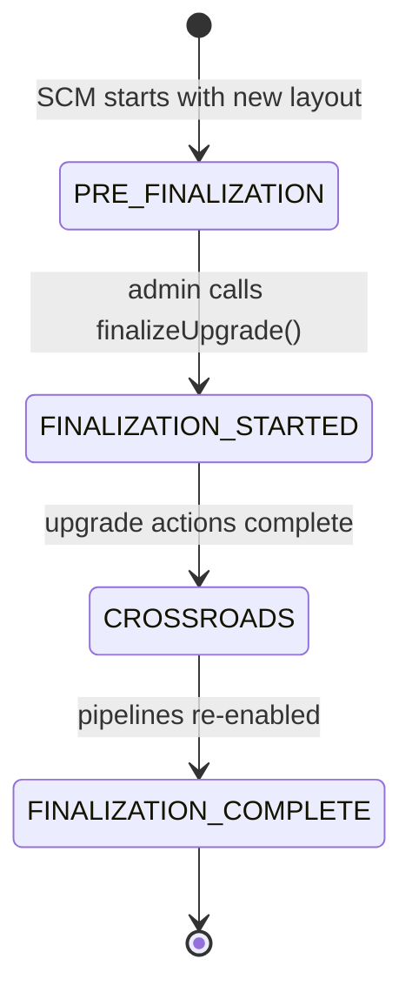

# scm / upgrade

_This feature page was generated from `study/atlas/components/scm/upgrade.md`. Author prose belongs above or below the BEGIN/END markers._

{/* BEGIN atlas-generated */}

**Classes:** 8    **Kinds:** service:5, interface:2, data:1

## Overview

The upgrade feature manages SCM's layout finalization process, which transitions the cluster from one metadata layout version to the next after all nodes have been upgraded. `FinalizationManager` is the admin-facing interface; `FinalizationManagerImpl` implements it by driving `SCMUpgradeFinalizer`. `FinalizationStateManagerImpl` is the authoritative source of finalization checkpoint state: it persists a `FINALIZING_MARK` key in the `finalizationInfo` RocksDB table and transitions through a sequence of `FinalizationCheckpoint` values (PRE_FINALIZATION, FINALIZATION_STARTED, FINALIZATION_COMPLETE). All state-changing methods are annotated with `@Replicate` so they go through `FinalizationStateManagerInvoker` into the Ratis log. `SCMUpgradeFinalizer` contains the per-layout-version upgrade actions (e.g., `ScmOnFinalizeActionForDatanodeSchemaV2`) and invokes them in order during finalization. `SCMUpgradeFinalizationContext` bundles the services needed by upgrade actions: `PipelineManager`, `NodeManager`, etc.

## Diagram

## Class table

### Sub-feature: `server.upgrade`

| reading_order | fqcn | kind | logic | loc | study (min) | role |
|--:|---|---|---|--:|--:|---|
| 1511 | <Fqcn>org.apache.hadoop.hdds.scm.server.upgrade.FinalizationManager</Fqcn> | interface | mixed | 25~ | 20 | Class to initiate SCM finalization and query its progress. |
| 1512 | <Fqcn>org.apache.hadoop.hdds.scm.server.upgrade.FinalizationStateManager</Fqcn> | interface | mixed | 25~ | 20 | Manages the state of finalization in SCM. |
| 1513 | <Fqcn>org.apache.hadoop.hdds.scm.server.upgrade.FinalizationStateManagerImpl</Fqcn> | service | logic-heavy | 200~ | 45 | Manages the state of finalization in SCM. |
| 1514 | <Fqcn>org.apache.hadoop.hdds.scm.server.upgrade.FinalizationManagerImpl</Fqcn> | service | mixed | 150~ | 45 | Class to initiate SCM finalization and query its progress. |
| 1515 | <Fqcn>org.apache.hadoop.hdds.scm.server.upgrade.SCMUpgradeFinalizationContext</Fqcn> | service | mixed | 100~ | 30 | Provided to methods in the SCMUpgradeFinalizer to supply objects needed to operate. |
| 1516 | <Fqcn>org.apache.hadoop.hdds.scm.server.upgrade.SCMUpgradeFinalizer</Fqcn> | service | mixed | 100~ | 30 | UpgradeFinalizer for the Storage Container Manager service. |
| 1517 | <Fqcn>org.apache.hadoop.hdds.scm.server.upgrade.ScmOnFinalizeActionForDatanodeSchemaV2</Fqcn> | service | mixed | 25~ | 30 | SCM Upgrade Action for the very first Upgrade Version. |
| 1518 | <Fqcn>org.apache.hadoop.hdds.scm.server.upgrade.FinalizationCheckpoint</Fqcn> | data | data-only | 25~ | 10 | A finalization checkpoint is an abstraction over SCM's disk state, indicating where finalization left off so it can b... |

## Anchor details

### `FinalizationStateManagerImpl`

- **path:** `hadoop-hdds/server-scm/src/main/java/org/apache/hadoop/hdds/scm/server/upgrade/FinalizationStateManagerImpl.java`
- **loc:** 200~    **difficulty:** 4    **study:** 45 min    **concurrency:** thread-safe    **persistence:** RocksDB
- **entry points:** `build`
- **key collaborators:** `org.apache.hadoop.hdds.scm.ha.SCMRatisServer`, `org.apache.hadoop.hdds.scm.ha.invoker.FinalizationStateManagerInvoker`, `org.apache.hadoop.hdds.scm.metadata.DBTransactionBuffer`, `org.apache.hadoop.hdds.scm.metadata.Replicate`, `org.apache.hadoop.hdds.scm.pipeline.PipelineManager`, `org.apache.hadoop.hdds.upgrade.HDDSLayoutFeature`
- **role:** Manages the state of finalization in SCM.

## Design docs

- `hadoop-hdds/docs/content/design/upgrade-dev-primer.md` — developer guide covering the upgrade finalization framework that `SCMUpgradeFinalizer` implements
- `hadoop-hdds/docs/content/design/nonrolling-upgrade.md` — design for non-rolling upgrades
- `hadoop-hdds/docs/content/feature/Nonrolling-Upgrade.md` — user-facing upgrade documentation

## Seminal JIRAs / PRs

- [HDDS-6761](https://issues.apache.org/jira/browse/HDDS-6761). Handle restarts, crashes, and leader changes in SCM HA finalization.
- [HDDS-12033](https://issues.apache.org/jira/browse/HDDS-12033). ScmHAUnfinalizedStateValidationAction can be removed as it's not used.
- [HDDS-14569](https://issues.apache.org/jira/browse/HDDS-14569). Remove support for upgrade actions that run outside of finalization.
- [HDDS-15191](https://issues.apache.org/jira/browse/HDDS-15191). Add ScmInvoker subclasses for the remaining SCMHandler(s) — includes `FinalizationStateManagerInvoker`.

## Sharp edges

- `FinalizationStateManagerImpl` uses a `ReadWriteLock` (`checkpointLock`) to protect checkpoint transitions. The `hasFinalizingMark` field is `volatile` so reads outside the lock see the most recent value, but there is a subtle window: between reading `hasFinalizingMark` (outside lock) and calling `publishCheckpoint()` (which requires the write lock), the state may have changed. Code that makes decisions based on `hasFinalizingMark` without holding the read lock may act on a stale value. (`FinalizationStateManagerImpl.java` ~L53, `volatile boolean hasFinalizingMark`.)
- Finalization is not idempotent in the sense that restarting finalization mid-way re-reads the `FINALIZING_MARK` from RocksDB and resumes from the last persisted checkpoint. However, if finalization actions themselves are not idempotent (e.g., `ScmOnFinalizeActionForDatanodeSchemaV2` modifying schema), restarting SCM during finalization could apply some actions twice. Upgrade action authors must ensure their actions are idempotent. ([HDDS-6761](https://issues.apache.org/jira/browse/HDDS-6761) area.)

## Related features

- `components/scm/scm-ha.md` — `FinalizationStateManagerInvoker` routes mutations through `SCMStateMachine`
- `components/scm/scm-metadata.md` — `finalizationInfo` column family defined in `SCMDBDefinition` backs `FinalizationStateManagerImpl`
- `components/scm/pipeline-manager.md` — `SCMUpgradeFinalizationContext` provides `PipelineManager` to upgrade actions that re-enable pipelines after finalization
- `components/scm/scm-server.md` — `StorageContainerManager` exposes `FinalizationManager` to the admin CLI via `SCMClientProtocolServer`

## Self-quiz

1. `FinalizationStateManagerImpl.build()` is the entry point. What does `initialize()` do on first call, and what does it do when SCM restarts mid-finalization?
2. `FinalizationCheckpoint` is an enum. What are its values and what does each represent about the SCM disk state?
3. `FinalizationStateManagerImpl` uses `@Replicate` on state-changing methods. What does this annotation mean at runtime, and who processes it?
4. `SCMUpgradeFinalizer` contains per-layout-version actions. What class contains the upgrade action for `DATANODE_SCHEMA_V2`, and what does that action do?
5. `FinalizationManagerImpl` queries finalization progress. How does a client determine whether finalization is still running vs complete?

Answers

Answer 1: `initialize()` reads `finalizationStore.isExist(OzoneConsts.FINALIZING_KEY)` to set `hasFinalizingMark`. On first start it returns false (no mark). On restart mid-finalization it returns true, allowing SCM to resume from `FINALIZATION_STARTED` rather than re-running completed steps.
Answer 2: `FinalizationCheckpoint` values are `PRE_FINALIZATION` (not yet started), `FINALIZATION_STARTED` (the FINALIZING_MARK has been written to DB), `CROSSROADS` (upgrade actions have run, pipeline creation is still frozen), and `FINALIZATION_COMPLETE` (pipelines unfrozen, layout version updated). Each checkpoint corresponds to a specific on-disk state.
Answer 3: `@Replicate` is a marker annotation. At runtime, `FinalizationStateManagerInvoker` (the Ratis invoker generated for this interface) detects that the method is annotated with `@Replicate` and routes the call through `SCMRatisServerImpl.submitRequest()` to ensure it is replicated to all SCM nodes before being applied locally.
Answer 4: `ScmOnFinalizeActionForDatanodeSchemaV2` contains the action. It communicates to datanodes that they should finalize their own schema to V2 format, typically by sending a command or by updating the layout version metadata that datanodes read from SCM.
Answer 5: `FinalizationManagerImpl.queryUpgradeFinalizationProgress()` returns a `StatusAndMessages` object. A client calls this repeatedly; when the status is `ALREADY_FINALIZED` the upgrade is complete. The `SCMClientProtocolServer` exposes this via `queryUpgradeFinalizationProgress()` RPC.

{/* END atlas-generated */}
