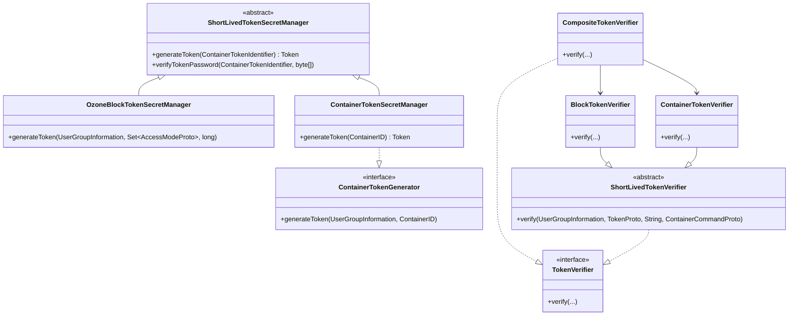

# security / security-tokens

_This feature page was generated from `study/atlas/components/security/security-tokens.md`. Author prose belongs above or below the BEGIN/END markers._

{/* BEGIN atlas-generated */}

**Classes:** 12    **Kinds:** service:7, interface:2, abstract:2, exception:1

## Overview

This feature contains the short-lived bearer-token machinery that gates datanode container and block access. Two parallel type hierarchies exist: secret managers (`ShortLivedTokenSecretManager` base, with `OzoneBlockTokenSecretManager` and `ContainerTokenSecretManager` as the two concrete managers living in OM) generate tokens by signing a token identifier with a symmetric key; verifiers (`ShortLivedTokenVerifier` base, with `BlockTokenVerifier` and `ContainerTokenVerifier` as concrete subclasses) run on each datanode gRPC handler and check the token on every request. `ContainerTokenIdentifier` encodes the allowed container ID, operation type, and expiry into the token payload. `CompositeTokenVerifier` chains multiple `TokenVerifier` instances so a single gRPC interceptor can validate either block or container tokens. `NoopTokenVerifier` is wired when `hdds.block.token.enabled=false` to avoid branching in hot paths. The entire token exchange travels in gRPC metadata headers inspected by `TokenVerifier.verify()`.

## Diagram

## Class table

### Sub-feature: `security.token`

| reading_order | fqcn | kind | logic | loc | study (min) | role |
|--:|---|---|---|--:|--:|---|
| 1016 | <Fqcn>org.apache.hadoop.hdds.security.token.ContainerTokenGenerator</Fqcn> | interface | mixed | 25~ | 20 | Generates container tokens. |
| 1017 | <Fqcn>org.apache.hadoop.hdds.security.token.TokenVerifier</Fqcn> | interface | mixed | 25~ | 20 | Ozone GRPC token header verifier. |
| 1018 | <Fqcn>org.apache.hadoop.hdds.security.token.ShortLivedTokenVerifier</Fqcn> | abstract | mixed | 75~ | 30 | Verifies short-lived token. |
| 1019 | <Fqcn>org.apache.hadoop.hdds.security.token.ShortLivedTokenSecretManager</Fqcn> | abstract | mixed | 25~ | 30 | Base class for short-lived token secret managers (block, container). |
| 1020 | <Fqcn>org.apache.hadoop.hdds.security.token.ContainerTokenIdentifier</Fqcn> | service | mixed | 75~ | 30 | Token identifier for container operations, similar to block token. |
| 1021 | <Fqcn>org.apache.hadoop.hdds.security.token.BlockTokenVerifier</Fqcn> | service | mixed | 50~ | 30 | Verify token and return a UGI with token if authenticated. |
| 1022 | <Fqcn>org.apache.hadoop.hdds.security.token.NoopTokenVerifier</Fqcn> | service | mixed | 25~ | 30 | No-op verifier, used when block token is disabled in config. |
| 1023 | <Fqcn>org.apache.hadoop.hdds.security.token.ContainerTokenSecretManager</Fqcn> | service | mixed | 25~ | 30 | Secret manager for container tokens. |
| 1024 | <Fqcn>org.apache.hadoop.hdds.security.token.CompositeTokenVerifier</Fqcn> | service | mixed | 25~ | 30 | Handles all kinds of container commands. |
| 1025 | <Fqcn>org.apache.hadoop.hdds.security.token.OzoneBlockTokenSecretManager</Fqcn> | service | mixed | 25~ | 30 | SecretManager for Ozone Master block tokens. |
| 1026 | <Fqcn>org.apache.hadoop.hdds.security.token.ContainerTokenVerifier</Fqcn> | service | mixed | 25~ | 30 | Verifier for container tokens. |
| 1027 | <Fqcn>org.apache.hadoop.hdds.security.token.BlockTokenException</Fqcn> | exception | data-only | 25~ | 10 | Block Token Exceptions from the SCM Security layer. |

## Anchor details

_No logic-heavy anchors in this feature (all classes are `mixed` or `data-only`). Key observations:_

- `BlockTokenVerifier.verify` extracts the `OzoneBlockTokenIdentifier` from the gRPC request header, looks up the signing key from `SecretKeyVerifierClient` by UUID, and checks both the HMAC and the `AccessMode` set; [HDDS-10054](https://issues.apache.org/jira/browse/HDDS-10054) reduced per-verification heap allocation by reusing a shared `Mac` instance rather than allocating one per call.
- `ContainerTokenIdentifier` uses Protobuf encoding for the on-wire token payload; its `bytes` field holds the PEM-encoded `ContainerID`, which makes the identifier self-describing and allows verification without a server-side identifier lookup.
- `NoopTokenVerifier.verify` is a no-op that always returns `null` (success); wiring it via the `CompositeTokenVerifier` configuration path means the zero-cost path is identical in structure to the real path, avoiding conditional branches in the gRPC interceptor.

## Design docs

- `hadoop-hdds/docs/content/design/token.md` — generic extensible token design ([HDDS-2867](https://issues.apache.org/jira/browse/HDDS-2867)) that introduced the `SecretManager<T>` abstraction and the short-lived token concept for Ozone.
- `hadoop-hdds/docs/content/design/symmetric-token-signatures.md` — design for replacing asymmetric signing with symmetric keys in block and container tokens ([HDDS-7733](https://issues.apache.org/jira/browse/HDDS-7733)).
- `hadoop-hdds/docs/content/security/SecuringDatanodes.md` — operator guide for block token configuration and datanode security setup.

## Seminal JIRAs / PRs

- [HDDS-4558](https://issues.apache.org/jira/browse/HDDS-4558). Support Ozone block token with access mode check.
- [HDDS-4729](https://issues.apache.org/jira/browse/HDDS-4729). Add token support for container admin operations.
- [HDDS-5236](https://issues.apache.org/jira/browse/HDDS-5236). Require block token for more operations.
- [HDDS-5264](https://issues.apache.org/jira/browse/HDDS-5264). SCM should send token for CloseContainer command.
- [HDDS-7831](https://issues.apache.org/jira/browse/HDDS-7831). Use symmetric secret key to sign and verify token.
- [HDDS-8003](https://issues.apache.org/jira/browse/HDDS-8003). E2E integration test cases for block tokens.
- [HDDS-10054](https://issues.apache.org/jira/browse/HDDS-10054). Reduce DataNode token verification heap allocation cost.

## Sharp edges

- `BlockTokenVerifier` checks the `AccessMode` set embedded in the token; if the token was issued with only `READ` mode and the datanode receives a `WRITE` command, the verification fails silently with a `BlockTokenException` rather than a gRPC status error — callers may interpret this as a generic failure ([HDDS-4558](https://issues.apache.org/jira/browse/HDDS-4558) first introduced the access-mode check).
- When `hdds.block.token.enabled=false` the `NoopTokenVerifier` is wired, meaning any caller can issue block commands without authentication; re-enabling the setting on a running cluster requires all existing tokens to be re-issued because the verifier switch is done at startup.
- `ContainerTokenIdentifier` carries an expiry; SCM's `CloseContainer` command embeds a short-lived container token ([HDDS-5264](https://issues.apache.org/jira/browse/HDDS-5264)), so a delayed delivery of this command may arrive with an expired token, requiring the datanode to ignore expiry for command-channel tokens.

## Related features

- `components/security/security-symmetric.md` — `SecretKeySignerClient` and `SecretKeyVerifierClient` are the key-retrieval APIs that token managers and verifiers depend on.
- `components/security/security-framework.md` — `OzoneSecretManager` is the Hadoop `SecretManager<T>` base that `ShortLivedTokenSecretManager` extends.
- `components/security/security-x509.md` — certificate client that signs the gRPC channel carrying these tokens; tokens themselves use symmetric keys, not x509.
- `components/security/security-ssl.md` — TLS layer over which token-bearing gRPC metadata headers are transmitted.

## Self-quiz

1. What is the role of `CompositeTokenVerifier`, and how does it decide which `TokenVerifier` to delegate to for a given container command?
2. `BlockTokenVerifier.verify` looks up a `ManagedSecretKey` by UUID. Where does the UUID come from in the request, and what happens if the key is not found in `SecretKeyVerifierClient`?
3. `ContainerTokenIdentifier` uses Protobuf serialization. Which field in the proto identifies the allowed container, and how does the verifier ensure the token was not reused for a different container?
4. `NoopTokenVerifier` is used when block tokens are disabled. Why is a composite verifier with a no-op entry preferable to an `if (tokensEnabled)` branch in the gRPC interceptor?
5. `ShortLivedTokenSecretManager` extends `OzoneSecretManager`. What does the `ShortLivedToken` base class add over the raw `SecretManager<T>` contract?

Answers

Answer 1: `CompositeTokenVerifier` holds a list of `TokenVerifier` implementations and tries each in turn; the first one whose `verify` returns without throwing wins. In practice it holds one `BlockTokenVerifier` and one `ContainerTokenVerifier`, which each self-select based on the token type embedded in the gRPC header.
Answer 2: The UUID is serialized into the `OzoneBlockTokenIdentifier` proto field; if `SecretKeyVerifierClient.getSecretKey(uuid)` returns null (key expired and purged), `BlockTokenVerifier` throws `BlockTokenException` with a key-not-found message.
Answer 3: The `containerID` field identifies the allowed container; the verifier re-parses the identifier from the token payload and checks it matches the container targeted by the command, rejecting any token whose embedded container ID differs.
Answer 4: Using the composite+noop pattern keeps the hot gRPC interceptor path branch-free and avoids the risk of a mis-placed `if` that could accidentally bypass the real verifier when a flag value is read inconsistently across threads.
Answer 5: `ShortLivedTokenSecretManager` adds token expiry enforcement (rejecting tokens past their `expiryDate`) and ties token signing to the current `ManagedSecretKey` from `SecretKeySignerClient`, neither of which the bare `SecretManager<T>` contract requires.

{/* END atlas-generated */}
