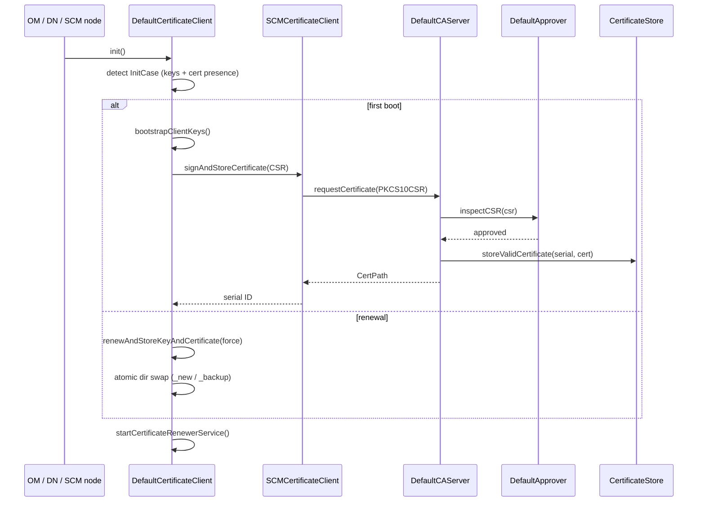

# security / security-x509

_This feature page was generated from `study/atlas/components/security/security-x509.md`. Author prose belongs above or below the BEGIN/END markers._

{/* BEGIN atlas-generated */}

**Classes:** 17    **Kinds:** service:8, interface:6, dto:2, abstract:1

## Overview

This feature implements Ozone's internal PKI: SCM acts as both a root CA and an intermediate CA, issuing x509 certificates to OM, datanode, and other SCM nodes. `DefaultCAServer` is the server-side CA: its `init` method detects four startup states (success, missing keys, missing certs, first boot) and on first boot delegates to `SelfSignedCertificate.Builder` to generate a self-signed root. `DefaultCertificateClient` is the abstract client base used by OM, datanode, and SCM itself; it manages key generation, CSR submission, certificate storage on disk, and a background renewal scheduler that swaps key/cert directories atomically using `_new` and `_backup` suffixes. `SCMCertificateClient` extends `DefaultCertificateClient` to request a sub-CA certificate from the primary SCM, setting the CA basic constraint so the resulting cert can in turn sign OM and datanode certificates. `SelfSignedCertificate` uses Bouncy Castle's `X509v3CertificateBuilder` and sets `BasicConstraints(true)` only when `.makeCA()` is called. `DefaultApprover` validates the CSR against `PKIProfile` rules before signing.

## Diagram

## Class table

### Sub-feature: `authority.profile`

| reading_order | fqcn | kind | logic | loc | study (min) | role |
|--:|---|---|---|--:|--:|---|
| 999 | <Fqcn>org.apache.hadoop.hdds.security.x509.certificate.authority.profile.PKIProfile</Fqcn> | interface | mixed | 25~ | 20 | Base class for profile rules. |
| 1000 | <Fqcn>org.apache.hadoop.hdds.security.x509.certificate.authority.profile.DefaultProfile</Fqcn> | service | mixed | 175~ | 45 | Ozone PKI profile. |
| 1001 | <Fqcn>org.apache.hadoop.hdds.security.x509.certificate.authority.profile.DefaultCAProfile</Fqcn> | service | mixed | 25~ | 30 | CA Profile, this is needed when SCM does HA. |

### Sub-feature: `certificate.authority`

| reading_order | fqcn | kind | logic | loc | study (min) | role |
|--:|---|---|---|--:|--:|---|
| 1002 | <Fqcn>org.apache.hadoop.hdds.security.x509.certificate.authority.CertificateStore</Fqcn> | interface | mixed | 25~ | 20 | This interface allows the DefaultCA to be portable and use different DB interfaces later. |
| 1003 | <Fqcn>org.apache.hadoop.hdds.security.x509.certificate.authority.CertificateApprover</Fqcn> | interface | mixed | 25~ | 20 | Certificate Approver interface is used to inspectCSR a certificate. |
| 1004 | <Fqcn>org.apache.hadoop.hdds.security.x509.certificate.authority.CertificateServer</Fqcn> | interface | mixed | 25~ | 20 | Interface for Certificate Authority. |
| 1005 | <Fqcn>org.apache.hadoop.hdds.security.x509.certificate.authority.DefaultCAServer</Fqcn> | service | logic-heavy | 300~ | 45 | The default CertificateServer used by SCM. |
| 1006 | <Fqcn>org.apache.hadoop.hdds.security.x509.certificate.authority.DefaultApprover</Fqcn> | service | mixed | 175~ | 45 | Default Approver used the by the DefaultCA. |

### Sub-feature: `certificate.client`

| reading_order | fqcn | kind | logic | loc | study (min) | role |
|--:|---|---|---|--:|--:|---|
| 1007 | <Fqcn>org.apache.hadoop.hdds.security.x509.certificate.client.CertificateClient</Fqcn> | interface | mixed | 50~ | 20 | Certificate client provides and interface to certificate operations that needs to be performed by all clients in the... |
| 1008 | <Fqcn>org.apache.hadoop.hdds.security.x509.certificate.client.CertificateNotification</Fqcn> | interface | mixed | 25~ | 20 | Class should implement this interface if it wants to be notified when there is some changes in Certificate. |
| 1009 | <Fqcn>org.apache.hadoop.hdds.security.x509.certificate.client.DefaultCertificateClient</Fqcn> | abstract | logic-heavy | 1025~ | 60 | Default Certificate client implementation. |
| 1010 | <Fqcn>org.apache.hadoop.hdds.security.x509.certificate.client.SCMCertificateClient</Fqcn> | service | logic-heavy | 250~ | 45 | SCM Certificate Client which is used for generating public/private Key pair, generate CSR and finally obtain signed c... |
| 1011 | <Fqcn>org.apache.hadoop.hdds.security.x509.certificate.client.RootCaRotationPoller</Fqcn> | service | mixed | 100~ | 30 | Poller mechanism for Root Ca Rotation for clients. |
| 1012 | <Fqcn>org.apache.hadoop.hdds.security.x509.certificate.client.DNCertificateClient</Fqcn> | service | mixed | 50~ | 30 | Certificate client for DataNodes. |

### Sub-feature: `certificate.utils`

| reading_order | fqcn | kind | logic | loc | study (min) | role |
|--:|---|---|---|--:|--:|---|
| 1013 | <Fqcn>org.apache.hadoop.hdds.security.x509.certificate.utils.SelfSignedCertificate</Fqcn> | service | logic-heavy | 200~ | 45 | A Self Signed Certificate with CertificateServer basic constraint can be used to bootstrap a certificate infrastructu... |
| 1014 | <Fqcn>org.apache.hadoop.hdds.security.x509.certificate.utils.CertificateSignRequest</Fqcn> | dto | logic-heavy | 275~ | 10 | A certificate sign request object that wraps operations to build a PKCS10CertificationRequest to CertificateServer. |

### Sub-feature: `x509.certificate`

| reading_order | fqcn | kind | logic | loc | study (min) | role |
|--:|---|---|---|--:|--:|---|
| 1015 | <Fqcn>org.apache.hadoop.hdds.security.x509.certificate.CertInfo</Fqcn> | dto | data-only | 100~ | 10 | Class that wraps Certificate Info. |

## Anchor details

### `DefaultCertificateClient`

- **path:** `hadoop-hdds/framework/src/main/java/org/apache/hadoop/hdds/security/x509/certificate/client/DefaultCertificateClient.java`
- **loc:** 1025~    **difficulty:** 5    **study:** 60 min    **concurrency:** thread-safe    **persistence:** in-memory
- **entry points:** `init`, `close`, `run`
- **key collaborators:** `org.apache.hadoop.hdds.security.x509.certificate.utils.CertificateSignRequest`, `org.apache.hadoop.hdds.protocolPB.SCMSecurityProtocolClientSideTranslatorPB`, `org.apache.hadoop.hdds.scm.client.ClientTrustManager`, `org.apache.hadoop.hdds.security.SecurityConfig`, `org.apache.hadoop.hdds.security.exception.SCMSecurityException`, `org.apache.hadoop.hdds.security.ssl.ReloadingX509KeyManager`
- **test exemplar:** `hadoop-hdds/framework/src/test/java/org/apache/hadoop/hdds/security/x509/certificate/client/TestDefaultCertificateClient.java`
- **role:** Default Certificate client implementation.

`init()` encodes startup state as a 3-bit integer (private key present, public key present, cert present) and dispatches to `handleCase(InitCase)` — any bit pattern with a certificate but no private key returns `FAILURE` immediately because the cluster cannot recover without manual key restoration. `renewAndStoreKeyAndCertificate` performs a two-phase atomic directory swap: new key/cert are written to `<dir>_new`, the current dirs are moved to `<dir>_backup` via `Files.move(ATOMIC_MOVE)`, then `<dir>_new` is promoted; a crash between the two moves leaves the backup dir as a recovery path.

### `DefaultCAServer`

- **path:** `hadoop-hdds/framework/src/main/java/org/apache/hadoop/hdds/security/x509/certificate/authority/DefaultCAServer.java`
- **loc:** 300~    **difficulty:** 4    **study:** 45 min    **concurrency:** single-threaded    **persistence:** in-memory
- **entry points:** `init`
- **key collaborators:** `org.apache.hadoop.hdds.security.x509.certificate.authority.profile.PKIProfile`, `org.apache.hadoop.hdds.security.x509.certificate.utils.SelfSignedCertificate`, `org.apache.hadoop.hdds.scm.metadata.SCMMetadataStore`, `org.apache.hadoop.hdds.security.SecurityConfig`, `org.apache.hadoop.hdds.security.exception.SCMSecurityException`, `org.apache.hadoop.hdds.security.x509.certificate.utils.CertificateCodec`
- **test exemplar:** `hadoop-hdds/framework/src/test/java/org/apache/hadoop/hdds/security/x509/certificate/authority/TestDefaultCAServer.java`
- **role:** The default CertificateServer used by SCM.

`requestCertificate` uses a `ReentrantLock` around `signAndStoreCertificate` to serialize issuance; the `CompletableFuture<CertPath>` it returns is completed synchronously inside the lock for the `KERBEROS_TRUSTED` and `TESTING_AUTOMATIC` approval types, making it effectively blocking despite the async signature. The `MANUAL` approval type immediately completes the future exceptionally with "not yet implemented", which is a permanent gap for operator-approved CSRs.

### `SCMCertificateClient`

- **path:** `hadoop-hdds/framework/src/main/java/org/apache/hadoop/hdds/security/x509/certificate/client/SCMCertificateClient.java`
- **loc:** 250~    **difficulty:** 4    **study:** 45 min    **concurrency:** actor/queue    **persistence:** in-memory
- **entry points:** `run`, `close`
- **key collaborators:** `org.apache.hadoop.hdds.security.x509.certificate.authority.CertificateServer`, `org.apache.hadoop.hdds.security.x509.certificate.authority.CertificateStore`, `org.apache.hadoop.hdds.security.x509.certificate.authority.DefaultCAServer`, `org.apache.hadoop.hdds.security.x509.certificate.authority.profile.DefaultCAProfile`, `org.apache.hadoop.hdds.security.x509.certificate.authority.profile.PKIProfile`, `org.apache.hadoop.hdds.security.x509.certificate.utils.CertificateSignRequest`
- **role:** SCM Certificate Client which is used for generating public/private Key pair, generate CSR and finally obtain signed c...

`configureCSRBuilder` sets `.setCA(true)` on the CSR, which results in a certificate with `BasicConstraints(true)` — this is what allows the sub-CA (SCM) to sign OM and datanode certificates. `shouldStartCertificateRenewerService` is overridden to return `false`, meaning SCM's own sub-CA cert renewal is triggered externally via `refreshCACertificates` rather than the background scheduler used by OM/DN. On startup of a non-primary SCM, `RefreshCACertificates.run` fetches the current root CA list from the leader to recover any rotation that occurred while this node was offline.

### `SelfSignedCertificate`

- **path:** `hadoop-hdds/framework/src/main/java/org/apache/hadoop/hdds/security/x509/certificate/utils/SelfSignedCertificate.java`
- **loc:** 200~    **difficulty:** 4    **study:** 45 min    **concurrency:** single-threaded    **persistence:** in-memory
- **entry points:** `build`
- **key collaborators:** `org.apache.hadoop.hdds.security.SecurityConfig`, `org.apache.hadoop.hdds.security.exception.SCMSecurityException`, `org.apache.hadoop.hdds.security.x509.exception.CertificateException`
- **role:** A Self Signed Certificate with CertificateServer basic constraint can be used to bootstrap a certificate infrastructu...

`generateCertificate` conditionally adds `BasicConstraints(true)` and `KeyUsage.keyCertSign | cRLSign` only when `caCertSerialId != null` (i.e., `.makeCA(serial)` was called on the builder); calling `.build()` without `.makeCA()` produces a leaf certificate with no CA extensions. The serial number for non-CA certs defaults to `Time.monotonicNow()`, which is millisecond-granular and could collide if two certs are issued within the same millisecond (inferred: [HDDS-14955](https://issues.apache.org/jira/browse/HDDS-14955) improved `BigInteger` instantiation in this area).

## Design docs

- `hadoop-hdds/docs/content/security/SecuringDatanodes.md` — explains auto-approval of datanode CSRs and the certificate lifecycle from a datanode's perspective.
- `hadoop-hdds/docs/content/security/SecureOzone.md` — overview of SCM CA bootstrap, Kerberos, and certificate issuance steps for OM/SCM.
- `hadoop-hdds/docs/content/feature/SCM-HA.md` — covers SCM HA certificate rotation and the root CA rotation mechanism that `SCMCertificateClient` and `RootCaRotationPoller` implement.

## Seminal JIRAs / PRs

- [HDDS-9548](https://issues.apache.org/jira/browse/HDDS-9548). Intermittent failures in TestRootCaRotationPoller.
- [HDDS-10249](https://issues.apache.org/jira/browse/HDDS-10249). Remove unused dead code in hdds-common module.
- [HDDS-10889](https://issues.apache.org/jira/browse/HDDS-10889). Remove certificate revocation related code.
- [HDDS-11028](https://issues.apache.org/jira/browse/HDDS-11028). Replace PKCS10CertificationRequest usage in CertificateClient.
- [HDDS-11031](https://issues.apache.org/jira/browse/HDDS-11031). Merge BaseApprover abstract class into DefaultApprover.
- [HDDS-13781](https://issues.apache.org/jira/browse/HDDS-13781). Certificate expiry date should consider time zone daylight saving impact.
- [HDDS-15192](https://issues.apache.org/jira/browse/HDDS-15192). Remove SCMHAInvocationHandler and the related code.

## Sharp edges

- `SelfSignedCertificate.generateCertificate` uses `Time.monotonicNow()` (milliseconds) as the serial number for non-CA leaf certs; two rapid issuances within the same millisecond will produce duplicate serials, which `CertificateStore` stores under the same key (inferred; [HDDS-14955](https://issues.apache.org/jira/browse/HDDS-14955) improved BigInteger instantiation but did not address serial uniqueness).
- `DefaultCAServer.requestCertificate` completes the `CompletableFuture` synchronously under a `ReentrantLock` for all non-MANUAL approval types; callers that chain `.thenApply` on the future will run their continuations on the issuing thread while the lock is still held, which can cause unexpected reentrancy.
- `DefaultCertificateClient.renewAndStoreKeyAndCertificate` performs an `ATOMIC_MOVE` of the key directory before the cert directory; a JVM crash between the two moves leaves the backup key dir without a matching backup cert dir, making manual recovery non-trivial ([HDDS-13781](https://issues.apache.org/jira/browse/HDDS-13781) addressed DST impact on computed expiry, but not the two-phase move atomicity).

## Related features

- `components/security/security-ssl.md` — `DefaultCertificateClient` drives `ReloadingX509KeyManager` and `ReloadingX509TrustManager` with the certificates this feature manages.
- `components/security/security-tokens.md` — block and container token secret managers inherit from `OzoneSecretManager`, which implements `CertificateNotification` to rotate its signing key when a new cert arrives.
- `components/security/security-symmetric.md` — SCM symmetric key lifecycle runs alongside the x509 PKI; tokens use symmetric keys but service-to-service TLS uses x509.
- `components/security/security-framework.md` — `OzoneSecretManager` implements the `CertificateNotification` interface defined in this feature.

## Self-quiz

1. `DefaultCertificateClient.init()` maps the presence of private key, public key, and certificate to an `InitCase` enum using a 3-bit integer. What does the `PRIVATEKEY_CERT` case (bit pattern `101`) mean operationally, and how does the client recover?
2. `SCMCertificateClient.configureCSRBuilder` calls `.setCA(true)`. What x509 extension does this translate to in the issued certificate, and why is it necessary for SCM's role?
3. `DefaultCAServer.requestCertificate` returns a `CompletableFuture<CertPath>` but completes it synchronously under a lock. What is the implication for a caller that adds a continuation via `.thenApply`?
4. `SelfSignedCertificate.Builder.makeCA(BigInteger serialId)` must be called to produce a CA certificate. What happens if it is not called, and where in the codebase is the non-CA variant used?
5. `RootCaRotationPoller` polls SCM for root CA changes. Under what condition does it add a certificate to the trust store without removing the old one, and why?

Answers

Answer 1: `PRIVATEKEY_CERT` (private key present, public key absent, cert present) means the keypair is partially stored. `DefaultCertificateClient.handleCase` attempts `recoverPublicKeyFromPrivateKey()` by deriving the public key from the private key's RSA CRT parameters; if recovery succeeds it returns `GETCERT` to request a fresh certificate.
Answer 2: `.setCA(true)` results in `BasicConstraints(true)` and `KeyUsage.keyCertSign | cRLSign` being added to the issued certificate. These extensions are required for the sub-CA to sign OM and datanode certificates; without them, TLS stacks reject the signed leaf certs as issued by a non-CA.
Answer 3: The continuation runs on the thread that called `requestCertificate`, while that thread still holds the issuance `ReentrantLock`. If the continuation tries to acquire any lock also held by a caller of `requestCertificate`, a deadlock is possible.
Answer 4: Without `.makeCA()`, `caCertSerialId` is null and `generateCertificate` skips the `BasicConstraints` and `KeyUsage` extensions, producing a leaf certificate. The non-CA variant is used when bootstrapping the initial SCM root cert for node-identity purposes, not for signing.
Answer 5: `RootCaRotationPoller` adds the new root CA to the trust store while the old one is still present (overlapping validity windows) so that services that obtained certificates signed by the old CA can still be verified during the transition period. The old cert is removed only after all sub-CA certs it signed have expired or been re-issued.

{/* END atlas-generated */}
