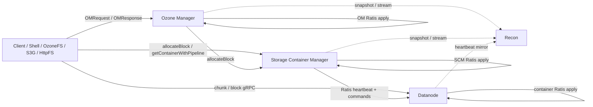
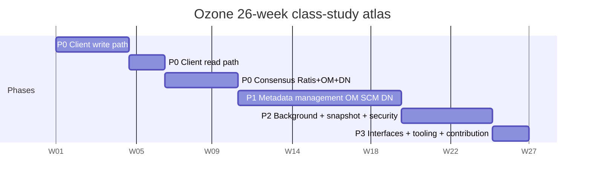

# Reading order

This page stitches together `study/atlas/INDEX.md` and `study/atlas/SCHEDULE.md` verbatim.

## Reading order (from INDEX.md)

# Atlas Index

Full hierarchical TOC. Every leaf link points to a per-feature file with class table, mermaid diagram, JIRAs, sharp edges, and self-quiz.

## Component relationship diagram

## Components (reading-order)

| # | Component | Feature | Sub-feature | Classes | reading_order range |
|--:|---|---|---|--:|---|
| 1 | [Client](/component/client/) | [ozone-client](/component/client/ozone-client) | [`client-facade`](/component/client/ozone-client#sub-feature-client-facade) | 6 | 1–6 |
| 2 | [Client](/component/client/) | [ozone-client](/component/client/ozone-client) | [`user-api-types`](/component/client/ozone-client#sub-feature-user-api-types) | 15 | 7–21 |
| 3 | [Client](/component/client/) | [ozone-client](/component/client/ozone-client) | [`io-streams`](/component/client/ozone-client#sub-feature-io-streams) | 11 | 22–32 |
| 4 | [Client](/component/client/) | [ozone-client](/component/client/ozone-client) | [`client.io`](/component/client/ozone-client#sub-feature-clientio) | 4 | 33–36 |
| 5 | [Client](/component/client/) | [ozone-client](/component/client/ozone-client) | [`client.rpc`](/component/client/ozone-client#sub-feature-clientrpc) | 1 | 37–37 |
| 6 | [Client](/component/client/) | [ozone-client](/component/client/ozone-client) | [`ec-client`](/component/client/ozone-client#sub-feature-ec-client) | 5 | 38–42 |
| 7 | [Client](/component/client/) | [ozone-client](/component/client/ozone-client) | [`checksum`](/component/client/ozone-client#sub-feature-checksum) | 5 | 43–47 |
| 8 | [OzoneCommon](/component/ozonecommon/) | [client-common](/component/ozonecommon/client-common) | [`client.checksum`](/component/ozonecommon/client-common#sub-feature-clientchecksum) | 3 | 48–50 |
| 9 | [OzoneCommon](/component/ozonecommon/) | [client-common](/component/ozonecommon/client-common) | [`client.io`](/component/ozonecommon/client-common#sub-feature-clientio) | 3 | 51–53 |
| 10 | [OM](/component/om/) | [om-protocol](/component/om/om-protocol) | [`ozone.protocolPB`](/component/om/om-protocol#sub-feature-ozoneprotocolpb) | 5 | 54–58 |
| 11 | [OM](/component/om/) | [om-request](/component/om/om-request) | [`om.request`](/component/om/om-request#sub-feature-omrequest) | 4 | 59–62 |
| 12 | [OM](/component/om/) | [om-request](/component/om/om-request) | [`request.lifecycle`](/component/om/om-request#sub-feature-requestlifecycle) | 4 | 63–66 |
| 13 | [OM](/component/om/) | [om-request](/component/om/om-request) | [`request.security`](/component/om/om-request#sub-feature-requestsecurity) | 3 | 67–69 |
| 14 | [OM](/component/om/) | [om-request](/component/om/om-request) | [`request.util`](/component/om/om-request#sub-feature-requestutil) | 6 | 70–75 |
| 15 | [OM](/component/om/) | [om-request](/component/om/om-request) | [`request.validation`](/component/om/om-request#sub-feature-requestvalidation) | 8 | 76–83 |
| 16 | [Client](/component/client/) | [hdds-client](/component/client/hdds-client) | [`xceiver-clients`](/component/client/hdds-client#sub-feature-xceiver-clients) | 10 | 84–93 |
| 17 | [Client](/component/client/) | [hdds-client](/component/client/hdds-client) | [`write-streams`](/component/client/hdds-client#sub-feature-write-streams) | 9 | 94–102 |
| 18 | [Client](/component/client/) | [hdds-client](/component/client/hdds-client) | [`scm.storage`](/component/client/hdds-client#sub-feature-scmstorage) | 2 | 103–104 |
| 19 | [Client](/component/client/) | [hdds-client](/component/client/hdds-client) | [`read-streams`](/component/client/hdds-client#sub-feature-read-streams) | 12 | 105–116 |
| 20 | [Client](/component/client/) | [hdds-client](/component/client/hdds-client) | [`ec-transport-read`](/component/client/hdds-client#sub-feature-ec-transport-read) | 8 | 117–124 |
| 21 | [Client](/component/client/) | [hdds-client](/component/client/hdds-client) | [`client-utils`](/component/client/hdds-client#sub-feature-client-utils) | 9 | 125–133 |
| 22 | [SCM](/component/scm/) | [block-manager](/component/scm/block-manager) | [`scm.block`](/component/scm/block-manager#sub-feature-scmblock) | 11 | 134–144 |
| 23 | [SCM](/component/scm/) | [pipeline-manager](/component/scm/pipeline-manager) | [`choose.algorithms`](/component/scm/pipeline-manager#sub-feature-choosealgorithms) | 4 | 145–148 |
| 24 | [SCM](/component/scm/) | [pipeline-manager](/component/scm/pipeline-manager) | [`scm.pipeline`](/component/scm/pipeline-manager#sub-feature-scmpipeline) | 24 | 149–172 |
| 25 | [DN](/component/dn/) | [kv-container](/component/dn/kv-container) | [`container.keyvalue`](/component/dn/kv-container#sub-feature-containerkeyvalue) | 7 | 173–179 |
| 26 | [DN](/component/dn/) | [kv-container](/component/dn/kv-container) | [`keyvalue.helpers`](/component/dn/kv-container#sub-feature-keyvaluehelpers) | 4 | 180–183 |
| 27 | [DN](/component/dn/) | [kv-container](/component/dn/kv-container) | [`keyvalue.interfaces`](/component/dn/kv-container#sub-feature-keyvalueinterfaces) | 2 | 184–185 |
| 28 | [DN](/component/dn/) | [kv-container-impl](/component/dn/kv-container-impl) | [`keyvalue.impl`](/component/dn/kv-container-impl#sub-feature-keyvalueimpl) | 10 | 186–195 |
| 29 | [DN](/component/dn/) | [container-interfaces](/component/dn/container-interfaces) | [`common.interfaces`](/component/dn/container-interfaces#sub-feature-commoninterfaces) | 14 | 196–209 |
| 30 | [DN](/component/dn/) | [erasure-coding](/component/dn/erasure-coding) | [`reconstruction`](/component/dn/erasure-coding#sub-feature-reconstruction) | 4 | 210–213 |
| 31 | [DN](/component/dn/) | [erasure-coding](/component/dn/erasure-coding) | [`coder`](/component/dn/erasure-coding#sub-feature-coder) | 22 | 214–235 |
| 32 | [DN](/component/dn/) | [erasure-coding](/component/dn/erasure-coding) | [`ec-chunk`](/component/dn/erasure-coding#sub-feature-ec-chunk) | 1 | 236–236 |
| 33 | [DN](/component/dn/) | [erasure-coding](/component/dn/erasure-coding) | [`ec.reconstruction`](/component/dn/erasure-coding#sub-feature-ecreconstruction) | 1 | 237–237 |
| 34 | [DN](/component/dn/) | [erasure-coding](/component/dn/erasure-coding) | [`erasurecode.rawcoder`](/component/dn/erasure-coding#sub-feature-erasurecoderawcoder) | 8 | 238–245 |
| 35 | [DN](/component/dn/) | [erasure-coding](/component/dn/erasure-coding) | [`ozone.erasurecode`](/component/dn/erasure-coding#sub-feature-ozoneerasurecode) | 1 | 246–246 |
| 36 | [DN](/component/dn/) | [erasure-coding](/component/dn/erasure-coding) | [`rawcoder.util`](/component/dn/erasure-coding#sub-feature-rawcoderutil) | 4 | 247–250 |
| 37 | [OM](/component/om/) | [om-request-key](/component/om/om-request-key) | [`create-commit`](/component/om/om-request-key#sub-feature-create-commit) | 6 | 251–256 |
| 38 | [OM](/component/om/) | [om-request-key](/component/om/om-request-key) | [`delete`](/component/om/om-request-key#sub-feature-delete) | 7 | 257–263 |
| 39 | [OM](/component/om/) | [om-request-key](/component/om/om-request-key) | [`rename`](/component/om/om-request-key#sub-feature-rename) | 3 | 264–266 |
| 40 | [OM](/component/om/) | [om-request-key](/component/om/om-request-key) | [`key-acl`](/component/om/om-request-key#sub-feature-key-acl) | 12 | 267–278 |
| 41 | [OM](/component/om/) | [om-request-key](/component/om/om-request-key) | [`request.key`](/component/om/om-request-key#sub-feature-requestkey) | 3 | 279–281 |
| 42 | [Ratis-integration](/component/ratis-integration/) | [ratis-integration](/component/ratis-integration/ratis-integration) | [`metrics.dropwizard3`](/component/ratis-integration/ratis-integration#sub-feature-metricsdropwizard3) | 1 | 282–282 |
| 43 | [Ratis-integration](/component/ratis-integration/) | [ratis-integration](/component/ratis-integration/ratis-integration) | [`scm.ha`](/component/ratis-integration/ratis-integration#sub-feature-scmha) | 3 | 283–285 |
| 44 | [HddsCommon](/component/hddscommon/) | [ratis-integration](/component/hddscommon/ratis-integration) | [`hdds.ratis`](/component/hddscommon/ratis-integration#sub-feature-hddsratis) | 3 | 286–288 |
| 45 | [HddsCommon](/component/hddscommon/) | [ratis-integration](/component/hddscommon/ratis-integration) | [`ratis.conf`](/component/hddscommon/ratis-integration#sub-feature-ratisconf) | 1 | 289–289 |
| 46 | [HddsCommon](/component/hddscommon/) | [ratis-integration](/component/hddscommon/ratis-integration) | [`ratis.retrypolicy`](/component/hddscommon/ratis-integration#sub-feature-ratisretrypolicy) | 3 | 290–292 |
| 47 | [HddsCommon](/component/hddscommon/) | [ratis-integration](/component/hddscommon/ratis-integration) | [`scm.ha`](/component/hddscommon/ratis-integration#sub-feature-scmha) | 4 | 293–296 |
| 48 | [OM](/component/om/) | [om-ratis](/component/om/om-ratis) | [`om.ratis`](/component/om/om-ratis#sub-feature-omratis) | 5 | 297–301 |
| 49 | [OM](/component/om/) | [om-ratis](/component/om/om-ratis) | [`om.ratis_snapshot`](/component/om/om-ratis#sub-feature-omratis_snapshot) | 1 | 302–302 |
| 50 | [OM](/component/om/) | [om-ratis](/component/om/om-ratis) | [`ratis.utils`](/component/om/om-ratis#sub-feature-ratisutils) | 1 | 303–303 |
| 51 | [OM](/component/om/) | [om-response](/component/om/om-response) | [`acl.prefix`](/component/om/om-response#sub-feature-aclprefix) | 1 | 304–304 |
| 52 | [OM](/component/om/) | [om-response](/component/om/om-response) | [`bucket.acl`](/component/om/om-response#sub-feature-bucketacl) | 1 | 305–305 |
| 53 | [OM](/component/om/) | [om-response](/component/om/om-response) | [`key.acl`](/component/om/om-response#sub-feature-keyacl) | 2 | 306–307 |
| 54 | [OM](/component/om/) | [om-response](/component/om/om-response) | [`om.response`](/component/om/om-response#sub-feature-omresponse) | 3 | 308–310 |
| 55 | [OM](/component/om/) | [om-response](/component/om/om-response) | [`response.bucket`](/component/om/om-response#sub-feature-responsebucket) | 4 | 311–314 |
| 56 | [OM](/component/om/) | [om-response](/component/om/om-response) | [`response.file`](/component/om/om-response#sub-feature-responsefile) | 5 | 315–319 |
| 57 | [OM](/component/om/) | [om-response](/component/om/om-response) | [`response.key`](/component/om/om-response#sub-feature-responsekey) | 20 | 320–339 |
| 58 | [OM](/component/om/) | [om-response](/component/om/om-response) | [`response.lifecycle`](/component/om/om-response#sub-feature-responselifecycle) | 4 | 340–343 |
| 59 | [OM](/component/om/) | [om-response](/component/om/om-response) | [`response.security`](/component/om/om-response#sub-feature-responsesecurity) | 3 | 344–346 |
| 60 | [OM](/component/om/) | [om-response](/component/om/om-response) | [`response.snapshot`](/component/om/om-response#sub-feature-responsesnapshot) | 7 | 347–353 |
| 61 | [OM](/component/om/) | [om-response](/component/om/om-response) | [`response.upgrade`](/component/om/om-response#sub-feature-responseupgrade) | 3 | 354–356 |
| 62 | [OM](/component/om/) | [om-response](/component/om/om-response) | [`response.util`](/component/om/om-response#sub-feature-responseutil) | 1 | 357–357 |
| 63 | [OM](/component/om/) | [om-response](/component/om/om-response) | [`response.volume`](/component/om/om-response#sub-feature-responsevolume) | 6 | 358–363 |
| 64 | [OM](/component/om/) | [om-response](/component/om/om-response) | [`s3.multipart`](/component/om/om-response#sub-feature-s3multipart) | 10 | 364–373 |
| 65 | [OM](/component/om/) | [om-response](/component/om/om-response) | [`s3.security`](/component/om/om-response#sub-feature-s3security) | 3 | 374–376 |
| 66 | [OM](/component/om/) | [om-response](/component/om/om-response) | [`s3.tagging`](/component/om/om-response#sub-feature-s3tagging) | 4 | 377–380 |
| 67 | [OM](/component/om/) | [om-response](/component/om/om-response) | [`s3.tenant`](/component/om/om-response#sub-feature-s3tenant) | 7 | 381–387 |
| 68 | [OM](/component/om/) | [om-execution](/component/om/om-execution) | [`execution.flowcontrol`](/component/om/om-execution#sub-feature-executionflowcontrol) | 1 | 388–388 |
| 69 | [OM](/component/om/) | [om-execution](/component/om/om-execution) | [`om.execution`](/component/om/om-execution#sub-feature-omexecution) | 1 | 389–389 |
| 70 | [DN](/component/dn/) | [ratis-statemachine-dn](/component/dn/ratis-statemachine-dn) | [`server.ratis`](/component/dn/ratis-statemachine-dn#sub-feature-serverratis) | 6 | 390–395 |
| 71 | [DN](/component/dn/) | [ratis-statemachine-dn](/component/dn/ratis-statemachine-dn) | [`statemachine.background`](/component/dn/ratis-statemachine-dn#sub-feature-statemachinebackground) | 2 | 396–397 |
| 72 | [OM](/component/om/) | [om-server](/component/om/om-server) | [`om.ha`](/component/om/om-server#sub-feature-omha) | 6 | 398–403 |
| 73 | [OM](/component/om/) | [om-server](/component/om/om-server) | [`om.s3`](/component/om/om-server#sub-feature-oms3) | 4 | 404–407 |
| 74 | [OM](/component/om/) | [om-server](/component/om/om-server) | [`ozone.om`](/component/om/om-server#sub-feature-ozoneom) | 60 | 408–467 |
| 75 | [OM](/component/om/) | [om-key-manager](/component/om/om-key-manager) | [`ozone.om`](/component/om/om-key-manager#sub-feature-ozoneom) | 2 | 468–469 |
| 76 | [OM](/component/om/) | [interface-storage](/component/om/interface-storage) | [`om.helpers`](/component/om/interface-storage#sub-feature-omhelpers) | 3 | 470–472 |
| 77 | [OM](/component/om/) | [interface-storage](/component/om/interface-storage) | [`om.lock`](/component/om/interface-storage#sub-feature-omlock) | 6 | 473–478 |
| 78 | [OM](/component/om/) | [interface-storage](/component/om/interface-storage) | [`ozone.om`](/component/om/interface-storage#sub-feature-ozoneom) | 2 | 479–480 |
| 79 | [OM](/component/om/) | [om-bucket-manager](/component/om/om-bucket-manager) | [`ozone.om`](/component/om/om-bucket-manager#sub-feature-ozoneom) | 2 | 481–482 |
| 80 | [OM](/component/om/) | [om-volume-manager](/component/om/om-volume-manager) | [`ozone.om`](/component/om/om-volume-manager#sub-feature-ozoneom) | 2 | 483–484 |
| 81 | [OM](/component/om/) | [om-request-bucket](/component/om/om-request-bucket) | [`bucket.acl`](/component/om/om-request-bucket#sub-feature-bucketacl) | 4 | 485–488 |
| 82 | [OM](/component/om/) | [om-request-bucket](/component/om/om-request-bucket) | [`request.bucket`](/component/om/om-request-bucket#sub-feature-requestbucket) | 4 | 489–492 |
| 83 | [OM](/component/om/) | [om-request-volume](/component/om/om-request-volume) | [`request.volume`](/component/om/om-request-volume#sub-feature-requestvolume) | 6 | 493–498 |
| 84 | [OM](/component/om/) | [om-request-volume](/component/om/om-request-volume) | [`volume.acl`](/component/om/om-request-volume#sub-feature-volumeacl) | 4 | 499–502 |
| 85 | [OM](/component/om/) | [om-locking](/component/om/om-locking) | [`om.lock`](/component/om/om-locking#sub-feature-omlock) | 11 | 503–513 |
| 86 | [OM](/component/om/) | [om-codecs](/component/om/om-codecs) | [`om.codec`](/component/om/om-codecs#sub-feature-omcodec) | 2 | 514–515 |
| 87 | [SCM](/component/scm/) | [container-manager](/component/scm/container-manager) | [`container.metrics`](/component/scm/container-manager#sub-feature-containermetrics) | 1 | 516–516 |
| 88 | [SCM](/component/scm/) | [container-manager](/component/scm/container-manager) | [`container.report`](/component/scm/container-manager#sub-feature-containerreport) | 1 | 517–517 |
| 89 | [SCM](/component/scm/) | [container-manager](/component/scm/container-manager) | [`container.states`](/component/scm/container-manager#sub-feature-containerstates) | 4 | 518–521 |
| 90 | [SCM](/component/scm/) | [container-manager](/component/scm/container-manager) | [`placement.algorithms`](/component/scm/container-manager#sub-feature-placementalgorithms) | 7 | 522–528 |
| 91 | [SCM](/component/scm/) | [container-manager](/component/scm/container-manager) | [`placement.metrics`](/component/scm/container-manager#sub-feature-placementmetrics) | 8 | 529–536 |
| 92 | [SCM](/component/scm/) | [container-manager](/component/scm/container-manager) | [`scm.container`](/component/scm/container-manager#sub-feature-scmcontainer) | 10 | 537–546 |
| 93 | [HddsCommon](/component/hddscommon/) | [container-common](/component/hddscommon/container-common) | [`common.helpers`](/component/hddscommon/container-common#sub-feature-commonhelpers) | 10 | 547–556 |
| 94 | [HddsCommon](/component/hddscommon/) | [container-common](/component/hddscommon/container-common) | [`container.balancer`](/component/hddscommon/container-common#sub-feature-containerbalancer) | 1 | 557–557 |
| 95 | [HddsCommon](/component/hddscommon/) | [container-common](/component/hddscommon/container-common) | [`scm.container`](/component/hddscommon/container-common#sub-feature-scmcontainer) | 10 | 558–567 |
| 96 | [SCM](/component/scm/) | [pipeline-choose-policy](/component/scm/pipeline-choose-policy) | [`choose.algorithms`](/component/scm/pipeline-choose-policy#sub-feature-choosealgorithms) | 5 | 568–572 |
| 97 | [HddsCommon](/component/hddscommon/) | [pipeline-common](/component/hddscommon/pipeline-common) | [`scm.pipeline`](/component/hddscommon/pipeline-common#sub-feature-scmpipeline) | 5 | 573–577 |
| 98 | [SCM](/component/scm/) | [container-replication](/component/scm/container-replication) | [`under-replication`](/component/scm/container-replication#sub-feature-under-replication) | 3 | 578–580 |
| 99 | [SCM](/component/scm/) | [container-replication](/component/scm/container-replication) | [`over-replication`](/component/scm/container-replication#sub-feature-over-replication) | 5 | 581–585 |
| 100 | [SCM](/component/scm/) | [container-replication](/component/scm/container-replication) | [`mis-replication`](/component/scm/container-replication#sub-feature-mis-replication) | 2 | 586–587 |
| 101 | [SCM](/component/scm/) | [container-replication](/component/scm/container-replication) | [`lifecycle-transitions`](/component/scm/container-replication#sub-feature-lifecycle-transitions) | 3 | 588–590 |
| 102 | [SCM](/component/scm/) | [container-replication](/component/scm/container-replication) | [`ec-replication`](/component/scm/container-replication#sub-feature-ec-replication) | 4 | 591–594 |
| 103 | [SCM](/component/scm/) | [container-replication](/component/scm/container-replication) | [`health-checks`](/component/scm/container-replication#sub-feature-health-checks) | 15 | 595–609 |
| 104 | [SCM](/component/scm/) | [container-replication](/component/scm/container-replication) | [`container.replication`](/component/scm/container-replication#sub-feature-containerreplication) | 16 | 610–625 |
| 105 | [SCM](/component/scm/) | [scm-ha](/component/scm/scm-ha) | [`ha.invoker`](/component/scm/scm-ha#sub-feature-hainvoker) | 10 | 626–635 |
| 106 | [SCM](/component/scm/) | [scm-ha](/component/scm/scm-ha) | [`ha.io`](/component/scm/scm-ha#sub-feature-haio) | 14 | 636–649 |
| 107 | [SCM](/component/scm/) | [scm-ha](/component/scm/scm-ha) | [`scm.ha`](/component/scm/scm-ha#sub-feature-scmha) | 35 | 650–684 |
| 108 | [SCM](/component/scm/) | [safemode](/component/scm/safemode) | [`scm.safemode`](/component/scm/safemode#sub-feature-scmsafemode) | 13 | 685–697 |
| 109 | [SCM](/component/scm/) | [node-manager](/component/scm/node-manager) | [`node.states`](/component/scm/node-manager#sub-feature-nodestates) | 7 | 698–704 |
| 110 | [SCM](/component/scm/) | [node-manager](/component/scm/node-manager) | [`scm.node`](/component/scm/node-manager#sub-feature-scmnode) | 27 | 705–731 |
| 111 | [DN](/component/dn/) | [hdds-volume](/component/dn/hdds-volume) | [`common.volume`](/component/dn/hdds-volume#sub-feature-commonvolume) | 24 | 732–755 |
| 112 | [DN](/component/dn/) | [dn-rocksdb](/component/dn/dn-rocksdb) | [`container.metadata`](/component/dn/dn-rocksdb#sub-feature-containermetadata) | 21 | 756–776 |
| 113 | [RocksDB](/component/rocksdb/) | [managed-rocksdb](/component/rocksdb/managed-rocksdb) | [`db.managed`](/component/rocksdb/managed-rocksdb#sub-feature-dbmanaged) | 29 | 777–805 |
| 114 | [RocksDB](/component/rocksdb/) | [managed-rocksdb](/component/rocksdb/managed-rocksdb) | [`utils.db`](/component/rocksdb/managed-rocksdb#sub-feature-utilsdb) | 1 | 806–806 |
| 115 | [DN](/component/dn/) | [dn-statemachine](/component/dn/dn-statemachine) | [`common.statemachine`](/component/dn/dn-statemachine#sub-feature-commonstatemachine) | 8 | 807–814 |
| 116 | [DN](/component/dn/) | [dn-statemachine](/component/dn/dn-statemachine) | [`statemachine.commandhandler`](/component/dn/dn-statemachine#sub-feature-statemachinecommandhandler) | 13 | 815–827 |
| 117 | [DN](/component/dn/) | [dn-reports](/component/dn/dn-reports) | [`common.report`](/component/dn/dn-reports#sub-feature-commonreport) | 8 | 828–835 |
| 118 | [DN](/component/dn/) | [dn-scm-commands](/component/dn/dn-scm-commands) | [`protocol.commands`](/component/dn/dn-scm-commands#sub-feature-protocolcommands) | 17 | 836–852 |
| 119 | [OM](/component/om/) | [om-snapshot](/component/om/om-snapshot) | [`diff.delta`](/component/om/om-snapshot#sub-feature-diffdelta) | 5 | 853–857 |
| 120 | [OM](/component/om/) | [om-snapshot](/component/om/om-snapshot) | [`diff.helper`](/component/om/om-snapshot#sub-feature-diffhelper) | 1 | 858–858 |
| 121 | [OM](/component/om/) | [om-snapshot](/component/om/om-snapshot) | [`om.snapshot`](/component/om/om-snapshot#sub-feature-omsnapshot) | 22 | 859–880 |
| 122 | [OM](/component/om/) | [om-snapshot](/component/om/om-snapshot) | [`snapshot.db`](/component/om/om-snapshot#sub-feature-snapshotdb) | 3 | 881–883 |
| 123 | [OM](/component/om/) | [om-snapshot](/component/om/om-snapshot) | [`snapshot.defrag`](/component/om/om-snapshot#sub-feature-snapshotdefrag) | 1 | 884–884 |
| 124 | [OM](/component/om/) | [om-snapshot](/component/om/om-snapshot) | [`snapshot.filter`](/component/om/om-snapshot#sub-feature-snapshotfilter) | 4 | 885–888 |
| 125 | [OM](/component/om/) | [om-snapshot](/component/om/om-snapshot) | [`snapshot.util`](/component/om/om-snapshot#sub-feature-snapshotutil) | 1 | 889–889 |
| 126 | [OM](/component/om/) | [om-request-snapshot](/component/om/om-request-snapshot) | [`request.snapshot`](/component/om/om-request-snapshot#sub-feature-requestsnapshot) | 8 | 890–897 |
| 127 | [OzoneCommon](/component/ozonecommon/) | [snapshot-common](/component/ozonecommon/snapshot-common) | [`ozone.snapshot`](/component/ozonecommon/snapshot-common#sub-feature-ozonesnapshot) | 6 | 898–903 |
| 128 | [RocksDB](/component/rocksdb/) | [checkpoint-differ](/component/rocksdb/checkpoint-differ) | [`compaction.log`](/component/rocksdb/checkpoint-differ#sub-feature-compactionlog) | 2 | 904–905 |
| 129 | [RocksDB](/component/rocksdb/) | [checkpoint-differ](/component/rocksdb/checkpoint-differ) | [`ozone.rocksdiff`](/component/rocksdb/checkpoint-differ#sub-feature-ozonerocksdiff) | 6 | 906–911 |
| 130 | [RocksDB](/component/rocksdb/) | [checkpoint-differ](/component/rocksdb/checkpoint-differ) | [`rocksdb.util`](/component/rocksdb/checkpoint-differ#sub-feature-rocksdbutil) | 2 | 912–913 |
| 131 | [RocksDB](/component/rocksdb/) | [checkpoint-differ](/component/rocksdb/checkpoint-differ) | [`utils.db`](/component/rocksdb/checkpoint-differ#sub-feature-utilsdb) | 5 | 914–918 |
| 132 | [RocksDB](/component/rocksdb/) | [rocks-native](/component/rocksdb/rocks-native) | [`hdds.utils`](/component/rocksdb/rocks-native#sub-feature-hddsutils) | 3 | 919–921 |
| 133 | [RocksDB](/component/rocksdb/) | [rocks-native](/component/rocksdb/rocks-native) | [`utils.db`](/component/rocksdb/rocks-native#sub-feature-utilsdb) | 3 | 922–924 |
| 134 | [DN](/component/dn/) | [container-replication-dn](/component/dn/container-replication-dn) | [`container.replication`](/component/dn/container-replication-dn#sub-feature-containerreplication) | 20 | 925–944 |
| 135 | [SCM](/component/scm/) | [container-balancer](/component/scm/container-balancer) | [`container.balancer`](/component/scm/container-balancer#sub-feature-containerbalancer) | 20 | 945–964 |
| 136 | [DN](/component/dn/) | [disk-balancer](/component/dn/disk-balancer) | [`container.diskbalancer`](/component/dn/disk-balancer#sub-feature-containerdiskbalancer) | 9 | 965–973 |
| 137 | [DN](/component/dn/) | [disk-balancer](/component/dn/disk-balancer) | [`diskbalancer.policy`](/component/dn/disk-balancer#sub-feature-diskbalancerpolicy) | 3 | 974–976 |
| 138 | [OM](/component/om/) | [om-background-services](/component/om/om-background-services) | [`om.service`](/component/om/om-background-services#sub-feature-omservice) | 13 | 977–989 |
| 139 | [OM](/component/om/) | [om-upgrade](/component/om/om-upgrade) | [`om.upgrade`](/component/om/om-upgrade#sub-feature-omupgrade) | 9 | 990–998 |
| 140 | [Security](/component/security/) | [security-x509](/component/security/security-x509) | [`authority.profile`](/component/security/security-x509#sub-feature-authorityprofile) | 3 | 999–1001 |
| 141 | [Security](/component/security/) | [security-x509](/component/security/security-x509) | [`certificate.authority`](/component/security/security-x509#sub-feature-certificateauthority) | 5 | 1002–1006 |
| 142 | [Security](/component/security/) | [security-x509](/component/security/security-x509) | [`certificate.client`](/component/security/security-x509#sub-feature-certificateclient) | 6 | 1007–1012 |
| 143 | [Security](/component/security/) | [security-x509](/component/security/security-x509) | [`certificate.utils`](/component/security/security-x509#sub-feature-certificateutils) | 2 | 1013–1014 |
| 144 | [Security](/component/security/) | [security-x509](/component/security/security-x509) | [`x509.certificate`](/component/security/security-x509#sub-feature-x509certificate) | 1 | 1015–1015 |
| 145 | [Security](/component/security/) | [security-tokens](/component/security/security-tokens) | [`security.token`](/component/security/security-tokens#sub-feature-securitytoken) | 12 | 1016–1027 |
| 146 | [OM](/component/om/) | [om-security](/component/om/om-security) | [`ozone.common`](/component/om/om-security#sub-feature-ozonecommon) | 1 | 1028–1028 |
| 147 | [OM](/component/om/) | [om-security](/component/om/om-security) | [`ozone.security`](/component/om/om-security#sub-feature-ozonesecurity) | 5 | 1029–1033 |
| 148 | [OM](/component/om/) | [om-security](/component/om/om-security) | [`security.acl`](/component/om/om-security#sub-feature-securityacl) | 4 | 1034–1037 |
| 149 | [SCM](/component/scm/) | [scm-security](/component/scm/scm-security) | [`scm.security`](/component/scm/scm-security#sub-feature-scmsecurity) | 6 | 1038–1043 |
| 150 | [Interfaces](/component/interfaces/) | [s3gateway](/component/interfaces/s3gateway) | [`s3-endpoints`](/component/interfaces/s3gateway#sub-feature-s3-endpoints) | 46 | 1044–1089 |
| 151 | [Interfaces](/component/interfaces/) | [s3gateway](/component/interfaces/s3gateway) | [`s3-signature`](/component/interfaces/s3gateway#sub-feature-s3-signature) | 12 | 1090–1101 |
| 152 | [Interfaces](/component/interfaces/) | [s3gateway](/component/interfaces/s3gateway) | [`s3-secret-mgmt`](/component/interfaces/s3gateway#sub-feature-s3-secret-mgmt) | 9 | 1102–1110 |
| 153 | [Interfaces](/component/interfaces/) | [s3gateway](/component/interfaces/s3gateway) | [`s3-common-types`](/component/interfaces/s3gateway#sub-feature-s3-common-types) | 8 | 1111–1118 |
| 154 | [Interfaces](/component/interfaces/) | [s3gateway](/component/interfaces/s3gateway) | [`s3-errors`](/component/interfaces/s3gateway#sub-feature-s3-errors) | 4 | 1119–1122 |
| 155 | [Interfaces](/component/interfaces/) | [s3gateway](/component/interfaces/s3gateway) | [`s3-utils`](/component/interfaces/s3gateway#sub-feature-s3-utils) | 8 | 1123–1130 |
| 156 | [Interfaces](/component/interfaces/) | [s3gateway](/component/interfaces/s3gateway) | [`s3-metrics`](/component/interfaces/s3gateway#sub-feature-s3-metrics) | 1 | 1131–1131 |
| 157 | [Interfaces](/component/interfaces/) | [s3gateway](/component/interfaces/s3gateway) | [`s3-audit`](/component/interfaces/s3gateway#sub-feature-s3-audit) | 1 | 1132–1132 |
| 158 | [Interfaces](/component/interfaces/) | [s3gateway](/component/interfaces/s3gateway) | [`ozone.s3`](/component/interfaces/s3gateway#sub-feature-ozones3) | 19 | 1133–1151 |
| 159 | [Interfaces](/component/interfaces/) | [ozonefs-common](/component/interfaces/ozonefs-common) | [`client-adapter`](/component/interfaces/ozonefs-common#sub-feature-client-adapter) | 4 | 1152–1155 |
| 160 | [Interfaces](/component/interfaces/) | [ozonefs-common](/component/interfaces/ozonefs-common) | [`ofs-rooted`](/component/interfaces/ozonefs-common#sub-feature-ofs-rooted) | 3 | 1156–1158 |
| 161 | [Interfaces](/component/interfaces/) | [ozonefs-common](/component/interfaces/ozonefs-common) | [`o3fs-bucket`](/component/interfaces/ozonefs-common#sub-feature-o3fs-bucket) | 1 | 1159–1159 |
| 162 | [Interfaces](/component/interfaces/) | [ozonefs-common](/component/interfaces/ozonefs-common) | [`io-streams`](/component/interfaces/ozonefs-common#sub-feature-io-streams) | 6 | 1160–1165 |
| 163 | [Interfaces](/component/interfaces/) | [ozonefs-common](/component/interfaces/ozonefs-common) | [`fs-types`](/component/interfaces/ozonefs-common#sub-feature-fs-types) | 1 | 1166–1166 |
| 164 | [Interfaces](/component/interfaces/) | [ozonefs-common](/component/interfaces/ozonefs-common) | [`metrics`](/component/interfaces/ozonefs-common#sub-feature-metrics) | 1 | 1167–1167 |
| 165 | [Interfaces](/component/interfaces/) | [ozonefs-common](/component/interfaces/ozonefs-common) | [`fs.ozone`](/component/interfaces/ozonefs-common#sub-feature-fsozone) | 7 | 1168–1174 |
| 166 | [Recon](/component/recon/) | [recon-server](/component/recon/recon-server) | [`chatbot.agent`](/component/recon/recon-server#sub-feature-chatbotagent) | 3 | 1175–1177 |
| 167 | [Recon](/component/recon/) | [recon-server](/component/recon/recon-server) | [`chatbot.llm`](/component/recon/recon-server#sub-feature-chatbotllm) | 4 | 1178–1181 |
| 168 | [Recon](/component/recon/) | [recon-server](/component/recon/recon-server) | [`chatbot.recon`](/component/recon/recon-server#sub-feature-chatbotrecon) | 5 | 1182–1186 |
| 169 | [Recon](/component/recon/) | [recon-server](/component/recon/recon-server) | [`ozone.recon`](/component/recon/recon-server#sub-feature-ozonerecon) | 16 | 1187–1202 |
| 170 | [Recon](/component/recon/) | [recon-server](/component/recon/recon-server) | [`recon.chatbot`](/component/recon/recon-server#sub-feature-reconchatbot) | 3 | 1203–1205 |
| 171 | [Recon](/component/recon/) | [recon-server](/component/recon/recon-server) | [`recon.codec`](/component/recon/recon-server#sub-feature-reconcodec) | 1 | 1206–1206 |
| 172 | [Admin CLIs](/component/admin-clis/) | [admin](/component/admin-clis/admin) | [`admin.nssummary`](/component/admin-clis/admin#sub-feature-adminnssummary) | 6 | 1207–1212 |
| 173 | [Admin CLIs](/component/admin-clis/) | [admin](/component/admin-clis/admin) | [`admin.om`](/component/admin-clis/admin#sub-feature-adminom) | 16 | 1213–1228 |
| 174 | [Admin CLIs](/component/admin-clis/) | [admin](/component/admin-clis/admin) | [`admin.reconfig`](/component/admin-clis/admin#sub-feature-adminreconfig) | 6 | 1229–1234 |
| 175 | [Admin CLIs](/component/admin-clis/) | [admin](/component/admin-clis/admin) | [`admin.scm`](/component/admin-clis/admin#sub-feature-adminscm) | 9 | 1235–1243 |
| 176 | [Admin CLIs](/component/admin-clis/) | [admin](/component/admin-clis/admin) | [`cli.cert`](/component/admin-clis/admin#sub-feature-clicert) | 5 | 1244–1248 |
| 177 | [Admin CLIs](/component/admin-clis/) | [admin](/component/admin-clis/admin) | [`cli.container`](/component/admin-clis/admin#sub-feature-clicontainer) | 9 | 1249–1257 |
| 178 | [Admin CLIs](/component/admin-clis/) | [admin](/component/admin-clis/admin) | [`cli.datanode`](/component/admin-clis/admin#sub-feature-clidatanode) | 21 | 1258–1278 |
| 179 | [Admin CLIs](/component/admin-clis/) | [admin](/component/admin-clis/admin) | [`cli.pipeline`](/component/admin-clis/admin#sub-feature-clipipeline) | 7 | 1279–1285 |
| 180 | [Admin CLIs](/component/admin-clis/) | [admin](/component/admin-clis/admin) | [`hdds.util`](/component/admin-clis/admin#sub-feature-hddsutil) | 1 | 1286–1286 |
| 181 | [Admin CLIs](/component/admin-clis/) | [admin](/component/admin-clis/admin) | [`om.lease`](/component/admin-clis/admin#sub-feature-omlease) | 2 | 1287–1288 |
| 182 | [Admin CLIs](/component/admin-clis/) | [admin](/component/admin-clis/admin) | [`om.snapshot`](/component/admin-clis/admin#sub-feature-omsnapshot) | 2 | 1289–1290 |
| 183 | [Admin CLIs](/component/admin-clis/) | [admin](/component/admin-clis/admin) | [`ozone.admin`](/component/admin-clis/admin#sub-feature-ozoneadmin) | 1 | 1291–1291 |
| 184 | [Admin CLIs](/component/admin-clis/) | [admin](/component/admin-clis/admin) | [`scm.cli`](/component/admin-clis/admin#sub-feature-scmcli) | 16 | 1292–1307 |
| 185 | [Debug & Repair](/component/debug-repair/) | [debug](/component/debug-repair/debug) | [`audit.parser`](/component/debug-repair/debug#sub-feature-auditparser) | 1 | 1308–1308 |
| 186 | [Debug & Repair](/component/debug-repair/) | [debug](/component/debug-repair/debug) | [`container.analyze`](/component/debug-repair/debug#sub-feature-containeranalyze) | 5 | 1309–1313 |
| 187 | [Debug & Repair](/component/debug-repair/) | [debug](/component/debug-repair/debug) | [`container.utils`](/component/debug-repair/debug#sub-feature-containerutils) | 4 | 1314–1317 |
| 188 | [Debug & Repair](/component/debug-repair/) | [debug](/component/debug-repair/debug) | [`datanode.container`](/component/debug-repair/debug#sub-feature-datanodecontainer) | 5 | 1318–1322 |
| 189 | [Debug & Repair](/component/debug-repair/) | [debug](/component/debug-repair/debug) | [`debug.datanode`](/component/debug-repair/debug#sub-feature-debugdatanode) | 1 | 1323–1323 |
| 190 | [Debug & Repair](/component/debug-repair/) | [debug](/component/debug-repair/debug) | [`debug.kerberos`](/component/debug-repair/debug#sub-feature-debugkerberos) | 17 | 1324–1340 |
| 191 | [Debug & Repair](/component/debug-repair/) | [debug](/component/debug-repair/debug) | [`debug.ldb`](/component/debug-repair/debug#sub-feature-debugldb) | 5 | 1341–1345 |
| 192 | [Debug & Repair](/component/debug-repair/) | [debug](/component/debug-repair/debug) | [`debug.logs`](/component/debug-repair/debug#sub-feature-debuglogs) | 1 | 1346–1346 |
| 193 | [Debug & Repair](/component/debug-repair/) | [debug](/component/debug-repair/debug) | [`debug.om`](/component/debug-repair/debug#sub-feature-debugom) | 4 | 1347–1350 |
| 194 | [Debug & Repair](/component/debug-repair/) | [debug](/component/debug-repair/debug) | [`debug.ratis`](/component/debug-repair/debug#sub-feature-debugratis) | 1 | 1351–1351 |
| 195 | [Debug & Repair](/component/debug-repair/) | [debug](/component/debug-repair/debug) | [`debug.replicas`](/component/debug-repair/debug#sub-feature-debugreplicas) | 7 | 1352–1358 |
| 196 | [Debug & Repair](/component/debug-repair/) | [debug](/component/debug-repair/debug) | [`logs.container`](/component/debug-repair/debug#sub-feature-logscontainer) | 5 | 1359–1363 |
| 197 | [Debug & Repair](/component/debug-repair/) | [debug](/component/debug-repair/debug) | [`ozone.debug`](/component/debug-repair/debug#sub-feature-ozonedebug) | 5 | 1364–1368 |
| 198 | [Debug & Repair](/component/debug-repair/) | [debug](/component/debug-repair/debug) | [`ozone.fsck`](/component/debug-repair/debug#sub-feature-ozonefsck) | 2 | 1369–1370 |
| 199 | [Debug & Repair](/component/debug-repair/) | [debug](/component/debug-repair/debug) | [`ozone.graph`](/component/debug-repair/debug#sub-feature-ozonegraph) | 2 | 1371–1372 |
| 200 | [Debug & Repair](/component/debug-repair/) | [debug](/component/debug-repair/debug) | [`ozone.utils`](/component/debug-repair/debug#sub-feature-ozoneutils) | 1 | 1373–1373 |
| 201 | [Debug & Repair](/component/debug-repair/) | [debug](/component/debug-repair/debug) | [`parser.common`](/component/debug-repair/debug#sub-feature-parsercommon) | 2 | 1374–1375 |
| 202 | [Debug & Repair](/component/debug-repair/) | [debug](/component/debug-repair/debug) | [`parser.handler`](/component/debug-repair/debug#sub-feature-parserhandler) | 3 | 1376–1378 |
| 203 | [Debug & Repair](/component/debug-repair/) | [debug](/component/debug-repair/debug) | [`parser.model`](/component/debug-repair/debug#sub-feature-parsermodel) | 1 | 1379–1379 |
| 204 | [Debug & Repair](/component/debug-repair/) | [debug](/component/debug-repair/debug) | [`ratis.parse`](/component/debug-repair/debug#sub-feature-ratisparse) | 2 | 1380–1381 |
| 205 | [Debug & Repair](/component/debug-repair/) | [debug](/component/debug-repair/debug) | [`replicas.chunk`](/component/debug-repair/debug#sub-feature-replicaschunk) | 2 | 1382–1383 |
| 206 | [Bench & Insight](/component/bench-insight/) | [freon](/component/bench-insight/freon) | [`ozone.freon`](/component/bench-insight/freon#sub-feature-ozonefreon) | 42 | 1384–1425 |
| 207 | [OM](/component/om/) | [om-audit](/component/om/om-audit) | [`ozone.audit`](/component/om/om-audit#sub-feature-ozoneaudit) | 2 | 1426–1427 |
| 208 | [OM](/component/om/) | [om-fs](/component/om/om-fs) | [`om.fs`](/component/om/om-fs#sub-feature-omfs) | 1 | 1428–1428 |
| 209 | [OM](/component/om/) | [om-helpers](/component/om/om-helpers) | [`om.helpers`](/component/om/om-helpers#sub-feature-omhelpers) | 2 | 1429–1430 |
| 210 | [OM](/component/om/) | [om-multitenant](/component/om/om-multitenant) | [`om.multitenant`](/component/om/om-multitenant#sub-feature-ommultitenant) | 5 | 1431–1435 |
| 211 | [OM](/component/om/) | [om-request-file](/component/om/om-request-file) | [`request.file`](/component/om/om-request-file#sub-feature-requestfile) | 6 | 1436–1441 |
| 212 | [OM](/component/om/) | [om-request-s3](/component/om/om-request-s3) | [`s3.multipart`](/component/om/om-request-s3#sub-feature-s3multipart) | 9 | 1442–1450 |
| 213 | [OM](/component/om/) | [om-request-s3](/component/om/om-request-s3) | [`s3.security`](/component/om/om-request-s3#sub-feature-s3security) | 4 | 1451–1454 |
| 214 | [OM](/component/om/) | [om-request-s3](/component/om/om-request-s3) | [`s3.tagging`](/component/om/om-request-s3#sub-feature-s3tagging) | 7 | 1455–1461 |
| 215 | [OM](/component/om/) | [om-request-s3](/component/om/om-request-s3) | [`s3.tenant`](/component/om/om-request-s3#sub-feature-s3tenant) | 7 | 1462–1468 |
| 216 | [OM](/component/om/) | [om-request-upgrade](/component/om/om-request-upgrade) | [`request.upgrade`](/component/om/om-request-upgrade#sub-feature-requestupgrade) | 3 | 1469–1471 |
| 217 | [SCM](/component/scm/) | [container-reconciliation](/component/scm/container-reconciliation) | [`container.reconciliation`](/component/scm/container-reconciliation#sub-feature-containerreconciliation) | 2 | 1472–1473 |
| 218 | [SCM](/component/scm/) | [scm-audit](/component/scm/scm-audit) | [`ozone.audit`](/component/scm/scm-audit#sub-feature-ozoneaudit) | 1 | 1474–1474 |
| 219 | [SCM](/component/scm/) | [scm-commands](/component/scm/scm-commands) | [`scm.command`](/component/scm/scm-commands#sub-feature-scmcommand) | 1 | 1475–1475 |
| 220 | [SCM](/component/scm/) | [scm-events](/component/scm/scm-events) | [`scm.events`](/component/scm/scm-events#sub-feature-scmevents) | 1 | 1476–1476 |
| 221 | [SCM](/component/scm/) | [scm-metadata](/component/scm/scm-metadata) | [`scm.metadata`](/component/scm/scm-metadata#sub-feature-scmmetadata) | 4 | 1477–1480 |
| 222 | [SCM](/component/scm/) | [scm-protocol](/component/scm/scm-protocol) | [`protocol.commands`](/component/scm/scm-protocol#sub-feature-protocolcommands) | 1 | 1481–1481 |
| 223 | [SCM](/component/scm/) | [scm-protocol](/component/scm/scm-protocol) | [`scm.protocol`](/component/scm/scm-protocol#sub-feature-scmprotocol) | 4 | 1482–1485 |
| 224 | [SCM](/component/scm/) | [scm-server](/component/scm/scm-server) | [`hdds.scm`](/component/scm/scm-server#sub-feature-hddsscm) | 6 | 1486–1491 |
| 225 | [SCM](/component/scm/) | [scm-server](/component/scm/scm-server) | [`scm.server`](/component/scm/scm-server#sub-feature-scmserver) | 19 | 1492–1510 |
| 226 | [SCM](/component/scm/) | [upgrade](/component/scm/upgrade) | [`server.upgrade`](/component/scm/upgrade#sub-feature-serverupgrade) | 8 | 1511–1518 |
| 227 | [DN](/component/dn/) | [container-checksum](/component/dn/container-checksum) | [`container.checksum`](/component/dn/container-checksum#sub-feature-containerchecksum) | 6 | 1519–1524 |
| 228 | [DN](/component/dn/) | [dn-audit](/component/dn/dn-audit) | [`ozone.audit`](/component/dn/dn-audit#sub-feature-ozoneaudit) | 1 | 1525–1525 |
| 229 | [DN](/component/dn/) | [dn-freon](/component/dn/dn-freon) | [`hdds.freon`](/component/dn/dn-freon#sub-feature-hddsfreon) | 1 | 1526–1526 |
| 230 | [DN](/component/dn/) | [dn-helpers](/component/dn/dn-helpers) | [`common.helpers`](/component/dn/dn-helpers#sub-feature-commonhelpers) | 8 | 1527–1534 |
| 231 | [DN](/component/dn/) | [dn-protocol](/component/dn/dn-protocol) | [`ozone.protocol`](/component/dn/dn-protocol#sub-feature-ozoneprotocol) | 4 | 1535–1538 |
| 232 | [DN](/component/dn/) | [dn-protocol](/component/dn/dn-protocol) | [`ozone.protocolPB`](/component/dn/dn-protocol#sub-feature-ozoneprotocolpb) | 4 | 1539–1542 |
| 233 | [DN](/component/dn/) | [dn-scm-client](/component/dn/dn-scm-client) | [`hdds.scm`](/component/dn/dn-scm-client#sub-feature-hddsscm) | 1 | 1543–1543 |
| 234 | [DN](/component/dn/) | [dn-service](/component/dn/dn-service) | [`common.impl`](/component/dn/dn-service#sub-feature-commonimpl) | 10 | 1544–1553 |
| 235 | [DN](/component/dn/) | [dn-service](/component/dn/dn-service) | [`common.states`](/component/dn/dn-service#sub-feature-commonstates) | 1 | 1554–1554 |
| 236 | [DN](/component/dn/) | [dn-service](/component/dn/dn-service) | [`container.common`](/component/dn/dn-service#sub-feature-containercommon) | 2 | 1555–1556 |
| 237 | [DN](/component/dn/) | [dn-service](/component/dn/dn-service) | [`container.ozoneimpl`](/component/dn/dn-service#sub-feature-containerozoneimpl) | 17 | 1557–1573 |
| 238 | [DN](/component/dn/) | [dn-service](/component/dn/dn-service) | [`ozone`](/component/dn/dn-service#sub-feature-ozone) | 7 | 1574–1580 |
| 239 | [DN](/component/dn/) | [dn-service](/component/dn/dn-service) | [`states.datanode`](/component/dn/dn-service#sub-feature-statesdatanode) | 2 | 1581–1582 |
| 240 | [DN](/component/dn/) | [dn-service](/component/dn/dn-service) | [`states.endpoint`](/component/dn/dn-service#sub-feature-statesendpoint) | 3 | 1583–1585 |
| 241 | [DN](/component/dn/) | [dn-streaming](/component/dn/dn-streaming) | [`container.stream`](/component/dn/dn-streaming#sub-feature-containerstream) | 9 | 1586–1594 |
| 242 | [DN](/component/dn/) | [dn-upgrade](/component/dn/dn-upgrade) | [`container.upgrade`](/component/dn/dn-upgrade#sub-feature-containerupgrade) | 7 | 1595–1601 |
| 243 | [DN](/component/dn/) | [dn-utils](/component/dn/dn-utils) | [`common.utils`](/component/dn/dn-utils#sub-feature-commonutils) | 10 | 1602–1611 |
| 244 | [DN](/component/dn/) | [dn-utils](/component/dn/dn-utils) | [`utils.db`](/component/dn/dn-utils#sub-feature-utilsdb) | 1 | 1612–1612 |
| 245 | [DN](/component/dn/) | [grpc-server-dn](/component/dn/grpc-server-dn) | [`transport.server`](/component/dn/grpc-server-dn#sub-feature-transportserver) | 5 | 1613–1617 |
| 246 | [Security](/component/security/) | [security-framework](/component/security/security-framework) | [`hdds.security`](/component/security/security-framework#sub-feature-hddssecurity) | 2 | 1618–1619 |
| 247 | [Security](/component/security/) | [security-ssl](/component/security/security-ssl) | [`security.ssl`](/component/security/security-ssl#sub-feature-securityssl) | 3 | 1620–1622 |
| 248 | [Security](/component/security/) | [security-symmetric](/component/security/security-symmetric) | [`security.symmetric`](/component/security/security-symmetric#sub-feature-securitysymmetric) | 13 | 1623–1635 |
| 249 | [HddsCommon](/component/hddscommon/) | [annotations](/component/hddscommon/annotations) | [`ozone.annotations`](/component/hddscommon/annotations#sub-feature-ozoneannotations) | 4 | 1636–1639 |
| 250 | [HddsCommon](/component/hddscommon/) | [audit](/component/hddscommon/audit) | [`ozone.audit`](/component/hddscommon/audit#sub-feature-ozoneaudit) | 7 | 1640–1646 |
| 251 | [HddsCommon](/component/hddscommon/) | [audit-common](/component/hddscommon/audit-common) | [`ozone.audit`](/component/hddscommon/audit-common#sub-feature-ozoneaudit) | 1 | 1647–1647 |
| 252 | [HddsCommon](/component/hddscommon/) | [config-annotations](/component/hddscommon/config-annotations) | [`hdds.conf`](/component/hddscommon/config-annotations#sub-feature-hddsconf) | 16 | 1648–1663 |
| 253 | [HddsCommon](/component/hddscommon/) | [config-common](/component/hddscommon/config-common) | [`hdds.conf`](/component/hddscommon/config-common#sub-feature-hddsconf) | 4 | 1664–1667 |
| 254 | [HddsCommon](/component/hddscommon/) | [config-common](/component/hddscommon/config-common) | [`ozone.conf`](/component/hddscommon/config-common#sub-feature-ozoneconf) | 1 | 1668–1668 |
| 255 | [HddsCommon](/component/hddscommon/) | [config-runtime](/component/hddscommon/config-runtime) | [`hdds.conf`](/component/hddscommon/config-runtime#sub-feature-hddsconf) | 7 | 1669–1675 |
| 256 | [HddsCommon](/component/hddscommon/) | [framework-freon](/component/hddscommon/framework-freon) | [`hdds.freon`](/component/hddscommon/framework-freon#sub-feature-hddsfreon) | 3 | 1676–1678 |
| 257 | [HddsCommon](/component/hddscommon/) | [framework-protocol](/component/hddscommon/framework-protocol) | [`hdds.protocol`](/component/hddscommon/framework-protocol#sub-feature-hddsprotocol) | 7 | 1679–1685 |
| 258 | [HddsCommon](/component/hddscommon/) | [framework-protocol](/component/hddscommon/framework-protocol) | [`hdds.protocolPB`](/component/hddscommon/framework-protocol#sub-feature-hddsprotocolpb) | 14 | 1686–1699 |
| 259 | [HddsCommon](/component/hddscommon/) | [framework-protocol](/component/hddscommon/framework-protocol) | [`scm.protocol`](/component/hddscommon/framework-protocol#sub-feature-scmprotocol) | 2 | 1700–1701 |
| 260 | [HddsCommon](/component/hddscommon/) | [framework-protocol](/component/hddscommon/framework-protocol) | [`scm.protocolPB`](/component/hddscommon/framework-protocol#sub-feature-scmprotocolpb) | 4 | 1702–1705 |
| 261 | [HddsCommon](/component/hddscommon/) | [framework-server](/component/hddscommon/framework-server) | [`hdds.server`](/component/hddscommon/framework-server#sub-feature-hddsserver) | 7 | 1706–1712 |
| 262 | [HddsCommon](/component/hddscommon/) | [framework-server](/component/hddscommon/framework-server) | [`server.events`](/component/hddscommon/framework-server#sub-feature-serverevents) | 13 | 1713–1725 |
| 263 | [HddsCommon](/component/hddscommon/) | [framework-utils](/component/hddscommon/framework-utils) | [`hdds.utils`](/component/hddscommon/framework-utils#sub-feature-hddsutils) | 28 | 1726–1753 |
| 264 | [HddsCommon](/component/hddscommon/) | [framework-utils](/component/hddscommon/framework-utils) | [`ozone.util`](/component/hddscommon/framework-utils#sub-feature-ozoneutil) | 3 | 1754–1756 |
| 265 | [HddsCommon](/component/hddscommon/) | [fs-utils](/component/hddscommon/fs-utils) | [`hdds.fs`](/component/hddscommon/fs-utils#sub-feature-hddsfs) | 12 | 1757–1768 |
| 266 | [HddsCommon](/component/hddscommon/) | [hadoop-shaded](/component/hddscommon/hadoop-shaded) | [`io_.retry`](/component/hddscommon/hadoop-shaded#sub-feature-io_retry) | 4 | 1769–1772 |
| 267 | [HddsCommon](/component/hddscommon/) | [hadoop-shaded](/component/hddscommon/hadoop-shaded) | [`ipc_`](/component/hddscommon/hadoop-shaded#sub-feature-ipc_) | 44 | 1773–1816 |
| 268 | [HddsCommon](/component/hddscommon/) | [hadoop-shaded](/component/hddscommon/hadoop-shaded) | [`ipc_.metrics`](/component/hddscommon/hadoop-shaded#sub-feature-ipc_metrics) | 2 | 1817–1818 |
| 269 | [HddsCommon](/component/hddscommon/) | [hadoop-shaded](/component/hddscommon/hadoop-shaded) | [`security_`](/component/hddscommon/hadoop-shaded#sub-feature-security_) | 4 | 1819–1822 |
| 270 | [HddsCommon](/component/hddscommon/) | [hdds-db-utils](/component/hddscommon/hdds-db-utils) | [`db.cache`](/component/hddscommon/hdds-db-utils#sub-feature-dbcache) | 9 | 1823–1831 |
| 271 | [HddsCommon](/component/hddscommon/) | [hdds-db-utils](/component/hddscommon/hdds-db-utils) | [`scm.metadata`](/component/hddscommon/hdds-db-utils#sub-feature-scmmetadata) | 4 | 1832–1835 |
| 272 | [HddsCommon](/component/hddscommon/) | [hdds-db-utils](/component/hddscommon/hdds-db-utils) | [`utils.db`](/component/hddscommon/hdds-db-utils#sub-feature-utilsdb) | 35 | 1836–1870 |
| 273 | [HddsCommon](/component/hddscommon/) | [hdds-primitives](/component/hddscommon/hdds-primitives) | [`hdds`](/component/hddscommon/hdds-primitives#sub-feature-hdds) | 9 | 1871–1879 |
| 274 | [HddsCommon](/component/hddscommon/) | [hdds-primitives](/component/hddscommon/hdds-primitives) | [`hdds.annotation`](/component/hddscommon/hdds-primitives#sub-feature-hddsannotation) | 2 | 1880–1881 |
| 275 | [HddsCommon](/component/hddscommon/) | [hdds-primitives](/component/hddscommon/hdds-primitives) | [`hdds.client`](/component/hddscommon/hdds-primitives#sub-feature-hddsclient) | 13 | 1882–1894 |
| 276 | [HddsCommon](/component/hddscommon/) | [hdds-primitives](/component/hddscommon/hdds-primitives) | [`hdds.fs`](/component/hddscommon/hdds-primitives#sub-feature-hddsfs) | 1 | 1895–1895 |
| 277 | [HddsCommon](/component/hddscommon/) | [hdds-primitives](/component/hddscommon/hdds-primitives) | [`hdds.recon`](/component/hddscommon/hdds-primitives#sub-feature-hddsrecon) | 2 | 1896–1897 |
| 278 | [HddsCommon](/component/hddscommon/) | [hdds-primitives](/component/hddscommon/hdds-primitives) | [`hdds.server`](/component/hddscommon/hdds-primitives#sub-feature-hddsserver) | 1 | 1898–1898 |
| 279 | [HddsCommon](/component/hddscommon/) | [hdds-utils](/component/hddscommon/hdds-utils) | [`common.utils`](/component/hddscommon/hdds-utils#sub-feature-commonutils) | 1 | 1899–1899 |
| 280 | [HddsCommon](/component/hddscommon/) | [hdds-utils](/component/hddscommon/hdds-utils) | [`hdds.utils`](/component/hddscommon/hdds-utils#sub-feature-hddsutils) | 17 | 1900–1916 |
| 281 | [HddsCommon](/component/hddscommon/) | [hdds-utils](/component/hddscommon/hdds-utils) | [`ozone.utils`](/component/hddscommon/hdds-utils#sub-feature-ozoneutils) | 1 | 1917–1917 |
| 282 | [HddsCommon](/component/hddscommon/) | [hdds-utils](/component/hddscommon/hdds-utils) | [`utils.db`](/component/hddscommon/hdds-utils#sub-feature-utilsdb) | 17 | 1918–1934 |
| 283 | [HddsCommon](/component/hddscommon/) | [hdds-utils](/component/hddscommon/hdds-utils) | [`utils.io`](/component/hddscommon/hdds-utils#sub-feature-utilsio) | 3 | 1935–1937 |
| 284 | [HddsCommon](/component/hddscommon/) | [http-server](/component/hddscommon/http-server) | [`server.http`](/component/hddscommon/http-server#sub-feature-serverhttp) | 14 | 1938–1951 |
| 285 | [HddsCommon](/component/hddscommon/) | [lease-manager](/component/hddscommon/lease-manager) | [`ozone.lease`](/component/hddscommon/lease-manager#sub-feature-ozonelease) | 8 | 1952–1959 |
| 286 | [HddsCommon](/component/hddscommon/) | [metrics-utils](/component/hddscommon/metrics-utils) | [`grpc.metrics`](/component/hddscommon/metrics-utils#sub-feature-grpcmetrics) | 4 | 1960–1963 |
| 287 | [HddsCommon](/component/hddscommon/) | [network-topology](/component/hddscommon/network-topology) | [`scm.net`](/component/hddscommon/network-topology#sub-feature-scmnet) | 12 | 1964–1975 |
| 288 | [HddsCommon](/component/hddscommon/) | [ozone-common-primitives](/component/hddscommon/ozone-common-primitives) | [`common.helpers`](/component/hddscommon/ozone-common-primitives#sub-feature-commonhelpers) | 3 | 1976–1978 |
| 289 | [HddsCommon](/component/hddscommon/) | [ozone-common-primitives](/component/hddscommon/ozone-common-primitives) | [`common.statemachine`](/component/hddscommon/ozone-common-primitives#sub-feature-commonstatemachine) | 2 | 1979–1980 |
| 290 | [HddsCommon](/component/hddscommon/) | [ozone-common-primitives](/component/hddscommon/ozone-common-primitives) | [`ozone`](/component/hddscommon/ozone-common-primitives#sub-feature-ozone) | 6 | 1981–1986 |
| 291 | [HddsCommon](/component/hddscommon/) | [ozone-common-primitives](/component/hddscommon/ozone-common-primitives) | [`ozone.common`](/component/hddscommon/ozone-common-primitives#sub-feature-ozonecommon) | 21 | 1987–2007 |
| 292 | [HddsCommon](/component/hddscommon/) | [ozone-common-primitives](/component/hddscommon/ozone-common-primitives) | [`ozone.ha`](/component/hddscommon/ozone-common-primitives#sub-feature-ozoneha) | 1 | 2008–2008 |
| 293 | [HddsCommon](/component/hddscommon/) | [ozone-common-primitives](/component/hddscommon/ozone-common-primitives) | [`ozone.lock`](/component/hddscommon/ozone-common-primitives#sub-feature-ozonelock) | 2 | 2009–2010 |
| 294 | [HddsCommon](/component/hddscommon/) | [ozone-common-primitives](/component/hddscommon/ozone-common-primitives) | [`ozone.util`](/component/hddscommon/ozone-common-primitives#sub-feature-ozoneutil) | 13 | 2011–2023 |
| 295 | [HddsCommon](/component/hddscommon/) | [protocol-common](/component/hddscommon/protocol-common) | [`hdds.protocol`](/component/hddscommon/protocol-common#sub-feature-hddsprotocol) | 2 | 2024–2025 |
| 296 | [HddsCommon](/component/hddscommon/) | [protocol-common](/component/hddscommon/protocol-common) | [`scm.protocolPB`](/component/hddscommon/protocol-common#sub-feature-scmprotocolpb) | 2 | 2026–2027 |
| 297 | [HddsCommon](/component/hddscommon/) | [scm-client-proxy](/component/hddscommon/scm-client-proxy) | [`scm.client`](/component/hddscommon/scm-client-proxy#sub-feature-scmclient) | 2 | 2028–2029 |
| 298 | [HddsCommon](/component/hddscommon/) | [scm-client-proxy](/component/hddscommon/scm-client-proxy) | [`scm.proxy`](/component/hddscommon/scm-client-proxy#sub-feature-scmproxy) | 8 | 2030–2037 |
| 299 | [HddsCommon](/component/hddscommon/) | [scm-common](/component/hddscommon/scm-common) | [`hdds.scm`](/component/hddscommon/scm-common#sub-feature-hddsscm) | 14 | 2038–2051 |
| 300 | [HddsCommon](/component/hddscommon/) | [scm-common](/component/hddscommon/scm-common) | [`scm.client`](/component/hddscommon/scm-common#sub-feature-scmclient) | 1 | 2052–2052 |
| 301 | [HddsCommon](/component/hddscommon/) | [scm-common](/component/hddscommon/scm-common) | [`scm.exceptions`](/component/hddscommon/scm-common#sub-feature-scmexceptions) | 1 | 2053–2053 |
| 302 | [HddsCommon](/component/hddscommon/) | [scm-common](/component/hddscommon/scm-common) | [`scm.utils`](/component/hddscommon/scm-common#sub-feature-scmutils) | 1 | 2054–2054 |
| 303 | [HddsCommon](/component/hddscommon/) | [security-common](/component/hddscommon/security-common) | [`certificate.authority`](/component/hddscommon/security-common#sub-feature-certificateauthority) | 1 | 2055–2055 |
| 304 | [HddsCommon](/component/hddscommon/) | [security-common](/component/hddscommon/security-common) | [`certificate.client`](/component/hddscommon/security-common#sub-feature-certificateclient) | 1 | 2056–2056 |
| 305 | [HddsCommon](/component/hddscommon/) | [security-common](/component/hddscommon/security-common) | [`certificate.utils`](/component/hddscommon/security-common#sub-feature-certificateutils) | 1 | 2057–2057 |
| 306 | [HddsCommon](/component/hddscommon/) | [security-common](/component/hddscommon/security-common) | [`hdds.security`](/component/hddscommon/security-common#sub-feature-hddssecurity) | 2 | 2058–2059 |
| 307 | [HddsCommon](/component/hddscommon/) | [security-common](/component/hddscommon/security-common) | [`security.exception`](/component/hddscommon/security-common#sub-feature-securityexception) | 3 | 2060–2062 |
| 308 | [HddsCommon](/component/hddscommon/) | [security-common](/component/hddscommon/security-common) | [`x509.exception`](/component/hddscommon/security-common#sub-feature-x509exception) | 1 | 2063–2063 |
| 309 | [HddsCommon](/component/hddscommon/) | [security-common](/component/hddscommon/security-common) | [`x509.keys`](/component/hddscommon/security-common#sub-feature-x509keys) | 3 | 2064–2066 |
| 310 | [HddsCommon](/component/hddscommon/) | [security-tokens](/component/hddscommon/security-tokens) | [`security.token`](/component/hddscommon/security-tokens#sub-feature-securitytoken) | 3 | 2067–2069 |
| 311 | [HddsCommon](/component/hddscommon/) | [storage-common](/component/hddscommon/storage-common) | [`scm.storage`](/component/hddscommon/storage-common#sub-feature-scmstorage) | 2 | 2070–2071 |
| 312 | [HddsCommon](/component/hddscommon/) | [tracing-common](/component/hddscommon/tracing-common) | [`hdds.tracing`](/component/hddscommon/tracing-common#sub-feature-hddstracing) | 8 | 2072–2079 |
| 313 | [HddsCommon](/component/hddscommon/) | [upgrade-common](/component/hddscommon/upgrade-common) | [`hdds.upgrade`](/component/hddscommon/upgrade-common#sub-feature-hddsupgrade) | 3 | 2080–2082 |
| 314 | [HddsCommon](/component/hddscommon/) | [upgrade-common](/component/hddscommon/upgrade-common) | [`ozone.upgrade`](/component/hddscommon/upgrade-common#sub-feature-ozoneupgrade) | 3 | 2083–2085 |
| 315 | [HddsCommon](/component/hddscommon/) | [upgrade-framework](/component/hddscommon/upgrade-framework) | [`hdds.upgrade`](/component/hddscommon/upgrade-framework#sub-feature-hddsupgrade) | 1 | 2086–2086 |
| 316 | [HddsCommon](/component/hddscommon/) | [upgrade-framework](/component/hddscommon/upgrade-framework) | [`ozone.upgrade`](/component/hddscommon/upgrade-framework#sub-feature-ozoneupgrade) | 8 | 2087–2094 |
| 317 | [OzoneCommon](/component/ozonecommon/) | [om-common](/component/ozonecommon/om-common) | [`multitenant.impl`](/component/ozonecommon/om-common#sub-feature-multitenantimpl) | 2 | 2095–2096 |
| 318 | [OzoneCommon](/component/ozonecommon/) | [om-common](/component/ozonecommon/om-common) | [`om.exceptions`](/component/ozonecommon/om-common#sub-feature-omexceptions) | 3 | 2097–2099 |
| 319 | [OzoneCommon](/component/ozonecommon/) | [om-common](/component/ozonecommon/om-common) | [`om.ha`](/component/ozonecommon/om-common#sub-feature-omha) | 5 | 2100–2104 |
| 320 | [OzoneCommon](/component/ozonecommon/) | [om-common](/component/ozonecommon/om-common) | [`om.multitenant`](/component/ozonecommon/om-common#sub-feature-ommultitenant) | 6 | 2105–2110 |
| 321 | [OzoneCommon](/component/ozonecommon/) | [om-common](/component/ozonecommon/om-common) | [`ozone.om`](/component/ozonecommon/om-common#sub-feature-ozoneom) | 3 | 2111–2113 |
| 322 | [OzoneCommon](/component/ozonecommon/) | [om-helpers-common](/component/ozonecommon/om-helpers-common) | [`om.helpers`](/component/ozonecommon/om-helpers-common#sub-feature-omhelpers) | 76 | 2114–2189 |
| 323 | [OzoneCommon](/component/ozonecommon/) | [ozone-common-primitives](/component/ozonecommon/ozone-common-primitives) | [`ozone`](/component/ozonecommon/ozone-common-primitives#sub-feature-ozone) | 5 | 2190–2194 |
| 324 | [OzoneCommon](/component/ozonecommon/) | [ozone-common-primitives](/component/ozonecommon/ozone-common-primitives) | [`ozone.conf`](/component/ozonecommon/ozone-common-primitives#sub-feature-ozoneconf) | 1 | 2195–2195 |
| 325 | [OzoneCommon](/component/ozonecommon/) | [ozone-common-primitives](/component/ozonecommon/ozone-common-primitives) | [`request.validation`](/component/ozonecommon/ozone-common-primitives#sub-feature-requestvalidation) | 2 | 2196–2197 |
| 326 | [OzoneCommon](/component/ozonecommon/) | [ozone-common-primitives](/component/ozonecommon/ozone-common-primitives) | [`web.utils`](/component/ozonecommon/ozone-common-primitives#sub-feature-webutils) | 1 | 2198–2198 |
| 327 | [OzoneCommon](/component/ozonecommon/) | [ozone-fs-common](/component/ozonecommon/ozone-fs-common) | [`fs.ozone`](/component/ozonecommon/ozone-fs-common#sub-feature-fsozone) | 1 | 2199–2199 |
| 328 | [OzoneCommon](/component/ozonecommon/) | [ozone-utils](/component/ozonecommon/ozone-utils) | [`ozone.util`](/component/ozonecommon/ozone-utils#sub-feature-ozoneutil) | 4 | 2200–2203 |
| 329 | [OzoneCommon](/component/ozonecommon/) | [protocol-common](/component/ozonecommon/protocol-common) | [`hdds.protocol`](/component/ozonecommon/protocol-common#sub-feature-hddsprotocol) | 1 | 2204–2204 |
| 330 | [OzoneCommon](/component/ozonecommon/) | [protocol-common](/component/ozonecommon/protocol-common) | [`om.protocol`](/component/ozonecommon/protocol-common#sub-feature-omprotocol) | 6 | 2205–2210 |
| 331 | [OzoneCommon](/component/ozonecommon/) | [protocol-common](/component/ozonecommon/protocol-common) | [`om.protocolPB`](/component/ozonecommon/protocol-common#sub-feature-omprotocolpb) | 13 | 2211–2223 |
| 332 | [OzoneCommon](/component/ozonecommon/) | [protocol-common](/component/ozonecommon/protocol-common) | [`ozone.protocolPB`](/component/ozonecommon/protocol-common#sub-feature-ozoneprotocolpb) | 1 | 2224–2224 |
| 333 | [OzoneCommon](/component/ozonecommon/) | [protocol-common](/component/ozonecommon/protocol-common) | [`protocolPB.grpc`](/component/ozonecommon/protocol-common#sub-feature-protocolpbgrpc) | 3 | 2225–2227 |
| 334 | [OzoneCommon](/component/ozonecommon/) | [security-common](/component/ozonecommon/security-common) | [`ozone.security`](/component/ozonecommon/security-common#sub-feature-ozonesecurity) | 3 | 2228–2230 |
| 335 | [OzoneCommon](/component/ozonecommon/) | [security-common](/component/ozonecommon/security-common) | [`security.acl`](/component/ozonecommon/security-common#sub-feature-securityacl) | 8 | 2231–2238 |
| 336 | [Recon](/component/recon/) | [recon-api](/component/recon/recon-api) | [`api.filters`](/component/recon/recon-api#sub-feature-apifilters) | 2 | 2239–2240 |
| 337 | [Recon](/component/recon/) | [recon-api](/component/recon/recon-api) | [`api.handlers`](/component/recon/recon-api#sub-feature-apihandlers) | 11 | 2241–2251 |
| 338 | [Recon](/component/recon/) | [recon-api](/component/recon/recon-api) | [`api.types`](/component/recon/recon-api#sub-feature-apitypes) | 66 | 2252–2317 |
| 339 | [Recon](/component/recon/) | [recon-api](/component/recon/recon-api) | [`chatbot.api`](/component/recon/recon-api#sub-feature-chatbotapi) | 1 | 2318–2318 |
| 340 | [Recon](/component/recon/) | [recon-api](/component/recon/recon-api) | [`recon.api`](/component/recon/recon-api#sub-feature-reconapi) | 22 | 2319–2340 |
| 341 | [Recon](/component/recon/) | [recon-codegen](/component/recon/recon-codegen) | [`recon.codegen`](/component/recon/recon-codegen#sub-feature-reconcodegen) | 2 | 2341–2342 |
| 342 | [Recon](/component/recon/) | [recon-codegen](/component/recon/recon-codegen) | [`recon.schema`](/component/recon/recon-codegen#sub-feature-reconschema) | 8 | 2343–2350 |
| 343 | [Recon](/component/recon/) | [recon-fsck](/component/recon/recon-fsck) | [`recon.fsck`](/component/recon/recon-fsck#sub-feature-reconfsck) | 7 | 2351–2357 |
| 344 | [Recon](/component/recon/) | [recon-heatmap](/component/recon/recon-heatmap) | [`recon.heatmap`](/component/recon/recon-heatmap#sub-feature-reconheatmap) | 4 | 2358–2361 |
| 345 | [Recon](/component/recon/) | [recon-metrics](/component/recon/recon-metrics) | [`recon.metrics`](/component/recon/recon-metrics#sub-feature-reconmetrics) | 8 | 2362–2369 |
| 346 | [Recon](/component/recon/) | [recon-persistence](/component/recon/recon-persistence) | [`recon.persistence`](/component/recon/recon-persistence#sub-feature-reconpersistence) | 8 | 2370–2377 |
| 347 | [Recon](/component/recon/) | [recon-recovery](/component/recon/recon-recovery) | [`recon.recovery`](/component/recon/recon-recovery#sub-feature-reconrecovery) | 2 | 2378–2379 |
| 348 | [Recon](/component/recon/) | [recon-scm](/component/recon/recon-scm) | [`recon.scm`](/component/recon/recon-scm#sub-feature-reconscm) | 22 | 2380–2401 |
| 349 | [Recon](/component/recon/) | [recon-security](/component/recon/recon-security) | [`chatbot.security`](/component/recon/recon-security#sub-feature-chatbotsecurity) | 1 | 2402–2402 |
| 350 | [Recon](/component/recon/) | [recon-security](/component/recon/recon-security) | [`recon.security`](/component/recon/recon-security#sub-feature-reconsecurity) | 1 | 2403–2403 |
| 351 | [Recon](/component/recon/) | [recon-spi](/component/recon/recon-spi) | [`recon.spi`](/component/recon/recon-spi#sub-feature-reconspi) | 8 | 2404–2411 |
| 352 | [Recon](/component/recon/) | [recon-spi](/component/recon/recon-spi) | [`spi.impl`](/component/recon/recon-spi#sub-feature-spiimpl) | 13 | 2412–2424 |
| 353 | [Recon](/component/recon/) | [recon-tasks](/component/recon/recon-tasks) | [`recon.tasks`](/component/recon/recon-tasks#sub-feature-recontasks) | 32 | 2425–2456 |
| 354 | [Recon](/component/recon/) | [recon-tasks](/component/recon/recon-tasks) | [`tasks.types`](/component/recon/recon-tasks#sub-feature-taskstypes) | 2 | 2457–2458 |
| 355 | [Recon](/component/recon/) | [recon-tasks](/component/recon/recon-tasks) | [`tasks.updater`](/component/recon/recon-tasks#sub-feature-tasksupdater) | 2 | 2459–2460 |
| 356 | [Recon](/component/recon/) | [recon-tasks](/component/recon/recon-tasks) | [`tasks.util`](/component/recon/recon-tasks#sub-feature-tasksutil) | 1 | 2461–2461 |
| 357 | [Recon](/component/recon/) | [recon-upgrade](/component/recon/recon-upgrade) | [`recon.upgrade`](/component/recon/recon-upgrade#sub-feature-reconupgrade) | 10 | 2462–2471 |
| 358 | [Interfaces](/component/interfaces/) | [httpfs](/component/interfaces/httpfs) | [`fs.http`](/component/interfaces/httpfs#sub-feature-fshttp) | 1 | 2472–2472 |
| 359 | [Interfaces](/component/interfaces/) | [httpfs](/component/interfaces/httpfs) | [`hdfs.web`](/component/interfaces/httpfs#sub-feature-hdfsweb) | 1 | 2473–2473 |
| 360 | [Interfaces](/component/interfaces/) | [httpfs](/component/interfaces/httpfs) | [`http.server`](/component/interfaces/httpfs#sub-feature-httpserver) | 10 | 2474–2483 |
| 361 | [Interfaces](/component/interfaces/) | [httpfs](/component/interfaces/httpfs) | [`lib.lang`](/component/interfaces/httpfs#sub-feature-liblang) | 2 | 2484–2485 |
| 362 | [Interfaces](/component/interfaces/) | [httpfs](/component/interfaces/httpfs) | [`lib.server`](/component/interfaces/httpfs#sub-feature-libserver) | 5 | 2486–2490 |
| 363 | [Interfaces](/component/interfaces/) | [httpfs](/component/interfaces/httpfs) | [`lib.service`](/component/interfaces/httpfs#sub-feature-libservice) | 5 | 2491–2495 |
| 364 | [Interfaces](/component/interfaces/) | [httpfs](/component/interfaces/httpfs) | [`lib.servlet`](/component/interfaces/httpfs#sub-feature-libservlet) | 4 | 2496–2499 |
| 365 | [Interfaces](/component/interfaces/) | [httpfs](/component/interfaces/httpfs) | [`lib.util`](/component/interfaces/httpfs#sub-feature-libutil) | 2 | 2500–2501 |
| 366 | [Interfaces](/component/interfaces/) | [httpfs](/component/interfaces/httpfs) | [`lib.wsrs`](/component/interfaces/httpfs#sub-feature-libwsrs) | 13 | 2502–2514 |
| 367 | [Interfaces](/component/interfaces/) | [httpfs](/component/interfaces/httpfs) | [`server.metrics`](/component/interfaces/httpfs#sub-feature-servermetrics) | 1 | 2515–2515 |
| 368 | [Interfaces](/component/interfaces/) | [httpfs](/component/interfaces/httpfs) | [`service.hadoop`](/component/interfaces/httpfs#sub-feature-servicehadoop) | 1 | 2516–2516 |
| 369 | [Interfaces](/component/interfaces/) | [httpfs](/component/interfaces/httpfs) | [`service.instrumentation`](/component/interfaces/httpfs#sub-feature-serviceinstrumentation) | 1 | 2517–2517 |
| 370 | [Interfaces](/component/interfaces/) | [httpfs](/component/interfaces/httpfs) | [`service.scheduler`](/component/interfaces/httpfs#sub-feature-servicescheduler) | 1 | 2518–2518 |
| 371 | [Interfaces](/component/interfaces/) | [httpfs](/component/interfaces/httpfs) | [`service.security`](/component/interfaces/httpfs#sub-feature-servicesecurity) | 1 | 2519–2519 |
| 372 | [Interfaces](/component/interfaces/) | [iceberg](/component/interfaces/iceberg) | [`ozone.iceberg`](/component/interfaces/iceberg#sub-feature-ozoneiceberg) | 4 | 2520–2523 |
| 373 | [Interfaces](/component/interfaces/) | [multitenancy-ranger](/component/interfaces/multitenancy-ranger) | [`om.multitenant`](/component/interfaces/multitenancy-ranger#sub-feature-ommultitenant) | 1 | 2524–2524 |
| 374 | [Interfaces](/component/interfaces/) | [ozonefs-hadoop-current](/component/interfaces/ozonefs-hadoop-current) | [`fs.ozone`](/component/interfaces/ozonefs-hadoop-current#sub-feature-fsozone) | 2 | 2525–2526 |
| 375 | [Interfaces](/component/interfaces/) | [ozonefs-hadoop2](/component/interfaces/ozonefs-hadoop2) | [`fs.ozone`](/component/interfaces/ozonefs-hadoop2#sub-feature-fsozone) | 2 | 2527–2528 |
| 376 | [Interfaces](/component/interfaces/) | [ozonefs-hadoop3](/component/interfaces/ozonefs-hadoop3) | [`fs.ozone`](/component/interfaces/ozonefs-hadoop3#sub-feature-fsozone) | 12 | 2529–2540 |
| 377 | [Interfaces](/component/interfaces/) | [s3-secret-store](/component/interfaces/s3-secret-store) | [`remote.vault`](/component/interfaces/s3-secret-store#sub-feature-remotevault) | 3 | 2541–2543 |
| 378 | [Interfaces](/component/interfaces/) | [s3-secret-store](/component/interfaces/s3-secret-store) | [`s3.remote`](/component/interfaces/s3-secret-store#sub-feature-s3remote) | 1 | 2544–2544 |
| 379 | [Interfaces](/component/interfaces/) | [s3-secret-store](/component/interfaces/s3-secret-store) | [`vault.auth`](/component/interfaces/s3-secret-store#sub-feature-vaultauth) | 4 | 2545–2548 |
| 380 | [Admin CLIs](/component/admin-clis/) | [cli-common](/component/admin-clis/cli-common) | [`hdds.cli`](/component/admin-clis/cli-common#sub-feature-hddscli) | 11 | 2549–2559 |
| 381 | [Admin CLIs](/component/admin-clis/) | [interactive-shell](/component/admin-clis/interactive-shell) | [`ozone.shell`](/component/admin-clis/interactive-shell#sub-feature-ozoneshell) | 1 | 2560–2560 |
| 382 | [Admin CLIs](/component/admin-clis/) | [shell](/component/admin-clis/shell) | [`ozone.shell`](/component/admin-clis/shell#sub-feature-ozoneshell) | 15 | 2561–2575 |
| 383 | [Admin CLIs](/component/admin-clis/) | [shell](/component/admin-clis/shell) | [`shell.acl`](/component/admin-clis/shell#sub-feature-shellacl) | 3 | 2576–2578 |
| 384 | [Admin CLIs](/component/admin-clis/) | [shell](/component/admin-clis/shell) | [`shell.bucket`](/component/admin-clis/shell#sub-feature-shellbucket) | 17 | 2579–2595 |
| 385 | [Admin CLIs](/component/admin-clis/) | [shell](/component/admin-clis/shell) | [`shell.common`](/component/admin-clis/shell#sub-feature-shellcommon) | 2 | 2596–2597 |
| 386 | [Admin CLIs](/component/admin-clis/) | [shell](/component/admin-clis/shell) | [`shell.keys`](/component/admin-clis/shell#sub-feature-shellkeys) | 17 | 2598–2614 |
| 387 | [Admin CLIs](/component/admin-clis/) | [shell](/component/admin-clis/shell) | [`shell.prefix`](/component/admin-clis/shell#sub-feature-shellprefix) | 6 | 2615–2620 |
| 388 | [Admin CLIs](/component/admin-clis/) | [shell](/component/admin-clis/shell) | [`shell.s3`](/component/admin-clis/shell#sub-feature-shells3) | 5 | 2621–2625 |
| 389 | [Admin CLIs](/component/admin-clis/) | [shell](/component/admin-clis/shell) | [`shell.snapshot`](/component/admin-clis/shell#sub-feature-shellsnapshot) | 10 | 2626–2635 |
| 390 | [Admin CLIs](/component/admin-clis/) | [shell](/component/admin-clis/shell) | [`shell.tenant`](/component/admin-clis/shell#sub-feature-shelltenant) | 15 | 2636–2650 |
| 391 | [Admin CLIs](/component/admin-clis/) | [shell](/component/admin-clis/shell) | [`shell.token`](/component/admin-clis/shell#sub-feature-shelltoken) | 8 | 2651–2658 |
| 392 | [Admin CLIs](/component/admin-clis/) | [shell](/component/admin-clis/shell) | [`shell.volume`](/component/admin-clis/shell#sub-feature-shellvolume) | 14 | 2659–2672 |
| 393 | [Debug & Repair](/component/debug-repair/) | [repair](/component/debug-repair/repair) | [`datanode.schemaupgrade`](/component/debug-repair/repair#sub-feature-datanodeschemaupgrade) | 4 | 2673–2676 |
| 394 | [Debug & Repair](/component/debug-repair/) | [repair](/component/debug-repair/repair) | [`om.quota`](/component/debug-repair/repair#sub-feature-omquota) | 3 | 2677–2679 |
| 395 | [Debug & Repair](/component/debug-repair/) | [repair](/component/debug-repair/repair) | [`ozone.repair`](/component/debug-repair/repair#sub-feature-ozonerepair) | 4 | 2680–2683 |
| 396 | [Debug & Repair](/component/debug-repair/) | [repair](/component/debug-repair/repair) | [`repair.datanode`](/component/debug-repair/repair#sub-feature-repairdatanode) | 1 | 2684–2684 |
| 397 | [Debug & Repair](/component/debug-repair/) | [repair](/component/debug-repair/repair) | [`repair.ldb`](/component/debug-repair/repair#sub-feature-repairldb) | 2 | 2685–2686 |
| 398 | [Debug & Repair](/component/debug-repair/) | [repair](/component/debug-repair/repair) | [`repair.om`](/component/debug-repair/repair#sub-feature-repairom) | 6 | 2687–2692 |
| 399 | [Debug & Repair](/component/debug-repair/) | [repair](/component/debug-repair/repair) | [`repair.scm`](/component/debug-repair/repair#sub-feature-repairscm) | 1 | 2693–2693 |
| 400 | [Debug & Repair](/component/debug-repair/) | [repair](/component/debug-repair/repair) | [`scm.cert`](/component/debug-repair/repair#sub-feature-scmcert) | 2 | 2694–2695 |
| 401 | [Bench & Insight](/component/bench-insight/) | [insight](/component/bench-insight/insight) | [`insight.datanode`](/component/bench-insight/insight#sub-feature-insightdatanode) | 3 | 2696–2698 |
| 402 | [Bench & Insight](/component/bench-insight/) | [insight](/component/bench-insight/insight) | [`insight.om`](/component/bench-insight/insight#sub-feature-insightom) | 2 | 2699–2700 |
| 403 | [Bench & Insight](/component/bench-insight/) | [insight](/component/bench-insight/insight) | [`insight.scm`](/component/bench-insight/insight#sub-feature-insightscm) | 7 | 2701–2707 |
| 404 | [Bench & Insight](/component/bench-insight/) | [insight](/component/bench-insight/insight) | [`ozone.insight`](/component/bench-insight/insight#sub-feature-ozoneinsight) | 13 | 2708–2720 |
| 405 | [Bench & Insight](/component/bench-insight/) | [ozone-tools](/component/bench-insight/ozone-tools) | [`fs.ozone`](/component/bench-insight/ozone-tools#sub-feature-fsozone) | 2 | 2721–2722 |
| 406 | [Bench & Insight](/component/bench-insight/) | [ozone-tools](/component/bench-insight/ozone-tools) | [`ozone.conf`](/component/bench-insight/ozone-tools#sub-feature-ozoneconf) | 4 | 2723–2726 |
| 407 | [Bench & Insight](/component/bench-insight/) | [ozone-tools](/component/bench-insight/ozone-tools) | [`ozone.genconf`](/component/bench-insight/ozone-tools#sub-feature-ozonegenconf) | 1 | 2727–2727 |
| 408 | [Bench & Insight](/component/bench-insight/) | [ozone-tools](/component/bench-insight/ozone-tools) | [`ozone.local`](/component/bench-insight/ozone-tools#sub-feature-ozonelocal) | 4 | 2728–2731 |
| 409 | [Bench & Insight](/component/bench-insight/) | [ozone-tools](/component/bench-insight/ozone-tools) | [`ozone.shell`](/component/bench-insight/ozone-tools#sub-feature-ozoneshell) | 1 | 2732–2732 |
| 410 | [Bench & Insight](/component/bench-insight/) | [ozone-tools](/component/bench-insight/ozone-tools) | [`ozone.utils`](/component/bench-insight/ozone-tools#sub-feature-ozoneutils) | 2 | 2733–2734 |
| 411 | [Bench & Insight](/component/bench-insight/) | [vapor](/component/bench-insight/vapor) | [`freon.containergenerator`](/component/bench-insight/vapor#sub-feature-freoncontainergenerator) | 4 | 2735–2738 |
| 412 | [Bench & Insight](/component/bench-insight/) | [vapor](/component/bench-insight/vapor) | [`ozone.freon`](/component/bench-insight/vapor#sub-feature-ozonefreon) | 10 | 2739–2748 |

## Meta files

- [README](/reference/repo-map)
- [GLOSSARY](/reference/glossary)
- [PREREQUISITES](/reference/prerequisites)
- [REPO_MAP](/reference/repo-map)
- [ENTRYPOINTS](/reference/entrypoints)
- [PROTOBUF_MAP](/reference/protobuf-map)
- [CONFIG_KEYS](/reference/config-keys)
- [METRICS](/reference/metrics)
- [DESIGN_DOCS](/reference/design-docs)
- [UPGRADES](/reference/upgrades)
- [SCHEDULE](/guide/reading-order#schedule-from-schedulemd)
- [PROGRESS](/progress)
- [GAPS](/reference/gaps)

## Schedule (from SCHEDULE.md)

# 26-Week Study Schedule

5 days/week, ~90 minutes/day. Monday–Thursday are new reads (D1..D4). Friday (D5) is a **connect-the-dots** day: no new classes; do the weekly recap (one sequence diagram + prose) and run the most illuminating `test_exemplar` you found this week.

## Gantt

## Weekly plan

### W01 Onboarding  (Week 01)

**Feature focus:** `Client/ozone-client`, `OzoneCommon/client-common`

| Day | Class | study (min) | feature |
|---|---|--:|---|
| D1 | `org.apache.hadoop.ozone.client.rpc.RpcClient` | 60 | Client/ozone-client |
| D1 | `org.apache.hadoop.ozone.client.io.SelectorOutputStream` | 30 | OzoneCommon/client-common |
| D2 | `org.apache.hadoop.ozone.client.OzoneBucket` | 60 | Client/ozone-client |
| D2 | `org.apache.hadoop.ozone.client.checksum.CrcUtil` | 30 | OzoneCommon/client-common |
| D3 | `org.apache.hadoop.ozone.client.io.KeyOutputStream` | 60 | Client/ozone-client |
| D3 | `org.apache.hadoop.ozone.client.checksum.CrcComposer` | 30 | OzoneCommon/client-common |
| D4 | `org.apache.hadoop.ozone.client.io.ECKeyOutputStream` | 60 | Client/ozone-client |
| D4 | `org.apache.hadoop.ozone.client.checksum.CompositeCrcFileChecksum` | 30 | OzoneCommon/client-common |
| D5 | **Weekly recap** — write a sequence diagram (see `INDEX.md` legend) for one flow you learned. Run the test exemplar you found most illuminating. | 90 |  |

### W02 Client write path (RPC)  (Week 02)

**Feature focus:** `Client/ozone-client`, `OM/om-protocol`, `OM/om-request`

| Day | Class | study (min) | feature |
|---|---|--:|---|
| D1 | `org.apache.hadoop.ozone.client.io.KeyDataStreamOutput` | 45 | Client/ozone-client |
| D1 | `org.apache.hadoop.ozone.om.request.util.OMMultipartUploadUtils` | 30 | OM/om-request |
| D2 | `org.apache.hadoop.ozone.protocolPB.OzoneManagerRequestHandler` | 60 | OM/om-protocol |
| D2 | `org.apache.hadoop.ozone.protocolPB.OMAdminProtocolServerSideImpl` | 30 | OM/om-protocol |
| D3 | `org.apache.hadoop.ozone.client.ObjectStore` | 45 | Client/ozone-client |
| D3 | `org.apache.hadoop.ozone.om.request.validation.ValidatorRegistry` | 30 | OM/om-request |
| D4 | `org.apache.hadoop.ozone.client.io.ECBlockOutputStreamEntry` | 45 | Client/ozone-client |
| D4 | `org.apache.hadoop.ozone.protocolPB.OMInterServiceProtocolServerSideImpl` | 30 | OM/om-protocol |
| D5 | **Weekly recap** — write a sequence diagram (see `INDEX.md` legend) for one flow you learned. Run the test exemplar you found most illuminating. | 90 |  |

### W03 Client write path (blocks)  (Week 03)

**Feature focus:** `Client/hdds-client`, `SCM/block-manager`, `SCM/pipeline-manager`

| Day | Class | study (min) | feature |
|---|---|--:|---|
| D1 | `org.apache.hadoop.hdds.scm.storage.BlockOutputStream` | 60 | Client/hdds-client |
| D1 | `org.apache.hadoop.hdds.scm.block.ScmBlockDeletingServiceMetrics` | 20 | SCM/block-manager |
| D2 | `org.apache.hadoop.hdds.scm.block.DeletedBlockLogImpl` | 45 | SCM/block-manager |
| D2 | `org.apache.hadoop.hdds.scm.block.SCMBlockDeletingService` | 45 | SCM/block-manager |
| D3 | `org.apache.hadoop.hdds.scm.pipeline.PipelineManagerImpl` | 60 | SCM/pipeline-manager |
| D4 | `org.apache.hadoop.hdds.scm.XceiverClientGrpc` | 60 | Client/hdds-client |
| D5 | **Weekly recap** — write a sequence diagram (see `INDEX.md` legend) for one flow you learned. Run the test exemplar you found most illuminating. | 90 |  |

### W04 Client write path (chunks)  (Week 04)

**Feature focus:** `Client/hdds-client`, `DN/kv-container`, `DN/kv-container-impl`

| Day | Class | study (min) | feature |
|---|---|--:|---|
| D1 | `org.apache.hadoop.hdds.scm.storage.BlockDataStreamOutput` | 60 | Client/hdds-client |
| D2 | `org.apache.hadoop.ozone.container.keyvalue.KeyValueHandler` | 60 | DN/kv-container |
| D3 | `org.apache.hadoop.ozone.container.keyvalue.impl.FilePerBlockStrategy` | 45 | DN/kv-container-impl |
| D3 | `org.apache.hadoop.ozone.container.keyvalue.impl.BlockManagerImpl` | 45 | DN/kv-container-impl |
| D4 | `org.apache.hadoop.ozone.client.io.ECBlockReconstructedStripeInputStream` | 60 | Client/hdds-client |
| D5 | **Weekly recap** — write a sequence diagram (see `INDEX.md` legend) for one flow you learned. Run the test exemplar you found most illuminating. | 90 |  |

**Milestone M1 at end of Week 4:** Explain end-to-end write path on a whiteboard from `OzoneClient` down to DN chunk file, naming every class on the path.

### W05 Client read path  (Week 05)

**Feature focus:** `Client/ozone-client`, `Client/hdds-client`, `DN/container-interfaces`

| Day | Class | study (min) | feature |
|---|---|--:|---|
| D1 | `org.apache.hadoop.ozone.client.io.BlockOutputStreamEntry` | 45 | Client/ozone-client |
| D1 | `org.apache.hadoop.ozone.container.common.interfaces.Handler` | 30 | DN/container-interfaces |
| D2 | `org.apache.hadoop.hdds.scm.XceiverClientShortCircuit` | 60 | Client/hdds-client |
| D2 | `org.apache.hadoop.ozone.container.common.interfaces.ContainerDeletionChoosingPolicyTemplate` | 30 | DN/container-interfaces |
| D3 | `org.apache.hadoop.ozone.client.io.BlockOutputStreamEntryPool` | 45 | Client/ozone-client |
| D3 | `org.apache.hadoop.ozone.client.checksum.BaseFileChecksumHelper` | 45 | Client/ozone-client |
| D4 | `org.apache.hadoop.hdds.scm.storage.StreamBlockInputStream` | 60 | Client/hdds-client |
| D4 | `org.apache.hadoop.ozone.container.common.interfaces.DBHandle` | 30 | DN/container-interfaces |
| D5 | **Weekly recap** — write a sequence diagram (see `INDEX.md` legend) for one flow you learned. Run the test exemplar you found most illuminating. | 90 |  |

### W06 Client read path (EC)  (Week 06)

**Feature focus:** `DN/erasure-coding`, `OM/om-request-key`

| Day | Class | study (min) | feature |
|---|---|--:|---|
| D1 | `org.apache.hadoop.ozone.container.ec.reconstruction.ECReconstructionCoordinator` | 60 | DN/erasure-coding |
| D1 | `org.apache.ozone.erasurecode.rawcoder.util.RSUtil` | 30 | DN/erasure-coding |
| D2 | `org.apache.hadoop.ozone.om.request.key.OMKeyRequest` | 60 | OM/om-request-key |
| D3 | `org.apache.ozone.erasurecode.rawcoder.util.GaloisField` | 45 | DN/erasure-coding |
| D3 | `org.apache.hadoop.ozone.om.request.key.OMKeyRenameRequestWithFSO` | 45 | OM/om-request-key |
| D4 | `org.apache.ozone.erasurecode.rawcoder.util.GF256` | 45 | DN/erasure-coding |
| D4 | `org.apache.hadoop.ozone.om.request.key.OMKeyCommitRequestWithFSO` | 45 | OM/om-request-key |
| D5 | **Weekly recap** — write a sequence diagram (see `INDEX.md` legend) for one flow you learned. Run the test exemplar you found most illuminating. | 90 |  |

### W07 Consensus: Ratis integration  (Week 07)

**Feature focus:** `Ratis-integration/ratis-integration`, `HddsCommon/ratis-integration`

| Day | Class | study (min) | feature |
|---|---|--:|---|
| D1 | `org.apache.hadoop.hdds.scm.ha.SCMHAUtils` | 45 | Ratis-integration/ratis-integration |
| D1 | `org.apache.ratis.metrics.dropwizard3.RatisMetricsUtils` | 20 | Ratis-integration/ratis-integration |
| D1 | `org.apache.hadoop.hdds.scm.ha.SCMHandler` | 20 | Ratis-integration/ratis-integration |
| D2 | `org.apache.hadoop.hdds.ratis.RatisHelper` | 60 | HddsCommon/ratis-integration |
| D2 | `org.apache.hadoop.hdds.ratis.ContainerCommandRequestMessage` | 30 | HddsCommon/ratis-integration |
| D3 | `org.apache.hadoop.hdds.ratis.retrypolicy.RequestTypeDependentRetryPolicyCreator` | 30 | HddsCommon/ratis-integration |
| D3 | `org.apache.hadoop.hdds.scm.ha.SequenceIdType` | 10 | Ratis-integration/ratis-integration |
| D3 | `org.apache.hadoop.hdds.ratis.retrypolicy.RetryLimitedPolicyCreator` | 30 | HddsCommon/ratis-integration |
| D4 | _(pool exhausted for this week; catch up on prior reads or extend a feature file)_ | | |
| D5 | **Weekly recap** — write a sequence diagram (see `INDEX.md` legend) for one flow you learned. Run the test exemplar you found most illuminating. | 90 |  |

### W08 Consensus: OM apply  (Week 08)

**Feature focus:** `OM/om-ratis`, `OM/om-request-key`

| Day | Class | study (min) | feature |
|---|---|--:|---|
| D1 | `org.apache.hadoop.ozone.om.ratis.OzoneManagerRatisServer` | 60 | OM/om-ratis |
| D1 | `org.apache.hadoop.ozone.om.request.key.OmKeysDeleteRequestWithFSO` | 30 | OM/om-request-key |
| D2 | `org.apache.hadoop.ozone.om.request.key.OMDirectoriesPurgeRequestWithFSO` | 45 | OM/om-request-key |
| D2 | `org.apache.hadoop.ozone.om.request.key.OMKeyDeleteRequestWithFSO` | 45 | OM/om-request-key |
| D3 | `org.apache.hadoop.ozone.om.ratis.OzoneManagerStateMachine` | 60 | OM/om-ratis |
| D4 | `org.apache.hadoop.ozone.om.ratis.OzoneManagerDoubleBuffer` | 60 | OM/om-ratis |
| D5 | **Weekly recap** — write a sequence diagram (see `INDEX.md` legend) for one flow you learned. Run the test exemplar you found most illuminating. | 90 |  |

**Milestone M2 at end of Week 8:** Explain end-to-end read path, including pipeline selection and EC read.

### W09 Consensus: OM response + double buffer  (Week 09)

**Feature focus:** `OM/om-response`, `OM/om-execution`

| Day | Class | study (min) | feature |
|---|---|--:|---|
| D1 | `org.apache.hadoop.ozone.om.response.key.OMDirectoriesPurgeResponseWithFSO` | 30 | OM/om-response |
| D1 | `org.apache.hadoop.ozone.om.execution.flowcontrol.ExecutionContext` | 30 | OM/om-execution |
| D1 | `org.apache.hadoop.ozone.om.response.s3.multipart.S3MultipartUploadCompleteResponseWithFSO` | 30 | OM/om-response |
| D2 | `org.apache.hadoop.ozone.om.execution.OMExecutionFlow` | 30 | OM/om-execution |
| D2 | `org.apache.hadoop.ozone.om.response.s3.multipart.AbstractS3MultipartAbortResponse` | 30 | OM/om-response |
| D2 | `org.apache.hadoop.ozone.om.response.file.OMDirectoryCreateResponseWithFSO` | 30 | OM/om-response |
| D3 | _(pool exhausted for this week; catch up on prior reads or extend a feature file)_ | | |
| D4 | _(pool exhausted for this week; catch up on prior reads or extend a feature file)_ | | |
| D5 | **Weekly recap** — write a sequence diagram (see `INDEX.md` legend) for one flow you learned. Run the test exemplar you found most illuminating. | 90 |  |

### W10 Consensus: DN state machine  (Week 10)

**Feature focus:** `DN/ratis-statemachine-dn`, `DN/kv-container`

| Day | Class | study (min) | feature |
|---|---|--:|---|
| D1 | `org.apache.hadoop.ozone.container.common.transport.server.ratis.ContainerStateMachine` | 60 | DN/ratis-statemachine-dn |
| D2 | `org.apache.hadoop.ozone.container.keyvalue.KeyValueContainer` | 60 | DN/kv-container |
| D3 | `org.apache.hadoop.ozone.container.common.transport.server.ratis.XceiverServerRatis` | 60 | DN/ratis-statemachine-dn |
| D4 | `org.apache.hadoop.ozone.container.keyvalue.KeyValueContainerCheck` | 45 | DN/kv-container |
| D4 | `org.apache.hadoop.ozone.container.keyvalue.helpers.KeyValueContainerUtil` | 45 | DN/kv-container |
| D5 | **Weekly recap** — write a sequence diagram (see `INDEX.md` legend) for one flow you learned. Run the test exemplar you found most illuminating. | 90 |  |

### W11 OM key manager & metadata  (Week 11)

**Feature focus:** `OM/om-server`, `OM/om-key-manager`, `OM/interface-storage`

| Day | Class | study (min) | feature |
|---|---|--:|---|
| D1 | `org.apache.hadoop.ozone.om.OzoneManager` | 60 | OM/om-server |
| D1 | `org.apache.hadoop.ozone.om.lock.OMLockDetails` | 30 | OM/interface-storage |
| D2 | `org.apache.hadoop.ozone.om.KeyManagerImpl` | 60 | OM/om-key-manager |
| D2 | `org.apache.hadoop.ozone.om.KeyManager` | 20 | OM/om-key-manager |
| D3 | `org.apache.hadoop.ozone.om.OmMetadataManagerImpl` | 60 | OM/om-server |
| D3 | `org.apache.hadoop.ozone.om.ExpiredOpenKeys` | 30 | OM/interface-storage |
| D4 | `org.apache.hadoop.ozone.om.OmSnapshotManager` | 60 | OM/om-server |
| D4 | `org.apache.hadoop.ozone.om.helpers.OzoneAclStorageUtil` | 30 | OM/interface-storage |
| D5 | **Weekly recap** — write a sequence diagram (see `INDEX.md` legend) for one flow you learned. Run the test exemplar you found most illuminating. | 90 |  |

### W12 OM bucket/volume manager  (Week 12)

**Feature focus:** `OM/om-bucket-manager`, `OM/om-volume-manager`, `OM/om-request-bucket`, `OM/om-request-volume`

| Day | Class | study (min) | feature |
|---|---|--:|---|
| D1 | `org.apache.hadoop.ozone.om.BucketManagerImpl` | 30 | OM/om-bucket-manager |
| D1 | `org.apache.hadoop.ozone.om.VolumeManagerImpl` | 30 | OM/om-volume-manager |
| D1 | `org.apache.hadoop.ozone.om.request.bucket.acl.OMBucketAclRequest` | 30 | OM/om-request-bucket |
| D2 | `org.apache.hadoop.ozone.om.request.volume.acl.OMVolumeAclRequest` | 30 | OM/om-request-volume |
| D2 | `org.apache.hadoop.ozone.om.BucketManager` | 20 | OM/om-bucket-manager |
| D2 | `org.apache.hadoop.ozone.om.VolumeManager` | 20 | OM/om-volume-manager |
| D2 | `org.apache.hadoop.ozone.om.request.bucket.OMBucketCreateRequest` | 10 | OM/om-request-bucket |
| D2 | `org.apache.hadoop.ozone.om.request.volume.OMVolumeSetQuotaRequest` | 10 | OM/om-request-volume |
| D3 | `org.apache.hadoop.ozone.om.request.volume.OMVolumeRequest` | 30 | OM/om-request-volume |
| D3 | `org.apache.hadoop.ozone.om.request.volume.OMVolumeSetOwnerRequest` | 10 | OM/om-request-volume |
| D3 | `org.apache.hadoop.ozone.om.request.bucket.OMBucketSetPropertyRequest` | 10 | OM/om-request-bucket |
| D3 | `org.apache.hadoop.ozone.om.request.bucket.OMBucketDeleteRequest` | 10 | OM/om-request-bucket |
| D4 | _(pool exhausted for this week; catch up on prior reads or extend a feature file)_ | | |
| D5 | **Weekly recap** — write a sequence diagram (see `INDEX.md` legend) for one flow you learned. Run the test exemplar you found most illuminating. | 90 |  |

**Milestone M3 at end of Week 12:** Explain OM Ratis apply loop and one non-trivial `OMClientRequest` lifecycle (double-buffer, cache, response).

### W13 OM locking + codecs  (Week 13)

**Feature focus:** `OM/om-locking`, `OM/om-codecs`, `OM/interface-storage`

| Day | Class | study (min) | feature |
|---|---|--:|---|
| D1 | `org.apache.hadoop.ozone.om.lock.OzoneManagerLock` | 45 | OM/om-locking |
| D1 | `org.apache.hadoop.ozone.om.codec.OMDBDefinition` | 45 | OM/om-codecs |
| D2 | `org.apache.hadoop.ozone.om.helpers.OzoneAclStorage` | 30 | OM/interface-storage |
| D2 | `org.apache.hadoop.ozone.om.lock.PoolBasedHierarchicalResourceLockManager` | 45 | OM/om-locking |
| D3 | `org.apache.hadoop.ozone.om.codec.TokenIdentifierCodec` | 20 | OM/om-codecs |
| D3 | `org.apache.hadoop.ozone.om.OMMetadataManager` | 20 | OM/interface-storage |
| D3 | `org.apache.hadoop.ozone.om.lock.DAGResourceLockTracker` | 30 | OM/om-locking |
| D3 | `org.apache.hadoop.ozone.om.lock.IOzoneManagerLock` | 20 | OM/interface-storage |
| D4 | `org.apache.hadoop.ozone.om.lock.OmReadOnlyLock` | 30 | OM/om-locking |
| D4 | `org.apache.hadoop.ozone.om.lock.OMLockMetrics` | 20 | OM/interface-storage |
| D5 | **Weekly recap** — write a sequence diagram (see `INDEX.md` legend) for one flow you learned. Run the test exemplar you found most illuminating. | 90 |  |

### W14 SCM containers  (Week 14)

**Feature focus:** `SCM/container-manager`, `HddsCommon/container-common`

| Day | Class | study (min) | feature |
|---|---|--:|---|
| D1 | `org.apache.hadoop.hdds.scm.container.ContainerStateManagerImpl` | 60 | SCM/container-manager |
| D1 | `org.apache.hadoop.hdds.scm.container.common.helpers.ExcludeList` | 30 | HddsCommon/container-common |
| D2 | `org.apache.hadoop.hdds.scm.container.balancer.ContainerBalancerConfiguration` | 45 | HddsCommon/container-common |
| D2 | `org.apache.hadoop.hdds.scm.container.ReplicationManagerReport` | 45 | HddsCommon/container-common |
| D3 | `org.apache.hadoop.hdds.scm.container.placement.algorithms.SCMContainerPlacementRackScatter` | 60 | SCM/container-manager |
| D3 | `org.apache.hadoop.hdds.scm.container.common.helpers.DeletedBlocksTransactionInfoWrapper` | 30 | HddsCommon/container-common |
| D4 | `org.apache.hadoop.hdds.scm.container.ContainerManagerImpl` | 45 | SCM/container-manager |
| D4 | `org.apache.hadoop.hdds.scm.container.AbstractContainerReportHandler` | 45 | SCM/container-manager |
| D5 | **Weekly recap** — write a sequence diagram (see `INDEX.md` legend) for one flow you learned. Run the test exemplar you found most illuminating. | 90 |  |

### W15 SCM pipelines  (Week 15)

**Feature focus:** `SCM/pipeline-manager`, `SCM/pipeline-choose-policy`, `HddsCommon/pipeline-common`

| Day | Class | study (min) | feature |
|---|---|--:|---|
| D1 | `org.apache.hadoop.hdds.scm.pipeline.PipelinePlacementPolicy` | 45 | SCM/pipeline-manager |
| D1 | `org.apache.hadoop.hdds.scm.pipeline.choose.algorithms.CapacityPipelineChoosePolicy` | 30 | SCM/pipeline-choose-policy |
| D1 | `org.apache.hadoop.hdds.scm.pipeline.PipelineNotFoundException` | 10 | HddsCommon/pipeline-common |
| D2 | `org.apache.hadoop.hdds.scm.pipeline.Pipeline` | 60 | HddsCommon/pipeline-common |
| D2 | `org.apache.hadoop.hdds.scm.pipeline.choose.algorithms.HealthyPipelineChoosePolicy` | 30 | SCM/pipeline-choose-policy |
| D3 | `org.apache.hadoop.hdds.scm.pipeline.PipelineStateManagerImpl` | 45 | SCM/pipeline-manager |
| D3 | `org.apache.hadoop.hdds.scm.pipeline.PipelineID` | 30 | HddsCommon/pipeline-common |
| D3 | `org.apache.hadoop.hdds.scm.pipeline.DuplicatedPipelineIdException` | 10 | HddsCommon/pipeline-common |
| D4 | `org.apache.hadoop.hdds.scm.pipeline.PipelineStateMap` | 45 | SCM/pipeline-manager |
| D4 | `org.apache.hadoop.hdds.scm.pipeline.choose.algorithms.RoundRobinPipelineChoosePolicy` | 30 | SCM/pipeline-choose-policy |
| D5 | **Weekly recap** — write a sequence diagram (see `INDEX.md` legend) for one flow you learned. Run the test exemplar you found most illuminating. | 90 |  |

### W16 SCM replication manager  (Week 16)

**Feature focus:** `SCM/container-replication`

| Day | Class | study (min) | feature |
|---|---|--:|---|
| D1 | `org.apache.hadoop.hdds.scm.container.replication.ReplicationManager` | 60 | SCM/container-replication |
| D2 | `org.apache.hadoop.hdds.scm.container.replication.ECUnderReplicationHandler` | 60 | SCM/container-replication |
| D3 | `org.apache.hadoop.hdds.scm.container.replication.RatisContainerReplicaCount` | 45 | SCM/container-replication |
| D3 | `org.apache.hadoop.hdds.scm.container.replication.ContainerReplicaPendingOps` | 45 | SCM/container-replication |
| D4 | _(pool exhausted for this week; catch up on prior reads or extend a feature file)_ | | |
| D5 | **Weekly recap** — write a sequence diagram (see `INDEX.md` legend) for one flow you learned. Run the test exemplar you found most illuminating. | 90 |  |

**Milestone M4 at end of Week 16:** Explain SCM container lifecycle + replication manager decisions.

### W17 SCM HA + safemode + node  (Week 17)

**Feature focus:** `SCM/scm-ha`, `SCM/safemode`, `SCM/node-manager`

| Day | Class | study (min) | feature |
|---|---|--:|---|
| D1 | `org.apache.hadoop.hdds.scm.ha.SCMStateMachine` | 45 | SCM/scm-ha |
| D1 | `org.apache.hadoop.hdds.scm.safemode.SCMSafeModeManager` | 45 | SCM/safemode |
| D2 | `org.apache.hadoop.hdds.scm.node.SCMNodeManager` | 60 | SCM/node-manager |
| D3 | `org.apache.hadoop.hdds.scm.ha.SCMHAManagerImpl` | 45 | SCM/scm-ha |
| D3 | `org.apache.hadoop.hdds.scm.safemode.HealthyPipelineSafeModeRule` | 45 | SCM/safemode |
| D4 | `org.apache.hadoop.hdds.scm.node.NodeDecommissionManager` | 60 | SCM/node-manager |
| D5 | **Weekly recap** — write a sequence diagram (see `INDEX.md` legend) for one flow you learned. Run the test exemplar you found most illuminating. | 90 |  |

### W18 DN volumes + rocksdb  (Week 18)

**Feature focus:** `DN/hdds-volume`, `DN/dn-rocksdb`, `RocksDB/managed-rocksdb`

| Day | Class | study (min) | feature |
|---|---|--:|---|
| D1 | `org.apache.hadoop.ozone.container.common.volume.HddsVolume` | 60 | DN/hdds-volume |
| D1 | `org.apache.hadoop.hdds.utils.db.managed.ManagedRocksDB` | 30 | RocksDB/managed-rocksdb |
| D2 | `org.apache.hadoop.ozone.container.metadata.DatanodeStoreSchemaThreeImpl` | 45 | DN/dn-rocksdb |
| D2 | `org.apache.hadoop.ozone.container.common.volume.StorageVolumeChecker` | 45 | DN/hdds-volume |
| D3 | `org.apache.hadoop.ozone.container.metadata.AbstractDatanodeStore` | 20 | DN/dn-rocksdb |
| D3 | `org.apache.hadoop.hdds.utils.db.managed.ManagedRocksObjectUtils` | 30 | RocksDB/managed-rocksdb |
| D3 | `org.apache.hadoop.hdds.utils.db.managed.ManagedColumnFamilyOptions` | 30 | RocksDB/managed-rocksdb |
| D4 | `org.apache.hadoop.ozone.container.common.volume.MutableVolumeSet` | 45 | DN/hdds-volume |
| D4 | `org.apache.hadoop.ozone.container.metadata.DatanodeStoreWithIncrementalChunkList` | 45 | DN/dn-rocksdb |
| D5 | **Weekly recap** — write a sequence diagram (see `INDEX.md` legend) for one flow you learned. Run the test exemplar you found most illuminating. | 90 |  |

### W19 DN state machine + reports  (Week 19)

**Feature focus:** `DN/dn-statemachine`, `DN/dn-reports`, `DN/dn-scm-commands`

| Day | Class | study (min) | feature |
|---|---|--:|---|
| D1 | `org.apache.hadoop.ozone.container.common.statemachine.DatanodeConfiguration` | 60 | DN/dn-statemachine |
| D1 | `org.apache.hadoop.ozone.container.common.report.ReportManager` | 30 | DN/dn-reports |
| D2 | `org.apache.hadoop.ozone.protocol.commands.CommandStatus` | 30 | DN/dn-scm-commands |
| D2 | `org.apache.hadoop.ozone.container.common.statemachine.StateContext` | 60 | DN/dn-statemachine |
| D3 | `org.apache.hadoop.ozone.container.common.report.ReportPublisher` | 30 | DN/dn-reports |
| D3 | `org.apache.hadoop.ozone.protocol.commands.DeleteBlockCommandStatus` | 30 | DN/dn-scm-commands |
| D3 | `org.apache.hadoop.ozone.container.common.report.PipelineReportPublisher` | 30 | DN/dn-reports |
| D4 | `org.apache.hadoop.ozone.container.common.statemachine.commandhandler.DeleteBlocksCommandHandler` | 60 | DN/dn-statemachine |
| D4 | `org.apache.hadoop.ozone.protocol.commands.CommandForDatanode` | 30 | DN/dn-scm-commands |
| D5 | **Weekly recap** — write a sequence diagram (see `INDEX.md` legend) for one flow you learned. Run the test exemplar you found most illuminating. | 90 |  |

### W20 OM snapshot  (Week 20)

**Feature focus:** `OM/om-snapshot`, `OM/om-request-snapshot`, `OzoneCommon/snapshot-common`

| Day | Class | study (min) | feature |
|---|---|--:|---|
| D1 | `org.apache.hadoop.ozone.om.snapshot.SnapshotDiffManager` | 60 | OM/om-snapshot |
| D1 | `org.apache.hadoop.ozone.om.request.snapshot.OMSnapshotMoveUtils` | 30 | OM/om-request-snapshot |
| D2 | `org.apache.hadoop.ozone.snapshot.SnapshotDiffReportOzone` | 30 | OzoneCommon/snapshot-common |
| D2 | `org.apache.hadoop.ozone.om.snapshot.OmSnapshotLocalDataManager` | 60 | OM/om-snapshot |
| D3 | `org.apache.hadoop.ozone.om.request.snapshot.OMSnapshotCreateRequest` | 10 | OM/om-request-snapshot |
| D3 | `org.apache.hadoop.ozone.snapshot.SnapshotDiffResponse` | 10 | OzoneCommon/snapshot-common |
| D3 | `org.apache.hadoop.ozone.om.snapshot.defrag.SnapshotDefragService` | 60 | OM/om-snapshot |
| D3 | `org.apache.hadoop.ozone.om.request.snapshot.OMSnapshotMoveTableKeysRequest` | 10 | OM/om-request-snapshot |
| D4 | `org.apache.hadoop.ozone.snapshot.ListSnapshotDiffJobResponse` | 10 | OzoneCommon/snapshot-common |
| D4 | `org.apache.hadoop.ozone.om.snapshot.SnapshotDiffValueParser` | 45 | OM/om-snapshot |
| D4 | `org.apache.hadoop.ozone.om.request.snapshot.OMSnapshotPurgeRequest` | 10 | OM/om-request-snapshot |
| D4 | `org.apache.hadoop.ozone.snapshot.ListSnapshotResponse` | 10 | OzoneCommon/snapshot-common |
| D5 | **Weekly recap** — write a sequence diagram (see `INDEX.md` legend) for one flow you learned. Run the test exemplar you found most illuminating. | 90 |  |

**Milestone M5 at end of Week 20:** Explain snapshot create + snapshot diff + deep-clean.

### W21 RocksDB checkpoint differ  (Week 21)

**Feature focus:** `RocksDB/checkpoint-differ`, `RocksDB/rocks-native`

| Day | Class | study (min) | feature |
|---|---|--:|---|
| D1 | `org.apache.ozone.rocksdiff.RocksDBCheckpointDiffer` | 60 | RocksDB/checkpoint-differ |
| D1 | `org.apache.hadoop.hdds.utils.db.ManagedRawSSTFileIterator` | 30 | RocksDB/rocks-native |
| D2 | `org.apache.hadoop.hdds.utils.db.LatestVersionedKWayMergeIterator` | 45 | RocksDB/rocks-native |
| D2 | `org.apache.ozone.compaction.log.CompactionLogEntry` | 45 | RocksDB/checkpoint-differ |
| D3 | `org.apache.hadoop.hdds.utils.NativeLibraryLoader` | 45 | RocksDB/rocks-native |
| D3 | `org.apache.hadoop.hdds.utils.db.SstFileSetReader` | 45 | RocksDB/checkpoint-differ |
| D4 | `org.apache.hadoop.hdds.utils.db.MinHeapMergeIterator` | 30 | RocksDB/checkpoint-differ |
| D4 | `org.apache.hadoop.hdds.utils.db.ManagedRawSSTFileReader` | 30 | RocksDB/rocks-native |
| D5 | **Weekly recap** — write a sequence diagram (see `INDEX.md` legend) for one flow you learned. Run the test exemplar you found most illuminating. | 90 |  |

### W22 DN background: scanner + reconciliation + balancer  (Week 22)

**Feature focus:** `DN/container-replication-dn`, `SCM/container-balancer`, `DN/disk-balancer`

| Day | Class | study (min) | feature |
|---|---|--:|---|
| D1 | `org.apache.hadoop.ozone.container.replication.ReplicationSupervisor` | 60 | DN/container-replication-dn |
| D1 | `org.apache.hadoop.ozone.container.replication.GrpcOutputStream` | 30 | DN/container-replication-dn |
| D2 | `org.apache.hadoop.hdds.scm.container.balancer.ContainerBalancerTask` | 60 | SCM/container-balancer |
| D3 | `org.apache.hadoop.ozone.container.diskbalancer.DiskBalancerService` | 60 | DN/disk-balancer |
| D4 | `org.apache.hadoop.ozone.container.replication.ReplicationServer` | 45 | DN/container-replication-dn |
| D4 | `org.apache.hadoop.ozone.container.diskbalancer.DiskBalancerConfiguration` | 45 | DN/disk-balancer |
| D5 | **Weekly recap** — write a sequence diagram (see `INDEX.md` legend) for one flow you learned. Run the test exemplar you found most illuminating. | 90 |  |

### W23 OM background services  (Week 23)

**Feature focus:** `OM/om-background-services`, `OM/om-upgrade`

| Day | Class | study (min) | feature |
|---|---|--:|---|
| D1 | `org.apache.hadoop.ozone.om.service.KeyLifecycleService` | 60 | OM/om-background-services |
| D1 | `org.apache.hadoop.ozone.om.upgrade.OMLayoutVersionManager` | 30 | OM/om-upgrade |
| D2 | `org.apache.hadoop.ozone.om.service.QuotaRepairTask` | 60 | OM/om-background-services |
| D2 | `org.apache.hadoop.ozone.om.upgrade.OMLayoutFeatureAspect` | 30 | OM/om-upgrade |
| D3 | `org.apache.hadoop.ozone.om.service.DirectoryDeletingService` | 60 | OM/om-background-services |
| D3 | `org.apache.hadoop.ozone.om.upgrade.QuotaRepairUpgradeAction` | 30 | OM/om-upgrade |
| D4 | `org.apache.hadoop.ozone.om.service.OMRangerBGSyncService` | 60 | OM/om-background-services |
| D4 | `org.apache.hadoop.ozone.om.upgrade.OMUpgradeFinalizer` | 30 | OM/om-upgrade |
| D5 | **Weekly recap** — write a sequence diagram (see `INDEX.md` legend) for one flow you learned. Run the test exemplar you found most illuminating. | 90 |  |

**Milestone M6 at end of Week 23:** Explain one full background service of choice, top to bottom.

### W24 Security: certs + tokens  (Week 24)

**Feature focus:** `Security/security-x509`, `Security/security-tokens`, `OM/om-security`, `SCM/scm-security`

| Day | Class | study (min) | feature |
|---|---|--:|---|
| D1 | `org.apache.hadoop.hdds.security.x509.certificate.client.DefaultCertificateClient` | 60 | Security/security-x509 |
| D1 | `org.apache.hadoop.hdds.security.token.ContainerTokenIdentifier` | 30 | Security/security-tokens |
| D2 | `org.apache.hadoop.ozone.security.OzoneDelegationTokenSecretManager` | 60 | OM/om-security |
| D2 | `org.apache.hadoop.hdds.security.token.ShortLivedTokenVerifier` | 30 | Security/security-tokens |
| D3 | `org.apache.hadoop.hdds.scm.security.RootCARotationManager` | 60 | SCM/scm-security |
| D3 | `org.apache.hadoop.hdds.security.token.BlockTokenVerifier` | 30 | Security/security-tokens |
| D4 | `org.apache.hadoop.hdds.security.x509.certificate.authority.DefaultCAServer` | 45 | Security/security-x509 |
| D4 | `org.apache.hadoop.ozone.security.acl.OzoneNativeAuthorizer` | 45 | OM/om-security |
| D5 | **Weekly recap** — write a sequence diagram (see `INDEX.md` legend) for one flow you learned. Run the test exemplar you found most illuminating. | 90 |  |

### W25 Interfaces: S3 + OzoneFS + Recon glance  (Week 25)

**Feature focus:** `Interfaces/s3gateway`, `Interfaces/ozonefs-common`, `Recon/recon-server`

| Day | Class | study (min) | feature |
|---|---|--:|---|
| D1 | `org.apache.hadoop.ozone.s3.endpoint.ObjectEndpoint` | 60 | Interfaces/s3gateway |
| D2 | `org.apache.hadoop.fs.ozone.BasicRootedOzoneFileSystem` | 60 | Interfaces/ozonefs-common |
| D3 | `org.apache.hadoop.ozone.recon.ReconUtils` | 60 | Recon/recon-server |
| D4 | `org.apache.hadoop.ozone.s3.endpoint.EndpointBase` | 60 | Interfaces/s3gateway |
| D5 | **Weekly recap** — write a sequence diagram (see `INDEX.md` legend) for one flow you learned. Run the test exemplar you found most illuminating. | 90 |  |

### W26 Tools + wrap-up + M7 PR  (Week 26)

**Feature focus:** `Admin CLIs/admin`, `Debug & Repair/debug`, `Bench & Insight/freon`

| Day | Class | study (min) | feature |
|---|---|--:|---|
| D1 | `org.apache.hadoop.hdds.scm.cli.ContainerOperationClient` | 60 | Admin CLIs/admin |
| D1 | `org.apache.hadoop.hdds.scm.cli.datanode.UsageInfoSubcommand` | 20 | Admin CLIs/admin |
| D2 | `org.apache.hadoop.ozone.debug.ldb.DBScanner` | 60 | Debug & Repair/debug |
| D2 | `org.apache.hadoop.hdds.scm.cli.datanode.AbstractDiskBalancerSubCommand` | 20 | Admin CLIs/admin |
| D3 | `org.apache.hadoop.ozone.freon.RandomKeyGenerator` | 60 | Bench & Insight/freon |
| D3 | `org.apache.hadoop.hdds.scm.cli.container.InfoSubcommand` | 20 | Admin CLIs/admin |
| D4 | `org.apache.hadoop.ozone.debug.logs.container.utils.ContainerDatanodeDatabase` | 60 | Debug & Repair/debug |
| D5 | **Weekly recap** — write a sequence diagram (see `INDEX.md` legend) for one flow you learned. Run the test exemplar you found most illuminating. | 90 |  |

**Milestone M7 at end of Week 26:** Contribute a docs PR or a bug-fix PR touching >=2 components.

## Scope note

The atlas indexes **2,748** classes; the naive read-time budget for all of them at 30 min/class is well over 1,000 hours. This 26-week schedule curates approximately 15% of the classes — the anchor rows across the P0/P1/P2 features — so the daily budget fits ~90 minutes. Every class not in the schedule is still catalogued in `components/` and `atlas.json`; the schedule is a reading order, not a coverage guarantee. When you have finished the 26 weeks, use `atlas.json` to pick further reading by feature or by `logic_weight=logic-heavy` filter.

